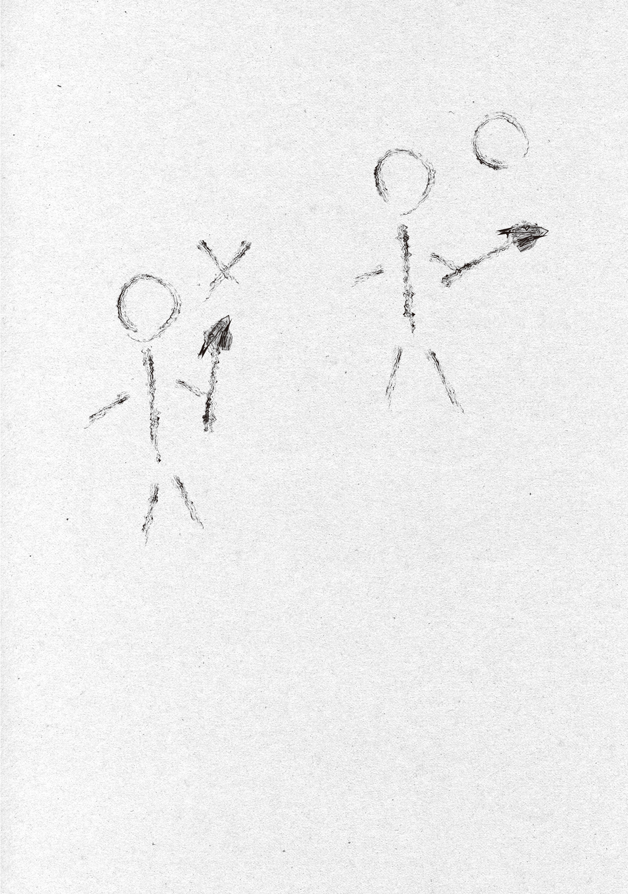

【魔力逆流防止機構】

魔力逆流とは、高等な魔法や強力な魔法を使う時に起こる現象だ。

グレムリンや魔石に注ぎ込むか、空中に留め置く（超越者限定）かした魔力が制御不全に陥り、唱えた魔法の性質を帯び体内に逆流しフィードバックダメージを引き起こす。

例えば凍れ[ヴアアラー]系統の魔法で魔力逆流を起こせば体が凍るし、未来視魔法で逆流すれば頭がパーになる。目玉魔法なら失明だ。

逆流が酷[ひど]いと魔法が暴走した挙句に死ぬ。飾[かつしか]区はかつて魔法使いが強力な魔法を暴走させたせいで更地になったとか。本人は弾[はじ]け飛[と]んで塵[ちり]になったらしい。怖すぎる。

魔女や魔法使いは、魔力をコントロールする事でこの魔力逆流によるフィードバックダメージを軽減できる。単純に逆流しようとする魔力を押し返したり、上手[うま]く逸[そ]らして大気中に逃がしたりするのだ。

だが魔力コントロールにも限界はある。青の魔女も大怪獣を氷漬けにする時は危うく魔法を暴走させかけたし、未来視は遠い未来を視[み]るたびに脳がやられて幼児退行するハメになっているとか。

問題は魔力コントロールができない、魔法を覚えただけの普通の人間……魔術師[ウイザード]だ。

東京魔法大学では、現在この魔力逆流問題に悩まされている。

発音可能で、魔力が足りている魔法であっても、魔力逆流のせいで事実上使えない危険な魔法が多いのだ。

その筆頭が焔[ほのお]魔法。

かなりの低燃費かつ短い詠唱で使える継火の魔女の焔魔法基幹呪文「焔よ[ジン・ガ]」だが、焔魔法全般の特徴として魔力逆流を起こしやすい。

火を出す魔法なんてそんなに高等には思えないが、一番簡単な焔魔法ですら物理火の解凍を無効化する大氷河魔法の氷を溶かせるというから、なんか魔法的にすごい高等付加効果が初期設定でついてしまっているのだろう。

この「焔よ[ジン・ガ]」を一般人が使うと、簡単に魔力逆流を起こし火傷[やけど]してしまう。魔法の発動自体はできるのだが、これではメリットとデメリットが釣り合っていない。

調理や暖房用、そして燃料代わりとして注目されている魔法なだけに、大[おお]日向[ひなた]教授は授業の傍[かたわ]ら魔力逆流防止研究に取り組んでいる。

安全音で魔法の暴発を防ぐように、何かしらの発音あるいは単語を詠唱に付け加える事で魔力逆流を無効化あるいは軽減できないか試行錯誤してはいるものの、手応えは無いらしい。

大日向教授によると、燃料問題は食料問題ほど緊急の案件ではないが、優先度が高いそうだ。

本当なら医療魔法の研究ができるならそれが食料に次ぐ最優先事項だが、医療魔法の使い手が存在せず、研究しようがないため、燃料問題の優先順位が繰り上がっている。

現在都心部では主に誰も住んでいない建物を解体して得た木材を使い、炊事や冬季の暖房のための燃料を賄っている。

しかしそういう都心部の木材はいくら節約しても使い果たしてしまうし、植樹しても燃料に使えるほどに木が育つのは十年後から二十年後。

郊外の山間部で伐採を行い、切り出した木材を都市部まで運ぶのも相当な労力だ。木炭貨物列車がそういった運送への活用に期待されているが、木炭列車の燃料がそもそも元をたどれば木材なわけで。

素晴らしい技術の結晶として賞賛すべきものではあるが、残念ながら効率の良い運送手段とは言えない。

やはり魔法。

魔法が全てを解決する。

焔魔法基幹呪文「焔よ[ジン・ガ]」は、杖[つえ]を振って発射しない限りその場で数分燃え続ける。ちょっとした調理や着火、湯沸かし、調理済みの食べ物を温め直す程度には十分だ。

だいたい３人に１人はこの魔法を唱えられるだけの魔力量を持つというから、うまくいけば一家に一人焔使いも夢じゃない。東京全体で総計すれば素晴らしい燃料節約になるだろう。

焔魔法を使用可能にする目途が立たなければ、木炭貨物車の改良普及や水運を利用した山間部からの木材輸送の計画を詰めていく予定になっているそうで、俺としても他人事[ひとごと]じゃない。

何しろ山間部である奥多摩[おくたま]には多摩川[たまがわ]が流れていて、多摩川は東京の市街地を貫き東京湾に注ぐ絶好の水運河川なのだ。

呑気[のんき]にしていたら奥多摩に林業の方々が大挙して押し寄せ、俺の安住の地でワイワイガヤガヤと伐採を始めてしまう。伐採拠点が建つ危険すらある。

あまりにも嫌すぎる。

大日向教授の手紙は「余裕があったら」とか「納期はありません」とか「大利[おおり]さんのペースで」とか俺を気遣う言葉に溢[あふ]れていたが、それにしては魔力逆流についての解説や魔法言語学的研究進捗状況、問題点が事細かに熱を込めて書かれている。

けっこうドン詰まりになっているのが端々から伝わってきたので、俺はちょっと気合を入れ一肌脱ぐ事にした。

魔法言語学からのアプローチで詰まっていても、加工学からのアプローチならけっこう簡単に解決するかも知れない。

まず、配達された手紙を俺が熟読している間にカードボックスを膝に乗せデッキを組んでいた青の魔女に魔力逆流についての所感を聞く。

俺は魔力逆流という現象について理論でしか知らない。実際に魔力逆流を体験し、ある程度コントロールする技術を持っている魔女に是非意見を伺いたい。

青の魔女に大日向教授の手紙を見せて意見を聞くと、実際に魔力逆流を体験し対処している魔女ならではの補足説明をくれた。

「キュアノスを使って魔法を使うと顕著に体感できるんだが、実は魔力逆流を起こしにくい杖の構え方がある」

「え、そんなんあんの？」

「ある。こう構えて……いや絵にした方が分かりやすいか？」

青の魔女はキュアノスを構えて説明しようとしたが、思い直して紙に二つの比較図を描いた。描かれた絵を見るがあんまり上手くない。

「棒人間かよ」

「う……し、仕方ないだろ。絵が苦手な女子だっている。こほん、とにかく！　まず、左が悪い構え方だ。魔法を使う時、魔力は声と共に口から放出され、魔石に注がれる。魔力が逆流する時は、魔石から一番近い身体部位に流れ込んでくる。左の図だと、魔石に一番近いのは頭だろう？　逆流した魔力が頭に直接流れ込んできて、危険だし、逆流した魔力をコントロールするのが難しい」

「ふむ……じゃあ、もし足の指で魔石を持ったら、逆流魔力は足の指先から流れ込んでくるのか」

「そうなるな。次は右の図を見てくれ。これが良い構え方だ。魔石から一番近いのは右手の先だから、逆流した魔力は右手の先から全身へ流れ込んでくる。いきなり頭に逆流するより遥[はる]かに安全だし、逆流魔力のコントロールもしやすい」

「なるほど…………」

魔石やグレムリンに魔力を注ぎ込むルートと、魔力が逆流する時のルートは違うのか。

その理屈でいくと……

いや……

いける、か……？

理論上はいけそうに思えるが。聞いてみるか。

「なあ、こんな感じで柄に魔力抵抗を持たせたら魔力逆流は軽減されると思うか？　感覚的に答えてくれていい」

俺はサラッと簡単な図を描いて青の魔女に見せた。

「うわ、よくフリーハンドでこんな正確な円を描けるな？　というか大利も棒人間じゃないか」

「別にいいだろ、写実画なら写真並に描けるし。手ェ抜ける時は抜いていいんだよ。で、どうだ？　黒矢印経路で魔力を送って、白矢印経路で魔力が逆流するわけだろ？　魔石と右手の間の魔法杖[ワンド]の柄の部分に魔力抵抗素材を使う手があると思うんだよ」

「……んん？　いや、ちょっと言っている意味が」

「分かりにくいか。前にさあ、グレムリンを融[と]かして固めてって実験しただろ。ほら、反射炉の。話した事あると思うけど、アレをグレムリンと自分の間に噛[か]ませると魔法の消費魔力量が二倍になるんだよ。言い換えれば50％の魔力ロスが起きるわけ。

この図の杖の柄に融解再凝固グレムリンを使えば、逆流してくる魔力が50％カットされる！　逆流魔力半減！　フィードバックダメージ半減！　に、なると考えたんだが。どう思う？」

「…………」

青の魔女は顎に手を当ててしばらく考え込んだ後、自分のラクガキを描いた紙にキュアノスを当てて魔法を唱えた。

「月影も涼風も全て氷になればいい[××・××フイフイ・イイヴアアラー]」

紙を薄い氷の板に変化させた青の魔女は、感覚を確かめるように手をにぎにぎしてから頷[うなず]いた。

「そうだな。その図の柄の部分に魔力が通りにくい……魔力がロスする？　素材になれば逆流魔力が少なくなりそうに感じる」

「お！　やっぱり？　そうなんじゃないかと睨[にら]んだんだよな！　ハッハー！」

クソの役にも立たない死蔵研究成果だと思っていた融解再凝固グレムリンが早くも役に立ちそうで笑えてくる。研究が必要になった時、既に研究は終わっていた。

流石[さすが]に天才。やはり俺は世界一の魔法杖職人[ワンドメーカー]……！

大日向教授や名前も知らんグレムリン融解実験チームの研究成果を踏まえての秒速解決策立案だから、全部が全部俺の天才性のお陰ではないけど、我ながら自分の発想力の凄[すご]さに震える。

役に立たない実験データを持ち出して上手く役立てる。これが一流技術者の頭の使い方ってもんよ！　そんじょそこらのクリエイターとは閃[ひらめ]きが違うよ、閃きが。

俺は早速考案した理論に基づきキュアノスの改造に取り掛かった。

キュアノスを分解し、柄を削って内部に細長い空洞を作り、融解再凝固グレムリンを嵌[は]めこむ。

青の魔女に魔力逆流テストを頼むと、試作一号は失敗した。逆流した魔力が融解再凝固グレムリンを通らず、迂回[うかい]して直接手に流れ込んでしまったのだ。

青の魔女の肌感的には「融解再凝固グレムリンと魔石の間に隙間があってそこから逆流魔力が漏れているから、接触部を作れば狙い通りに流れ込みそう」、との事だったので、言われるがままに改良を施し、試作二号を試してもらう。

試作二号は無事成功したが、魔力逆流は理論通り50％前後のカット率（青の魔女の体感）に留[とど]まる。

たった二回の試作結果としては大戦果。この理論を元に大日向教授に報告しても早すぎる問題解決に大喜びするだろう。

だが、これだけじゃ終わらない。自分、まだいけます！　もっと魔力逆流カット率上げられます！

融解再凝固グレムリン一つで魔力消費２倍の50％カットなら、四つ使えば魔力消費が２倍の更に２倍の２倍の２倍。二の四乗で16倍！　魔力カット率にして脅威の93・75％だーッ！

と、思ったのだが、棒状の融解再凝固グレムリンを四本束ねて柄に仕込んでもカット率は85％程度に留まった。

五本束と六本束も試してみたが、青の魔女曰[いわ]く「変わった気がしない」。

三本束に減らしてもカット率は約85％で、二本束にすると75％ぐらいになった。

つまり、融解再凝固グレムリンを使った魔力逆流軽減は85％で頭打ちという事だ。

もうちょっと行けそうだが、今はこれ以上良い加工アイデアも思い浮かばないので、ひとまずこれで完成とさせて頂こう。

俺は大日向教授に「魔力逆流防止加工できるようになったぜ！」と手紙で報告するついでに、東京魔法大学で使っている汎用魔法杖のリコールを申し出た。

いったん、全部回収して柄を逆流防止機構仕込みに換装したい。

換装は面倒だが、俺の魔法杖で魔力逆流事故が起きたら、まるで俺の魔法杖のせいみたいで嫌だ。

「魔法杖を使ったけど魔力逆流事故は防げなかった」より「魔法杖を使ったおかげで魔力逆流事故を防げたし、彼女ができたし、部活でレギュラーになったし成績も上がりました！　全部魔法杖のお陰です！」みたいな賞賛の声を聞きたい。レビューは是非☆５で頼む。

リコールを受け入れた大日向教授はすぐに汎用魔法杖を回収し、個人的な感謝の手紙と東京魔法大学名義の感謝状を添えて青の魔女に届けさせてくれたのだが、１日で問題を解決した俺をめっちゃ褒めちぎってくれていた。照れる。

いや、豊穣[ほうじよう]魔法改良と自分の変身解除を１日でやった教授も相当ですけどね。お互い基礎研究の下積みの上に成り立つ超速解決だから実質的には１日でやったわけじゃないけど。安易に褒め合っていこう。

大日向教授に課題を貰[もら]い、青の魔女にテスターをしてもらって進化した新バージョン魔法杖に、俺は大きな発展性を見出[みいだ]した。

今まで、俺が作る杖は核となる魔石やグレムリンにしか意味がなかった。

ぶっちゃけ、加工済みの魔石を直接握るだけで良くて、柄や彫刻は全て単なるオシャレな飾りに過ぎなかった。

しかしここに来て魔法杖の柄にもちゃんとした役割が生まれた。

核となる先端の宝石部分で魔法を増幅し、フィードバックダメージは柄を通して軽減。

美しい構造的コラボレーションじゃあありませんか？

研究を進めれば宝石部の保護材や柄の強度を高めるための金属、柄に施す彫刻なんかにもちゃんとした魔法的な役割を持たせられるかも知れない。夢が広がる。

まだまだ魔法杖には改良の余地が残されている。どんどん進化させていこう。
