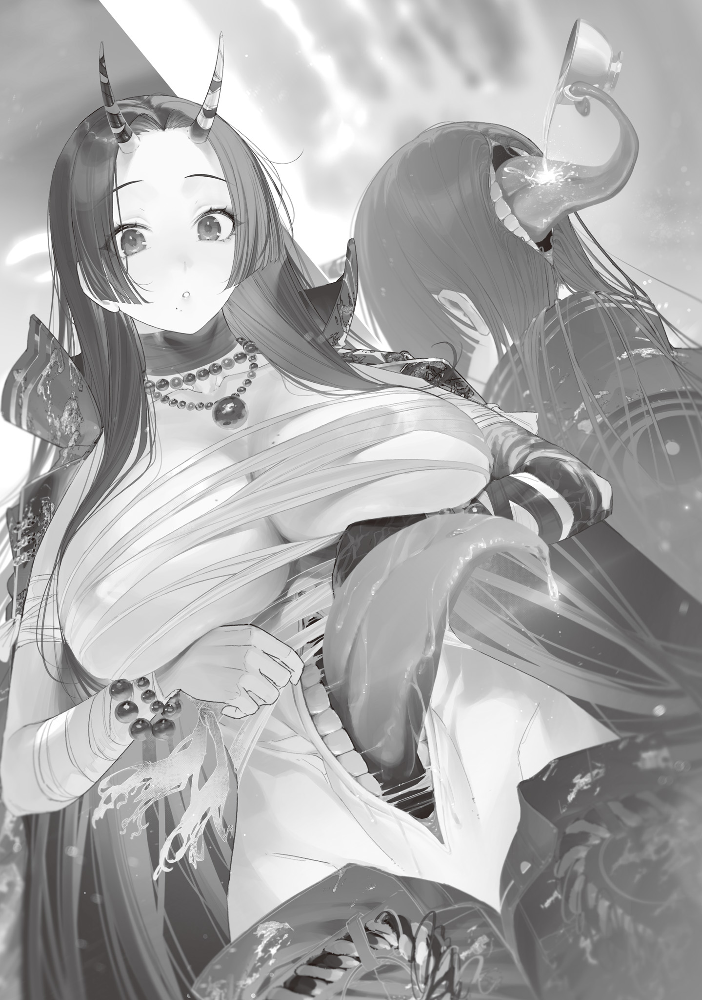

【地獄の魔女】

東京魔女集会のお歴々にオーダーメイド高級魔法杖[まほうづえ]を青の魔女便で発送してから五日が経[た]った。

発注書には個性がよく表れていて、作るのにも気合が入ったし面白かった。

魔石は手に入らないのでグレムリンを使っての物となったのだが、八王子[はちおうじ]の魔女はグレムリンの色指定をしてきた。黒色が良いという注文だったので、青の魔女が昔討伐したという人食い怪鳥のマットな漆黒グレムリンを譲ってもらった。

二本注文してきた目玉の魔女はデザインに指定をしなかったが、一本は贈答用との事だったので、杖のデザインはもちろん贈答の箱にもこだわった。

継火の魔女は杖の頑丈さを要求してきた。バリバリ戦闘に使い、杖でぶん殴る事もあるという事だったので、鋼材を再成型し、杖の芯に使用。それでも壊れてしまう事を前提にメンテナンス性を上げ、交換用の柄を二本つけた。

未来視の魔法使いは極限まで高性能な魔力逆流防止機構、その一点だけを切実な文面で頼んできた。もちろん、俺の持てる技術すべてを費やし最高の精度に仕上げた。

全て会心の出来栄えだ。

竜の魔女から製造依頼が来ていないのが意外だが、奴[やつ]が欲しがらないわけがないから、たぶん青の魔女がシャットアウトしているのだろう。マネージャー業、助かってるぜ。

だがこの五日、青の魔女が珍しく家に来ない。

あいつもあいつでやる事ぐらいあるんだろうが、商品を受け取った顧客の反応が気になるので、それを聞きに行くついでに青の魔女の守備偏重デッキを俺の超火力デッキでボコるためのカードセットを持って青梅[おうめ]を訪ねた。

青の魔女の家へは迷わず辿[たど]り着いたのだが、なんだかおかしな事になっている。俺は蔦[つた]が這[は]う電柱の陰にサッと隠れた。

魔女の家の前に、鬼の女があぐらをかいて座り込んでいたのである。

たぶん、魔女だよな？　アレ。

青の魔女は青梅市民以外の青梅市侵入を禁じている。

侵入者は基本的に発見次第ボコボコにして叩[たた]き出すか、ぶち殺す。

一般人があんなに堂々と座り込んでいるわけがないし、魔物にも見えないから、魔女に違いない。

その魔女は座っていても分かるぐらいデカかった。立ったら１９０㎝以上ありそうだ。

胸もデカい。サラシで巻かれた胸は見た事のないサイズだ。ムキムキシックスパックの腹は剥[む]き出[だ]しでお腹[なか]冷やしそう。

背中で斜めにザックリ切られた黒髪に二本角を生やし、暴走族がよく着ているようなダボついた特攻服を着て、地獄界の女番長といった風体[ふうてい]だったが、顔は格好に反して上品な感じの美人さんだった。それはそれでグレてしまった令嬢っぽさがあって怖い。

なんか知らんが、家の前で座り込んでいるなら、青の魔女に用事があるのだろう。今俺が出て行ったら絶対に呼び止められそうだ。

よしッ！　訪問中止！　奥多摩[おくたま]に帰ろう！

見つからないように足音を忍ばせそーっと帰ろうとしたのだが、俺が隠れていた電柱の蔦にとまり虫をついばんでいた小鳥が不意に鳴き声を上げ、座り込んでいた鬼女がこちらを向いた。

「あれっ!!?　もしかして青梅市民!!?」

「ひぇっ……！」

立ち上がった鬼女は、背も高けりゃ胸もデカく、声までデカかった。

逃げられなかった。俺は反射的に下を見て縮こまる。

ドカドカと足音が聞こえ、アスファルトを見つめる俺の視界にビッグサイズの足が映った。

ひーっ！　ビッグフット！　でかい！　にんげん！　こわい！　やだ！

「しっ、知らないです関係ないです分かんないです俺用事あるんで忙しいんで」

「まあそう怖がらないで!!　私は地獄の魔女!!　とって食いはしないから!!」

「そ、そうなんですか？」

「君が善人ならね!!」

「あわわわ……！」

悪人ならとって食うって事じゃないですか！　やだー！

俺、悪人じゃないです！　昔ちょっと著作権侵害アニメグッズ製作で儲[もう]けた事があるだけで！　ほんと、それ以外は善人なんで！　食べないで！

「青梅の魔女が話を聞いてくれなくて、困ってるんだよ!!　君から取り次いでくれないかな!!?」

「あ、あの、その」

俺がバカデカ声に鼓膜を揺らされ地震を起こせそうなぐらいガタガタ震えていると、聞き慣れた「凍る投げ槍[ドウ・ヴアアラー]」の詠唱が聞こえ、鬼女は吹っ飛ばされて道路に転がった。

うおお、救世主きた！

俺は急いで玄関に仁王立ちしてキュアノスを構えている青の魔女の元にダッシュし、背中に隠れる。助かった～、ナイス！

最強の壁の後ろに隠れ一安心していると、青の魔女は立ち上がろうとする地獄の魔女に油断なくキュアノスを向けながら、不機嫌そうに小声で文句を言って来た。

「どうして来たんだ？　地獄の魔女に付きまとわれてるから、しばらくそっちに行けないし、こっちに来るなと言っただろ」

「え？　いや聞いてないけど」

「いや言った。目玉の使い魔で」

「あ～、着拒してたわ。お前が長電話してくるから」

青の魔女からの目玉の使い魔越しの連絡は、最初はちょっとした事務会話ぐらいだったのに、だんだん話が長くなっていった。

最近じゃ毎晩一時間ぐらいしょーもない話を聞かされていたのだ。着拒もしたくなる。

「着信拒否!?　馬鹿お前、それじゃ通信機の意味が、凍る投げ槍[ドウ・ヴアアラー]、道理で返事が無いと、お前、ほんとにお前という奴は……！」

近づいてこようとする地獄の魔女を魔法で吹っ飛ばしながら、青の魔女はぶつぶつ言う。

「だってどうでもいい事ばっかり電話してくるからさ。庭に小鳥用の餌箱置いたなんて知るかよ。害獣に餌やってんじゃねーぞ」

「黙れ可愛[かわい]いだろうが。雀[すずめ]だけじゃなくてメジロも来るんだぞ？　こっちはお前のカードゲームに付き合ってやってるのに、私のことは無視か」

「それは確かに……？　ごめん、俺が悪かったかも知れん」

「かもじゃなくて、お前が悪い。お陰で面倒な状況がもっと面倒になった。凍る投げ槍[ドウ・ヴアアラー]」

何度も氷の槍[やり]にぶっ飛ばされたデカい鬼女は、両手を上げて降参の意志を見せた。

かと思えば、そのまま地面に這いつくばり、綺麗[きれい]な土下座の姿勢をとる。

そして真摯なバカデカ声で言った。

「青梅の魔女!!　この通り、どうかお願いしたい!!　私を魔法杖職人[ワンドメーカー]に会わせて欲しい!!　恩人に直接お礼しないと仁義にもとる!!」

青の魔女は沈黙した。

俺も沈黙した。

あのさ。

面倒な状況って言ったけどさ。

これ、なんか面白い状況になっちゃってないか？

お目当ての魔法杖職人が目の前にいるのにまるで気付いていないぞ。

まあ魔法杖職人じゃなくてデッキケース持ったカードゲーマーにしか見えないだろうしな。良かった、ヘンデンショーを懐に入れておいて。

俺は青の魔女の背中からちょっと顔を出して聞いた。

「あのー、恩人って、その人に何してもらったんですか？」

こんな鬼女、知らんぞ。

誰だよ。恩を売った覚えはない。

別人のフリをして尋ねると、地獄の魔女は額をアスファルトに擦[こす]りつけたまま答えた。

「暴走を収めてもらった!!　この二年半!!　私はずっと暴走した魔法を抑え込んでたんだよ!!　足立[あだち]区は地獄だった!!　でも魔法杖職人[ワンドメーカー]の杖のおかげで、魔法をコントロールして、暴走魔法を消せた!!　足立区も私も解放された!!」

な、なるほど？

話を聞いて合点がいく。記憶にないわけだ。

目玉の魔女に依頼された贈答用の杖が、この地獄の魔女の手に渡ったに違いない。

そして魔女の封印が解かれたのだ。

「目玉の魔女に礼を言ったら!!　魔法杖職人のお陰だって教えてもらった!!　だから、私は魔法杖職人に会わせてもらえるまで、ここを動かない!!　お願いだよ!!　魔法杖職人の居場所を知っているのは、青梅の魔女だけなんでしょ!!?」

「知らん。帰れ」

青の魔女は冷たく一蹴したが、地獄の魔女は土下座したままテコでも動かない構えだ。

俺は人型拡声器にだいぶビビらされたが、話を聞いて興味をそそられた。

二年半も暴走魔法を抑え込んでいたって？

で、その暴走魔法を俺の杖を使って収めた？

そんな素っ頓狂な実践使用データ、滅多[めつた]にとれるもんじゃないぞ。是非、使用した感想を知りたい。

俺は青の魔女に耳打ちした。

「ちょっと話聞きたい。家に上げてやってくれん？」

「……いいのか？　性根の腐った女じゃないが、人食い魔女だぞ」

「正直怖いけど気になる。なんかしてこようとしても青の魔女が守ってくれるだろ？」

「それはそうだが……」

「でも話すの嫌だからさ。お前が俺の代わりに俺の聞きたいこと聞いてくれ。俺は横で聞いてる」

「ふざけろ自分で話せ」

青の魔女は舌打ちすると、地獄の魔女を立たせ、家の中に招いた。

えー、俺が話すのか。ヤだな……でも貴重なデータをとるためだ。これも必要経費と割り切って、しっかり詳しく聞き出そうじゃないか。

---

地獄の魔女を居間に通した青の魔女は、二杯だけ紅茶を淹[い]れ、テーブルに着いた。青の魔女と俺が隣り合い、対面に地獄の魔女が座る形だ。

俺は青の魔女にコソコソ耳打ちした。

「カップ一つ忘れてるぞ。今居間には三人だ」

「分かってる。わざとだよ」

「ん……？　どういう……？」

「歓迎してないから出さないんだ。分かるか？　お前に飲ませる紅茶はないって意味だ」

「あーね？　そういやこういうの昔なんかの昼ドラで見たな。意地悪な姑[しゆうとめ]が家に来た息子の嫁に粘着質な嫌がらせしてた。陰湿だよな、女の嫌なとこって感じ」

「…………」

青の魔女は黙って三つ目のカップを取りに行った。

なんだよ結局出すんじゃん。じゃあ最初から出せばいいのに。

俺と青の魔女のやりとりを最初は怪訝[けげん]そうに、途中からニコニコして見ていた地獄の魔女は、紅茶が注がれたカップを受け取るとデケー声で礼を言い、居住まいを正し切り出した。

「それで、魔法杖職人に会わせてくれるって事でいいのかな!!?」

俺は青の魔女の顔を見たが、紅茶に口をつけるだけで答えてくれそうにないので、渋々自分で答える。

「えー、あの、俺がその魔法杖職人の弟子なんで。感謝の言葉は俺から伝えておきます」

「お弟子くんだったんだ!!　よろしく!!　お師匠さんは今、外出中とかかな!!?　それとも、もしかしてご病気!!?」

「あ、いえ。ものすごいコミュ障なので単純に人に会いたがらないだけです」

「こら!!　自分のお師匠を悪く言わない方がいいよ!!」

「ひっ！　す、すみません善人です食べないで」

「いや食べないってば!!　食べるのは本物のワルだけだよ!!　ごめんねなんか脅かしちゃってるみたいで!!　この大声とかも気にしないで!!　変異の時にこんなんなっちゃっただけだから!!」

「は、はぁ……」

竜の魔女みたいなモンなの？　強制的に喋[しやべ]り方変わるって地味に大変そうなの。

媚[こ]びた語尾のドラゴンを思い出していると、地獄の魔女は腕組みをして唸[うな]った。

「うーん、本人が会いたくないなら仕方ないかなぁ!!?　青梅の魔女は何も話してくれないからさ!!　なんで会わせてくれないのか分かんなくて座り込むしかなかったんだよね!!」

「おい」

「うるさい」

青の魔女の脇腹を肘でつつくと、気まずそうにそっぽを向いた。

俺のことコミュ障とか社会不適合者って言うけど、お前もだいぶ拗[こじ]らせてるからな。

少しの間天井を見上げ考えた鬼女は、一つ頷[うなず]いてズボンのポケットに手を突っ込みながら言った。

「じゃあお弟子くん!!　これ、君からお師匠さんに渡して欲しい!!　地獄の魔女からの礼の品だって!!　杖作るならこういうの良い材料になるよね!!?」

そう言って地獄の魔女がテーブルの上に置いたのは、でっかい宝石だった。

それは広げた手のひらより一回り小さいぐらいの扁平[へんぺい]な石で、色合いは発色の良い琥珀[こはく]のようだが、琥珀と違い透明度が低く透けていない。

しかし何より特筆すべきはその美しさ！

俺はビビッときた。

この独特の存在感。

不思議と目を惹[ひ]く魅力。

間違いない。

「魔石だ！　いいんですか貰[もら]っちゃっても!?」

「いや、君にじゃなくて君のお師匠さんにね!!?」

窘[たしな]められて頷きながら、地獄の魔女が心変わりしないうちにサッと琥珀の魔石を手元に引き寄せる。

やったぜ棚ぼた！

グレムリンで杖作ったら、魔石になって返ってきたぞ！

返礼品がバグってる！　最高かよ！

ニヤつきを隠せない俺にちょっと呆[あき]れた様子の青の魔女は、不愛想に鬼女に言った。

「おい、いいのか」

「なにが!!?」

「魔石をそんなに簡単に渡して」

「江戸川[えどがわ]の魔女とかよく人に貸してるでしょ!!?　何がダメなの!!?」

「その江戸川の魔女は入間[いるま]に魔石を貸した途端に殺された。もう簡単に貸し借りをする時代じゃない」

青の魔女の忠告を聞いた地獄の魔女は、口から紅茶を吹き出し咳[せ]き込んだ。

「えぇ！！！？　入間に!!?　江戸川が!!?　そんな事する奴じゃなくない!!?」

「誰もがそう思っていた。だから事が起きるまで分からなかった。入間のクーデターで江戸川の魔女と、鴉[からす]、流星、立川[たちかわ]の魔法使いが死んだ。入間は私が殺した。荒川[あらかわ]の魔法使いはクーデター鎮圧後に地元に帰ったから、今の荒川区は花の魔女が治めてる。ああ、人魚は吸血がなんとか会話を成立させた。人の言葉を覚えたイルカぐらいになっている」

「ちょ、そんな一気に、二年半で変わり過ぎじゃない!!?」

「目玉から話を聞いてないんだな」

「聞いてなくはない!!　でも、青梅の魔女は市民以外に冷たくなったから行ってもたぶん話通じないって言われたぐらい……!!　じゃあその仮面は!!?」

「いいだろ別に何を被[かぶ]ろうが」

「そ、そっか……!!　聞かないでおく!!」

あの、仮面も大事件がきっかけみたいに思っていらっしゃるみたいですけど、その仮面は俺がコミュ障過ぎてコイツの美少女フェイスを直視できないからつけてもらってるんですよ。クッソしょーもない理由だから触れないで欲しかった。

「私が魔法暴走させてる間に色々あったんだ!!　私、鬼なのに浦島[うらしま]太郎[たろう]になった気分だよ!!」

「詳しくは目玉の魔女に聞け。たぶん一番情報通だから。足立区はもう人の住める環境じゃないだろ？　新しい管理区域の割り振りも手配してくれるはずだ」

「あ、ごめん!!　私、東京を出るつもりなんだよね!!」

青の魔女は俺のカップに紅茶のお代わりを注ぐ手を一瞬止めた。

ただでさえあまり機嫌が良くなさそうだったのに、さらに一段階不機嫌になって問いただす。

「なぜだ。お前、東京出身だろう？　地元に家族を残してきたわけでもあるまい」

「いや、今の東京、平和だからさ!!　いやまだ平和ってほどじゃないけど、ほら!!　けっこう復興進んでるでしょ!!?　足立区からここに来る時に街見てきたけど、明日生きていられるかも分からないって感じはしなかったし!!」

え、こわ。

昔の東京都心ってそんな感じだったんです？

奥多摩で引きこもってて良かったな俺。そして最初に会ったのが青の魔女で良かった。殺されそうになったけど。

「でも、魔女も魔法使いもいない地域って多いし過酷でしょ!!?　世界中を旅して、生き残ってる人達を助けて回ろうかって思ってるんだ!!」

足立区も誰もいなくなっちゃったし!!　と付け加えた地獄の魔女に、青の魔女は小声で聞いた。

「街を守り続けようとは思わないのか」

「足立区を!!?　もう誰もいないのに!!?　うーん、私は思わないかな!!　悪い奴殺して食べて掃除して、良い人は助ける!!　そういうのが一番私に合ってる!!」

「そうか……」

「？　……あ!!　ごめん無神経だった!!　青梅に人が全然いないのってやっぱり、いや、つまり、ごめん!!」

「…………」

黙り込んで動かなくなってしまった青の魔女を、地獄の魔女は心配そうに見た。

俺にもオロオロと視線を寄こしてきたが、視線を向けられ俺もオロオロした。あの、こっちあんま見ないでもらえると。

「えーっと!!　なんだか空気悪くしちゃったみたいだし!!　あああこんな時でも勝手に声大きくなるのほんとに……!!　とにかく、用も済んだし、私はこれで失礼しようかな!!　お弟子君、お師匠さんにくれぐれもよろしく伝えてね!!」

気まずそうにそーっと、しかし声はデカく帰ろうとする地獄の魔女を慌てて引き留める。

そっちの用事終わっても、こっちの用事は終わってないぞ！

レビュー！　使用感！　杖を使った結果のデータをくれ！

「あっ、あの、すみません、まだちょっと」

「ああごめんね勝手に帰ろうとしちゃって!!　なに!!?」

「そのー、杖の使用感とか聞かせてもらっていいですか」

「使用感!!?」

立ち上がりかけた腰を椅子に戻し、鬼女はデカい尻で椅子を軋[きし]ませながら首を傾[かし]げる。

まあそうか。技術者から製品使用に関してフィードバックデータを要求されるのは、ちょっと慣れない事かも知れない。

「地獄の魔女さんは、目玉の魔女さんから魔法杖もらって、それ使って魔法の暴走を収めたんですよね？　二年半も暴走してたのに。杖をどんな感じで使ったのかとか、ここが良かったとか、これがこうなると良かったとか、杖有り無しでどう違ったかとか、そういう感想があれば聞かせてもらいたいです。参考にするので……師匠が」

「えーっ、なにそれ、職人のプロ意識って感じだぁ!!　いいよ、いくらでも話すよ!!　何を話せばいいかな!!?」

「あ、特に指定とかは。自由に思った事を喋ってもらえれば」

「そういうものなの!!?　うーん、じゃあ、そうだねぇ!!　まずね、私は足立区に住んでたんだけど!!」

地獄の魔女が語ったところによると、元々彼女は足立区住まいの女子大学生だったそうだ。

変異に伴う昏睡[こんすい]中に魔物に襲われ、しかし名前も分からない女性に護[まも]られ救われる。昏睡から回復した後、彼女は恩人の服を身に纏[まと]い、地獄の魔女として人を助け守り始めた。

しかし、地獄の魔女の魔法は死ぬほど使い勝手が悪かった。小回りの利く魔法を覚えておらず、使える魔法が全てマップ兵器なのだ。

範囲内の生きとし生けるものを殺し合わせる魔法とか。

範囲内を火の海にして、全てを焼き尽くす魔法とか。

範囲内を血の池に沈め、血に触れた者に自ら死を選ぶほどの苦痛を与える魔法とか。

全て魔法の効果範囲が広すぎて、おいそれとは使えない。地獄みたいな魔法しか使えない、まさに地獄の魔女。だから、彼女はほとんど拳で魔物や悪漢と戦っていた。

交番に届けられ保管されていた魔石を入手してからも、ただでさえ広範囲で制御が難しい魔法を威力上昇させてはますます扱いが難しくなる、と考え魔石の使用を控えていた。

しかしある時、そうも言っていられない非常事態が起きる。

「ゲームによくいる敵キャラのスライム、分かる!!?　ああいう魔物が出たんだよ!!　下水道で増えて地上に出てきたらしくて、拡大を防ぐために急いで一掃しないといけなかった!!」

「それで範囲魔法使って、暴走したんですか」

「そうなんだけど、それだけじゃないかな!!　魔法二つ使っただけじゃ全然倒しきれなかったから、魔石で増幅した魔法を三つ同時に唱えたんだ!!」

「三つ同時に？　どうやって？」

「私、口が三つあるから!!」

「え」

俺の目の前で、地獄の魔女は後頭部に紅茶のカップを持って行った。角度的に見えないが、後頭部が蠢[うごめ]いて垂れ流された紅茶が飲み込まれていくのが分かる。

あ、頭の後ろに口があるぅうううう！　化け物じゃん！　いや、鬼だし化け物だけどね!?

「あとここにも!!」

「!?」

突然地獄の魔女の腹筋が喋りだして椅子から転げ落ちそうになったが、よく見たら口の裂け目がちょうど腹筋の割れ目と重なっているだけだった。なにそのカムフラージュ？

地獄の魔女は何事もなかったかのように二つの口を閉じ、普通の位置にある口だけで話を続けた。

「話戻るけど、無茶[むちや]したから魔物は一掃できた!!　でも、無茶したから魔法は暴走した!!　もう血と炎と瘴気[しようき]で足立区が地獄になっちゃって!!　私は血を啜[すす]って泥食べながら二年半ずっと暴走した魔法を抑え込んでた!!　完全に制御手放したら、地獄が周りに広がっていきそうだったから!!」

「そ、壮絶……！」

二年半ずっと魔法を抑え込んだと聞いて、普通に寝たり食べたりはできるけど爆心地から離れられない程度の話かと思っていた。

でも聞いた感じ、不眠不休だったっぽい。どういう体力？　いやヤバいのは精神力か。魔力コントロール力もすごそう。

「でも!!　五日ぐらい前に目玉の魔女が地獄の中を爆心地まで杖届けに来てくれて!!　暴走と制御で拮抗[きつこう]してたバランスが私の方に一気に傾いて、地獄は消せた!!　めでたしめでたし!!　そんな感じかな!!　参考になりそう!!?」

「あ、はい、まあ」

俺は曖昧に頷いた。

杖の使用感というより、大部分は地獄の魔女の経歴紹介だった気がするぞ。

何が技術者に必要な情報かなんて素人には分かんないから、思いついた事を片っ端から丁寧に話した結果なんだろうけどね。ネットオークションのレビューにもこういうのあったからよく分かる。

俺は語られなかった杖の使用感について更に具体的にいくつか質問し、本人が些細[ささい]な事と気にしていなかった貴重なデータを引き出した。

これこれ、こういうの、こういうの。こういう特殊なデータが特殊な杖を作ったり、一般論を導き出すために役立ったりするんだよ。

余は満足である。これで魔法杖がまた一段階グレードアップしそうだ。

少しお節介かとも思ったが、俺は貴重なデータの礼として一つだけ地獄の魔女に小言を言う事にした。

竜の魔女もそうだけど、彼女も変異で捻[ね]じ曲[ま]がった性癖に振り回されているとしたら、誰かが言って正した方がいい。本人、あんま自分のヤバさ自覚してないかも知れないし。

「じゃあ、あの、最後に一つだけ。これは魔法杖とは関係ない話で、こうしろとかダメとかいうのじゃなくて、ただの通りすがりの人が呟[つぶや]いた言葉程度に聞いて欲しいんですけど、いややっぱりちょっとは重く受け止めてくれたら嬉[うれ]しいんですけど……」

「なに!!?」

「ひっ！　いやあの。人、人を食べるのはやめといた方がいいんじゃ？　やっぱそのせいで人間関係拗れたり、嫌われたり、ありそうだし……その、一般論で……」

俺もビビったし。なんならなんとなく人柄を掴[つか]んだ今もホントに大丈夫かよと思ってるし。

控え目に提案すると、地獄の魔女はにっこり笑った。

「心配してくれてありがとう!!　でも、やめないよ!!

相手が悪人でも、人食いが悪いのは分かってる!!

いつか誰かが、私を裁く!!

人食い悪鬼を裁ける、平和で力強い世の中になる!!

でも、それは今じゃない!!」

地獄の魔女の言葉は力強かった。

声の大きさ以上のデカさに感じる、確固とした揺るぎない信念が俺を打つ。

「今の世の中は、足を引っ張り過ぎる悪い奴を殺して消さないと立ち行かない!!　裁判なんてしてる暇はないんだよ!!　すぐ殺さないといけない奴がたくさんいる!!　未来視風に言えば『残念ながら』ね!!

未来視も裏でやる事やってるみたいだし、吸血もたぶんそう!!　目玉とかは……分かんないけど、多かれ少なかれ、これは必要なんだ!!

私は、その必要悪が悪だと思う!!　人を殺して食って嫌われて!!　世の中を嫌な方法で良くして!!　最後に悪逆非道な人食い鬼は退治される!!　私はそういう生き方を、死に方をしたい!!」

「…………」

「あ、ごめんね!!　心配してくれただけなのに、自語りしちゃった!!　人肉好きなのは本当だし、要するに私は悪い奴なんだよ!!　でも恩人に感謝するぐらいはしたかった!!　それだけ!!」

そう言って席を立ち、今度こそ帰ろうとする鬼女を、俺は再び呼び止めた。

彼女はどうやら悪いのに良い奴らしい。

彼女の旅は、孤独なものになるだろう。東京を出て、行く先々で誰かを救って回ったとしても、そこで人を貪り食えば、感謝の念も薄れるだろう。

自分の功罪に悲しいぐらい自覚的で、平和の礎になって散る覚悟を決めている彼女に、俺は旅の道連れとなる相棒を贈ってやりたくなった。

「あの、この魔石でとびっきりの杖作るんで、旅の相棒にしてくれません？　必ず役に立ちます。ぜひ、使って欲しい……って師匠は言うと思うんですが、どうですかね」

地獄の魔女はでっけぇ図体[ずうたい]で俺を見下ろしながらしばらくキョトンとして、言った。

「君はさ!!」

「はい」

「もしかして魔法杖職人[ワンドメーカー]本人なんじゃない!!?　話してて弟子っぽさ全然無いし!!　師匠に聞かないと分からないみたいなのが無くて、全部自分の一存で決めてるように聞こえる!!」

ギ、ギク──────ッ！！！！！

どどどどどうして俺が本人だって証拠だよ！

エビデンスは証拠で証明なんですかぁ!?

「ま、まさかそんなわけ。ただ、コミュ障の師匠に全部任されてるだけで、いや俺もコミュ障ですけど、まだマシみたいな、だから俺は師匠じゃなくて弟子ですほんとに。嘘[うそ]じゃないです」

「そうだよねぇ!!　変な事言った!!　忘れて!!　良い杖が貰えるなら恐悦至極だけど、あんまり気を遣ってくれなくていいからね!!」

地獄の魔女は軽く笑うと、しばらく二年半分の情勢変化を知るために目玉の魔女のところにいるから、と言い残し今度こそ帰っていった。

一人いなくなっただけで、居間に二人分ぐらいのスペースが空いた。

耳鳴りがするぐらいの静かさの中で、顎に手を当て未[いま]だに黙って考え込んでいる青の魔女に聞く。

「なあ、怪しまれたかな？　本人かって聞かれて否定する時かなり挙動不審になっちまったような気がする」

「……ん？　ああ、大丈夫だろう。大利[おおり]は元々挙動不審だ」

「そっか。よかった」

ほな大丈夫か。

良かったコミュ障で。

じゃあそのコミュ障は今から地獄の魔女専用特別魔法杖を作るんで。いったん奥多摩に帰ろうかな。

久々の魔石加工だ。腕が鳴るぜ!!

---

地獄の魔女は特徴だらけの女だ。何もかもがデケぇ。インパクトがある。その見た目や信念、二年半もの間魔法暴走を抑え込み続けたド根性に意識がもっていかれがちだ。

しかし、魔法杖職人[ワンドメーカー]目線だと（たぶん魔法言語学者目線でも）、一番の特徴は「口が三つある」事だ。

本人が語った通り、彼女は三つの魔法を同時に唱えられる。

三種類の地獄を同時に顕現させる事ができる。

他の魔女たちから魔法を習えば、未来予知で相手の動きを予測しながら氷の槍を投げつつ鎖で拘束もする、というような単独連携魔法も可能だ。

手数三倍。強すぎる。魔力消費も三倍だが。

口三つで魔法三つというのは単純に強いが、強いばかりではない。

具体的には発動媒体に負荷がかかる。

魔女や魔法使いはグレムリンや魔石などの発動媒体無しでも、素手で魔法を使える超人たちだ。

しかし二つや三つの魔法を同時に使うとそうもいかないらしく、発動媒体を起点に魔法の焦点を作る必要があるそうだ。

グレムリンを使って魔法の同時使用をすると、一回使っただけでグレムリンが異常に震動し砕け散ってしまうという。歪[いびつ]な形のグレムリンを使う場合そもそも詠唱途中で砕け散り魔法が発動しない事すらある。同時詠唱は負荷が大きいのだ。

その点、魔石はグレムリンの上位互換。二つ同時使用では多少怪しい震え方をするが全然平気だ。

が、大魔法三つ同時使用には耐えかねたらしく、異常震動でヒビが入ってしまった。

だから地獄の魔女から受け取った琥珀色の魔石には中心部に小さな亀裂が走っている。

今後同じような事があれば、ヒビは広がっていくだろう。割れたり砕けたりしてしまう危険も大きい。

この問題には極めて簡単な解決法がある。

一つの魔石、一本の杖に負荷を集中させるからダメなのだ。

シンプルに杖を三本持てばいい。

魔石を三つに分割して作った杖を三本持って、それぞれ別々に魔法を使えば良い。

しかしこの単純明快な解決法、杖三本持ちには致命的な問題がある。

カッコ悪いのだ。

想像しただけでめちゃカッコ悪い!!

剣を三つ持つのはカッコ良くても、それが杖になった途端ダサくなる。そんなの許せねぇよ、俺。

杖二刀流は悪くはないが、良くもない。俺としてはしっくりこない。

やはり魔法杖は一本だけ構えるのが一番似合う。

地獄の魔女にも是非そのスタイルでいって欲しい。

地獄の魔女の最大の利点、三魔法同時詠唱を活[い]かす。

その唯一の欠点である魔石異常震動をなんとかする。

一本の杖にする。二本・三本は逃げ。

今回の杖製作で気を付けるべきはこの三つになる。

まず、俺は大[おお]日向[ひなた]教授に手紙を書き意見を伺った。

同時詠唱してグレムリンや魔石が異常震動するという現象は、どちらかというと魔法言語学分野の問題に思えたからだ。

地獄の魔女からヒアリングして得たデータを詳細に書いて送ると、珍しく返信まで時間が空いた。

一週間後、青の魔女便で受け取った返信はかつてない長文で、いつものオマケ菓子の他に統計資料や分布図などがどっさり同封されていた。

---

夏の暑さも峠を越えたとはいえ、まだまだ残暑が厳しい今日この頃。大利さんは夏の暑さをものともせず精力的に研究に励んでおられて、夏バテしがちな私としては羨ましい限りです（尻尾が冬毛のまま生え変わらないんです！）。

最近では八王子の魔女さんが気象学者や気象予報士の生き残りを集め天気予報復活を計画していると聞きます。

人工衛星が使えませんから、雲の動きを追うのも大変ですが、目安程度でも暑さ寒さの移り変わりが事前に分かれば、暮らし向きはぐっと楽になるでしょう。

奥多摩の天気が予報できるようになったら、お知らせするようにしますね！

さて。

前回のお手紙で伺った件についてですが、非常に興味深く、こちらで関連実験を行わせて頂きました。お返事が遅くなったのはそのせいです。すみません。

ですが大利さんのお役に立つデータが採れたと思います。

まず、二つ以上の魔法を、一つのグレムリンを使って唱えた場合。

これは基本的に成立しません。二人の人間が息を合わせ全く同時に詠唱を開始しても、グレムリンに最も近い位置に口があった人の魔法が一つだけ発動し、他の魔法は不発します。

これに関しては半年ほど前に採った詳細なデータがありますので、写しを同封しました（右上にＡ－１～３と書いてあるものです）。詳しくはそちらをご参照下さい。

しかし、地獄の魔女さんはこの同時詠唱を成立させています。

私は未来視の魔法使いさんと、目玉の魔女さんに協力を仰ぎ、実験を行いました。

同時詠唱の成立が魔力をコントロールできる魔女・魔法使い特有のものなのか、地獄の魔女さん特有のものなのかを明らかにするためです。

結果は、お二方の魔法は片方だけが発動しました。

従って一つの発動媒体で二つ以上の魔法を同時使用できるのは地獄の魔女さんの特性と言えます。

全ての過程で、伺ったような異常震動は観測できませんでした。

そこで私は更に研究を行い、この特異な現象を掘り下げました。

いくつか実験を行いましたが（一応、失敗実験の内容も別紙にまとめて同封しました。Ｂ－１～５です）、そのうちの一つ。双子実験で顕著な結果が得られました。

私は、地獄の魔女さんが同時詠唱を成立させているのは、全く同じ声で詠唱しているからではないかと推測しました。

魔法言語では極めて厳密な発音が要求されます。同時詠唱には発音だけではなく、細部に至るまでの声質の一致が求められるのではないかと思ったのです。

そこで一卵性双生児の方を募集しまして、簡単な魔法を二つ、グレムリンに対して同時に使ってもらいました。

すると二つの魔法が一つのグレムリンを通して発動し、異常震動とそれによるグレムリン破砕が発生しました。

やはり同時詠唱の秘密は完全な声質の一致にありました。

私は双子の方に更に追加で実験をして頂き、異常震動の法則性を探りました。この一連の実験については別紙を参照頂きたいのですが（Ｃ－１～６）、結論としては異常震動を起こしにくいグレムリンの形状があるようです。

当大学の教授に協力を仰ぎ、いくつかのグレムリンの形状で実験を行ったところ（別紙Ｄ－１図）、中央に穴をあけた扁平な形状が最も異常震動が小さいと分かりました。五円玉のような形状ですね。

しかし、当大学の加工技術には限界があり、これ以上の研究ができません。

形状ごとの震動値の比較（Ｄ－２図）から、震動をゼロあるいは無視できるほど小さくできる形状の存在が予想されますが、当大学ではその形状に加工する事ができません。

大利さんがその卓越した加工技術を活用し、予想された理想形状を見つけて下さると、こちらとしては大変助かります。

そうする事で、大利さんが製作中の地獄の魔女さん専用杖にも役立つかと思います。

大変長くなりましたが、私の方から出せるデータは以上となります。

お役に立てば幸いです。

最後に。

お節介だと思いますが、大利さんは製作に打ち込むと生活を蔑[ないがし]ろにしがちな印象があって心配です。三食きちんと食べ、しっかり寝て、体調を整えれば、製作の効率も上がります。

どうかご自愛なさって下さい。

大日向　慧[けい]

---

俺は同封されていたドライパイナップルをつまみながら、長大な研究データを熟読した。

大日向教授は俺の製作へののめり込み過ぎを心配してくれてるけどさあ、これだけの研究データを一週間で出してまとめるのも相当研究にのめり込み過ぎだと思うんだよな。

いやまあ、大日向教授には部下の研究生や他の教授、支援してくれる魔女や魔法使いとか、いっぱいヘルプがあるから、一人で製作作業する俺とは負担が全然違うんだろうけど。

社交性……人脈の違い……大日向教授はあんなちっちゃいのにスゲえや。

貰ったデータは面白い上に、超役に立ちそうだった。

地獄の魔女から聞いたデータをぶん投げただけで、ものすごい量の発展データの雪崩が返ってきた。

なんかヒントが貰えればなぁ、とか考えてたのに、ほぼ答えが出てる。

異常震動を起こさないグレムリンの理想形状がある？

それは五円玉に近い形状？

人が知恵と技術を結集するとこの短期間でそこまで分かるものなのか。

しかも「感覚的にやったらなんか成功した」とかじゃない。ちゃんと理詰めで導き出している。

最後の一押しは俺を頼りにするしか無いようだが、そこは分業だろう。

人智[じんち]を超えた変態加工は任せろ。俺、そういうの得意だから。

そういうの以外は全部苦手とも言う。

ここまでお膳立てされておいて、技術屋として失敗する訳にはいかない。

俺は忠告に従って適度に休みながら、五円玉型をベースに思いつく限りの種類の形状に削り出したグレムリンを大学に送り、異常震動の実験をしてもらった。

赤血球型、中抜きひし形、蛇腹円など色々送ったが、そのうちの一つが完璧な数値を叩き出した。

それは同時詠唱による異常震動値ゼロ。

メビウスの輪だ。

メビウスの輪は、細長い帯を一回ねじり両端を張り合わせた形状だ。表裏の区別がない連続面が特徴で、幾何学における不思議や美しさの一例として数学界隈[かいわい]と中二病界隈で有名な形状でもある。

どうやら魔法的にも意味がある形状だったらしい。

メビウスの輪は魔法的に極めて安定している形らしく、輪の大きさに関係なく魔法増幅倍率は１・00を示した。完全な等倍だ。

メビウスの輪の形に加工したグレムリンで魔法を使うと魔法の種類に関係なく輪の中が黄金色に光るなど、特殊エフェクトもつく。

他にも特徴がある魔法に愛されたメビウス加工だが、重要なのは地獄の魔女にピッタリな形だという事である。

俺はメビウスの輪を見て、彼女に贈る魔法杖の形を決定した。

錫杖[しやくじよう]だ。

それしかない。

円環を連ねた頭部を持つ錫杖は、主に仏教の修行僧が持つ。求道者の道を征[い]く地獄の魔女にピッタリだ。

俺は扁平形の琥珀魔石から、上手[うま]く分離させず切れ目のない七つのメビウスの輪を削り出した。

お釈迦様[しやかさま]は生まれてすぐに７歩歩いたという伝説がある。それにあやかり、１つの大円環の左右に三つずつ小円環を下げた、合計七つの輪から成る頭部とした。

逆流防止機構を仕込む柄には、お釈迦様がその下で悟りを開いたとされる、縁起のいい菩提樹[ぼだいじゆ]を使用。

輪の数にも、柄の材質にも、実用的な意味は何もない。

むしろ６つの小円環はじゃらじゃらして邪魔だろうし、もっと強度が高い木材もある。

だが、この杖は性能が高ければいい戦闘兵器ではない。

彼女の苦難の旅の相棒なのだ。

相応[ふさわ]しい意味を持たせたかった。

刻む銘に関してはかなり悩んだが、家中の辞書や辞典をひっくり返しピッタリのものを見つけた。

元は人食いだったが、のちに人食いをやめ神となった仏教の鬼子母神[きしもじん]、そのサンスクリット語हारीती。日本語読みは「ハリティ」だ。

この銘を以[も]って彼女に祝福を送りたい。

メビウス連環錫杖ハリティの完成は、地獄の魔女が目玉の魔女の元を離れ旅に出立する前日に滑り込んだ。青の魔女が届けに行った時にはもう旅の荷物をまとめている最中だったらしい。

休み休みじっくり作ったからギリギリになってしまったが、その分、出来栄えは保証できる。

高性能品とはまた違う、職人の魂を込めた至上の専用杖だ。

地獄の魔女の旅路が良きものになる事を祈りたい。
