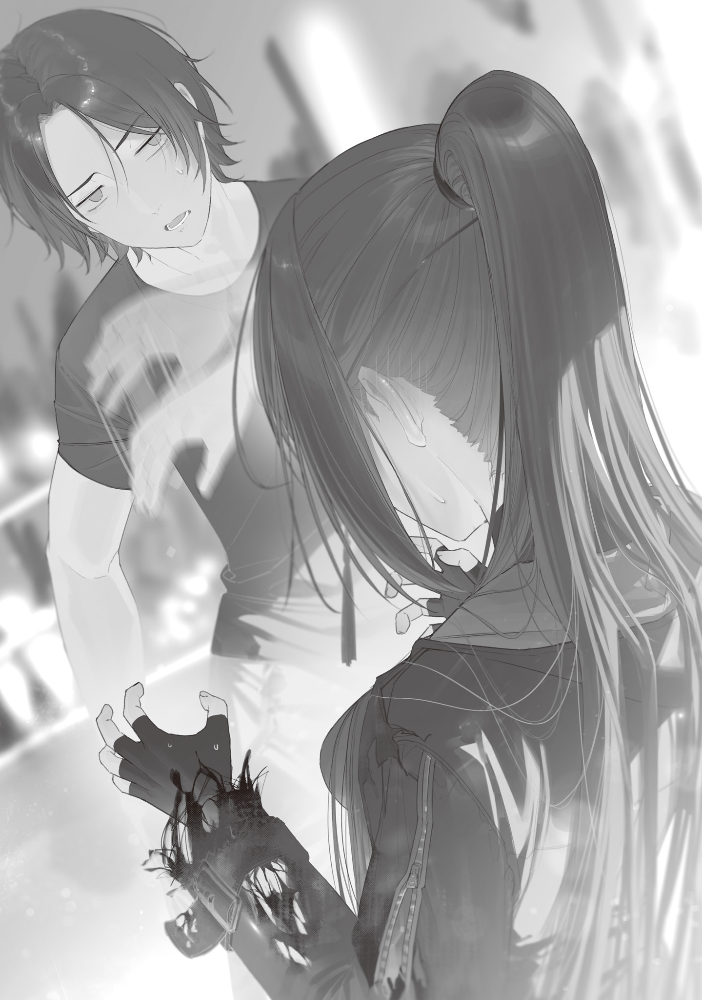

【儀式魔法十三祭具】

俺と正反対をいく大量生産路線の象徴、半田[はんだ]式製造法で作られる一般量産杖[つえ]は、段階的に製造ラインを増やしジワジワと普及していっている。

一般魔法杖[まほうづえ]製造が始まってからまだ半年足らずで、今は日産１００本前後に過ぎない。このままでは東京近郊の住民に行き渡るまで80年ぐらいかかる計算だ。

しかし、製造ラインが一つ増えるたびに日産本数は約10本増える。職人の腕も徐々に上がり、生産効率化も進んでいく。

加速度的に生産本数は増加していくから、東京どころか日本全土に魔法杖が普及するのもそう遠い未来ではないだろう。

東京では良い復興サイクルができていた。

というか、魔女集会を中心に良い復興サイクルを作る事に成功していた。

全国を飛び回る竜の魔女によるちょっと信頼性が怪しい情報によると、全ての生存者コミュニティの中で東京魔女集会治める東京都が最大規模であり、復興度合いも最高だとか。

今年度初めに目玉の魔女が行った統計調査によると、現在の東京人口は約２８０万人。首都圏全てを合算すると３５０～４００万人だ。これは全盛期のおおよそ20％になる。

グレムリン災害直後はとにかく人手が足りなかった。都外から運び込まれる莫大[ばくだい]な各種物資に依存していた生活は、物流停止によって崩壊。

備蓄を切り崩しながら、全力で畑を動かし（機械無しで！）、必死に開墾を進め、埠頭[ふとう]には切羽詰まった釣り人が並び、雀[すずめ]やハトですら貴重な食料になった。近隣都市の中で、魔物によって壊滅した場所から食料をかき集め回収したりもしていた。

それでも栄養は足りず、都民は少しずつ痩せていっていた。

水道が止まったから、毎日長い距離を川まで水を汲[く]みに歩かなければならなかったし、燃料確保のために廃屋を解体して木材を入手するのも時間と労力がかかる。火の番に常に誰かを置く必要があるし（都心で火事になったら洒落[しやれ]にならない。消防車は無いのだから！）、魔物が現れれば全てを放り出し必死に戦い、魔女か魔法使いの到着まで命懸けだ。

都民全員がその日生き延びるのに必死で、とても明日のために、復興のために、という余力など無かった。

俺にも覚えがある、最初期の苦しさだ。

一日の時間の多くが食料や燃料集めに費やされ、それでも足りていなかった。田舎の物資独り占め状態ですら不安を覚える不安定さだ。

あまりにも厳しく、脱落して命を落とす者が後を絶たない日々の中で、吸血の魔法使いを筆頭とした一部がなんとか無理やり余力を捻出し、未来への投資を行ったのは賞賛に値する。

小さくか細い未来への希望は、大[おお]日向[ひなた]教授の豊穣[ほうじよう]魔法迂回[うかい]詠唱成功によって結実した。

豊穣魔法によって耕作地の収穫が二倍強に増え、農作業に拘束されていた人員を他に回せるようになった。

すると、空いた人手で簡易的な水道を設置できた。

水道ができると、水汲みに費やされていた人員がまた他に回せるようになった。

今日を生き延びるためではなく、明日のために動ける人材が爆発的に増えたのだ。

だから今日一日を生き延びるためだけを考えるなら必要ない大学を設立できたし、魔法杖生産工房をどんどん建て、職人や職人見習いを配置できている。

豊穣魔法迂回詠唱という最初の起爆剤は、物の見事に連鎖して好循環を作った。

まあ俺が知っているこういう話はだいたい青の魔女と大日向教授からのまた聞きで、実際に劇的復興の渦中に身を置いていたわけではないから（俺は安全で平和な田舎からちょこちょこ手を出していただけだ）、聞いた話がどこまで実体通りかは知らないが。

今日俺の手元に転がり込んできた巨大グレムリンも、そうした正の連鎖の結果の一つだ。

以前、青の魔女が大怪獣を倒す時にできた街一つ丸ごと包み込むブ厚い大氷河は、魔法の火でのみ溶かせる。

だから継火の魔女が毎日コツコツ解凍作業を進めていたのだが、一般人が焔[ほのお]魔法を修得し始め、一般量産魔法杖の普及が始まった事で、解凍作業が加速。当初三年かかると見込まれていた工期は短縮され、二年半で完了した。

すごい。

けど、二年半かけて解凍しなきゃならん大氷河をたった一発の魔法で創り出した青の魔女はどうなってんだよ。世界のバグかお前は。

解凍が完了した後も住民の移住などいろいろ面倒な問題は残っているようだが、大怪獣の死体を巡ってもひと悶着[もんちやく]あったらしい。

まず大量の怪獣生肉は竜の魔女が引き取った。

魔物の肉の多くは食用に適さない。人間が食べると腹を壊すのだ。しかし魔女か魔法使いなら普通に食べられるから、勝手につまみ食いにやってきて文字通り味をしめた竜の魔女が肉の処分を全て引き受けた。生で食べきれない分は火を吐いて一気に燻製[くんせい]にするらしい。

なんかモヤるが結果オーライ。人間の食用にならない大量の肉の処分に手間取っていたらあっという間に腐って病気の温床になるからな。あいつもたまには役に立つ。

しかし肉以外についてはモメた。

半端な魔法ではビクともしない怪獣の強靭[きようじん]な鱗[うろこ]は、解凍して取り出すと魔力が抜けて急速に劣化が始まったが、それでも有用だ。怪獣の巨体を支えた頑丈な骨も貴重な資源。尾と胸部から採れた直径80㎜の巨大グレムリン２個も値段がつかない価値を持つ。

怪獣が死んだ羽村[はむら]市の住民とその管理者である煙草[たばこ]の魔女が所有権を主張した他、青の魔女も興味を示したし、怪獣の足止めに命をかけた継火の魔女と八王子[はちおうじ]の魔女も分け前を要求した。途中で怪獣から逃げ出した世田谷[せたがや]の魔女も図々[ずうずう]しく取り合いに参加し、事態は混迷を極めた。

最終的には目玉の魔女の取り成しで、それぞれ公平に分け合うという事になった。

もっとも、その公平の定義についてもまたモメて（貢献度順なのか？　貢献度はどう評価する？　魔女の人数割か？）、青の魔女がキュアノスを構える寸前までいったというからおっかない。そんな会議絶対参加したくない。胃が十個あっても全部壊れるぞ。

青の魔女は余波で街を一つ氷漬けにして、逃げ遅れていた住人を数十人巻き込み殺してしまったとはいえ、最終的な怪獣討伐者。

青の魔女が倒さなければ少なく見積もっても数万人規模で死者が増えていた事も重く見られ、取り分として巨大グレムリン二つを分捕った。

そのうち一つは大日向教授のおねだりでポンと東京魔法大学に寄贈され、魔物学科とグレムリン工学科の格好の共同研究材料になった。

そして残りの一つが俺の手元に来たわけだ。

俺は自宅工房の台座に巨大グレムリンを置き、感嘆と共にじっくり眺めまわした。

「でっけぇ～……80㎜だっけ？　魔石にゃ劣るが綺麗[きれい]だし。いいなぁコレ」

「気に入ったか。ボードゲームはまた明日にするか？」

「ん？　ああ。つーか、いいのか俺が貰[もら]っても。お前の取り分なんだろ」

「私が持っていても使わない。キュアノスがあるからな。大利[おおり]が欲しがると思って確保しただけだ」

「マジかよ。俺達ずっと友達でいような！　友達最高！」

「現金過ぎる……」

青の魔女は呆[あき]れているが、ちゃんと本心だぞ。

一生友達の意義や意味なんて理解する事はないと思っていたが、いざ友達ができてみると悪くない。

いや違うか？　このただ高価な物が手に入った以上のなんとも言い難い嬉[うれ]しい感覚は友達だからじゃなくて、青の魔女だからなのか？

友達一人しかいないから分かんねぇや。

青の魔女は廃墟[はいきよ]から発掘してきたという二人用ボードゲームを置いて帰ったので、改めてじっくり巨大グレムリンに向き合う。

今まで発見された中で最大級のグレムリンは、電気由来のモノが各地の発電所で発見された28㎜級。魔物由来のモノが40㎜級。

対して、こいつは80㎜。記録を大幅に塗り替える大物だ。

魔物産グレムリンに共通する特徴として未加工でも球形に近く、色がついている。独特の青白い色合いは氷のようであり、光の当たり方が変わると高温の青い火のようにも見えた。

むむむ。美しい。

これは磨き上げて飾ってもいいな。我が魔法杖工房の御神体[ごしんたい]、オクタメテオライトの添え物に置いたらめっちゃ映えそう。

でもこれだけ大きいグレムリンなら今までサイズの問題でやろうとしてもできなかったあの加工法この加工法、色々試せるし。

どうしたもんかな。贅沢[ぜいたく]な悩みだ。

俺は巨大グレムリンをぽけーっと眺めながら一晩丸々悩んだが、最終的には加工実験に使う事にした。

工房の飾りに使うのも魅力的だったが、東京魔法大学では研究に使っているというし、あんまり呑気[のんき]に趣味に走っていると技術的に置いて行かれそうでちょっとビビってしまった。半田教授の研究チームはマジで油断ならん。

巨大グレムリンが二つとも俺の物だったら、一つ飾ってもう一つを実験に使えたんだけどな。まあしゃーなし。

巨大グレムリンは今最もアツいメビウス加工の発展研究のために使う事に決めた。

メビウス加工は奥深い。巨大グレムリンを使う価値があるし、巨大グレムリンでないと試せない実験がある。

注目すべきは、呪文を唱える時に使うグレムリンによって呪文の挙動が変わる事だ。

この挙動は以下のように分類できる。

①通常形状グレムリンで魔法を使う

・他人同士が一つのグレムリンで同時に魔法を使う→一つだけ発動。残りは不発

・双子が一つのグレムリンで同時に魔法を使う→両方発動するが、異常震動発生

②メビウスの輪グレムリンで魔法を使う

・他人同士が一つのグレムリンで同時に魔法を使う→同時発動する

・双子が一つのグレムリンで同時に魔法を使う→同時発動する

要するにメビウスの輪は魔法的に安定した形状で、特別に二つの魔法を同時に処理できるのだ。魔法を増幅したり減衰したりはしないが、ピッタリ１・00倍の威力で魔法を出力できる。

が、この原理にはまだ続きがある。

双子が、同じ魔法を同時にメビウスの輪グレムリンに使った場合だ。

この時、魔力消費の頭割りが発生する。

実際に行われ確認された、凍結魔法基幹呪文「凍れ[ヴアアラー]」の場合を例にとろう。

メビウス・グレムリンを双子が一緒に持ち、二人が同時に「凍れ[ヴアアラー]」と唱えたところ、冷凍光線は一本しか出なかった。威力も消費魔力も一人分の一回分。

ただし、その消費魔力は双子で二分割された。

二人が協力して一つの魔法を唱えた事になったのだ。一人あたり二分の一の魔力消費で、一つの魔法を唱える事ができた。

三つ子でも実験が行われたが、その場合は一人あたり三分の一の魔力消費で一つの魔法が発動した。

人材が見つからず四つ子以上では実験できていないが、双子と三つ子の実験だけで何が起きているのか推測するには十分すぎる。

理論上、１００つ子なら消費魔力を１００分割できる。

人間でも詠唱できるが消費魔力が多すぎて事実上魔女＆魔法使い専用になっている強大な魔法でも、この方式なら協力して魔力消費を負担し合い、発動できる。

実際にある双子は一人では魔力が足りなくて発動できない魔法を、この大日向教授が「合唱」と呼ぶ協力詠唱で発動してのけたという。

非常に、非常に面白い。

二人で声を合わせ力を合わせて発動する魔法！　めちゃかっけぇ！　しかも実用的！

だが、ネックになるのは声質の完璧な一致だ。

その制限上、双子や三つ子、地獄の魔女といった例外でなければ「合唱」は使えない。

それでも凄[すご]い事だが、俺は１００人で大合唱して大魔法使うのとか見てみたい。

だから合唱の制限を巨大グレムリンを使い取り払おうと考えた。

他人同士だと「合唱」できない？

双子じゃないと「合唱」できない？

じゃあ、グレムリンの方を双子に加工しよう！

昔、青の魔女が言っていた。全てのグレムリンは、大本となる魔石から生まれた親子関係にあるのだと。

親子関係があるなら双子関係もあるのでは？

グレムリンの双子を作る方法は簡単だ。

巨大なグレムリンから、完璧に同一の形状のメビウスの輪を複数削り出す。

同じ塊から、同じ加工品を削り出すのだ。

それなら双子と呼べるはず。

この双子グレムリン加工が成功する根拠は特に無い。

普通に失敗するかも知れないが、なんかいけそうだと思っている。だから実験するのだ。

俺は教授じゃないから理論を筋道立てて説明できない。

世界で一番グレムリン加工の経験を積んできた魔法杖職人としての勘だ。この部品はここにハマりそうだな、みたいな。このやり方、いけそうな気がするんだよなぁ。

俺は一カ月近くの日数を費やし、直径80㎜のグレムリンから完璧に同一な形状のメビウスの輪を12個、それより一回り大きな比較実験用メビウスの輪を１個削り出した。

１００％の形状一致を達成するため、カタツムリよりゆっくりと慎重に馬鹿ほど時間をかけたし、目から血が出るんじゃないかというぐらい集中した。

なんなら一度極限の集中状態で鼻血が出て、気が付いたら顎と膝元が血だらけになっていたぐらいだ。

しかしおかげでミスは一度もしなかったし、精度は俺が出せる理論値になったと思う。

加工に誤差があるとしても１・０ミクロン以上は有り得ない。

珠玉の出来栄えだ。本物の双子だってここまでは似ないぞ。

12＋１輪のメビウスの輪を作り終えた俺は丸三日死んだように眠り、死にかけの亀のように起き出し堅パンをもそもそ食べ、半日ぐらいぼーっとした後、やっとまともに動けるようになり、目玉使い魔通信で青の魔女を呼んだ。

加工は完了した。後は実際に想定通りに機能してくれるかどうか、実験だ。

しばらくしてから迷いの霧を抜けてやってきた青の魔女は、玄関先で俺の顔を一目見るなり心配そうに言った。

「大利、お前やつれてないか？」

「い……や？　たぶん？」

「しばらく集中するとか言ってたが、食事はとっていただろうな」

「一カ月絶食してたら死んでるって。こんな話はいいんだよ、さあ入った入った、実験に付き合ってくれ」

俺は工房に青の魔女を通し、製作したメビウスの輪を見せ、予測される現象を説明した。

青の魔女は12個の完全同一グレムリンの内の一つを手で弄びながら首を傾[かし]げる。

「つまり、私がこれを持って、大利も別の双子グレムリンを持って、お前と合唱すればいいんだな？」

「そう。でも合唱じゃなくて儀式魔法って呼ぼうぜ。考えたんだけど、そっちのが断然かっこいいよな」

「？　まあ、大利がそう呼びたいならなんでもいい。私と二人で儀式魔法をすれば消費魔力が折半されるだろうという予想は分かったが、魔法はどう出るんだ？　どちらの輪から出る？　二つの輪の中間から出るのか？」

「え。いや、さあ？　全然考えて無かった」

双子グレムリンを使って儀式魔法が成立するのかどうかばかりに頭が行って、そのあたり全く考えて無かった。

まあまあ、いいんすよ。やってみれば分かるでしょ。

青の魔女は溜息[ためいき]を吐[は]いた。

「そういうところが危機感不足だと言っているんだ。暴発したらどうする？　念のためお互いグレムリンは別方向に向けて魔法を唱えよう」

「おっけー。じゃ、それで。唱えるのは『凍れ[ヴアアラー]』でいこう。いち、にの、さんな？　さんの「ん」って言った後に唱えるイメージで」

青の魔女は頷[うなず]き、俺に絶対に当たらない向きにグレムリンを構えた。

俺も青の魔女に絶対当たらない向きにグレムリンを構えた。

そして、唱える。

「いち、にの、さん！　『『凍れ[ヴアアラー]』』！」

実験の成功は即座に分かった。

俺と青の魔女が持つメビウスの輪が両方黄金色に光り、しかし魔法は一つしか発動しなかったのだ。

ただしその魔法は壁にかけていた比較実験用の大きなメビウスの輪から飛び出してきた。

俺は仰天した。

そっち!?　それは予想してなかった！

よりにもよって青の魔女に直撃する方向から冷凍光線が飛んできたため、俺は咄嗟[とつさ]に青の魔女の前に飛び出し背中に庇[かば]った。

「でぇ!?　つっめた！　ひーっ！」

胸に冷凍光線が直撃し、寒さに震えあがる。

氷風呂に飛び込んだみたいだ。凍る凍る！　寒い！　激寒！

鳥肌が立った肌をさすり足をバタつかせていると、後ろからガッと肩を掴[つか]まれ、強制的に青の魔女の方を向かされた。

「おい！　何を考えている!?」

青の魔女は凄い剣幕[けんまく]だった。な、なんかめちゃ怒ってるぅ！

俺は両手を上に上げて後ずさる。

「い、いや分かんないだろ、予想できないだろあっちの輪から魔法が出るなんて！　たぶん双子理論でいうとアレが13つ子の長男みたいに認識されていて、小さい12個のメビウスから集まった魔力の焦点があの一回り大きい長男メビウスに収束されて、」

俺は自説を語り無罪を主張しようとしたのだが、青の魔女は俺の言葉を遮り烈火の如[ごと]く怒鳴り散らす。

「違う！　なぜ私を庇った？　死んだらどうする!?　殺すぞ！　この馬鹿が！」

「いやいや庇うつもりなんて無かったんだって！　ほんとに、カケラも！　ただ急に冷凍ビームが来たからびっくりしてさあ！　体が勝手に！」

慌てて弁解すると、青の魔女は一気に言葉を萎[しぼ]ませた。

「…………とっさに私を庇ったのか？　何も考えず？」

「そう。ごめんて！」

マジでバカやった。体質で冷気耐性がある青の魔女に当たっていればなんともなかったのに。

俺が謝ると、青の魔女は静かになった。ぴくりとも動かなくなったので仮面の前で手を振るが、反応がない。

「し、死んでる……！」

「生キテル。デモ今日モウ帰ル」

「え、実験の続きは」

「明日」

やっと動いたと思ったら青の魔女はなんだかギクシャクした言葉と動きで帰ってしまった。

仮面と髪の隙間からチラッと見えた耳が赤くなってたし、風邪かな……

なんて思うほど、俺は鈍くない。

俺には分かるぞ。

青の魔女は照れていたのだ！　耳まで赤くなるほど照れていたのだ！

でも何に？

何を照れる要素があったのか。意味不明だ。

まあアイツも俺に負けず劣らず独特の感性してるから、なんか照れる事があったんだろう。そういう日もある。

何にせよ、青の魔女の協力のおかげで実験の成功は確認できた。

あとはこの12＋１個の双子メビウスの輪を樹脂でコーティングして傷がつかないようにして、大日向教授に送り付けよう。

そしてドヤるのだ。

どうだ？　お宅の大学でこの双子グレムリン製造は真似[まね]できまい。

常人には作れないアーティファクトをどんどん増やすぜ！

ワハハハハーッ！
