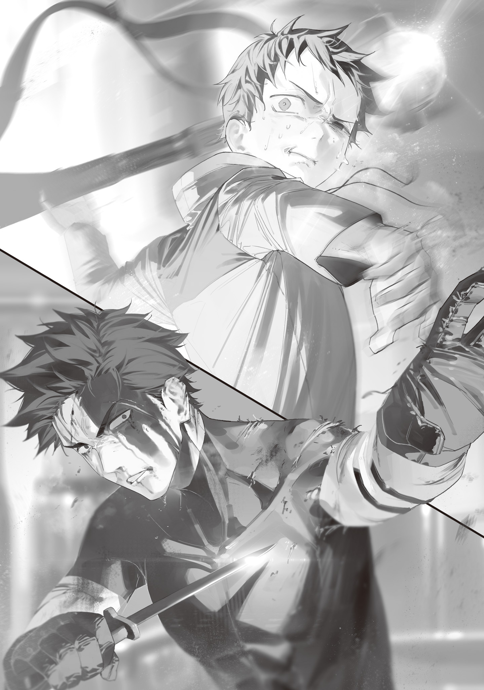

【港[みなと]区奪還作戦】

垂田[だれだ]紀見[きみ]は、港区を焼け出され渋谷[しぶや]区に身を寄せている一般成人男性だ。

垂田は中学生までは陸上部に所属し、部活の無い日も父と共にジョギングに出かけるなど、走るのが好きでアウトドア派だった。

が、中学三年生の時に交通事故に遭い、両足を複雑骨折。手術によって歩けるようにはなったものの、以前のようには走れなくなってしまった。

失意の垂田は、世界陸上の動画を見て心を慰めた。

もう自分では走れないとはいえ、走るためのフォーム研究をしているようで、まだ走りの世界の延長線上にいるような気分になれたのだ。

世界陸上の動画を見ている内に、趣味は少しずつ変わっていった。

最初は短距離と中距離走の動画しか見ていなかったのだが、マラソンの動画も見るようになった。

マラソンの次は、トライアスロン。

トライアスロンに触発されて水泳を見て、自転車競技を見て、アクロバットバイクを見て、映画スタントを経て、映画の世界に浸[つ]かる。

興味は興味を呼び、紆余曲折[うよきよくせつ]を経て、元々アウトドア派だった垂田は立派なファンタジー映画マニアと化した。

そんなファンタジー映画マニアが成長し、大人になり、グレムリン災害に遭った時、誰にも言えない事だが、期待してしまった。

電子機器が壊滅してしまい、笑い声を出す事さえ憚[はばか]られるような未曾有[みぞう]の大災害が起きている最中[さなか]ではあるが、魔物や魔女が現れたのだ。魔法が現れたのだ。

治癒魔法を期待し、現代医学では元通りにならなかった自分の足が魔法のように完治するかも、と胸躍らせるのはそんなに悪い事だろうか。

まさにその魔法、魔物が使う魔法によって人が死んでいくのを目の当たりにしながら、魔法は素晴らしいもので希望が持てるだなんて口が裂けても言えなかったが。

垂田は災害と共に世界にもたらされた魔法に強い興味を持った。

港区自治警備隊への配属願いを出し、射手として配属（足が悪いため）されてからは、遭遇した魔物のスケッチを欠かさず、その特徴や使った魔法、出現日時、場所、戦闘履歴などをつぶさに書き留めた。

他の同僚は命懸けで必死に魔物と戦い、港区担当である吸血の魔法使いの到着まで体を張っていたが、クロスボウ持ちの後衛である垂田は前衛と比べればまだマシだったし、戦闘後にメモ帳を取り出すぐらいの余裕はあった。もちろん、吸血の魔法使いのスケッチや分析メモもとった。

東京湾から港区に上陸してきた大怪獣によって港区を焼け出された後も、垂田は大怪獣の姿を描き留め、データをメモした。

その日の仕事をこなすばかりではなくデータを収集していた垂田は、すぐに大怪獣を一撃で葬り去った青の魔女の魔法威力が異常だと気付いた。

大多数の都民は「流石[さすが]、青の魔女だ」「最強の魔女だ」と恐れながらも賞賛していたが、魔物だけでなく魔法使いと魔女についてもデータを集めていた垂田には違和感があった。

魔女も魔法使いも、決して無敵ではない。

強大な魔物相手では苦戦する事があるし、敗走する事もある。

魔法の威力にも限界がある。

体感的なものに過ぎないが、被害規模から察するに青の魔女の魔法は魔女としての限界を超えているように思えた。

港区からの避難先である渋谷区、目玉の魔女の支配地で警備隊の仕事を続けつつ調べを進めた垂田は、「青魔杖[つえ]キュアノス」の存在を知った。

魔法の威力を増幅させる神秘の秘宝、魔石の存在は知っている者なら知っている。

吸血の魔法使いも自身が持つ魔石「ブラッドムーン」を隠そうともせず持ち歩いていたし、入間[いるま]の魔法使いのクーデターで魔石は戦いの大きな争点になった。

数少ない青の魔女の目撃談を統合するに、キュアノスは魔石を利用した道具のようだった。魔石を棒にくっつけ、持ち歩きやすくしているのだろうか？　分からない。

入間のクーデターで青の魔女が見せた魔法の力は飛びぬけたものだったが、魔石を使ったのを加味しても今回の怪獣退治は異常だ。

何か秘密がある。もしかして、キュアノスを手に入れれば自分でも魔法を使えるようになるのではないだろうか？　そんな根拠の無い期待を持ちたくなるような代物だ。

一度、垂田は警備隊の備品の双眼鏡をこっそり持ち出し、青梅[おうめ]市まで偵察に行った。

市外から半日張り込んだ垂田は、屋根の上を走って市内の哨戒[しようかい]をしている青の魔女の姿を捉える事に成功したが、双眼鏡越しに自分の方を見られ慌てて逃げた。

機嫌を損ねて殺されては敵[かな]わない。

青の魔女が青い宝石を嵌[は]めこんだ美しい杖を持っているのは確認できたが、詳しく観察する余裕はなかった。青の魔女の調査は危険なので、垂田は諦めて警備隊の仕事に従事する日々に戻った。

それから約半年が経[た]った頃、文京[ぶんきよう]区で魔法大学が開校されるという知らせが都内全域に広められた。

魔法大学！

垂田はもちろん、喜び勇んで話に飛びついた。

この波に乗らない馬鹿はいない。入学者には魔法を伝授するという謳[うた]い文句[もんく]はあまりに魅力的だ。自分もあの魔女や魔法使いのようになれると胸躍らせる者もいれば、在学中の仕事の免除のために受験を決める者もいた。

垂田の志望動機は前者だったが、普通に不合格になりガックリした。

滑舌テストはクリアし、魔力量テストでも優秀な数値を叩[たた]き出したが、知能テストがダメだった。

垂田よりも確実に頭の良い警備隊の同期（国立大学出身）も落ちていたから、これは垂田の頭が悪かったせいではなく、単純に東京魔法大学の合格水準が高すぎるだけだろう。

魔法大学には本当に優秀な一握りの人材しか入れない。

不合格を突きつけられ挫折に沈んだ垂田だったが、それからも未練がましく魔法大学の情報を集めた。

東京魔法大学学長、世紀の天才少女にして魔法言語学教授、青の魔女との太いパイプももつ大[おお]日向[ひなた]慧[けい]は正十二面体フラクタル型魔法杖[まほうづえ]アレイスターと呼ばれる大仰な杖を持っていた。

本人の周りには常に専門の警備がさりげなくついていて不審者の接近を許さないので、垂田は大学の学生の口伝[くちづ]てにアレイスターの情報を探った。

アレイスターはキュアノスとはまた違った魔法杖で、その名の通り正十二面体フラクタル型のコアを備えている。

垂田はアレイスターの正体を特殊な魔石を利用した杖だと睨[にら]んだ。

黄鉄鉱の自然結晶は綺麗[きれい]な立方体になる事で有名だ。それが魔石ともなれば、自然にフラクタル型になる事もあるに違いない。

誰かが加工した作品だという説もあったが、垂田からすれば職人の現場を分かっていない者の無知から来る妄言だった。グレムリンの加工難度は非常に高い。精密工作機器が壊れて使えなくなったこの世界で、誰が話に聞く入り組んだフラクタルを削り出せるだろう？　そんな事ができる職人は存在しない。

垂田は日々の警備業務をこなしながらも杖を調べ魔女と魔法使いを調べ、魔物についても調べつつ、次回の魔法大学入試対策の勉強まで並行して行った。

忙しい毎日だった。

しかし努力は実らなかった。

垂田は翌年と翌々年の入試にも落ちたのである。

特に翌々年の入試は惜しかった。

前年まで魔法言語学科一つしかなかった魔法大学に「グレムリン工学科」「魔物学科」「変異学科」「戦闘学科」の四学科が新設される事になり、生徒だけでなく教授の募集も行われていた。

垂田は警備隊の経験を活[い]かして戦闘学科の教授を、コツコツまとめてきた独自の魔物データを元に魔物学科の教授を目指したが、どちらも上位互換がいた。

戦闘学科の教授の座は棒術と射撃術に優れるだけに留[とど]まらず独学で魔女の魔法を真似[まね]して運用していた天才が射止めたし、魔物学科の教授に就いた男は垂田のように魔物のデータを集めていただけに留まらず、そのデータを統計的に整理し系統別魔物分類を行っていた。

垂田も日々の仕事をこなすのに必死な大多数の市民と比べれば相当独自研究に労力を費やしている方だと思っていたが、上には上がいた。

垂田も優秀な方だ。

しかし、魔法大学の狭き門をくぐるには一歩足りない。

どうにも上手[うま]く行かない垂田に転機が訪れたのは、不合格通知から八カ月が経ってからの事だった。

垂田は魔法大学入試に三回落ち、教授試験に合わせて二回落ちているが、受験時の個人情報は大学に保管されていた。

垂田はその豊富な魔力量と港区出身である点を買われ、魔女集会直々に港区奪還作戦への参加を打診されたのだ。

垂田は仰天した。

グレムリン災害前でいえば、アマチュア動物学者が突然日本政府からの極秘作戦に招集されたようなものである。

打診にはもちろん快諾した。

何かのドッキリではないだろうな、と少し疑いながら憧れの東京魔法大学の門をくぐり、大学構内の会議室に入ると、そこには自分と同じように招集された者達がいた。

不安そうにしている者もいれば、ようやく港区を魔物の魔手から取り返す時が来た、と燃えている者もいた。

やがて会議室の椅子が埋まった頃、最後に可愛[かわい]らしい白い毛並みの獣人少女が入室してきた。

彼女は踏み台をズルズル隅から引っ張ってきて講壇にちょこんと立つと、人好きのする笑顔で一礼した。

「皆さん、こんにちは！　本日は急な呼びかけにもかかわらず、お集まりいただきありがとうございます。私は大日向慧。当大学の学長を務めさせて頂いている者です。今回は東京魔女集会からの依頼により、あなた方への儀式魔法指導役を仰せつかりました」

大日向教授が語るところによると、港区奪還は兼ねてより計画されていたが、ようやく必要な手札が揃[そろ]ったとの事だった。

かつて偉大な吸血の魔法使いが治めていた港区は、大怪獣進撃によって焦土と化した。

本来ならば死亡した吸血の魔法使いの代わりに誰か別の魔女が管理を引き継ぐのが望ましかったが、魔女集会は限界だった。構成員は既に限界まで広い地域を担当しており、港区の世話まで受け持てる者がいなかったのだ。

百体以上の使い魔を自在に操り、魔女集会屈指の広範囲を監視し六区の管理をしている目玉の魔女ですら、七区目にはお手上げだった。

空白の港区はたちまち魔物の巣窟になってしまった。

魔女集会の中でも遊撃に出る事が多い板橋[いたばし]の魔女が定期的に間引いてくれているが、板橋の魔女は他の空白地域……葛飾[かつしか]、大田[おおた]、八王子[はちおうじ]西部、稲城[いなぎ]などの定期駆除もしている他、千葉や埼玉から侵入してくる魔物の撃退まで請け負い目の回るような忙しさだ。とても港区だけに集中はできない。

仮に魔女が辣腕を振るい一時的に魔物を一掃できたとしても、維持ができないのだ。

しかし、状況は変わった。

なすすべもなく港区から逃げ出し、魔物に占拠された港区を指を咥[くわ]えて見ているしかなかった二年半前とはもう違う。

魔法大学魔法言語学科の研究により、人間でも唱えられる実戦的魔法が増えた。

グレムリン工学科の研究により、港区警備隊全員に行き渡るだけの数の一般魔法杖が揃った。

魔物学科の研究により、魔物の危険度を分類し、特徴や弱点を記した虎の巻草案ができた。

戦闘学科で訓練を積んだ魔術師[ウイザード]が複数名、奪還作戦に名乗りを上げた。

東京魔女集会は機は熟したと判断した。

作戦はこうだ。

吸血の魔法使いの遺品である魔石「ブラッドムーン」の杖を持った魔術師[ウイザード]を切り込み役として、港区の中心部を電撃的に確保。

東京タワーの残骸を利用し見張り塔を作り、儀式魔法集団を配置。高地から港区全域を監視し、魔物を片端から儀式魔法で呪殺する。

この見張り塔からの儀式魔法は港区制圧後も、対魔物監視対応の心臓部として機能する。

「このブラッドムーンを使った血杖[けつじよう]ヴァンピールは、当大学が製造した初めての魔石杖[ませきづえ]です。性能としては青魔杖キュアノスに大きく劣りますが、仕上げの研磨だけを外部委託し、コアは完璧な球体になっています。今後の新加工技術発見発達を見込み、拡張性を持たせるため、内部の多層化加工は行われていません。

血杖ヴァンピールは港区の過去からきた物であり、港区奪還の今を初陣として飾る物であり、未来へ紡がれるものでもあります。

戦闘学科首席、京極[きようごく]大和[やまと]さん。前へ」

筋骨隆々の大男が血杖ヴァンピールを授与されると、会議室には大きな拍手が巻き起こった。

続いて垂田を含む十三人に捻[ね]じれた青白い宝石の輪っかをくっつけた杖が配られる。

「今お渡しした儀式魔法十三祭具は、人間が大量の魔力を消費する儀式魔法を使うために必要な特別製の杖です。コアは保護材で覆ってありますが、非常に繊細なものなので大切に扱って下さいね。

小林[こばやし]さんにお渡しした焦点杖[しようてんづえ]を中心に、十三人で魔力を分割負担し、一つの大魔法を行使できます」

大日向教授は、黒板に図を描いて儀式魔法の使い方について講義を行った。

魔法の発射先は焦点杖の持ち主が決めるため、要するに垂田の役割は魔力タンクだ。

望むところだった。魔法大学に何度も落ちた落ちこぼれでも、港区奪還部隊の一員として魔法を振るえるなら、主役じゃなくても全然良い。

「私達は魔物の呪殺役と仰[おつしや]っていましたが、呪殺魔法とは具体的にはどのようなものですか？」

垂田が挙手して質問すると、大日向教授は指示棒で手のひらを叩き神妙に答えた。

「良い質問ですね。呪殺魔法は、グレムリン災害初期に亡くなった小金井[こがねい]の魔女の魔法です。絶対音感を持っている変異学科の教授が偶然彼女の魔法を聞いて覚えていまして、当大学に一つだけ呪いの魔法、呪殺魔法の記録があります。

呪殺魔法は魔力消費が大きいですが、視界に捉えた相手を呪い殺す事ができます。消費した魔力より小さい魔力しか持っていない相手は即死します」

大日向教授の言葉に会議室がざわついた。

魔法にはとんでもないものが多いが、今聞いた呪殺魔法は特に法外だ。

教授はざわめきが収まるのを待ってから続けた。

「ただし、呪殺に失敗すると呪い返しを受けます。相手が消費魔力より大きな魔力の保有者だった場合や、魔力コントロールで呪いを逸[そ]らした場合などですね。

この場合、強烈なフィードバックで魔法の使用者が死亡します。魔力逆流防止機構で軽減しても命の保証はできません。

あなた方を招集する時に命の保証ができないとお断りさせていただいたのは、魔物との戦いで命を落とす危険性もありますが、このフィードバックによるものも大きいです。

魔物分類表を活用し、魔力が大きすぎる魔物には呪殺を試みず、魔女か魔法使いに応援を要請するようにしてください」

会議室はしばらく静まり返り、やがて数人が離脱した。

魔物との戦いで殺されるのなら納得できるが、自爆して死ぬのは御免だ、との言である。

もっともだ。垂田も正直離脱したくなった。

戦って死ぬならまだ納得できるが、相手の保有魔力量を量り違えて間抜けに頓死したのでは死んでも死にきれない。

が、そうした間違いを防止するために魔物分類表がある。垂田は悩んだ末、尻を椅子から離さなかった。この仕事は誰かが命懸けでやらなければならないのだ。垂田は、自分がその「誰か」になる資格を持つ者だと前向きに捉えた。

儀式魔法は一日あたり複数回の発動が予想されているため、魔力タンク役は総勢40名近くいる。数名抜けてしまったとはいえ、奪還作戦は断行される運びとなった。

呪殺魔法の詠唱を習い、儀式魔法と連携の訓練をみっちり積んだ垂田たちは、二カ月後に魔法大学に集まった元港区住民たちの盛大な見送りの中、港区奪還作戦へ出発した。

かつて都心に溢[あふ]れていた放置車両は既に撤去が終わり、自転車の通行が可能になっている。港区奪還作戦部隊は自転車で一列縦隊を作り、やがて港区の端へ到着した。

奪還作戦の現場指揮を執る京極大和が、焼け落ちた廃墟[はいきよ]と太陽を背に血杖ヴァンピールを掲げ、短い演説をした。

「諸君！　我々は戻ってきた！　この港区に戻って来た！　各々思う所があるだろう！　思う所などなく、ただ仕事としてここへ来た者もいるだろう！　だが、今日この日この瞬間、我々は一つの目標の下に団結する！」

京極は一度言葉を切り、踵[きびす]を返し叫んだ。

「港区を魔物から取り返すぞ！　作戦、開始!!」

鬨[とき]の声[こえ]が轟[とどろ]き、奪還作戦が始まった。

中心部への進軍は予定通り電撃的に行われた。じっくり魔物を掃討し危険を潰しながら進軍していては魔力がもたない。

最低限の警戒をしながら、部隊は早足に国道一号線に沿って東京タワーを目指した。

幸い、相手は人間ではないから罠[わな]を踏み抜く心配は無い。待ち伏せをしている一部の魔物は相手が鈍足なら走って振り切り、振り切れないようなら魔法杖を振るう魔術師[ウイザード]たちが魔法の集中砲火で迅速に討伐した。

あまりに強い魔物が立ち塞がれば迂回[うかい]するか、引き返す手筈[てはず]になっている。だが幸い、国道一号線の沿線上にそういった魔物はいなかった。これならば後続の第二部隊が問題なく補給経路を確立できる。

途中で部隊の何名かが瓦礫[がれき]に足を取られ足首を挫[くじ]いたり、地面から飛び出してきた魔物に襲われたりして離脱したが、一行は計画通り小一時間で東京タワーの根本に到着した。

東京タワーを望む焼け残った売店で小休止を取りながら、隊長である京極が垂田たちを労[ねぎら]う。

「全員、よくやった。後はタワーに上り、高所を制圧し儀式魔法部隊を配置するだけだ。

見晴らしの良い高所から全方位に呪殺魔法を撃てるようになれば、港区は取り戻したも同然だ」

「ですが、隊長……」

「ああ。問題はタワーを上り切れるかだ」

部隊員の一人の言葉に、京極は頷[うなず]き売店の窓から外の様子を窺[うかが]った。

東京タワーは魔物の巣になっていた。

あちこちに人間大の大きな繭がくっつき、獣とカマキリを歪[いびつ]に合成したような奇怪な魔物が集団でその繭の世話をしている。

前回、板橋の魔女が掃討を行った時にはいなかったはずの魔物だ。掃討後に蔓延[はびこ]ったのだろう。

「隊長、繭を除[のぞ]けば獣カマキリの数は16体です。他の魔物の姿はありません」

「魔物分類表を確認しました。獣と昆虫、二種類のキメラタイプですので、危険度としてはここからここの間かと」

「そうか……一度に全ては相手にできないな。魔法の遠距離射撃が得意な者に狙撃を頼みたい。４、５体初動で落とすか弱らせれば、楽に戦える」

売店の椅子に座り隊長たちの作戦会議を聞いていた垂田は、ふと小さな物音に気付いた。

些細[ささい]な音だったが、何か気になって窓から外を覗[のぞ]くと、見張りに立っていた部隊員が屋上から忍び寄った獣カマキリに首を落とされるところだった。

垂田の心臓がとび跳ね、絶叫した。

「敵襲ーッ！　見張りがやられた！　屋根上に魔物一体かそれ以上！」

パニックになりかけながらも咄嗟[とつさ]に的確な状況報告ができたのは、二カ月の訓練の賜物[たまもの]だろう。

しかし誰もが垂田のように行動できたわけではない。売店の窓を突き破り転がり込んできた二体の獣カマキリは、休息していた部隊を大混乱に陥れた。

隊長である京極は流石に動きが違い、統制を取ろうと声を張り上げながら血杖ヴァンピールを素早く獣カマキリに向ける。

が、それより早く、カマキリが尻から棘[とげ]の散弾を隊員へ発射してきた。

棘のほとんどは誰にも当たらず売店の壁に突き刺さったが、その内の一発が馬鹿当たりのアンラッキー・ショットだった。

なんと、京極の手からヴァンピールを弾[はじ]き、割れた窓の外まで飛ばしてしまったのである。

それだけではなく、東京タワーからにじりよってきたひときわ大きく派手な虹色の獣カマキリの足元に杖が転がっていく。

虹色獣カマキリは多脚を止め、昆虫的な動きで首を傾[かし]げ、文字通り転がり込んできた杖を興味深そうに見た。

一生分の不運がまとめてやってきたような大事故に唖然[あぜん]とする京極と、それを見ていた垂田の目が一瞬合った。

そして次の瞬間、京極は突進してきた獣カマキリの巨体に押し倒された。

事態は混迷を極めていた。

売店内は阿鼻叫喚[あびきようかん]で、同士討ちを恐れまともに獣カマキリを攻撃できていない。血しぶきが舞い、悲鳴がこだまする。頼りの隊長は切り札を失ったのみならず、獣カマキリの下敷きになり、肝心の切り札は敵の足元。

正気を失いそうなほどの混乱と恐怖に襲われた垂田の頭の中で、何かがプツンとキレた音が聞こえた気がした。

刹那、かつてないほど頭が澄み渡る。

垂田は二度とできないであろう瞬時の状況判断を行い、近くで狼狽[うろた]えている小林から焦点杖を奪い、代わりに自分の杖を押しつけ、出口へ走った。

「儀式魔法準備ーッ！　起点、垂田！　カウント３、２、１!!」

垂田はほとんど悲鳴に近い声で叫びながら売店のドアを蹴破り、外に飛び出した。

「君を愛している[ナトウ・ヤウエ]」

垂田は走った。

十年ぶりに全身全霊で走った。

体はすっかり錆[さ]びついていたが、フォームは覚えていた。

何百回何千回と口に馴染[なじ]ませてきた詠唱文が零[こぼ]れ出て、背後からも皆が唱える同じ文句が聞こえる。

「でも僕は悪魔だから[デンニエクララバアイエン]」

両足は悲鳴を上げ、一歩踏み出すたびに足の骨が砕け散りそうだったが、垂田は獣のように呪文を咆哮[ほうこう]し激痛に耐えた。

「これが僕の愛の形なんだよ[フクシツワクララフイフイ・ヤウエ]!!」

垂田を焦点として発動した儀式呪殺魔法の淀[よど]んだ黒い波動は、今まさにヴァンピールを鎌で掴[つか]み飛び立った虹色獣カマキリに命中した。

中空で力を失い落下した虹色獣カマキリの死体のもとへ駆け込み、鎌からヴァンピールをもぎ取る。

振り返ると、売店の窓から右手で構えた小剣で獣カマキリを牽制[けんせい]している血まみれの隊長が見えた。窓から左手を突き出し、「渡せ」の仕草をしている。

警備隊の射撃手としての歴が長い垂田は投擲[とうてき]術も修めている。

垂田が投げ渡した血杖ヴァンピールは京極隊長の手に吸い込まれ、瞬く間に売店内を混沌[こんとん]の渦に叩き落としていた二体の獣カマキリを吹き飛ばした。

それが決定打になった。

虹色個体は群れを統率するリーダーだったらしく、獣カマキリたちの動きは明らかに精彩を欠いた。

獣カマキリの奇襲は数名の犠牲者を出した。

だがそれ以降は負傷者もなく、東京タワーを制圧。

計画通り、高所からの呪殺で周囲の安全を確保。

時は12月25日、クリスマス。

港区は血の代償と引き換えに、二年と八カ月ぶりに人類の手に戻った。
