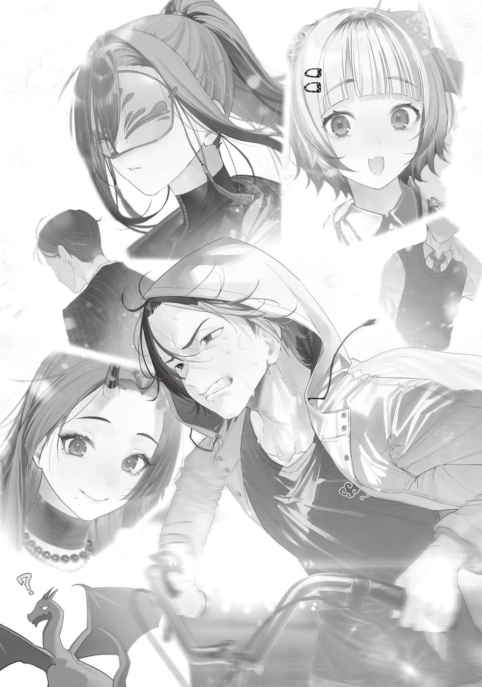
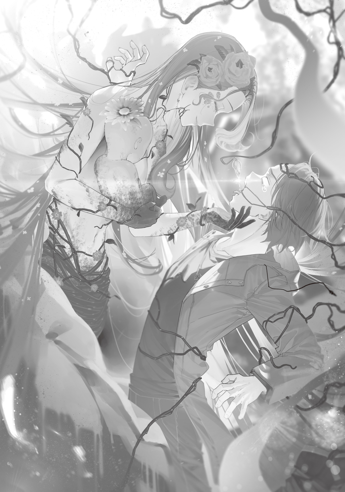

【花の魔女】

最近、俺は幾何学的美と芸術的美の融合に取り組んでいた。

杖[つえ]の性能向上にはそんなに役立たないが、性能だけではなく見た目にもこだわっていきたい。無骨な杖も好きだけどね？

大[おお]日向[ひなた]教授を通じて数学と芸術の蔵書を取り寄せ、炭こたつでぬくぬくしながら読[よ]み耽[ふけ]り、触発されて思いついたアイデアを描きとめる毎日。

冬の間は野良仕事もお休みだ。こたつと薪[まき]ストーブのおかげで電気がなくても部屋は暖かい。

夕食には釜炊きの新米をたらふく食べる。朝は前日の残りの米に清水と干し魚の削[そ]ぎ肉、キノコや切干大根、一つまみの塩を加えて煮立たせ、具だくさんの雑炊にする。

どれも旨[うま]い。やっぱり新米は古米・古古米とは炊き上がりも食感も香りも全てが段違いだ。

今年の春ごろには自家製味噌[みそ]と醤油[しようゆ]の熟成が終わる。そうすれば在庫を気にせず日本人の魂ともいえる調味料を贅沢[ぜいたく]に使って飯を作れる。楽しみだ。

そうして悠々自適の山奥工房生活を送っていた俺は、ある朝起きた時、頭にキノコが生えている事に気付いた。

グレムリン災害からそろそろ四年。いろんな突拍子もない出来事にも慣れてきたが、流石[さすが]にビビる。

まさかキノコの食べすぎで頭からキノコが!?

恐[おそ]れ戦[おのの]いたが、頭のキノコは見た事のない種類だった。俺が普段山で採っている食用キノコとは種類が違う。

傘は毒々しい紫と赤のまだら模様。柄の皺[しわ]はまるで人面のように見える。

不気味だ。

体に悪そうだったのですぐ頭からもぎ取り、俺は念入りにシャンプーをしてキノコの根っこを洗い落とした。

キノコを引っこ抜いてシャワーを浴びたら、なんだか体が軽くなった気がする。うーん、寄生キノコとかだったんだろうか？

地球原産の珍種か特殊型魔物か知らないが、俺の体から生えてきた記念に、もぎ取ったキノコはアルコール漬けにして標本として保存した。

瓶の中のアルコールに浮いているキノコを眺めていると、けっこう不気味だがおもろい。実質生え変わった乳歯みたいなものだ。たぶんね。知らんけど。

キノコが生えてきた二日後、俺はキノコの標本とボードゲームを持って青の魔女の家に遊びに行った。目玉の使い魔で遊びに行っていいか聞いたが、返事はなかった。着拒されているっぽい。俺もした事あるから、たぶんその仕返しだろう。

はー、あいつも大人げねぇな。まったくさぁ。

とはいえこのボドゲには青の魔女もかなりアツくなっていたから、持って行けば遊びの誘いに応じるだろう。

あとついでにキノコについても聞きたい。魔女ってこういうキノコに詳しいイメージある。偏見かな。

青の魔女の家に到着した俺は、入ってすぐのところで寝っ転がっている青の魔女に驚いた。

「えっ？」

何やってんだこいつ？　玄関で寝てんのか？　そんなブラック企業勤め限界サラリーマンみたいな事ある？　奇行過ぎる。

踏まないように気を付けながら靴を脱ごうとしたところで、彼女の手が一通の手紙を持っている事に気付く。

「何やってんのお前。この手紙何？」

なんなんだ。マジでどうした？

というか、青の魔女の頭にもキノコ生えてないか？　何？　流行[はや]ってんの？

不思議に思いながら興味本位で手紙を拾う。

送り主は「未来視の魔法使い」だった。

ほう。魔女集会の業務連絡か何かだろうか。

中身は気になるが、他人の手紙をあんまりジロジロ見るのも悪い。

青の魔女の手に手紙を戻そうとして、俺は他人の手紙ではなかった事に気付いた。

偶然目に入った宛名に「２０２８年２月８日09時33分、青の魔女自宅玄関に立っている誰かへ」と書いてあったのだ。

宛名を穴が開くほどまじまじと見て、玄関先の柱時計を見る。

時計の針は９時33分を示していた。

「えっ……」

なにこれ。こわぁ……

未来視の魔法使いは未来が視[み]えるって聞いてたけど、こんな事できるんですか？

怖いよ、個人情報丸裸じゃん。

いや名前はバレてないっぽいし、何もかもお見通しってわけでもないのか？

思わず周りを見回す。今こうしている瞬間の行動も、未来視の魔法使いに視られてるんじゃないだろうな？　視られていてもどうしようもないけど、なんか嫌な気分だ。

俺は手紙の宛名をしばらく見つめ考えてから、足元に転がっている青の魔女に声をかけた。

「なあ、これ俺宛だよな？　読んでいいのか？」

しかし返事はない。

あまりにも静かなので急に心配になって口に手を近づけたが、小さく息をしていた。

なんだ、生きてた。良かった。

しかし死んだように眠るやつだな。今まで寝てるとこ見た事ないから知らなかった。

冷たい玄関の土間で寝かせておくのもアレなので、廊下のふかふかした玄関マットの上に引きずって乗せておく。

俺の冬用コートを脱いで上にかけてやってから、手紙を開封して読み始めた。

---

はじめまして。私は未来視の魔法使いと呼ばれている、東京魔女集会の者だ。

君が今ここでこの手紙を読む未来を視て、この手紙を書いている。

時間が惜しい。結論から書こう。

君には今すぐ花の魔女の下へ行き、

この最悪の疫病の特効薬を手に入れて欲しい。

できれば残りの文章は花の魔女の元へ向かいながら読んで欲しいが、残念ながら理由を説明しなければこんな突然の頼みを納得はできないだろう。

まずは何が起きているかのおさらいから始めよう。知っている情報もあるだろうが、間違いのないよう筋道立てて説明したい。

現在、東京を中心に頭からキノコが生える奇病が大流行している。

このキノコは寄生した宿主から体力と魔力を吸い取り成長するのだが、症状には三段階ある。

まずは潜伏期。寄生された者は全く自覚できず、健康そのもの。この状態でも高い感染力を持ち、周囲に感染を広げていく。

次に発症前段階。体力と魔力の吸い上げが始まり、倦怠感[けんたいかん]に襲われる。

更にその次の発症後段階では、吸い上げた栄養によって頭にキノコが生えてくる。

この後段階は条件によって二通りの症状が出る。

軽症型と、劇症型だ。

軽症型はまさに軽症で、頭からキノコが生えても微熱程度の症状に収まる。

その症状さえ、キノコを切除すれば快復し、たったそれだけで病は完治する。

君の後ろ姿を視た限り、君の頭にキノコは生えていなかった。

だから君は感染していないか、軽症型で発症し頭のキノコを切除して完治した後なのだろう。安心して良い。

問題は劇症型だ。

感染後に魔力欠乏による失神を一度でも経験した者は、必ず軽症型から劇症型へ変化する。

劇症型の発症後段階では激しく魔力と体力の吸い上げが行われる。

魔法の使用が不可能になり、生えたキノコを除去すればむしろ病状が悪化する上、キノコは即座に再生する。

魔力体力の急激な消耗につれ、意識の混濁、五感の喪失などの症状を呈した後、昏睡[こんすい]状態になる。そうなればもう点滴も効かない。消耗は続き、栄養を全て吸い上げられ死亡する。

こうして、劇症型の発症者は２～５日で死に至る。致死率は残念ながら１００％だ。

---

そこまで読んだ俺は手紙から目を離し、玄関マットの上でぴくりとも動かない青の魔女を見下ろした。

恐る恐るいつもつけっぱなしの仮面を外すと、美しいが土気色になった美少女の御尊顔[ごそんがん]が露[あら]わになる。

はー!?

顔色わっる！　劇症型だこれ！　致死率１００％！

悠長に玄関に突っ立って手紙読んでる場合かーッ！

花の魔女のとこに特効薬があるって!?

バカッ、今すぐ行くぞ！

「おい待ってろ！　今花の魔女のとこに連れていってやる！」

俺は青の魔女の頬[ほお]をむにむにして声をかけてから、急いで裏手の庭の倉庫からリヤカーを引っ張って来た。

青の魔女をそーっと抱きかかえ、野良仕事で培ったパワーに物を言わせて運び、毛布を敷いたリヤカーに寝かせる。

そして自転車とリヤカーを短いロープでしっかり結び、東京の地図を見て花の魔女が根城にしている台東[たいとう]区・荒川[あらかわ]区への道順を確認する。

たぶんこれが俺ができる最善。全速前進だ。青の魔女が死んでしまう前に花の魔女の下に辿[たど]り着き、特効薬を飲ませてやらなければ。

地図をポケットに突っ込みサドルにまたがる。

そして自転車の重いペダルを漕[こ]ぎ始めながら、未来視の手紙の続きを読んだ。

お前これでもし手紙の最後に「ドッキリ大成功」とか書いてあったらブン殴りに行くからな。

---

劇症化したキノコ病を治療する唯一の手段は、花の魔女が持つ特効薬だ。

しかし残念ながら、彼女は君以外に決して特効薬を渡さない。君だけが特効薬を手に入れられる。君には花の魔女と取引を行い、なんとしてでも特効薬を入手して欲しい。

取引の内容だが、君にとっては苦しいものでも難しいものでもない。

花の魔女はこれから起こり得るおおよその事を知っている。交渉は円滑に進むだろう。

彼女と話しているとまるで未来を予知しているように感じるだろうが、それは少し違う。

あまり口外しないでもらいたいのだが、かつて私は花の魔女と取引を行った。

その取引の結果として、私は魔力の半分を彼女の未来を予知するために使っている。花の魔女が未来を知っているのはそれが理由だ。

私が視た未来の光景の意味を私は理解しきれなかったが、私の話を聞いた花の魔女には意味が分かったらしい。彼女には君が必要で、君にも彼女が必要だ。君が青の魔女のために特効薬を求めるのなら。

残念ながら、君に伝えられる情報はここまでだ。

君にはきっとまだ知りたい情報があるだろう。私も君に伝えたい事、尋ねたい事が山ほどある。

だが、これ以上の情報は逆効果らしい。

君はありのまま、花の魔女と向き合えばいい。

どうやらそれが最も良い未来を手繰り寄せる。誰にとっても。

首尾よく特効薬を手に入れたら、まず青の魔女に使い、残りを文京[ぶんきよう]区役所に届けて欲しい。まだ私が生きていたのなら、後は私がなんとかする。残念ながら私が死んでいたとしても、私の部下と魔女集会の生き残りがなんとか事態を収拾するだろう。

幸運を祈る。

未来視の魔法使い

---

手紙は終始真面目な調子で、ドッキリとは程遠かった。

花の魔女の拠点である台東区へ向かう道すがら、俺はドッキリとはほど遠いパンデミックの現実を目の当たりにした。

道中で誰かに話しかけられたらどうしよう、という俺の心配は「残念ながら」杞憂[きゆう]に終わった。

俺が通る幹線道路上で出会った人間は、ほとんど例外なく倒れ伏していた。

倒れているだけならまだいい方で、そのうち半分は頭にキノコを生やしている。肥大化して寄生先の頭部より大きくなった一部のキノコは、その醜い人面皺から黒板を爪で引[ひ]っ掻[か]くような鳴き声を微[かす]かにあげていた。その鳴き声が、生きた人間が助けを呼ぶ声よりも大きく聞こえるのが地獄だった。

人に話しかけられるのは、俺が最も嫌う事のうちの一つだ。

だが、歪[ゆが]んだ笑みを作る寄生キノコから（そいつは笑っていると分かるのだ！）、理解できないおぞましい鳴き声で呼びかけられる方が何倍も嫌だった。

都心部では焼け焦げた臭いが鼻をついた。

家が燃やされていたのだ。

継[つ]ぎ接[は]ぎのブサイクなビニールスーツで全身を覆った人々（化学防護服のつもりか？）が、家々に火をつけていた。

ビニールスーツの集団のうちのいくつかは、武装している強そうな人たちと殴り合いや口論をしていた。盗み聞くつもりなど全くなかったが、顔を真っ赤にして大声で怒鳴り合っているため嫌でも双方の主張は聞こえた。

どうやらビニールスーツ集団は自称「浄化班」で、キノコに寄生された死体を家ごと燃やして感染拡大を防いでいるらしい。善意や使命感でやっているのかも知れないが、未来視の手紙を読む限り、彼らの行動に意味は無さそうだ。むしろ火災の延焼の危険を考えると有害だろう。

武装集団の方は警備隊だ。本来、対魔物戦闘を主要業務としている彼らだが、浄化班の対処に駆り出されブチ切れていた。パンデミックが起きている間も魔物は普通に出没しているから、余計な仕事を増やしやがった浄化班に怒り心頭で、魔法をぶっぱなし事実上の集団放火グループである浄化班を叩[たた]きのめしている現場もあった。

東京は死んだように静かな地域と、火と小競り合いで大騒ぎの地区とで両極端になっていた。まともな場所はどこにもない。

そんな中をフードを目深に降ろし自転車でリヤカーを牽[ひ]いていく俺は怪しいはずだったが、もっと怪しい奴[やつ]がいくらでもいたため、相対的に目立たなかった。

浄化班はもちろん全身を覆う継ぎ接ぎビニールスーツで悪目立ちしていたし、他にもカビ取り剤の空き缶を全身に鈴なりに身に着け狂った笑い声をあげている奴、自分の身長より大きな籠を引きずり死んだ目で死体のキノコを回収している奴、ツバをまき散らし何か外国語で演説をぶち上げている奴、廃材を組んだ十字架に祈っている奴ら、色々だ。

そんな見るからにヤバい奴らの間を通って行くのは怖かったが、後ろで死にかけている青の魔女に背中を押された。誰とも目を合わせないように下を見て自転車を漕ぎながら、先を目指す。

正直、青の魔女は無敵の最強生物かと思っていた。怪我[けが]をしたり、病気になったりするなんて想像もしていなかった。

だがどうやら青の魔女でも死にかける事があるらしい。

青の魔女は俺のたった一人の友達だ。

彼女を死なせたら、二度と友人には恵まれない。

一人が辛[つら]いと思った事は一度もない。

これからも永遠にないだろう。

だが、二人が嬉[うれ]しいと思う事はある。

だから青の魔女は俺の唯一無二の……いや待てよ？

大日向教授は？

そうだ。あのオコジョ娘も絶対重症化してるぞ！　魔法言語学教授としてバリバリ実験してる奴が魔力欠乏失神を経験していないはずがない。

やべ。教授は友達じゃないけど、死なれるのはヤだな。青の魔女に特効薬飲ませたら急いで魔法大学に行かないと。とりあえず青の魔女と大日向教授の命をセーブだ。

あとついでに未来視も。アドバイスくれたし。あと半田[はんだ]教授もか？　半田教授は俺のいい感じのライバ……引き立て役だ。生きてくれ。

あと地獄の魔女も旅先でキノコ生やして死んでるとこ見たくないし、竜の魔女も……竜の魔女はいいや。

こうして思い返せば、随分知り合いが増えたものだ。

他人ばかりだが、死んだら凹[へこ]む奴ばかり。会いたくはないが、俺の視界の外で健やかに生きていて欲しい。

そのためにも、花の魔女の特効薬が必要だ。魔女の薬を貰[もら]えないと大日向教授どころか青の魔女すら助けられない。

俺は青梅[おうめ]を出発してから５時間ほどかけ、足がパンパンになるほどペダルを踏み続けひぃこら台東区に到着した。

花の魔女は台東区から荒川区にまたがる地域を管理下に置いている。花の魔女の領地の境界線は分かりやすかった。支配地の境界線上に蔦[つた]の這[は]う廃車が積み上げられているのだ。

出入り経路は廃車の隙間に作られたゲートだけ。しかし、ゲートはあるのに見張りはいない。

よく分からんが、好都合だ。

俺はゲートをくぐって花の魔女の領地に入り、どうしたもんかと悩んだ。

花の魔女のお膝元に来たはいいが、この地区のどこに魔女がいるのか知らない。

どこかにはいるのだろう。でもどこだ？

どこかに案内板とかない？　観光名所みたいに魔女の家が載ってるやつ。

俺、通行人を捕まえて「花の魔女の家ってどこですか？」って聞くの嫌だぞ。

案内板を探しながら心細く周りを見回していると、不意に地面を突き破って太い木の根っこが顔を出した。

ビビってはいないが思いっきりのけぞって自転車から転がり落ちそうになる俺に、木の根っこは手招きしているような動きをして、幹線道路の先を何度も指す。

「え、えーと、花の魔女さんですか？」

俺が恐る恐る尋ねると、木の根っこは何も応えず、地面に引っ込んで消えた。

……これはアレだよな？　未来視の手紙に書いてあったやつ。

花の魔女は何が起きるか大体分かってるから、色々スムーズに行くよっていう。

俺は素直に木の根が指した方向へ進んだ。

花の魔女が座す、彼女の支配地の中心へ。

これから何が起きるか分からないが、手紙にあった通りありのままで行こう。

それで事態は解決するはずだ。

きっと。

---

時折地面から飛び出しては手招きならぬ根招きする木の根っこに導かれ、俺は東京文化会館に到着した。

正確にはその跡地だ。

コンクリート製の柱には冬だというのに緑鮮やかな苔[こけ]がむし、「東京文化会館」の看板の上には大きな蜂の巣ができている。

ガラスの大窓は全て割れ、透明な人工物の代わりに分厚い蔦のカーテンが風雨を遮っていた。

入口に植えられた椿[つばき]の若木はひっそりと赤い花を咲かせていたが、数輪の花が全てこちらを見ているような、監視しているような向きで揃[そろ]って花開いていてどうにも居心地が悪い。

そこが花の魔女の本拠地だというのは遠目にも分かった。建物の内部から屋根を突き破り、樹齢千年にも二千年にも思える樹種不明の巨木が生えていたからだ。樹高は50ｍか、60ｍに達しているかも知れない。よく茂った葉は雪のように白く、青空に映えている。明らかに地球産の木ではなかった。小鳥の群れが枝に留まって盛んに鳴きかわし、糞[ふん]が建物の屋根を汚している。

植物が繁茂しているのは周囲の中で東京文化会館だけで、枝葉と花の香りに護[まも]られて、コンクリートジャングルにぽつんとできた自然の聖域のように感じられた。

俺は入口で根招きする根っこに従い、自転車とリヤカーを停[と]めて青の魔女を背負った。

青の魔女の体はゾッとするほど冷えきっていた。道中１時間おきに毛布で包[くる]み直し、生きているのを確かめていたが、鼓動が弱々しい。少しゆするだけでその鼓動も止まってしまいそうで、俺は彼女をできるだけ揺らさないように優しく、しかし大急ぎで建物の奥へ向かった。

花の魔女は、建物の中心部で俺を待っていた。

噂[うわさ]に聞く花の魔女は、噂以上の美しさだった。

大樹の影になり彼女の玉座は薄暗かったが、その影の中で大輪の花を咲かせている。

崩落し散乱した瓦礫[がれき]の中心には一枚で一抱えほどもある緑の葉と蔦が土台を作り、その上に見た事もない真紅の花が咲き誇る。

こんなにも美しい赤は見た事がなかった。

鮮血のようであり、焔[ほのお]のようであり、宝石のようでもあった。花弁の一つ一つに生命力が満[み]ち溢[あふ]れた、目を惹[ひ]かれる美しい赤色だ。自然の調和が形作る美はこの世のものとは思えないほど美しい。

そして真紅の大輪の中央には人が生えていた。容姿の整った妙齢の女性で、均整のとれた体は服をまとっていないが、代わりに蔦と葉を前衛芸術のようにまとっている。

下半分と比べ、人型をした上半分の美しさは正直よく分からない。顔の良い女はみんな同じ顔に見える。

まあ緑髪の発色は良いんじゃないですかね。知らんけど。

「ようこそ私の聖域へ。貴方[あなた]をずっと待っていたわ」

花の魔女は妖艶に微笑[ほほえ]み、俺に向かってスルスルと蔦を伸ばし頬を撫[な]でてきた。

あ、あのー。怖いんですけど。なんで撫でてるんですか？　味見？

本当に話は通ってるんですよね？　この蔦に締め殺されたりはしないんですよね？

「貴方の望みを叶[かな]えてあげましょう。青の魔女を治してあげるわ。未来視に教えられているのでしょう？　日本全国に行き渡るだけの量の特効薬も授けます」

「で、でも……？」

「そう。でも。貴方には対価を支払ってもらう」

花の魔女は優雅に微笑み、スカートのように広がる花弁を動かし開いた。

その下には、ぐちゃぐちゃに絡まった蔦と根、茎の塊が隠されていた。それぞれがドクドクと脈打ち、僅かに蠢[うごめ]いている。集合体恐怖症の人が見たら五、六回失神しそうだ。

「最初の子株は、生まれる事ができなかったの。二人目の子株を生もうとしているのだけど、最初の子株の遺体と絡まり合っている。このままでは死んでしまうわ」

花の魔女は物悲しそうに言った。

「私ではどうにもならない。解[と]こうとしたのだけど、ますます絡まってしまって。

一本たりとも切るわけにはいかない。子株が死んでしまうから。

時間も限られている。本当なら満月の夜にもう生まれているはずだったから。

これを解いて、私の子株を助けられるのは貴方しかいないわ。

子株を助けなさい。そうすれば特効薬を渡します」

「あ、なんだそんな事？」

俺は拍子抜けして、ホッと息を吐いた。

花の魔女の下半身は蔦と根と茎が相当キモい絡まり方をしているが、キモいだけで絡まり方自体は単純だ。見ればどう解けばいいのかすぐ分かる。

こんな簡単なのが解けないってマジ？　花の魔女ってめっちゃ不器用なんだな。かわいそう。

でもおかげ様で簡単にキノコ病の特効薬が手に入る。どんな対価を要求されるのかと恐れていたが、こいつぁ楽だぜ。助かった。

「えーと……」

「青の魔女はそこに寝かせなさい。背負ったままではできるものもできないでしょう」

「あ、どうも」

俺は青の魔女を用意されていた枯葉と枯れ枝のベッドにそっと横たえ、顔にかかった髪をのけて息がしやすいようにしてから、改めて花の魔女に向き直り腕まくりをした。

「慎重にね？　失敗したら貴方も青の魔女も殺して吸い尽くすわ」

「はは、ご冗談を。それトランプタワー建てるの失敗したら殺すって言ってるようなもんですよ」

「……それなら難しいのではないの？」

「ちょっと何言ってるのか分かんないです」

失敗する方が難しいって言ってるんですよ。なんで伝わらないかな？

俺は花の魔女の花弁のスカートの下に潜り込み、ぺぺぺっと絡まりを解いた。

「はい終わりました。これ子株です。元気な女の子ですね！　じゃ、特効薬下さい」

「え」

取り上げた子株を差し出すと、花の魔女は目を丸くした。

根の奥で窒息しそうになっていた子株は無事だった。取り上げたミニチュア版花の魔女のような子株を渡し、手を突き出す。くれよ特効薬。

しかし、花の魔女はムズがる子株を受け取りながらなぜかちょっと引いていた。

「そ、そう。私の子株は無事。そう。こんなに簡単なのね？　貴方にとっては。そう……」

「あの、特効薬は？」

動揺していた花の魔女だが、受け取った子株を腕に抱くと途端に優しい顔つきになった。

鳴き声のような、歌声のような、旋律のある木々のざわめきのような音をだし、子株をあやし始める。

特効薬くれって言ってるのにくれないな、この魔女。まあ出産直後だし流石に赤ちゃん優先か。

あまりにも愛[いと]おしそうで、二人の世界に入りきっていたので、俺は少しの間暇つぶしをする事にした。取り上げたもう一体の子株……死んでミイラ化している子株の墓を掘る。

素手で玉座の間の隅の腐葉土を掘り返し、割れたタイルをひっくり返して退[ど]け、できた穴に遺体を横たえる。

この子も上半身は人型をしているが、物言わぬ遺体に恐怖は無かった。

アーメン。南無阿弥陀仏[なむあみだぶつ]。安らかに眠れ。

手を合わせ、十字を切って、知っている聖句を心の中で唱えてから、遺体に土をかける。

不幸な話だ。生まれる事もできなかったなんて。

何かを好きになる事もなく死んだなんて。

この子供は生きる事すらできなかったのに、危うく妹を殺しかけたのだ。

せめてこれからは安らかに眠るがよい。大したもんじゃあないけど、墓作ってやるからさ。

遺体に土をかけ終わったら、瓦礫の中から軽そうな石を持ってきて、墓標代わりに置く。そして枯葉の中から割れたガラスを見つけてきて、尖[とが]った石で削り彼女の母の姿に似せた花の形にして、墓前に供えた。

ま、こんなもんだろう。グッバイ来世、成仏しろよ！

さてそろそろ出産後の母子感動の対面も終わっていい頃合いだろう。

手の土を払い、特効薬をもらうために振り返ると、スヤスヤ眠る子株を抱いた花の魔女がじ─────っと俺を見つめていた。

俺は蒼褪[あおざ]めて震えあがった。

「ひっ！　あ、あの、すみません余計な事して。あ、あああああのすぐ戻すんで。すぐ掘り返すんで。すぐ！」

やべぇーッ！

馬鹿やった！　頼まれていたのは出産補助だけだ。誰が墓作れって言ったよ？

こんなの頼まれてもいない、余計な、あーっ！　俺ってやつは！

急いで墓を掘り返し原状復帰しようとした俺は、腕を木の根に掴[つか]まれて凍り付いた。

アカン。

殺される。

絶望したが、花の魔女の顔色を薄目を開けて窺[うかが]うと、怒っていなかった。

まるで奇妙な珍獣を初めて見たように、まじまじと見つめてきている。

「この子の未来ばかり視させてきた。この子が無事に産まれてさえくれればと。でも、貴方は私が見ようとしなかった、あの子を見てくれたのね」

「は？　はぁ……？　そう、なんですかね？」

花の魔女の声は穏やかだった。俺の腕を掴む木の根にも強い力は入っていない。

殺されはしなさそう……？

「感謝するわ。ありがとう。特効薬は今渡します」

「あ、どうも」

許された上に、花の魔女は機嫌が良さそうだった。何かが彼女の琴線に触れたらしい。

お供え物のデザインが好みだったとかかな？　デザインの勉強はしておくもんだぜ。

俺の腕から根を離した花の魔女は、木の根と蔦をぐねぐね動かし組み合わせ、木製の手桶[ておけ]を作って自分の体から切り離した。

地面に置いた手桶の上に枝の先端を差し出し、透明な液体を滴らせ始める。

途端に森林浴をしているような爽やかな芳香がふわっと広がり、それだけで寝ていた青の魔女の頭に生え脈打っていたキノコが黒ずみ枯れた。

「!?　え、匂いだけで？　飲んでないのに!?」

癒[いや]しの波動じゃん？　どうなってんの？

駆け寄って青の魔女の様子を見ると、ほとんど死体同然の肌色が生気を取り戻し始めていた。呼吸も安定して、すぅすぅと穏やかな寝息になっている。

驚愕[きようがく]する俺に、花の魔女は手桶に液体を垂らしながら説明してくれた。

「私達のような植物は、菌や昆虫から身を守るために特別な成分を分泌できるの。俗にいうエッセンシャルオイル、精油ね。精油には殺菌作用がある。普通の精油はそのキノコに効かないけれど、私の精油ならよく効く。私の地区の区民は誰も感染していなかったでしょう？」

「あ、いえ、その、下見て歩いてたんで分かんないです」

「そ、そう。人見知りなのね？」

なんかちょっと気を遣ってる感じで言われてしまった。

絶対コミュ障だとバレたな。いいだろコミュ障でも！

「この精油は揮発した成分に触れるだけでキノコを殺すから、千倍、一万倍……いえ、十万倍の希釈液を吹きかけるだけでも死滅するでしょう。キノコ以外の魔法菌や昆虫の魔物も殺すでしょうけど、構わないわね？」

「そりゃもちろん」

俺は頷[うなず]いた。

構う奴もいるかも知れないが、どう考えてもキノコの殺菌が最優先だ。

「これは私の所感なのだけど、このキノコはきっと一度感染して治れば免疫ができるタイプね。二度目、三度目の感染爆発[パンデミツク]は心配しなくていいわ。勿論[もちろん]調査と研究、対策は必要でしょうけど、そこは未来視か目玉にでも任せてしまいなさい。さあ、これで十分な量が溜[た]まったわ」

話している間に、手桶にはなみなみと精油が溜まっていた。花の魔女は桶に蔦と枝で作った蓋を被[かぶ]せる。

人類の希望になる手桶を取ろうとした俺の手を、花の魔女は不意に木の根で掴んで自分の傍[そば]へグッと引き寄せた。

「ななななんですか、なんですかなんなんですか!?　もががっ」

たたらを踏んでよろめく俺の口を手で掴んでこじ開け、上を向かせた花の魔女は返事をしなかった。

美しく微笑みながら、俺の口に束ねた花びらの先端から分泌される黄金の液体を三滴垂らす。

恐怖そのものだった。ひーっ！　何を飲まされてるんだよコレ！

得体のしれない液体を吐き出そうとするが、喉に細い蔦を差し込まれ無理やり嚥下[えんげ]させられる。

黄金の液体を飲んだ事を確認した花の魔女は、拘束を解いて俺を解放した。

地面に四[よ]つん這[ば]いになり、激しく咳[せ]き込む。

嫌な感じはしないというか、むしろ飲まされた黄金は甘く香り高く、自然の力が体に満ちるような心地よさがあった。が、とにかく得体が知れなさすぎる。

飲んじゃったよ。なに？　何をされたんだ？　説明！

「い、今のは？」

「知らない方がいいわ。でも、悪い物ではない」

「いや知りたいんですけど。俺は何を飲まされたんですか」

「貴方が飲んだ物について、貴方を殺してでも知りたい人間が山のようにいるでしょうね」

「ひぇっ……」

さっきから怖すぎる。

そんな危険物飲ませないでくれます？

花の魔女は腕に抱いた子株を優しく揺らしながら微笑むばかりで、それ以上の説明はしてくれそうもなかった。

未来視の嘘[うそ]つき！　取引は安全だって書いてたじゃん！

いや書いて無かったか？　「苦しくも難しくもない」とは書いてあったけど、安全とは書いてなかった気がする。

クソッ、ハメられた！

前向きに考えれば、飲まされたのは無害なものなのだろう。

取引通りに出産を手伝ったのに、仕事終わりの助産師に毒を飲ませるとか頭おかしい。いくら倫理観がズレている傾向にある魔女とはいえ、それは流石に無いと信じたい。

飲まされたのはたぶん飲んでも大丈夫なものだ。

でも飲んだ物について俺を殺してでも知りたい奴がいっぱいいるってどういう事？

やっぱり危険物じゃねーか！

飲んだ物の正体について問い詰めたいところだが、あんまり母子水入らずの時間を邪魔したら怒りそうだし、今この瞬間もキノコ病で命を落としている人がいる。

それは未来視かも知れないし、大日向教授かも知れない。

何を飲まされたとしても、命に別状は無いと信じてこの場を立ち去るのが賢明だろう。

早く特効薬を文京区役所へ届けなければ。

安らかな寝息を立てている青の魔女を背負い、重い手桶を腰のベルトにしっかり結び付け、植物の聖域から去る俺の背中に、花の魔女は親しげに声をかけた。

「貴方とは永[なが]く良い付き合いをしていきたいものね。たまには顔を出しなさい？　歓迎するわ」

【アルラウネの秘蜜】

飲んだ者の若さを保ち、寿命を延ばす大自然の秘薬。

秘蜜は一年に一滴しか作られないが、アルラウネが死亡し枯れる時には大桶一杯分が溢れ出る。

量を確保すれば永遠の命を得られるも同然だ。
