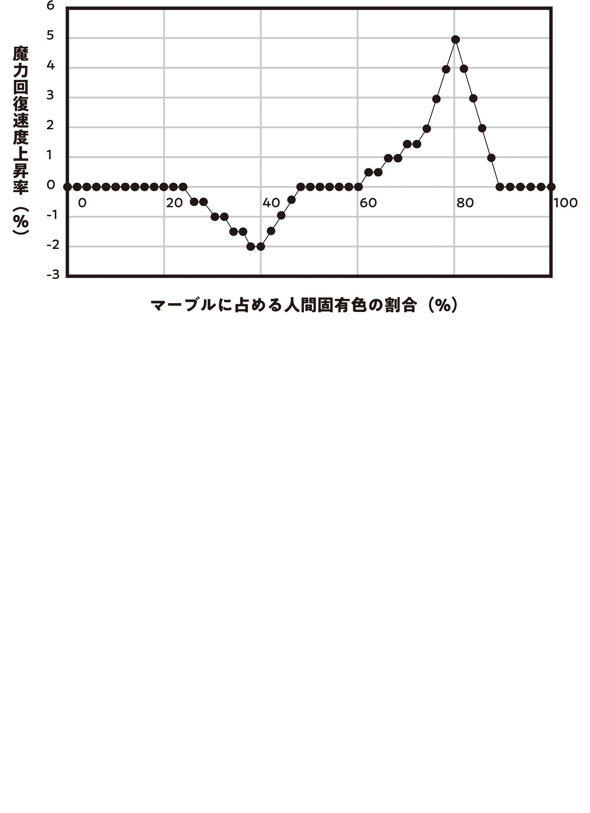

【アミュレット】

敵から何かを得ようと思うなら、まず敵を知る事だ。

俺は今回のキノコ・バイオハザード・パンデミックを単なる災厄で終わらせないために、自分の頭に生えていたキノコを使って研究を始めた。

戦争も災害も疫病も無い方が断然いいが、そこから学べる事もある。

戦争は科学を発達させ、災害は起こるたびに備えと予測を増し、疫病は医療を進歩させる。今回のパンデミックでもそうありたい。

都心では各区の医療チームを中心に検死などを通し原理解明と再発防止に邁進[まいしん]しているという。俺も俺なりにこのキノコを俺の役に立てていきたい。

具体的には、キノコから魔法封印杖[つえ]や魔力吸引杖、自己修復機能付き杖を作れないか期待している。

劇症化キノコは寄生先の魔法を封じる。

キノコをもぎ取ると魔力と体力を急激に吸い上げ超再生する。

その原理を解明し、杖の製造に応用できたなら可能性は無限大だ。

念のために裏庭の隅に隔離された解剖用テントを作り、手始めに生理的嫌悪を煽[あお]る人面キノコを解剖する。

このキノコの基本構造は一般的な物に似ていた。傘があり、傘の裏側にはヒダがある。傘からは柄が伸びて、柄の末端の石突から菌糸を寄生先に伸ばす構造だ。

だが、柄を裂いてみると中に心臓のようにも見える繊維質の塊が確認された。不気味だ。

動物なのか？　菌類なのか？　分からない。そのあたりは大学の魔物学科が調べるだろう。

繊維質の心臓を開くと、中には小さな小さなグレムリンが一粒埋もれていた。

グレムリンを持っているという事は、このキノコは間違いなく魔物の一種だ。動物の魔物はよく見るし、植物の魔物もたまにいるが、菌類の魔物には初めてお目にかかる。そのグレムリンにも。

ピンセットで摘出したグレムリンは例によって球形に近く、大きさは直径０・１㎜ほど。ノミより小さい極小サイズだ。

しかし、シャーレに載せ観察してみると、その特異性がよく分かった。

キノコから採れたグレムリンは、乳白色と金色でムラのある二色の縞模様[しまもよう]を作っていたのだ。

マーブル模様のグレムリンなんて初めて見た。興味深い。

今まで見てきたグレムリンは全て単色だった。

電気を吸って育ったグレムリンはまさにこのキノコグレムリンの二色のうち一色と同じプレーンな乳白色。魔物から採れるグレムリンは様々なカラーバリエーションがあるが、やはり単色。

魔石も不純物が入っているものこそあったが、全体の色としては単色。

それなのに、こいつはマーブル模様。新発見の珍種グレムリンだ。

このマーブル模様はこの個体に限った特別なものなのだろうか？　それともキノコ全てがこういうマーブル模様のグレムリンを持っているのだろうか？

俺の頭に生えていたキノコ一本では分からないので、病み上がりのところ申し訳ないが青の魔女に手紙を託し、未来視の魔法使いに頼んで50本のキノコサンプルを取り寄せた。

そのうち半分は軽症者のキノコで、もう半分は劇症者のキノコだ。

軽症者キノコと劇症者キノコでは、採取できたグレムリンに顕著な大きさの違いがあった。

軽症者が０・１㎜サイズ。

劇症者は０・５㎜サイズ。

これはかなりハッキリ分かれていた。劇症キノコは軽症キノコと比べ段違いに魔力を激しく吸い上げるから、吸い上げた魔力量の差がグレムリンの大きさに現れているのだろう。なんならもっとサイズ差があってもいいぐらいだ。

グレムリンの色彩は軽症も劇症も両方マーブル模様だった。

二色のマーブル模様で、そのうち一色は必ず乳白色。もう一色はランダムだ。

合計51個のマーブルグレムリンを並べてみたが、特に色彩に規則性は見られない。

俺はマーブル模様の色彩の違いを、寄生先の血に由来するものだと推測した。

以前、俺はグレムリン融解再凝固実験でグレムリンの染色法を突き止めた。

魔物の色付きグレムリンは、魔物の血中にあるなんらかの成分に由来しているのだ。

それが人間でも同じだとしたら。

人間が血中に持つなんらかの成分が、キノコが人間から栄養を吸い上げる菌糸経路を通しグレムリンの発色として現れているのだとしたら。

マーブルグレムリンの二色のうち、固定の乳白色はキノコ由来の色。

もう一つのランダムな色は、寄生先の人間の血液由来の色。

そう考えれば筋道が通っている。

この仮説を確かめるため、俺は注射器を作って自分の血を採血し、電気由来の乳白色グレムリンを融解させたものに混ぜ込んで固めた。

すると、再凝固したグレムリンは金色に着色されていた。

俺の頭に生えていたキノコから採取したマーブルグレムリンは乳白色と金色の縞模様だった。

見比べてみたが、全く同じ色だ。

フゥ～、大当たり！

こうやって仮説がズバリ当たった時が一番気持ちいいんだから！

楽しくなってきてしまったが、自分を宥[なだ]めて念のためもう一つサンプルを取りに行く。

データが一つだけでは偶然の一致の可能性があるからな。もちろん血の提供は青の魔女に頼む。

青の魔女は生死の境を彷徨[さまよ]ってからまだ一カ月も経[た]っていない。

血を採らせてくれ、という頼みは断られてもおかしくなかったが、特に嫌がりもせず目玉使い魔越しの呼び出しに応え奥多摩[おくたま]まで献血に来てくれた。

工房の作業台に敷いたタオルの上に腕を差し出した青の魔女は、俺が注射を持って近づくと身を固くした。

子供かお前は。

「大丈夫ですからね～、すぐ終わりますからね～。はいチクッてしますよ～終わりました～。脱脂綿はしばらく押さえていて下さいね～」

「!?　お、終わったのか？　もう？　チクッとすらしなかったような」

「俺、器用だから」

「それは万能の言い訳じゃないからな。まあいいが」

別に俺だって器用なだけで青の魔女の無痛採血をやってのけた訳じゃない。自分の血を採血する時にちょっとコツを掴[つか]んだだけだ。いやそれはやっぱり器用なだけだったかも知れんな……

採血を終えた青の魔女はもう用済みだが、見学をしたいと言ったのでグレムリン融解再凝固（＋血液成分混合）の作業を隣で見ていてもらう。

青の魔女は特に何を話すわけでもなく本当に見ていただけだが、ほどよく力の抜けた穏やかな時間が過ぎていった。

反射炉から出した融解再凝固グレムリンは、目の覚めるような綺麗[きれい]な青色に染まっていた。フム。やっぱり血の色がグレムリンに出ているようだ。魔物だろうが人間だろうが魔女だろうが、血液成分がグレムリンを色づける。野生のカラスの血で試した時は発色しなかったのに……このへん、なんか法則ありそうだな。

そこも気になるが、今はキノコのマーブルグレムリンが研究の主眼。横道に逸[そ]れず集中する。

次は二色のグレムリンを混ぜ、マーブル模様の一塊にしてみよう。それで少なくとも見た目だけはキノコマーブルグレムリンと同じ感じになるはずだ。

融解再凝固しているから魔法の発動体としての機能は失うだろうが、人工的に製造したマーブルグレムリンと天然マーブルグレムリンを比較するだけできっと得られる知見はある。マーブルの混ざり方とかね。強度も二色の境界線で脆[もろ]くなったりするんじゃないかと思うんだよな。

俺が再び炉に火を入れ、白＆青と白＆金の二組のグレムリンを融解させていると、切り株に腰かけて何か考えていた青の魔女が話しかけてきた。

「血で着色したグレムリンだが」

「ん？」

「目玉の使い魔の色と同じだな。私のは青で、大利[おおり]のは金だろう？」

「……あー、確かに？」

俺は思い返して頷[うなず]いた。

言われてみれば、その通りだった。

目玉の使い魔の魔法には個人差がある。

俺が使うと、まるで宝石のキャッツアイのような金色の目玉が出る。

青の魔女の使い魔は病的にも見える青っぽい目玉だ。

目玉の魔女の使い魔も俺達とは別の色合いをしているらしい。

ふむ。目玉には血管が通っている。目玉の使い魔の魔法の詠唱文的にも、使い魔の発色に自分自身の血、魔法的固有色が反映されていてもおかしくなさそうだ。

同一魔法行使時の個人差について議論しながら反射炉の面倒を見て、やがて出来上がったマーブルグレムリンの試作を取り出す。

取り出すのが早過ぎて、急冷によるヒビが走ってしまっていたが、白＆青のマーブルも白＆金のマーブルもおおよそ狙い通りに混ざりあっていた。

ふむ。加熱時間をもう少し短くした方が綺麗な縞模様になりそうだ。

火箸で出来上がったマーブルグレムリンを摘[つ]まんで色々な角度から見て出来栄えを確認していると、不意に青の魔女に横からひったくられた。

「あ、おい！」

「待て。これは…………これは……？」

「何？　なんだよ。言えよ」

「静かに。今確かめている」

青の魔女はそう言ったきり、グレムリンを摘まんだまま棒立ちで動かなくなってしまった。

俺はちょっとイライラしながら待つ。

何かを確かめているらしいが、なんなんだ。何かピンと来るものがあったんだろうか？

やがてたっぷり十数分も待たせた青の魔女は、やっと再起動して俺にグレムリンを返した。

「悪い、魔力操作をしていた。確かめたんだが、どうやらこれは魔力回復を促進させているらしい」

「魔力回復促進？」

少し驚いた。

回復促進効果があるって？　これに？　ヒーリング効果のあるパワーストーンみたいな？

そりゃあ何かしらの効果を発見する事を期待しての一連の実験だから、何か効果を発揮した事そのものには驚かないが。

魔力の吸収とか、魔法封印とか、自己再生とかじゃなくて？　魔力回復促進ですか？

それは予想と違うな。

「具体的にはどういう？」

興味をそそられ詳しい説明を要求すると、青の魔女は白＆青と白＆金の二個のマーブルグレムリンを指さしながら所感を述べた。

「魔力の流れがおかしくなっているんだ。私の血を入れたそっちの白青マーブルのグレムリンは、私の魔力の回復を促進している。魔力はこういう流れで……」

青の魔女は指先で虚空を指揮するようになぞったが、途中で説明を放棄した。

「いや、魔力を感じ取れないのにこういう説明をしても意味は無さそうだな。とにかく、白青マーブルのグレムリンを私が持っていると、私の魔力回復が促進されるようになるのは間違いない。体感的なものだが、２～３％程度の上昇率だろう。

しかし白青マーブルを大利が持っていても、大利の魔力回復は促進されない。大利の魔力回復を促進させているのはそっちの白金マーブルの方だ」

「ははあ。自分の血を混ぜたマーブルを持ってると魔力回復力が上がるって事か？」

俺が顎を撫[な]でながら説明を簡潔にまとめると、青の魔女は頷いた。

「厳密には所持している必要はない。マーブルが自分の近くにあれば……１～２ｍ以内の距離にあれば効果を発揮するだろう」

「じゃ、今俺は魔力回復速度アップしてんだ？」

「ああ」

「…………。何も感じないな……」

「いや、私には分かる。僅かだが回復速度が上がっている。間違いない」

青の魔女は確信的に断定した。

そうは言われても全ッ然分かんねぇ。魔力回復速度が上がってるって言われてもそんな感覚は全くしない。

まあ２～３％しか上がってないって言ってたし、そもそも人間は魔力を感じ取れないし、魔力回復速度上昇なんて体感できるワケないんだけどさ。

青の魔女が同席してなかったら一生この効果に気付かなかったかも知れない。呼んでて良かった、青の魔女。

俺は手の中でマーブルグレムリンを転がしながら考えた。

魔力回復速度アップは面白いだけでなく、価値の高い効果だ。

使用した魔力がすぐに回復すれば、魔力保有量が少なくてもガンガン魔法を使える。

でも２～３％アップか。マジで気休めにしかならないな。

……いや！　回復率が低いのはマーブルにヒビが入っているからかも知れない。

もっと大きなグレムリンにすれば回復率が高まる可能性も十分にある。グレムリンなんてデカけりゃデカいほどいいんだから。

ガッカリするにはまだ早い。

災厄の化身、キノコ病から利を得る足がかりは掴んだ。

後はデータだ。データを集めるのだ。そうすれば見えてくるものがある。

俺はそれから一カ月ほどかけ、反射炉で大量のマーブル・サンプルを作成。統計的データを作った。

データを集めた結果、自己血を混合したマーブルグレムリン所持による魔力回復速度上昇率は最大５％だと判明した。これはマーブルがどんな色彩でも関係ない。魔女でも人間でも上昇率は変わらない。

上昇率に最も大きな影響を与えるのは乳白色グレムリン（これは電気産グレムリンを使えばいい）と固有色グレムリンの混合比で、この比率は２：８で回復速度を最大化する。比率が重要であり、マーブルの混ざり方や大きさはほぼ関係ない。

マーブル模様が分からないほどしっかり混合したり、０・１㎜未満の大きさにしたりすると効果を失うが、マーブル模様が判別可能で０・１㎜以上の大きさであれば回復速度上昇率は５％を示した。

また、マーブルのヒビも魔力回復速度に影響しない。完全に割れない限り、ヒビが入っている程度なら問題はないようだ。形状も魔力回復速度に影響を与えない。

結局、最大限に改良を施しても効果は微々たるものだったが、魔力回復速度上昇はあって損する機能ではない。杖に仕込んでしまえば性能をアップさせられる。一般人にとっては雀[すずめ]の涙の５％アップでも、魔女や魔法使い並のクソデカ魔力の持ち主なら中々バカにならない。

だが、俺は杖にマーブルを内蔵するのはやめた。

向いてないと思ったのだ。主にデザイン性の見地から考えて。

魔法杖[まほうづえ]にマーブルを仕込むより、どう考えても単体で運用した方が幅広いデザイン性を確保できる。

つまり、杖に仕込むのではなく指輪やネックレスなどの装飾品としてマーブルを加工するのだ。

大きさや形状を弄[いじ]っても魔力回復速度を向上させられないという事は、逆に言えば自由な大きさと形状にできるという事。思うがままのデザインの御守り[アミユレツト]に加工できる。

なんでもかんでも杖に機能を搭載すればいいというものではない。インターネットに繋[つな]がって二足歩行する炊飯器とかあっても困るしな。分けるべき機能は分けた方がいい。

実際、魔法を使う時だけ手に持てばいい魔法杖と違い、魔力回復速度促進の恩恵は常に受けておいた方が得だ。両手を空けて常に身に着けていられるアクセサリはそういう面でも優れている。

俺は今回の実験研究の集大成として、自分の血を使った30㎜サイズの白＆金マーブル融解再凝固グレムリンを作成。俺の出発点となった宇宙からの賜物[たまもの]、流星隕石[いんせき]オクタメテオライトにあやかって星型に削り出し、ペンダント型の御守り[アミユレツト]にした。

御守り[アミユレツト]を首にかけ、オクタメテオライトを手に持ち、工房の鏡の前でポーズをとって悦に浸る。

イイ！　すごくイイ！　この格好、すっげー魔法使いっぽい！

ただのコスプレじゃない。この御守り[アミユレツト]にも魔法杖[ワンド]にもちゃんと意味があり、魔法能力が秘められている。原理があり、工夫があり、そうなるべくしてこういう魔法の品になっている。

それが感慨深く、そしてたまらなく俺のワクワク回路を刺激した。

鏡の前で色々なポーズを決め、自撮りできないのを惜しんでいると、研究中たびたび家に来ては魔女ならではの魔力コントロールで御守り[アミユレツト]の性能チェックを手伝ってくれていた青の魔女がキュアノスで俺をつついてきた。

「私の御守り[アミユレツト]は？」

「え？　作ってない」

「なぜだ」

「なぜって、お前アクセ嫌いだろ」

俺が不思議に思って言うと、青の魔女は首を傾[かし]げた。

「いや……？　そんな事言ったか？」

「あれ？　なんか前アクセ渡した時、そんな事言ってたような」

「？　記憶にないな」

「言ってなかったっけ？」

二人揃[そろ]って首を傾げる。

まあ二人ともよく覚えていないなら、単なる記憶違いなのだろう。

「ああ、それで慧[けい]ちゃんにばっかりアクセサリの試作品をプレゼントしていたのか？　私がアクセサリ嫌いだと思って」

「違ったか。あれー？」

「そんな事を言った覚えは全然……あっ？　…………。いや、まあ、アクセサリが嫌いと言った事はないな。うん。大利が私に御守り[アミユレツト]を作ってくれるなら、ありがたく受け取ろう」

よく分からないが、青の魔女の装飾品装備スロットは空いているらしい。

そういう事なら作らせてもらおうじゃないか。

魔女と名乗るからには魔女っぽい姿でいてもらいたいという欲望もある。初めて会った時なんて、コイツ未加工魔石を握りしめてるだけだったからな。

それが魔法杖[ワンド]を持ち、御守り[アミユレツト]を装備する事になるとは。あの貧弱装備だった子が立派になって、およよよよ。

俺は青の魔女の血を使った白＆青マーブルで、六花結晶型ペンダントの御守り[アミユレツト]を作って渡した。

六花結晶は雪の結晶がその氷樹を成長させる過程で創り出す、自然と冷気の芸術的調和が魅せる形状だ。氷魔法の使い手である青の魔女が身に着けるに相応[ふさわ]しいデザインだろう。

俺が作った専用御守り[アミユレツト]を青の魔女は気に入ったようだった。首にかけた御守り[アミユレツト]のペンダントを指でひっかけ、くるくる回して嬉[うれ]しそうにしている。

ウケて良かった。

一カ月以上かけて出した研究成果、御守り[アミユレツト]はキノコパンデミックというクソデカ災害から得られた物としては物寂しい。

が、今までの多層加工魔法威力超増幅とか、魔力逆流85％カットとかがおかしかっただけとも言える。

普通、最初はこんなもんだ。

車は最初、馬よりノロかった。

飛行機は最初、１分しか飛べなかった。

だが技術は進歩した。

御守り[アミユレツト]も今は５％の魔力回復速度上昇が限界でも、そのうち10％、50％と性能が上がっていくと俺は信じている。

そしてその性能向上のための研究は、魔法大学に丸投げする。

だって一人でデータ集めるのしんどいから。こういうのは俺の仕事じゃなくて大学の仕事だ。

来月から休講していた大学が再開されるっていうし、そろそろ仕事をぶん投げて増やしても許されそう。

じゃ、俺息抜きに七支刀型ゲテモノ魔法杖作って遊ぶから。

御守り[アミユレツト]研究はあと全部任せた。よろしく！
