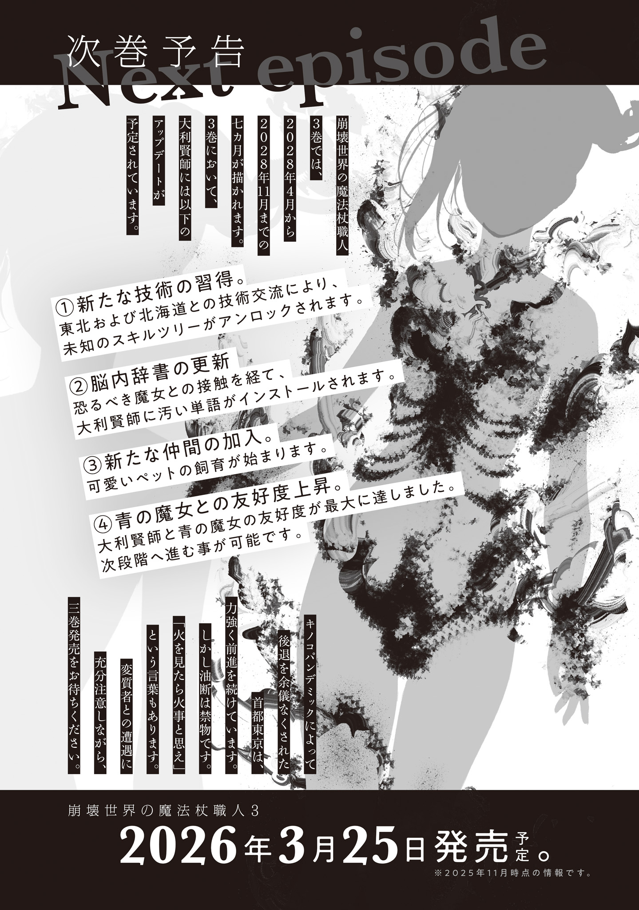

【番外編　この主人公はワシが育てた】

日根野谷[ひねのや]一族は代々後援家の家系である。

この資産家一族は代々才覚はあるが貧乏ゆえに苦しむ者を見つけてきては、手厚く支援し、成功へ導いてきた。

蔵の巻物が語る最も古い記録によると江戸時代頃からずっとそうしていて、有名な茶人、文豪、デザイナー、歌手などを育て、世に送り出している。

真に優れた芸術を愛し、それを助け広める事を喜びとする崇高な一族なのだ。

しかし一族最後の生き残りである日根野谷[ひねのや]拓雄[たくお]に言わせれば、ただの強火ファン一族だった。

「これすごいでしょ！　みてみて！」とウキウキで宣伝して周り、人気が出てきたら「この芸術家はワシが育てた」と悦に浸るのが大好きな、推し活一族である。

何が後援家だ篤志家だ投資家だ。カッコつけた肩書き使ってんじゃねーよ時代遅れどもが！　と親に反発していた拓雄も今ではたった独り。

グレムリン災害は、地位にも信念にも関係なく、全ての人類に平等に降りかかった。全員死亡し血脈が途絶えた旧家も数多いのだから、一人でも命を繋[つな]いだ日根野谷家はマシな方だ。

そんな拓雄にも、推しの芸術家がいる。

ＯＫ工房である。

ＯＫ工房はグレムリン災害前にネットオークションサイトで活躍していた職人のハンドルネームだ。ＳＮＳも同じ名義でやっていた。

本名、年齢、性別、全てが謎。

何十回ものオークション落札を通してコメントを交わしているが、ＯＫ工房は常に極限まで個性を削[そ]ぎ落としカッチカチにフォーマットを固めた杓子定規[しやくしじようぎ]なビジネス文章で会話をしてくる。人柄すらも分からない。

機械的なまでに丁寧な文章を通じて分かったのは、ＯＫ工房は子供ではなく、ちゃんとした文章を書ける大人であろうという事。それだけだ。

ＯＫ工房は電子上の妖精同然で、生活実態が分からない。グレムリン災害によって通信網が沈黙すると、拓雄はＯＫ工房の安否を確認する手段の一切を失った。

恐ろしい喪失感だった。

もう一度ＯＫ工房の名作を拝みたいだなんて贅沢[ぜいたく]は言わない。ただ、ＯＫ工房が生きていて欲しい。どうにかして難を逃れ、健康で心安らかに暮らしていて欲しい。

だがそんな願いをどこに向ければいいのかも分からない。もう推し職人に金を積もうとしても、振り込みはできない。欲しい物リストを通じた物資支援もできない。なんという事だろうか！

ＯＫ工房よ、どうか生き残っていてくれ。

拓雄はグレムリン災害発生から四年、ずっとそう願っていた。

しかし四年は長い。

東京各区の区役所や行政中枢に貼り出された行方不明者の長い長いリストには黒い横線が無数に引かれていて、掲示をやめてしまった地区も珍しくない。

拓雄も家族を弔った後に一番生死が気になるＯＫ工房の足跡を追おうとしたが、何しろ顔出しゼロでネット上の付き合いしかなかった偏屈職人である。

ネットストーカーをした時期があったため生活圏を東京近郊にまで絞り込めているが、範囲が広すぎる。完全に安否不明だ。

最初の一年、拓雄は毎日自宅の展示室に飾ったＯＫ工房製の非公式アニメグッズや小物を眺めては辛[つら]く厳しい日々を生き抜く活力を貰[もら]っていた。

次の一年は、魔女集会に無断で危険地帯に作った隠し田の世話をしに行く時、御守[おまも]り代わりにＯＫ工房製の木彫り人形を持ち歩いた。

三年目からは、仕事休みの日に展示室の掃除をするぐらいになった。

だんだんと推しに費やす時間が減ってきている。

それなのに胸にぽっかりと空いた空虚さは時と共に癒えてきていて、良くも悪くも時の流れを思い知る。

あれほどドハマりした最推し職人、ＯＫ工房の喪失を受け入れてしまいそうだった。

ＯＫ工房を忘れたくない。

超精密なのに不思議と手作りの温かみに溢[あふ]れたあの独特の作風は唯一無二。あれほど好みにピタリとハマる芸術家には二度と出会えないと確信するほどだ。

それなのに記憶は少しずつ薄れ、作品を手に取るたびに胸の奥から湧きあがっていたクソデカ感情は縮んでいく。

既に四年近くＯＫ工房新作の供給がない。当然の話だが、新しい刺激が無い。どんなに激しく燃え盛る熱狂も燃料がくべられなければ冷えていく。

拓雄は、ＯＫ工房の死という宇宙史上最悪の喪失を受け入れまだ見ぬ新たな推し芸術家を探すか、それとも最推しの思い出を後生大事に抱えて生きていくか、二つの感情の間で揺れていた。

転機が訪れたのは、東京魔法大学オープンキャンパスでの事だった。

東京魔法大学は東京全域から学生を募集している。噂[うわさ]の魔法大学は果たしてどんなものか、と興味本位で説明会に出向いた拓雄は、ごった返す人混みに面食らう。東京にはまだこれほどの人が残っていたのかと驚いた。

グレムリン災害以来、東京の人口は二割にまで激減したと言われている。

事実、拓雄の近所でも目に見えて人の数が減り、過密都市全盛の人口密度を体感している身としては文明の衰退を肌で感じていた。

人は、いるところにはいるものだ。

オープンキャンパスの参加者には五十の手習いを地で行くいい歳[とし]をした者も多かった。老若男女関係なく才能を求めた結果研究開発が大躍進し、魔女だけでなく民間にも魔法杖[まほうづえ]が出回り始めている事を思えば、東京魔法大学の方針は大当たりしていると言える。

魔法言語学科とグレムリン工学科、魔物学科、変異学科の研究室を見て回った拓雄は、大学構内併設の購買部にも顔を出す。

購買部も大盛況だった。特に「新作受注生産受付中！」のノボリが立っている魔法道具関連コーナーはぎゅうぎゅうに人が集まっている。

ルーズリーフや万年筆、インク壺[つぼ]、そろばん（計算機代わりか？）、和綴[わと]じの参考書、ハサミ、工具各種、堅パンなど、購買の品揃[しなぞろ]えは豊富だ。

東京はほとんどの地域で配給体制が続いて久しく、交換市でもないのに常設の販売店が開店しているのは奇妙な感覚がした。24時間営業のコンビニに常に溢れ返るほどの物資が置かれていた頃がもう遥[はる]か大昔に感じる。

ざっと商品を見た後、ノボリが気になった拓雄は押し合いへし合いしている人垣に体を捻[ね]じ込んだ。

一体どんな物がこれほど人を惹[ひ]きつけているのだろうか？

拓雄は押しつぶされそうになりながら苦労して集まった人々の最前列に辿[たど]り着き、何がこれほどの人を集めているのか目の当たりにした。

ガラス製のショーケースの中に、一本の魔法杖が納められていた。

ショーケースの説明書きには「学長愛用の魔法杖、正十二面体フラクタル型魔法杖アレイスターを手掛けた名工の新作」と記されている。

ビロードのクッション付きで丁寧に納められた魔法杖を一目見た拓雄は、驚愕[きようがく]のあまり目玉が飛び出しそうになった。

目玉の代わりに飛び出したのは購買部に響き渡る絶叫だ。

「うわあああああッ！　ＯＫ工房だぁああああああ!?　しっ、新作を!?　こんなところで!?　あああ奇跡ッ！　神に感謝！　はいはいはい買います買います買います！　買わせて!!」

「あの、すみません。もう少しお静かにお願いできますか」

「アッごめんなさい」

間近で杖を見ようとする人々を押し戻していた店員に注意され、拓雄は慌てて自分の口を手で押さえた。

だが気持ちまでは抑えられない。

死んでしまったのだと諦めかけていたＯＫ工房は、生きていた！

運命的な再会だった。

なんという事だろう！　神の再臨に等しい胸が熱くなる奇跡に涙すら滲[にじ]む。

あの杖が、是が非でも欲しい。

一瞬にしてＯＫ工房熱が再点火した拓雄は、品出しをしている店員を捕まえて話しかけた。

「あのー」

「はい？」

「あの展示されている杖を買いたいんですが」

「ああ、すみません。アレは見本です。非売品なんですよ。購入は受注生産だけの受付で」

「な、なるほど。値段の所に書かれている１６０という数字は……？」

「それは評価点ですね。本学では授業や小論文提出で単位とは別に評価点が貯[た]まる仕組みになっておりまして。貯めた評価点を使って購買でこういった物を買えます。勉強するほど良い物を買って良い生活ができるんです」

拓雄は説明を聞いて納得した。学生が学業をする金を作るために勉強時間を削ってアルバイトをするよりずっと健全だ。

もちろん大学側が裏で必死にやりくりをしているからこそ成立する制度なのだろうし、評価点をつける評価者の良識にかなり依存する部分もある難しいやり方だが、学生が勉学によって生活上の問題を解決できるならそれが一番良い。本来、大学は勉強をする場所なのだから。

もっとも今重要なのは魔法大学独特の施策ではない。

奇跡的な巡り合わせで再び出会った最推し芸術家の新作────それも四年前と比べ格段に腕を上げたのが分かる珠玉の逸品を、なんとしてでも手に入れたい！

拓雄は前のめりになり重ねて尋ねた。

「評価点１６０というのはどれぐらいの価値が？　ここだけの話、けっこうな量の新米の在庫を抱えているんですが、物々交換をお願いできますか？」

「いやー、物々交換はしていないんですよ。購買で使えるのは評価点だけです。評価点１６０は学年平均より少し上ぐらいの成績を維持しないと厳しいですねぇ。あなたはオープンキャンパス参加の方ですよね？　入学した暁には是非こういった物を買えるように頑張って下さい。応援していますよ」

話しながら品出しをテキパキと終えた店員は、空のカートを押してバックヤードに下がってしまった。

諦めきれない拓雄は別の店員を捕まえて同じ事を尋ねたが、同じ答えが返ってくる。それでも食い下がると購買部を取り仕切る店長がでてきて、学長の方針で学生以外には売れないのだという事を説明された。身元の不確かな不特定多数の人間に売って良いようなシロモノではないから。

そこまで言われてしまえば拓雄としても引き下がるしかない。

ＯＫ工房の作品がとても高く評価されているからこその限定販売なのだと捉えれば納得できた。

拓雄は改めて展示された魔法杖に群がる人垣から少し離れ、杖について熱心に意見交換をする学生たちや物見遊山の見学者たちの感嘆の声に静かに耳を傾けた。

賞賛の声が我が事のように気持ちよく、ニッコリしてしまう。

あのＯＫ工房が、大きくなったものだ！

一時期はやたら飾り縫いに凝った電子レンジ専用手編みカバーとか（買った）、金庫を溶接して作った金庫ロボとか（買った）、まともに売れるわけがないワケの分からない物を作って迷走していた、あのＯＫ工房が。

今では時代の最先端を行く東京魔法大学の購買部で、フェアをやってもらえるぐらい認知され評価されている。

腕利きの修復[レストア]業者をやっていた最初期の頃からＯＫ工房を知る最古参ファンとして、こんなに嬉[うれ]しい事は無かった。

自分が手に入らなくても、こんなにも多くの人々がＯＫ工房の作品に熱狂している。

これだけの逸品を作る職人の無名の頃の作品を自宅に何十点も所蔵しているのだと自慢したくなってしまう。

ＯＫ工房ほどの腕前の超一流職人ならば、なんの支援もなくともきっと自力で栄達したに違いない。

今のこの成功にどれほど拓雄の支援が関与しているのか分からない。

しかしネットオークション時代に知人へ紹介したり、長文レビューを書いたり、宣伝工作を張ったりした草の根活動の全てが全くの無意味だったという事はないはずだ。

ＯＫ工房は徹底的に自分の個人情報を隠し、全てを作品で語る孤高の職人である。

本人の意思を尊重したい。身元特定に繋がりかねない昔の活動歴を吹聴[ふいちよう]して回るつもりはない。

だが、崩壊した世界の中で大きく花開いた職人に昔から目をつけ応援していた事を、ひっそりと誇るぐらいは許されるだろう。

ニヤけきったドヤ顔を抑えられない拓雄は、含み笑いをしながら全世界に胸を張った。

「ふふふふ……！　ＯＫ工房はワシが育てた！」

あとがき

私は気付いてしまった。漫画にあとがきって無くない？　基本。映画にもない。あるのはスタッフロールだけ。一体なぜ小説にだけあとがきを書く文化が存在するのか？　疑問に思った私は謎を解明するためアマゾンに飛んだ後帰宅し普通にググった。

調べたところ、あとがきの歴史は古代ローマ時代に遡るらしい。書物の末尾に補足情報や謝辞を書いていたのだとか。ちょっと論拠が不確かだけど、概ね正しいように思える。

前述の論が確かなら、漫画と映画にあとがきが無い理由も説明できる。漫画も映画もローマには無かった（あるいはあったが断絶し後世の文化と接続されなかった）新しい文化だから、古代ローマから繋[つな]がる文化的慣習とは独立し得る。ナルホド～！　の気分。

でも一方で漫画はファンブックが出たりするし、映画もパンフレットを売っていたりするし、結局は形を変えただけで事実上のあとがきはどのコンテンツにも存在するのではなかろうか。謝辞はとにかく、補足情報はどこのエンタメ業界でも需要があるんだろうな。

私はあとがきに補足情報を書きません。補足情報を全部書くと本編より長くなりかねないし。

だからこんな感じのふわーっとしたあとがきでいつもお茶を濁すのである……

令和七年九月某日　黒留[くろどめ]ハガネ

