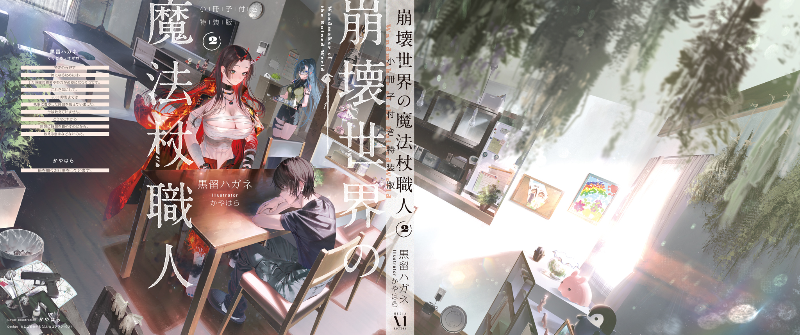

電子書籍特典　書き下ろし短編

『大利の絵』

一時は生死の境を彷徨っていた青の魔女は順調に回復し、ベッドの上で退屈し始めていた。生まれたての小鹿のように頼りなく歩く一方で頭はハッキリしていて眠気もないようで、すっかり暇を持て余している。

青の魔女が食べ終わった雑炊と澄まし汁、梅干しの小皿を片付け部屋を出ようとすると呼び止められた。

「大利、少し話していかないか」

「え。今から食器洗うんだけど」

「退屈なんだよ。眠くないし、ずっと文字を読んでいると疲れる」

言いながら栞を挟んだ小説をベッド横の文机に置く。タイトルを見ると、どうやら恋愛小説っぽい。

そんな難しい本読むから疲れるんだろ。もっと簡単な推理小説とか学術誌とか読めばいいのに。

「まあ話したいならいいけど、何を話すんだ？　俺メンタルケアとかできないぜ」

俺は会話を通して人の神経を逆撫でしがちらしい。

あんまり病人の話し相手として向いていないのではと思うのだが、青の魔女は手招きして俺をベッド脇に座らせた。

「いいんだよ、話す内容なんて何でもいい。傍にいてくれ」

「はあ……？　目的もなく話すのか？　会話を目的にした会話って事？　それはどういう……？」

「そう難しく考えるな。話したくないならそこに居てくれるだけもでいい」

「？？？」

よく分からんが、居るだけでいいらしい。

言われた通りぼんやりベッドの端に腰を下ろしているだけなのに、青の魔女は気分が良さそうだった。

なんだこれ。俺、アニマルセラピーに使われてる？　犬をはべらせるとストレスが軽減される的な？

それで体調が良くなるなら別にいいが、ぼーっと座っているのも退屈だ。

化粧台に置かれていたルーズリーフを引き寄せ手慰みに落書きをしていると、青の魔女が手元を覗き込んできた。クローゼット上のぬいぐるみの模写絵を見て感嘆の声を上げる。

「おおっ、上手いな。いや本当に上手いな？　ほとんど写真じゃないか。美大出身だったのか？」

「いや理工系だけど。写実画は上手いって前に言ったろ。なんも難しくない」

言いながらボールペンを操り目の前の美人さんの姿をルーズリーフに精密に写し取っていく。

こんなモンはね、簡単なんですよ。見た光景をそのまんま手を動かして紙に出力するだけなんだからただの単純作業だ。特に面白みもない暇潰しに過ぎない。

「ん、私を描いてくれてるのか。すごいな、イラストレーターでも食べていけるんじゃないか」

「バカ。写真撮れば済む事をわざわざ手作業でやってるんだからこんなんむしろアホだろ」

「ええ？　いや、そんなに卑下しなくても……」

「分かってねぇなぁ。例えば、そうだな。キッチンとこに青の魔女の妹が書いた絵飾ってあんじゃん？　これよりあっちの方がずっといい。絵が上手いかどうかで言えばド下手クソだけど、妹さんがお前の事めっちゃ好きなのは一目見ただけでドカンと伝わってくるだろ？　良い絵だよアレは。意図、用途、誰に向けてどう作るのか！　そういうとこだ、芸術の大切さってのは」

俺の専門は魔法杖。つまり手工芸であって絵ではない。絵に詳しいわけではないが、絵だって根っこの部分では手工芸と大切な要点を共有しているはずだ。

大利流芸術論を聞いた青の魔女は俺になんとも言えない複雑な表情を向けてきた。

「二度と私の妹の絵を下手と言うな。でも、ありがとう。誉め言葉の方は素直に受け取っておく」

青の魔女はどうやら昔を思い出したらしく、遠い目をして窓の外を眺める。

すっかり自分の世界に入ってしまったので、俺は気を惹かないように空食器を乗せた盆を持ってそっと寝室を出た。

やれやれ。病人の我儘に付き合うのも楽じゃない。

