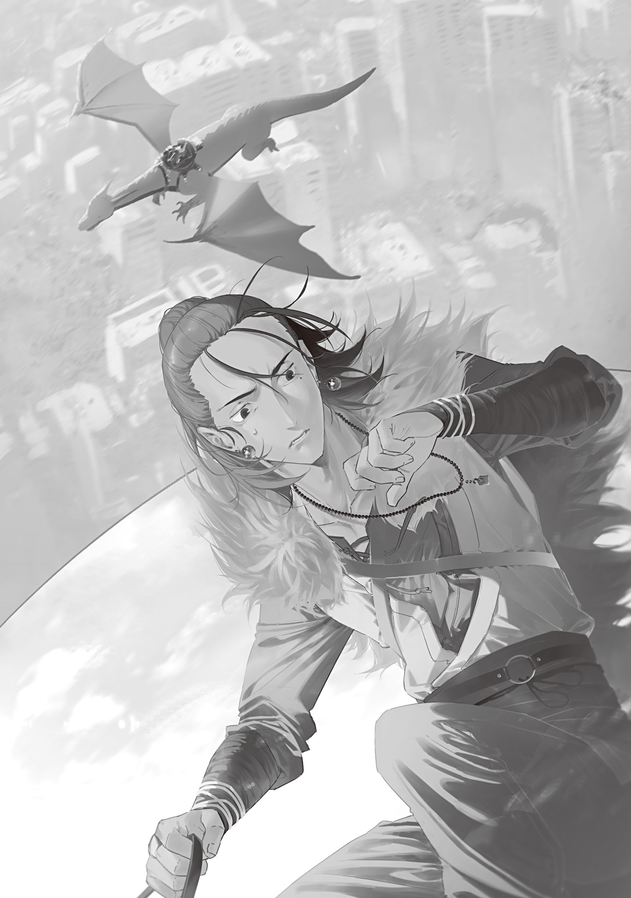

【東北狩猟組合の秘伝】

東北狩猟組合所属の魔法使い「大狼[オキヤク]」は、竜の魔女の背に乗り首都上空にはるばるやってきた。

吹き付ける風を手庇[てびさし]で避けながら地上を見降ろせば、想像よりずっと保存状態の良い広大な街並みが広がる。まるで一度大怪獣が暴れたような破壊の痕跡こそ痛々しいものの、グレムリン災害前の威容は健在だ。

在りし日の華の都大東京の面影を残すその光景に、大狼[オキヤク]は眉をひそめた。

聞いたところによると、東京魔女集会率いる東京生存コミュニティの人口は、キノコパンデミックの後でさえ２２０万人に及ぶという。

全盛期の１４００万人と比べれば激減している。しかし充分な、充分すぎるほどの大人口だ。

大狼[オキヤク]が思うに、今回東京魔女集会が外部の救援を必要とした理由は、過剰な人口を養おうとしているからだった。

端的に言えば東京には人が生き残り過ぎている。

東北狩猟組合は仙台[せんだい]市を拠点とし、４人の魔法使いと１人の魔女で運営されている生存者コミュニティだ。

擁する人口は20万人。単純に考えて、猟師１人あたり４万人を保護している計算になる。他の大規模生存者コミュニティである「北海道魔獣農場」「琵琶湖[びわこ]協定」「荒瀧[あらたき]組」も同程度の比率のはずだ。

対して東京魔女集会は16人の構成員に対し２２０万人。１人あたり約14万人。

東北狩猟組合の３倍以上の負担を背負っている事になる。

運営困難に陥って当然だ。逆に今までどうやって都市運営を成立させていたのか分からない。

東北狩猟組合では、グレムリン災害直後に生存者の容赦ない選別を行い、保護しきれない者は最初から保護しない方針を取った。全員を守ろうと無理をして全員で弱っていく愚を避けるためだ。

自分で歩けない者や、持病や障害を持つ者は女子供であっても真っ先に切り捨てられた。

反感は出たが、自衛隊と警察壊滅後は唯一市民を守る力を持っている圧倒的超越者達の総意には誰も逆らえない。

それは超越者たちにとっても苦渋の決断であり、東北狩猟組合はたとえ身内であっても選別に例外を作らなかった。

事実、選別によって持病持ちだった大狼[オキヤク]の兄はコミュニティの防衛線の外へ粛々と出ていき、魔物と相討って命を落としている。今でも夢に見る最悪の記憶だ。

内にも外にも厳しい断固とした方針は、軋轢[あつれき]は生んだが受け入れられた。市民にしてみれば、受け入れざるを得なかったとも言うのだろうが。

しかし選別の結果残った20万人でさえ、東北狩猟組合は完全に守り切れているわけではない。

怪我[けが]や病気で死ぬ者もいた。市街地で変異し潜んでいた魔物に殺された者もいた。

何より、東京魔女集会から無償で送られてきた豊穣[ほうじよう]魔法指導教員の博田[はかた]先生がいなければ去年の時点で破滅的な大飢饉[だいききん]が起こり、東北狩猟組合は瓦解していただろう。

今回、大狼[オキヤク]が復興支援使節として仙台を離れ東京にやってきたのは、その豊穣魔法を教わった恩があるからだ。

豊穣魔法と同時にキノコ病も仙台に持ち込まれたが、東北狩猟組合のコミュニティの中でのキノコ病による死者は２０００人前後。豊穣魔法が持ち込まれなかった場合の破滅的被害を考えるなら、安い代償だ。

グレムリン災害初期から厳しい選択を迫られ続けていた東北狩猟組合コミュニティでは、東京魔女集会に感謝こそすれ逆恨みする者はいない。いない事になっている。恨みを持つ者もその感情をぶちまけ憎しみのまま暴れる事はないので、対外的には隔意は何も無いと伝えている。

大狼[オキヤク]が一時的にでも東京支援のために仙台を離脱すると、コミュニティの狩猟ローテーションに穴が開き、居残り組に大きな負担がかかる。

しかし市民の「今こそ豊穣魔法の恩を返す時」という声は大きかった。

中でも首脳陣へ強く嘆願を行ったのは博田先生だった。

恩師からの援助要請の手紙を受け取った博田先生は、東北狩猟組合の取[と]り纏[まと]め役[やく]である大熊[イタズ]を説き伏せ、貴重な猟師である大狼[オキヤク]の東京災害援助派遣を呑[の]ませた。

市民の信頼厚く、コミュニティの食料危機を救った経歴を持ち、普段は言葉少ない人格者である博田先生の土下座に、さしもの頑固爺[じじい]も心動かされたらしい。

大狼[オキヤク]が考えているうちに、竜の魔女は急降下を始めた。瞬く間に高度が下がりビル群が近づいて、都市のド真ん中に作られたヘリポートならぬドラゴンポートに降り立つ。

突風と地響きを伴い着陸した竜の魔女の背から荷物を背負いヒラリと降りた大狼[オキヤク]を、単眼の女性が出迎える。

ロングスカートにカーディガンを合わせた春めいた装いは女性らしいものだったが、パッチリした大きな単眼が頭をバグらせる。服を着ていなければ魔物と間違えるところだ。

単眼の女性は大狼[オキヤク]に歩み寄り、丁寧に一礼した。

「ようこそいらっしゃいました。私は目玉の魔女、東京魔女集会の纏め役をしております。東北狩猟組合の大狼[オキヤク]さんですね？」

「大狼[オキヤク]です。今日から七日間よろしくお願いします、目玉の魔女さん」

「こちらこそ。実り多き七日間にいたしましょう」

大狼[オキヤク]と握手を交わした目玉の魔女は穏やかに微笑[ほほえ]み頷[うなず]くと、尻尾を振ってソワソワしている竜の魔女に向き直った。

「連れてきたの。ほら、早く報酬寄[よ]こすの。約束なの！」

「ありがとうねぇ、本当に助かったわ。はい、これ。まだこっちにいるならお茶でも飲んでいかない？　去年漂着した貿易船の良い茶葉がまだ残ってるのよ」

「やったの。チョロい仕事なの！　お茶は要らないの、また美味[おい]しい仕事あったら呼ぶの！」

竜の魔女は目玉の魔女に手渡されたマーブル石の見事なネックレスを嬉々[きき]として腹袋に仕舞[しま]い込[こ]み、忙[せわ]しなく飛び立ち大空の向こうへ去っていった。

フッと息を吐いて竜の魔女を見送った目玉の魔女は、大狼[オキヤク]を促し今回の会合の会場となる建物（何かの会館らしい）に入っていった。

建物の内装はよく掃除が行き届いていて、玄関横のホワイトボードには色々な魔女の名前で簡単な連絡事項が書かれている。入ってすぐ右手の扉の横合いには、「歓迎　東北狩猟組合　大狼様」と書かれた立て看板が立っていた。

そしてその立て看板のてっぺんに、手のひらサイズの火の妖精がちょこんと座っている。

その妖精はサイズ感を除けば女子中学生程度の年頃に見えた。赤く燃える炎でできた長い髪を持ち、揺れる輪郭の焔[ほのお]を服のようにまとっている。

大狼[オキヤク]と目玉の魔女に目を留めサッと立ち上がった火の妖精は、活発そうな見た目に反して落ち着いた声で一礼した。

「はじめまして、継火の魔女です。今日は会合中の警備を担当しています」

「よろしくお願いします。東北狩猟組合の大狼[オキヤク]です」

大狼[オキヤク]が手を差し出すと、継火の魔女は差し出された手の人差し指を両手で精一杯握りしめ握手をした。立っているだけで火の粉を散らす継火の魔女だったが、見た目ほどの熱さはなく、むしろほんわか温かいカイロのようだ。

見た目の可愛[かわい]らしさも相まって撫[な]でたくなったが、警備係に対して失礼なので自制した。第一、魔女は見た目通りの年齢とは限らない。

大狼[オキヤク]が撫でたい衝動と己の常識との間に挟まれ葛藤していると、目玉の魔女がかがんで目線を合わせ、心配そうに声をかけた。

「あら。ひーちゃん、また縮んだんじゃない？　大丈夫なの？」

「ええっと。その件に関して、後で青ちゃんさんとお話する時間が欲しいと思っています。少し相談したい事があって……目玉さんから伝えておいてもらえますか？」

「うーん、機嫌が良さそうな時に言ってはみるけど、時間をとってくれるかは分からないわよ？」

「それで十分です。よろしくお願いします」

二人の魔女のやり取りを見ていて、大狼[オキヤク]は変な気分になった。

すごくまともな会話だった。

まとも過ぎる。

もしかして、東京魔女集会はまともな集まりなのか……？

これまで大狼[オキヤク]が直接見知っている東京魔女集会の魔女は竜の魔女しかいなかった。なんとなくああいう連中の集まりなのだと思っていたが、どうやら違うらしい。

竜の魔女は例外のようだ。一安心である。

会議室に通されると、中では二人の女性が並んで着席し待っていた。

一人は顔立ちからして成人しているかどうかという年頃に見える若い女性だ。ボロボロの黒いコートを纏い、洒落[しやれ]た女性向けデザインの雪結晶ペンダントを首から下げている。

特に目を惹[ひ]くのは手に持った青く美しい宝石の嵌[はま]った美麗な杖[つえ]で、大狼[オキヤク]は自分が入室した瞬間に何気ない動作で杖の照準を向けられたのを感じた。

警戒されている。要人に個人的な護衛が付くと聞いていたから、彼女がその護衛なのだろう。

護衛の隣にいるのは、まだ小学生かギリギリ中学生かというぐらいの年齢の女の子だ。

オコジョのような可愛らしい耳を生やし、椅子からはみ出した先端だけ黒い白尻尾をゆらゆらさせている。ショートカットの白髪は活発な印象を与え、人好きのする笑顔で隣の護衛と楽しそうに話している姿からも社交的な性格が窺[うかが]えた。

大狼[オキヤク]は一瞬、首を傾[かし]げた。

身体的特徴からして、オコジョ娘の方が魔女に見える。

しかし魔力コントロールをしているのは護衛の方だから、護衛の方が魔女だ。

この会合に同席する要人は魔女ではなく、一般人の有識者と聞いていたが。どうして一般人にケモミミが生えているのだろう……？

大狼[オキヤク]の入室に合わせ、目玉の魔女が二人の傍[そば]へ移動する。手ずから紅茶を淹[い]れお茶請けと共に全員にカップを回した目玉の魔女は、一息ついて二人を紹介した。

「ご紹介いたします。向かって左、白髪の可愛らしい彼女が大[おお]日向[ひなた]慧[けい]です。弱冠十四歳にして東京魔法大学学長を務め、また魔法言語学科教授として教鞭[きようべん]を執る才媛です。今回の会合は私が責任者ではありますが、基本的に現場代表の彼女に向けて話して頂ければと思います」

紹介を受けたケモミミ少女は立ち上がり、にこやかに一礼した。

「ご紹介に与[あずか]りました、大日向慧です。東北狩猟組合の噂[うわさ]はかねがね聞かせて頂いています。魔法使いとしての腕前もさることながら、皆さん素晴らしい猟師[ハンター]なのだそうですね。若輩の身ではありますが、この機会にご指導ご鞭撻[べんたつ]頂けると嬉[うれ]しいです！」

子供らしからぬ堂に入った丁寧かつ明るい挨拶に感心し、大狼[オキヤク]も頭を下げた。

「大狼[オキヤク]です。大日向教授の才名は博田先生から伺っています。大変すばらしい教師であり、研究者でもあるとか。私は復興支援者として来た身ではありますが、是非教授から新たな学びを得て帰りたいと思っています。よろしくお願いします」

「はいっ！　仲良くして下さいね？」

コテンと愛らしく首を傾げお願いする大日向教授は胸を掻[か]きむしりたくなるぐらい可愛い。色仕掛け要員として送り込まれているのではないかと邪推したくなるぐらいだ。将来はさぞ美人になるに違いない。

ロリコンでもケモナーでもない自分の性癖に、大狼[オキヤク]は感謝した。

「大狼[オキヤク]というのは猟師[マタギ]の方が使う山言葉でしょうか？」

「!?　お詳しいですね。流石[さすが]言語学者でいらっしゃる。そうですね、命名は私の祖父の大熊[イタズ]です。ウチの纏め役は古い人間でして。『この世ならざるモノと関わる時は、日常の言葉を使っちゃなんねぇ』なんて言うもので、こういう名前を名乗らせてもらっています。オキャクさんでもオオカミさんでも、お好きにお呼び下さい」

「では、オオカミさんと呼ばせて下さい。動物仲間ですね！」

短いやりとりの中でもオコジョ教授の人柄が伝わってきて、大狼[オキヤク]はほんわかふわふわした気持ちになった。彼女の明るい笑顔を見ているとこちらまでニコニコしてしまう。

だが、会話が切れたところを見計らって物騒な護衛が冷や水をぶっかけるように自己紹介を挟み込んできた。

「青の魔女。護衛だ。彼女に指先一本でも触れようとしたら殺……許さない」

大日向教授の隣の護衛は目玉の魔女に紹介されない内に素っ気なく名乗り、警告を述べ、それきり静かになった。

困惑して目玉の魔女の顔を窺うが、目玉の魔女は気のせいか笑みが少し引きつっている。どうやら「殺す」と言いかけた気がしたのは気のせいではなかったらしい。

大狼[オキヤク]はもうどういう顔をすればいいのか分からなかった。

東京魔女集会は複雑怪奇。まともな女性と変人に挟まれ温度差で風邪をひきそうだ。

「こ、こほん。彼女は少し気難しいですが非常に腕が立ちます。戦闘をこなす実力者としての視点で意見をくれるでしょう。

これからの予定ですが、今日はここで情報交換をして、終わり次第宿へご案内します。

明日からは大学の各学部を回って意見交換、最後の二日で東京全体を巡る。興味のある場所がありましたらその時にご案内いたします。

合わせて六泊七日ですね。こういったスケジュールになりますが、よろしいでしょうか」

「はい。お任せします」

「ありがとうございます。では、遠路はるばるお越し頂いたばかりで恐縮ですが、時間も限られておりますので、まずはこちらの大日向からお話を……」

目玉の魔女に促され資料を手に話し始めようとした大日向教授を、大狼[オキヤク]は手で制した。

「いえ。失礼ですが、こちらからお話をさせて頂いても？　そちらにお渡しする物の中にナマモノ……ナマモノ？　とにかく保存が必要な物があるので。早めに使い方を説明して引き渡してしまいたいんです」

「あら。そういう事なら、是非お願いします。こちらからも贈呈品がありますが、日持ちしますので荷物にならないようお帰りの際にお渡ししますね」

目玉の魔女が朗らかに承諾したので、大狼[オキヤク]は持ってきた荷物の中から秘伝のタレが入った大壺[おおつぼ]を出し、会議室のテーブルの上にドンと置いた。

大日向教授が目をキラキラさせ前のめりになるのを微笑ましく見ながら、早速話し始める。

「今回ですね、東北狩猟組合としては大きく三つの物を復興支援として東京魔女集会に渡す事に決めました。そのうちの一つがコレ、我々が『秘伝のタレ』と呼んでいるものです」

大狼[オキヤク]は壺の蓋を開け、中の醤油[しようゆ]のような黒い液体を全員に分かるように見せた。少し酸っぱい食欲をそそる香りが会議室に広がる。

「この秘伝のタレには、魔物肉を解毒する効果があります。魔女と魔法使いにしか食べられない魔物肉をこのタレに三日以上漬けこむ事で、普通の人間でも食べられるようになる。分厚い肉を漬ける場合は四日から五日は見た方がいいですね。

タレの成分は魔物の胃液です。元々は消化器官が発達した複数種類の魔物の胃液を混合したものだそうで。原液を作った本人もなぜ解毒できているのか原理が分かっていないのですが、ウチでは使えるモンは何でも使う精神で活用しています。

秘伝のタレの量を増やしたい時や、使用して目減りした嵩[かさ]を戻したい時は、どんな魔物のものでもいいので胃液を注[つ]ぎ足して下さい。一気に新しい胃液を注ぎ過ぎるとタレのバランスが崩れて解毒効果を失ってしまうので、注ぎ足しは１日１回、全体の１割の量まで。１１１と覚えて下さい。水で薄める事もできますが、これも薄めすぎると解毒効果が無くなってしまうので……」

大狼[オキヤク]は大日向教授がメモを取る速度に合わせながら、ゆっくりと使用・管理上の注意点についてレクチャーした。

秘伝のタレは東北狩猟組合管理地域では各家庭に普及していて、家庭ごとにタレの味が微妙に違う。まさに「家庭の味」の源泉だ。

組合の猟師が狩った魔物を精肉店に卸し、精肉店が解体し、胃液と肉を各家庭に分配する。そうした流通経路はグレムリン災害後間もない時期から仙台の食料事情を大きく助けていた。

原理不明の秘伝のタレだが、今のところタレが原因の食中毒は起きていない。東京でもおおいに役立つだろう。

一通りレクチャーを受けメモを終えた大日向教授は、サンプルとして壺の中に入れていた魔物肉を大狼[オキヤク]に断りを入れその場で炙[あぶ]って試食した。

もしょもしょ咀嚼[そしやく]し、グッと親指を立て、仲睦[なかむつ]まじく護衛の青の魔女と肉を食べさせ合う。

いきなり食べてみるその度胸にも感心したが、それ以上に火魔法を使った事に驚く。

本人は何気なく杖を操り火魔法を唱えたが、大狼[オキヤク]は目を剥[む]いた。

流石東京、魔術師[ウイザード]の本場だ。一般人でも簡単に火魔法を使いこなしている。

仙台とはレベルが違う。まだまだ豊穣魔法以外全然広まっていない仙台では考えられない事だ。まあ、教授は著名な魔法言語学者であるからして、一般人の中でも例外的に魔法の扱いが上手[うま]いのかも知れないが。

大狼[オキヤク]の秘伝のタレは、厚い謝辞と共に目玉の魔女に引き渡され、いったん部屋の隅に置かれた。春先ぐらいの室温ならば直射日光を避け冷暗所で保存しておけば良いので、ひとまずそれで問題はない。

続けて、大狼[オキヤク]はマモノバサミを取り出しテーブルに置いた。

今度は青の魔女が身を乗り出しまじまじとマモノバサミを覗[のぞ]き込む。

「おい。まさかこのトラバサミ、砕いた魔石を使っているのか？」

「御明察です」

「なぜ砕いた？　もったいない……ああいや、口を挟んで悪かった」

途中で自分が護衛であると思い出したらしい青の魔女は、椅子に体を戻し再び静かになり、手で続きを促した。

魔石の魔法威力増幅効果は、当然大狼[オキヤク]も知っている。大きな魔石ほど威力増幅効果が高い事も。だから砕いて小さくするのが愚行に思われてしまうのも分かるのだが、当然、そこには理由がある。

大狼[オキヤク]はマモノバサミの部品を指さしながら説明する。

「見れば分かると思いますが、これはトラバサミを改造して作った罠[わな]です。我々はマモノバサミと呼んでいます。

中心の二つの歯付き半円は従来のトラバサミと同じです。何かが真ん中の板を踏むと、踏んだ物に歯付き半円が噛[か]みついて捕らえます。

それで重要なのは外側の円。この、円に沿って埋め込んである魔石の欠片[かけら]が分かりますか？　これです。これは二色の魔石を交互に配置して円形にしています。円である必要はなく、それぞれの欠片が接触していて先端から終端まで一本に繋[つな]がっていればどんな形でもいいんですが。この魔石にですね、こうやって魔力を込めて……」

大狼[オキヤク]が魔力コントロールで魔力を罠に注ぐと、マモノバサミの魔石が一瞬光を発した。

「……はい。これで発動待機状態になりました。目玉の魔女さん、例の使い魔を出せますか？　マモノバサミの上を通過させてみて下さい」

「ええ。板を踏んだ方が良いですか？」

「魔石の効果を見せるだけなので、通過だけで」

目玉の魔女は頷き、呪文を唱えて目玉の使い魔を出した。

フヨフヨ浮かぶ目玉が目玉の魔女に操られるがままマモノバサミの上を通過する。

途端に、目玉の使い魔はガクンと動きを鈍らせた。途轍[とてつ]もなく粘度の高い液体の中を進んでいるかのように、亀よりも遅い動きになる。

二人の魔女と一人のオコジョ娘から一斉に感嘆と感心の声が漏れ、大狼[オキヤク]は鼻が高くなった。

東京魔女集会が次々と創り出している新技術の数々は、伝え聞くだけでもまったく大したものだ。

しかし東北狩猟組合の狩猟具[トラツプ]も捨てたものではない。

「御覧のように、罠の中に入った者の動きを極端に鈍らせます。トラバサミ機構を併せれば、相当強い魔物でも強力に拘束できます。罠にかけさえすれば後はもう動きが止まっているところをタコ殴りにするだけで簡単に狩れるんです。そちらの魔術師[ウイザード]部隊の魔物狩りのお供として役立つかと」

「へぇ～っ！　すごいですね！　これって拘束魔法の一種なんですか？」

色々な角度から空中でノロノロ動く目玉の使い魔を観察する興味津々な大日向教授に、大狼[オキヤク]は知る限りの情報を話す。

「ウチの魔法使いが言うには、拘束しているというより時間を重くしているだけらしいですね。簡単に言えば、中に入った獲物の時間経過がゆっくりになっているんですよ。本来なら一瞬で罠を壊して逃げられるところを、込める魔力次第では何時間も何日も留[とど]めておけるんです」

「なるほど……うーん、狩猟……重傷者の容体維持……食料保存……実験…………使い道が多そうですね。素晴らしいです！　私の知人にも興味を持つ人が多そうです」

「東京魔女集会も魔石は持っていますよね？　青の魔女さんのその杖も魔石製とお見受けしますし。構造自体は比較的単純なので、すぐにコピーして作れると思います。一応、設計図も持ってきました。どうぞ。

マモノバサミの使用上の注意点は色々ありますが、一番気を付けて欲しいのは魔物だけではなく人も引っかかる事です。というか、魔力を持っている生き物は全て引っかかります。不注意でウッカリ踏んだ魔法使いが脱出まで何日もかかった事故例があるぐらいで。まあ、時間の流れが遅くなっているので飢えたり漏らしたりは無かったんですが、無防備な間に魔物に襲われていたら死んでいましたね。くれぐれも気を付けて下さい。

一応魔石を組みかえれば罠の起動閾値[いきち]を変更して、一定以上の魔力を持つ者が上を通った時だけ起動するようにもできるんですが────ん？」

説明の途中で背後で扉が開く音がして、大狼[オキヤク]は言葉を切り何事かと振り返った。

扉の向こうには誰もいなかった。独りでに扉が開いたのかと思ったが、下に視線を下げると小さな火の妖精、継火の魔女がいた。

まだ会合中だというのに警備員が入ってくるとは、外で何かあったのだろうか？

緊張が走る大狼[オキヤク]に、継火の魔女は縋[すが]るように聞いてきた。

「すみません、話が聞こえてしまって。そのマモノバサミ、私に使う事はできますか？」

予想と違う言葉が飛び出してきて目を瞬[またた]かせる大狼[オキヤク]に、継火の魔女は続けて頼み込んだ。

「私を封印して欲しいんです」
