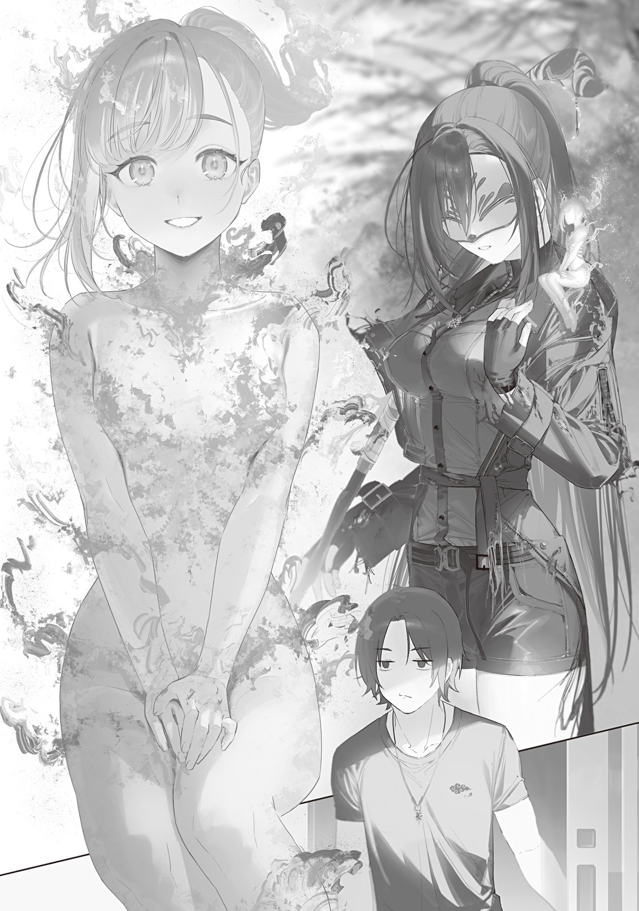
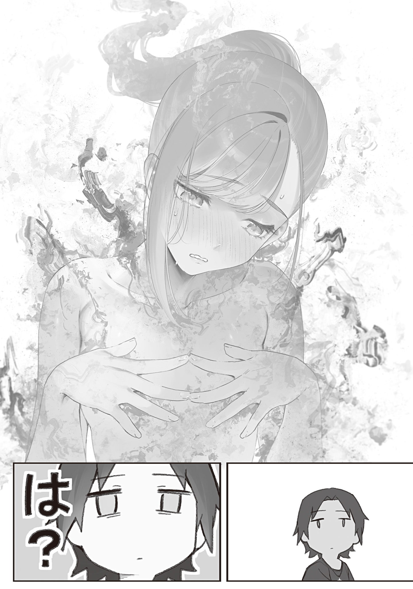

【継火の魔女】

ポストアポカリプス生活も五年目に突入し、俺の奥多摩[おくたま]生活は基盤が整ってきた。

奥多摩の俺の家周辺には迷いの霧の魔法がかけられ、外敵に襲われる事はまずない。

田んぼは去年の経験を活[い]かし整備を進め、今年は更なる増収を見込める。

裏庭には生[い]け簀[す]があり、新鮮な魚をいつでもお届け。

コンポストで作っている堆肥は家庭菜園に撒[ま]いて、旬の野菜を豊穣[ほうじよう]魔法と併せたっぷり収穫できる。

年々価格が高騰している調味料問題も、今春ようやくモノになった自家製味噌[みそ]と自家製醤油[しようゆ]で華麗に解決だ。

栽培計画を進めていた椎茸[しいたけ]も原木から数は少ないもののしっかり生えてくれて、今朝の朝食は昨晩の残りの米に自家製味噌の味噌汁をぶっかけた猫まんま。プラス、採れたてプリプリの椎茸の醤油焼きに、岩魚[いわな]の塩焼きまでつけたゴキゲンなラインナップだ。

一時は減っていく体重と食料備蓄に怯[おび]えていたというのに、時代は変わるものだとしみじみ思う。

まさかこんな理想の田舎贅沢[ぜいたく]飯で一日を始められるようになるとはね。

都心ではパンデミックの影響で食料生産体制が揺らぎ大変だというが、俺に限っていえば気楽なモンだ。東北狩猟組合から魔法杖[つえ]の注文を取ってきてくれるだろう青の魔女を労[ねぎら]うために、旬のヨモギを使ったヨモギ団子を用意しておく余裕すらある。

幸せな朝食をたらふく食い、食後の腹ごなしがてら昨晩川にかけておいた仕掛け罠[わな]を回収しようと長靴を履いて家を出ると、ちょうど青の魔女が迷いの霧を抜けてやってくるところだった。

いつもの仮面、いつもの青魔杖[まじよう]、いつもの御守り[アミユレツト]。

しかし肩にちょこんと乗った火属性っぽい妖精さんだけがいつもと違う。

なにごと？

「おはようございます、初めまして。継火の魔女です」

そいつは手のひらサイズの女の子で、赤く燃える髪と服のような炎を身に纏[まと]っていた。

落ち着いた声音で俺にぺこりと頭を下げ、挨拶してくる。

すごくメルヘンチックだ。絵本の中から飛び出してきた妖精さんみたいでめちゃ可愛[かわい]い。

でもちょっと待て、前にもこういうの見た事あるぞ？

前の時はオコジョだった。

そして、せっかく可愛いなと思っていたのに、二度目に会った時には人間になっていやがった。

もう騙[だま]されんぞ！　詐欺師め！

「へっ。どうせ目を離した隙に巨大化して普通の人間サイズに戻るとかだろ。そうだろ！　俺を誑[たぶら]かそうったってそうはいかんぞ」

「な、なんの話ですか？」

「落ち着けコミュ障。キャンキャン吠[ほ]える前に私の話を聞け」

油断なく威嚇する俺に、青の魔女は怪しげな火妖精を連れてきた事情を語った。

火妖精は本人が名乗った通り、東京魔女集会の一人、継火の魔女なのだそうだ。

彼女は品川[しながわ]区を治めている。グレムリン災害発生時はまだ十三歳だったにもかかわらず、得意の焔[ほのお]魔法でバッタバッタと魔物を焼き払い、本人の大人しく常識的な性格も相まって魔女集会の中でも安定して頼れる人材として重宝されてきた。

彼女の得意分野は見ての通り、火だ。彼女は魔法火だけでなく、近くにある物理的な火すらある程度操れるという特技がある。火災を抑え込んだり、放った焔魔法を広範囲化したり、魔力を消費せず焔魔法の火力を増減させたり、特定の物だけ燃やしたり、火に関する事ならかなり融通が利く。

巷[ちまた]で広まっている焔魔法「焔よ[ジン・ガ]」も元は彼女の魔法だ。いつも大変お世話になっております。今日も朝食作る時使わせてもらったぜ。

そんな継火の魔女は、この一年で急激に衰え、燃え尽きようとしていた。

彼女の体は火でできている。そういう生き物なのだ。元々は普通の人間サイズだったのに、一年の間にだんだん縮み、温度も低下。グレムリン災害直後の魔女になりたての頃は迂闊[うかつ]に木造建築に近づけないぐらいだったのに、今ではティッシュを近づけてもなんともない。

本人曰[いわ]く、寿命らしい。

病気とは違う。自分が衰え、自然に年老いていくのが分かるそうだ。

魔法使いや魔女は、変異によって人間の頃とは体が根本的に変わっている。

地獄の魔女は口数が増え角が生えたし、食人衝動に目覚めた。

花の魔女は下半身が花の魔物になった。

青の魔女だって見た目こそ人間だが、異常な冷気耐性を持ち、人外の膂力[りよりよく]を備え、喉の構造も人とは違う。

こういった変異には寿命の変化も含まれるのだそうだ。北[きた]区の魔女は思春期の子供の姿のまま全く年老いていない事で知られる。キノコパンデミックで亡くなった墨田[すみだ]の魔女も元々老衰間近だったのに変異を経てシャッキリしていたそうだ。

しかし、変異で寿命が延びる事があるなら、寿命が縮む事もある。

継火の魔女は変異によって寿命が短い生き物になっていた。

妖精は儚[はかな]い。

変異後四年が経[た]ち、火妖精である継火の魔女は加齢が進み、年老いて寿命を迎えようとしていた。

「急に死ぬのが怖くなってしまって……」

と、青の魔女の肩の上に乗る継火の魔女はまるでそれが情けない事であるかのように情け無さそうに吐露した。

「今まで散々敵を焼き殺してきたのに。いつか自分も死ぬんだって、分かっていたはずなのに。いざその時が来ると分かったら怖くて、怖くて。寿命だから仕方ないのは分かるんです。分かるけど、怖いんです。どんな形でもいい。まだ生きていられるなら、私は大狼[オキヤク]さんのマジックアイテムに縋[すが]りたい」

「お客さん？　誰？」

「大きい狼[おおかみ]と書いて大狼[オキヤク]と読む。大狼[オキヤク]は東北狩猟組合の魔法使いだ。マジックアイテムはこれ、マモノバサミの事だな。罠にかかった者の時間を停滞させる機能がある。壊すなよ？　魔女集会預かりの物を借りてきてるだけだからな」

そう言って青の魔女はトラバサミを俺に渡してきた。

一目見て、俺はそのトラバサミのおおよその仕組みを理解した。

なるほど。二種類の魔石を連結させて回路を作っているのか。ははあ、こんなに簡単な発想なのに思いつかなかったな。一種類の魔石の破片を繋[つな]げたり組み合わせてみたりした事はあったが、二種類。なるほど。

作りとしてはわざとやろうとしてもこうはならんやろ、というぐらい粗雑だ。魔石[そざい]が泣いてるぞこんなの。

形状的に断片が一致する魔石がいくつか見て取れたので、魔石を雑にバコーン砕いて、二色の魔石片を交互にオラオラ置いて両端を繋げた感じだ。

もうちょっとさあ、こう、なんとかならんかったのか？

いや魔石は研磨・切削が難しいし、やろうとしても出来なかったんだろうなとは分かるけどさあ。しっかり起動さえすれば後はどうでもいい、という製作者の意図を感じる。

「この魔石の輪に入った奴[やつ]の時間を停滞させるのか？　んー、空気とか塵[ちり]に反応するなら誤作動起こすよなぁ。生き物、いや、魔力持ちの生物限定で作用する感じか。動力源は……魔力しかないな。当然だ。これ、起動に呪文とか要る？　魔力をチャージするだけ？」

「説明しなくても全部見抜いてるじゃないか……」

「いや全部は分かんないから。で？」

「魔力をチャージすれば発動待機状態になる。発動待機状態で上に獲物が通りかかれば捕獲する。チャージには魔力コントロールが必要だから、必要になったら私か継火に頼め」

「ちょ、今頼むわ。一回作動するとこ見たい」

俺はワクワクしながら受け取ったマモノバサミを青の魔女に渡そうとしたが、青の魔女は溜息[ためいき]を吐[つ]いた。

「新しいオモチャが嬉[うれ]しいのは分かるが、まだ話の途中だぞ」

「話？　……なんの話だっけ？」

「継火の魔女が寿命で死にかけてると言っただろう。ほら継火。自分で頼め」

青の魔女に促され、継火の魔女は地面にジャンプして降り、俺に礼儀正しく頭を下げた。

「私を封印するマジックアイテムを作って欲しいんです。長くても十数日で効果が切れてしまうものではなく、何十年も封印がもつような。それで私は未来に希望を託したい。今はどうにもならない私の寿命も、何十年か経ったら解決する方法が見つかっているかも知れない。どうかお願いできませんか？」

「ああ、それなら全然オッケー。要はコールドスリープしたいのな。もうアップグレード方法いくつか思い浮かんでるし、何十年ももつようにできるかは知らんけど、十数年ぐらいもつようにはできる。たぶん」

「ほ、本当ですかっ!?　こんなアッサリ、あ、ありがとうございます！　ありがとう、本当にありがとう……！」

「別に拝まなくてもいい。魔女の封印マジックアイテム作るの面白そうだし。で、青の魔女。ちょっとこっち」

拝まなくてもいいと言ったのに拝みっぱなしの継火の魔女を置いて、俺は青の魔女を呼んで継火の魔女から少し離れ小声で詰問した。

「おい。俺の存在は秘密にするんじゃなかったのか？　なんで連れてきたんだよ」

「放っておいたら死ぬんだぞ。泣きながらあの職人を紹介して欲しいって頼まれたし、継火は良い子だし。あの人外サイズなら大利[おおり]の人嫌いも発動しないだろ」

「いや俺は人嫌いじゃないから。苦手なだけで」

勘違いを訂正し、気まずそうに言い訳する青の魔女を見て思う。

うーん。やっぱ最近、青の魔女の人間不信が少しずつ治ってきている気がするんだよなぁ。ガードが下がってる。

コイツからはなんとなく元々陽[よう]キャだったような気配感じる時あるし、親しい人に散々裏切られ亡くしてきたというトラウマも癒[い]えてきたのか。

陽キャに戻られると俺が付き合いにくくなって困るから今のままでいて欲しい、けど、青の魔女は友達だ。ムッツリジメジメしてるより笑っていて欲しい。なんとも言い難い複雑な気持ちだ。

「まぁ、継火の封印マジックアイテムの話は分かった。東北狩猟組合からの注文は取ってきてくれたか？」

「話は伝えた。注文は大狼[オキヤク]の一存では決められないから、一度持ち帰って協議にかけると言っていたな」

「あーね。ま、妥当なところか」

組織所属って大変だな。何につけても自分一人じゃ決められない。

でも前向きに考えれば、使者としてやってきた魔法使い一人からのご注文だけではなく、東北狩猟組合に所属する魔女・魔法使い複数名からの大口注文に発展する可能性がある。ぜひ前向きに検討して頂きたい。

世界に羽ばたけ、大利ブランド最高級魔法杖！

用件を済ませた青の魔女は、継火の件について魔女集会に伝えてくると言い霧の向こうに去っていった。後にはマモノバサミを持った俺と継火の魔女が残される。

さてどうするか、と足元の継火の魔女を見下ろすと、俺を見上げおずおずと聞いてきた。

「あの。職人さんは青ちゃんさんと仲良いんですか？」

「友達だ。お前もけっこう気に入られてるんじゃないか？　どういう関係なんだ」

「えへへ。実は雑誌モデル時代からずっと大ファンで。ファンレター送ったのも覚えてくれていたみたいで！　青ちゃんさんとおんなじ魔女になれたって分かった時は嬉しかったなぁ」

「ふーん。まあとりあえず入れよ。工房に案内しよう」

俺は昔を思い出し遠い目をする継火の魔女を我が家へ通した。

ノンバリアフリーの家の出っ張りで転びそうになりながらちょこちょこ俺の後について工房に入った継火の魔女は、大[おお]日向[ひなた]教授と違いそんなにテンションを上げなかった。どうやらこういう工作系にあんまり興味が無いらしい。

が、反射炉を使うほどではないちょっとした火仕事に使っているミニ炉には目を惹[ひ]かれている様子だった。

「壊さなければ好きに見てていい。えーと、魔石の削りクズはどこしまったっけな……」

継火の魔女を好きにさせ、俺は魔石の在庫を探した。

俺はこれまで三本の魔石杖を作ってきた。

黒魔石を使った至宝オクタメテオライト。

青魔石を使った青魔杖キュアノス。

琥珀[こはく]魔石を使った錫杖[しやくじよう]ハリティ。

当然、加工の過程で出た削りクズは全て保管してある。何かに使えればと思ってとっておいたのが役立ちそうだ。

棚の奥の方にしまっていた魔石クズケースを見つけて製図机の上に置き、在庫量を確認し、さっそくアイデアをスケッチしてまとめていく。

大前提として形を揃[そろ]える必要はあると思うんだよな。乱雑な形の欠片[かけら]を繋げるのではなく、魔力が滑らかに整然と流れるようにしてやる必要がある。それだけでロスが減り、封印時間はグンと延びるはず。

あとはどんな形に揃えるか。そして一片の最適な大きさはどれぐらいか。

二色ではなく三色の魔石を規則的に繋げた場合どうなるかも検証する必要がある。性能が強化されるのか？　ショートする危険もあるし、そもそも全く別の効果を発揮する可能性だってある。

平面ではなく立体的な組み立ても試してみたい。時間の流れを遅くするのではなく、速くしたり完全に停止させたりはできるのだろうか……

しばらくスケッチと設計に没頭していると、肘のあたりをちょんちょんつつかれた。

目を向ければ、製図机によじ登った継火の魔女が反射炉と炭焼き窯の設計図を精一杯に広げて俺に見せてきていた。

「お仕事中すみません。あの、この設計図って職人さんのですか？」

「ああ、両方俺が引いた。裏山に建てたヤツのだな。それが？」

「まさかこの設計図通りに作ったんですか……？」

「え。なんかヤバい？」

俺なりによく調べて考えて図面を引いたつもりだが、引っかかる部分があったらしい。

火の専門家である継火の魔女目線だと致命的不備があったりするんだろうか。

不安になって尋ねると、継火の魔女は首を横に振る。

「ヤバくはないですけど。改善の余地アリですね。そういうのに興味あれば改善方法をお教えできますけど」

「マジか。聞きたい聞きたい。レクチャー頼む」

俺が設計を中断してお願いすると、継火の魔女は俺の鉛筆を借りて解説しながら設計図に手を加えていった。

話によると、俺の反射炉と炭焼き窯は貴重な化学成分を垂れ流しにしてしまっているらしい。

木や石炭を燃やす時には蒸気が出る。これは集めて冷やし凝集させると乾留液[パイロリグニアス]になる。乾留液は多くの有用な化学物質の混合物だ。

反射炉と炭焼き窯に改造を加える事で、この貴重な混合物を大気中にいたずらに垂れ流さず、効率的に集める事ができる。

まず煙をパイプを通して集め、細いらせん状の管の中を通し、冷水で冷やし乾留液にする。冷やしても液体にならなかった成分は木ガスという可燃性ガスであり、そのまま燃料として使える。

乾留液は放置していると水っぽい上層とドロりとした下層に分離する。

水っぽい上層は木酢[もくさく]と呼ばれるもので、分留すれば酢酸、アセトン、メタノールを得られる。

酢酸は薄めればお酢になるし、染料や殺菌剤の原料にもなる。

アセトンは洗剤になる他、無煙火薬[コルダイト]の製造にも必要になる。

無論、メタノールは燃料だ。

ドロリとしたタールは分留するとテレピン油、クレオソート、ピッチが得られる。

テレピン油は溶剤として重要な役割を持ち、クレオソートは防腐剤・消毒剤になる。

ピッチは高い防水性能を持ち、これからの時代に必要になってくるであろう木造船の製造や補修に欠かせない。

継火の魔女は炉の改造図面を引いてくれただけでなく、分留装置の図説も書いてくれた。

彼女は全ての図を何も参照せずに描いた。全て頭の中に入っているのだ。

すごくね？

「火の妖精ってこういう化学的な火仕事にも詳しいんだな」

「あ、いえ、このあたりは全部勉強して覚えました。ウチの品川区は火を扱う産業を興しているので」

「真面目～」

継火の魔女はちょっと照れくさそうにはにかんだ。

品川区民もトップがこれならさぞ心強いだろう。俺も俺の仕事についてちゃんと分かってくれている上司が欲し……いや上司はいらねぇな。俺自身が俺の上司だ。

「それから、炉の灰はどうしてます？」

「畑に撒[ま]いてるな」

「それもいいですけど、カリを作るのにも使えますよ。灰を水に溶かして不純物を除いて、水を蒸発させると白い結晶が残ります。それがカリです。カリは石鹸[せつけん]やガラスの原料、助燃剤として使えます。料理では麺を打つ時のかんすいに利用できますね」

継火の魔女はサラサラと炭酸カリウム（カリ）の構造式と用途を書いた。

今まで会った中で一番魔法生物な見た目をしているのに、一番化学に詳しいぞコイツ。

しかしそうか、そうだよな。世界から電気が失われても、電気を使わない化学はある。魔法はこれからの時代を切り開く素晴らしい新技術だが、使える化学を使っていく事も忘れてはいけない。

俺は貴重な気付きと資料をくれた継火の魔女に心から感謝した。

「いや、めちゃくちゃ参考になった。やっぱ専門家の意見は聞くもんだな」

「お役に立てて良かったです」

そう言って継火の魔女は控え目に微笑[ほほえ]む。

大日向教授と同じミニサイズの生き物だが、大日向教授と違って陰の者寄りの性格っぽい。親近感が湧く。

「人間だった頃成績良かっただろ？　分子の構造式なんて久しぶりに見た」

「いえいえ、私なんて。職人さんの方がずっと凄[すご]いですよ。フリーハンドでこんな精密な図面引ける人、初めて見ました。ちょっと気持ちわ……すごいですね」

「最後まで言わなかった礼になんかやろうか？　改良マモノバサミ以外に」

継火の魔女の改良図面は俺の田舎暮らしをめちゃくちゃ豊かにしてくれそうだ。礼の一つもくれてやりたくなる。

順調にいけば数日後には封印され、間延びした時間の流れの中で長い間囚[とら]われの身になるわけだし、今のうちに良い思い出作っとけ。

俺が尋ねると、継火の魔女は少し考え込み、何かを思いつき、モジモジしながら言った。

「それなら。ここに来る途中、放置されてる廃屋があるのを見つけたんですけど」

「ああ」

「あの、あの廃屋に放火してもいいですか？」

「なんで……？」

全く想定していなかった言葉が飛んできてビビる。

本当になんで？

意味が分からない。

さっきまで大人しくて常識的で賢い感じ出してたのに、なんで急に放火魔になった？

こえぇよ。良い人ヅラしてるけどやはりコイツも魔女だったか。

俺の顔を見た継火の魔女は慌てて両手を振って弁解する。

「あっ、いや放火癖がある訳じゃないです私。そういうのじゃないです！」

「じゃあどういう訳なんだよ」

「それは……その……！」

継火の魔女は言[い]い淀[よど]み、俯[うつむ]いてしまった。元々全体的に赤いから分かりにくいが、顔が赤くなっている気がする。

何？　なんなんだ？

黙って先の言葉を言うのを待っていると、やがて継火の魔女はか細い声で続けた。

「ちょっと……」

「なんだよ」

「……ムラムラしてしまって」

「は？」

なんて？

説明を聞いてもっと分かんなくなる事ある？

ここ十年で最高純度の俺の「は？」を聞いた継火の魔女は、顔を真っ赤にしてヤケクソで早口に事情を話した。

「私はそういう生き物なんです。魔女が変異する時に性癖が変わる事があるのは知っていますよね？　私が変異したこの体の生き物は、夫婦で何かに火をつけて繁殖するみたいなんです。だからムラムラすると放火したくてしたくて仕方なくなって。

たぶん同種の雄と一緒に放火すると、火の中から子供が生まれるとかかなって思ってます。だって仕方ないじゃないですか、そういう生態なんですから！　逆らえないんですよ、本能にはっ！」

「お、おお」

「わーっ！　やっぱり引かれた……！　言っておきますけどね、もうすぐ死ぬかも知れないから、職人さんの口の堅さを信じて言ったんですからね！　今まで誰にも言わずにずーっと敵に火をつけて欲求不満を解消してたんですから！」

「あ、ああ」

すごい剣幕[けんまく]で言われ、ちょっと引きながら頷[うなず]く。

お前は「もうすぐ死ぬかもしれないし言っちゃえ」のテンションで告解したのかも知れんが、未知の性癖を打ち明けられた俺の身にもなってくれよ。

とんでもない話を聞かされたが、一つだけ確実に言える事がある。

「あのさあ。俺もこういう会話の機微？　には詳しくないけどさ。たぶんその性癖はもう誰にも打ち明けない方がいい」

「ぐぅっ……！」

継火の魔女はグゥの音を上げて沈黙した。

「まあ事情は分かった。共感はちょっとできないけど。そういう事なら好きに燃やしていい。どうせ奥多摩の廃屋は物資全部持ち出した後だし。今更住民帰ってくる事もないだろ」

継火の魔女は頷き、まだ少し顔を赤らめたままてってこ工房から出ていく。

早速放火しに行くらしい。

難儀な性癖なんだな、と思いつつ設計に戻ろうとした俺の耳に、玄関の方から二人の魔女の話し声が聞こえてきた。

「ん？　なんだ帰るのか？」

「おっ、お帰りなさい青ちゃんさん。私は……私は、ちょっと出かけるだけです。職人さんに使ってない廃屋を燃やして良いと言われて。すぐ戻ります」

「そうか。魔女集会には『継火の問題は解決に向けて進展中』と伝えておいた。他に何かあるか？　伝えておきたい事だとか、気になっている事だとか」

「…………。あ、あの、青ちゃんさんっ」

「なんだ」

「私と一緒に、廃屋を燃やしてくれませんか!?」

ひと際大きく響いた継火の発情した声に、俺は耳を疑った。

継火さん!?

何をおっしゃる!?

だってお前それ、え？

誰かと一緒にする放火活動って、お前的には繁殖行動なんだろ!?

「廃屋を一緒に燃やす……？　別に構わないが……」

しかしそんな事を知る由もない青の魔女は、突然のお願いに困惑しながらも了承を返してしまった。

わ、わあ……！　とんでもない事になっちゃってるゥ！

青の魔女は全然理解してないけど、これ相手の無知につけこんだとんでもないセクハラだーッ！

止めに行こうと腰を浮かせるも、どう止めればいいのか言葉が思い浮かばず体が止まる。

いやいやいや、なんて言えばいいんだよこんなの。「青の魔女、お前はいま無知シチュ百合[ゆり]放火ックスを仕掛けられてるから断れ」とでも？　言えるかバカ！

散々迷ったが、俺は結局椅子に座り直した。

ま、まあ女同士だし。裏事情を知らなければやってる事は単なる放火だし。黙っておけば実害はあるまい。

継火も俺をある意味で信用して性癖をぶちまけたんだろうから、俺の口から秘密をバラしてしまうのも違う。黙っておけば事は丸く収まる。真実は、時に口に出さない方が平和なのだ。

それから小一時間して変態放火活動を終え戻ってきた継火の魔女は、スッキリした穏やかな表情をしていた。

青の魔女は台所にラップして置いておいたヨモギ団子をお土産に、自分が何をさせられたのか気付く事もなく帰ったらしい。かわいそう。伝えらんねぇよ真相なんて。

継火の魔女に何をヤッたのか詳細を聞くのも憚[はばか]られ、俺はこの件について触れない事にした。

すごいね、生命の営み。

全然見習いたくないぜ。
