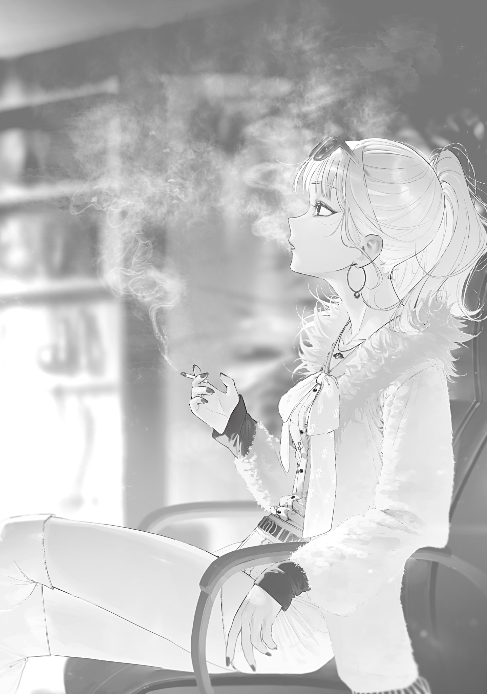

【闇商人、０９３３を語る】

白[シロカラス]は、杉並[すぎなみ]区で闇取引を生業[なりわい]としている闇商人の女首領である。

白

は元々新宿[しんじゆく]区に住む夜職の女だった。ホストの彼氏と付き合い同棲[どうせい]していたのだが、その彼氏はグレムリン災害が起きてすぐ白

の目の前で魔物に貪り食われて死んだ。

その凄惨な光景は白

の何かを壊した。常識と良識を破壊するのに十分すぎるインパクトがあった。

白

はグレムリン災害の混乱に乗じ、独自の勢力を作った。彼氏の友達として顔見知りだった全身に入れ墨が入っているタイプの腕の立つ男や、口車に乗せやすい女を集め、闇取引事業を始めたのである。

グレムリン災害後の世界では誰も彼もが切羽詰まっていて、白

は人々の窮地につけ込み大儲[おおもう]けした。

医薬品の強制徴収時に隠しておいた僅かな風邪薬は、大量の食料配給券に変わった。

畜産業をしている男を色仕掛けで引っかけ、貴重な肉を横流しさせた。

魔物の血を「魔女の血」と偽って売りさばき、自衛隊の死体から回収された銃器を密[ひそ]かに買[か]い叩[たた]いた。

身よりの無い女を集めて躾[しつ]け、混沌[こんとん]とした社会でそこそこの地位を持った男にあてがい甘い汁を吸った。

白

の一党は儲けに儲け、未曾有[みぞう]の大災害の最中[さなか]にもかかわらず、贅沢[ぜいたく]な暮らしができた。

だが、白

の春は短いものに終わった。

魔女と魔法使いのせいだ。

東京ではどこの地区でも大なり小なり超越者が治安を維持している。

大抵の地区には食料配給があり、仕事の割り当てがあり、警備隊が魔物討伐がてら警邏[けいら]をしている。大きな問題が起きれば、超越者たる魔女が出張ってくる。

白

が住んでいた新宿区は、目玉の魔女の管理区である。目玉の魔女は平和主義で争いを好まず、白

のような勢力にも裁定が甘かった。

一度目玉の魔女直々の訪問を受け、流石[さすが]に処罰されるかと身構えたが、まるで近所のオバさんに将来の心配をされているような和やかな会談に終わり、拍子抜けしたぐらいだ。

目玉の魔女は甘い。

こりゃ敵なしだ、と調子に乗りかけた白

だが、不穏な噂[うわさ]が待ったをかけた。

周辺の同業者が次々と消息を絶ち始めたのである。

特に新宿と隣接している文京[ぶんきよう]区では、ある日を境に闇系の同業者全てと一切連絡がつかなくなった。

警備隊に捕まったとか、魔物に殺されたとか、そういう話は無かった。

何の前触れもなく、ただ、突然消えた。

白

の部下のうち何名かはこれ幸いと空白になった縄張りへ勢力を拡大しようと提案してきたが、何が起きているのか察した女ボスは部下の空っぽの頭を引っぱたき叱った。

何者かが、恐らくは超越者の一人である未来視の魔法使いが、恐るべき手際で反社会勢力を人知れず始末しているのだ。

人間業ではない何かが起きたなら、それは人間の仕業ではない。

縄張りの拡大どころではなかった。

目玉の魔女は未来視の魔法使いと仲が良い。目玉の魔女は甘くても、未来視の魔法使いはやる事をやる男だ。目玉の魔女のために未来視の魔法使いが気を利かせ、新宿区の掃除に乗り出せば、白

の一団は容易[たやす]く消し飛ぶ。

白

たちは大急ぎで荷物をまとめ、脱兎[だつと]の如[ごと]く夜逃げした。

その逃亡先が杉並区だった。

杉並区に逃げ込んだ白

たちは、大急ぎの脱出についてこれず、新宿に残してきた部下と連絡が取れなくなっている事実に蒼褪[あおざ]め冷や汗を拭った。間一髪だったらしい。

しばらく生きた心地のしない日々を過ごした白

一行だったが、待てども待てども何も起こらず、やがて未来視の魔手が伸びてこないと悟り、安堵[あんど]した。

未来視は万能の断罪者ではなかった。東京の全てを見通し、監視できているわけではないのだ。

白

たちは安心して杉並区で闇取引事業を再開した。

だが、今度は未来視の逆鱗[げきりん]に触れないように、悪質すぎる事業はやめた。始末された同業者の順番と傾向から、未来視が何にキレて何を許すかのラインはぼんやり理解できた。

白

は闇取引で得た収入の半分をグレムリン災害で大量に出た孤児を保護する孤児院の設立と経営に充て、未来視に媚[こ]びを売った。

そしてそれはどうやら成功したようだった。

一度未来視から何も文面が書かれていない白紙の手紙が届けられたので（それだけで部下の半分が泡を食って逃げ出した）、監視対象として目をつけられているようではあるが、少なくとも未[いま]だ消されてはいない。

新たなアジトを構えた杉並区は、白

たちにとって都合の良い治安の悪さで居心地が良かった。

杉並区の管理者、さざれ石の魔女はニートである。グレムリン災害の前からずっとニートをしている生粋の社会不適合者だ。

さざれ石の魔女はグレムリン災害直後は自宅警備しかしていなかったが、今は亡き吸血の魔法使いに説き伏せられ、渋々杉並区を守るようになっている。が、根がニートなのであまり働かないし、拠点にしている漫画喫茶から出てこない。

さざれ石の魔女はグレムリンに魔法をかけ、グレムリンを核にした石人形[ゴーレム]を作る事ができる。有名な目玉の魔女の使い魔と同じような、魔女の手足となって動く兵力だ。

杉並区の各地にはこの石人形が配置され、引きこもって出てこない魔女本人に代わり区内の魔物討伐を担っている。

だが、たまに魔物が目の前を通り過ぎても彫像のように動かない事がある。どうやら半自動で動くらしいゴーレムは、困った事に主人であるさざれ石の魔女の気質を受け継いでしまっているらしい。

そういう時はゴーレムを蹴っ飛ばし無理やり動かすのが杉並区民の暗黙の了解になっている。いくらニート気質だろうが、働いてもらわなければ困る。

他の区における警備隊に相当する仕事を担うゴーレムがそんな調子だから、杉並区はお世辞にも治安が良いとは言えない。ニートに社会性あふれる統治など到底期待できない。

それでも魔女がいない危険地帯や、ゾンビの魔女の管理区よりは遥[はる]かにマシだ。

ニートの習性なのか、さざれ石の魔女は他の魔女にゴチャゴチャ指図されたり説教されたりするのを嫌っていて、そこも白

たちにとっては好都合だった。自分達のような闇組織を引き渡せと他の魔女に要求されても、さざれ石の魔女は無視するか突っぱねる。

さざれ石の魔女は特別白

の一団を守ったりはしない。だが、排除もしない。

ほどよく治安が悪く魔女の手出しを受けない杉並区に、何度も修羅場を潜[くぐ]った経験のある白

たちは速やかに蔓延[はびこ]り安定した裏社会を築き上げた。

まあ、未来視の魔法使いか魔女が誰か一人でも本腰になればまた尻尾を巻いて逃げるハメになるので、決して盤石ではないのだが。

ともあれ、そうして白

の一団は杉並区に「渡[ワタリガラス]」の名で根を下ろし、表向きは孤児院と質屋を営む善良な市民集団として、裏では東京裏社会指折りの闇取引商として今日も元気に活動しているのだった。

---

キノコパンデミックの災禍も過ぎ、桜の花もすっかり散り緑の葉を茂らせ始めたある日の事。

白

は杉並区商店街ビルの質屋地下の一室で部下が仕入れてきた盗品の鑑定をしていた。

古株の部下は盗品の目利きができるが、今回の盗品を仕入れてきたのは若手のヒヨッコだ。白

自らがチェックしなければ不安がある。偽物を掴[つか]ませる側である闇組織が偽物を掴まされたのでは沽券[こけん]に関わる。

暗い地下室には元は億ションの部屋にあった高級調度品が並び、白

お気に入りの前時代の銘柄の煙草[たばこ]が棚に綺麗[きれい]に整頓して置かれている。白

は煙草の魔女が生産している煙草を市場に流し、二度と新規に製造されない貴重な前時代の銘柄は個人的に確保していた。悪貨は良貨を駆逐するのだ。

魔法火をつけたランタンの煌々[こうこう]とした灯[あか]りの下、白

は吸いかけの煙草を灰皿に置き、テーブルの上に置かれた杖[つえ]をルーペでつぶさに調べた。

ヒヨッコの言い分が真実なら、目の前にあるのは稀代[きたい]の杖職人０９３３が手掛けた27年型汎用二層構造グレムリン魔法杖[ワンド]のはずである。女にハマって身を持ち崩した魔法大学卒業生から譲られた品だというが、偽物も出回っている。言葉だけでは信用できない。

０９３３の杖には渡

として長く儲けさせてもらっているが、大損をさせられた事もある。本物なら大きな商いになるが、偽物ならカスだ。

０９３３────以前は「青梅[おうめ]の職人」と呼ばれていた謎の人物が渡

の商売に関わるようになったのは、約二年半前からだった。

魔法大学の開校に合わせ、キュアノス出現以来朧気[おぼろげ]に存在が囁[ささや]かれていた謎の魔法杖職人[ワンドメーカー]は量産型の杖を世に流し始めた。

量産型とはいえ、神業の加工技術によって作られた最初期の25年型杖は表社会だけでなく裏社会の住人にとっても非常に魅力的だった。

世の中には魔女が唱える詠唱を耳で聞いて覚え、その中でも人間が扱える呪文を切り札として隠し持っている者がいる。そういった希少な人間のうちいくらかは裏社会の重鎮に成り上がっていて、白

もその一人だ。

魔法杖があれば、切り札は兵器へ昇華する。もたらされる利益は莫大[ばくだい]だ。

25年型杖は魔法大学卒業生にのみ配布され、それ以外の手段では手に入らない。それがまた杖を欲しがる裏表両社会の人間の欲に火をつけた。

別地区の同業者などは「青梅の職人」と直接仕入れ交渉を行うため、愚かにも青梅に足を踏み入れたほどだ。

しかし当然、誰も帰って来なかった。

白

からしてみれば至極当然、アホの極みである。

青梅の魔女は、誰もいない街を執拗[しつよう]に守り続けているイカれた女だ。頭がおかしいだけでなく、超越者集団である東京魔女集会の中でぶっちぎりの最強、生きた核爆弾なのだ。つついたら消し飛ぶに決まっている。

触らぬ魔女に祟[たた]りなし、だ。

そんなわけで25年型杖は入手が難しく、渡

でさえ一本しか商った事がない。

その一本は抗生物質15箱と栄養剤６ケース、ピル３箱、チョコレート８ボックス、２５０Ｌガソリン入りドラム缶６本、新宿区の食料配給券10束で売れた。

たった一本の杖が、である。

崩壊前の価値にすれば５億円はくだらないだろう。

その一度の取引で渡

は大いに潤い、組織の地盤が固まり、孤児院の保母さん（保育士資格持ち）を５人も増やせた。

翌年の26年型では魔力逆流防止機構が組み込まれるようになり、杖の性能が向上。

25年型が陳腐化すると同時に26年型の需要は高まった。

魔女から詠唱を聞き盗んだ野良魔術師[ウイザード]のうち、魔力逆流のせいでまともに切り札を運用できていなかった者が、特にこの26年型を欲しがった。

渡

は、魔女の管理区外でコッソリ隠田をやっている大地主のために苦労して一本の26年型を仕入れた。

今度は竜の魔女の足の骨、蜘蛛[くも]の魔女の蜘蛛糸布ふた巻、煙草の魔女印の煙草10カートンで売った。どれも入手困難で値段がつけられない貴重な品である。

この取引でも渡

は大儲けして、手に入れた貴重品の転売で得た利益を使って魔法大学卒業生を１人囲い込み、組織の魔法教師役として置く事に成功。また、孤児院のために教員資格持ちの教師を５人雇い、新しい遊具を３つ設置した。

しかし翌年の27年型には大損させられた。

渡

はあらかじめ27年度の魔法大学入学生の一人にツバをつけておき、入学後に紛失を装い27年型の杖を１本横流しさせた。

そして危ない橋を渡り手に入れた27年型をさあどの大口顧客に売りつけてやろうかというところで、魔法大学が一般量産杖の製造を始めたのだ。

顧客はたちまち一般量産杖の方に飛びついた。安く、入手しやすく、魔力逆流防止機構がついていて、魔法増幅率だって悪くはない。

闇取引をしてまで最高級品を欲しがる客もまだいたが、その客でさえ足元を見て買い叩いてきた。

27年型入手のために費やした少なくない投資は、杖の価値の暴落によって大赤字を生んだ。

依然、青梅の職人の杖は最高級品ではあった。なにしろ高性能でデザインも良い。

しかしこれまでのような法外な値はつかなくなってしまった。

27年度の渡

は赤字によって雌伏の年となり、大きな変革は孤児院でのお誕生日ケーキ制度導入に留[とど]まった。

最新28年型は、昨年の紛失騒ぎのせいで大学のガードが固くなってしまっており、まだ入手できていない。キノコパンデミックで組織や孤児院に少なからぬ犠牲が出たのも痛い。

だが一方で謎の魔法杖職人についての情報は仕入れる事ができた。

文京区役所勤めの情報筋によると、魔法杖職人は関係者の間で「０９３３」と呼ばれているという。

０９３３は青の魔女の庇護[ひご]を受け、東京魔法大学学長の関係者で、未来視の魔法使いに頼られ、花の魔女に強力なコネクションを持ち、つい最近は継火の魔女を封印し、代替わりした火継の魔女と懇意にしているという。未確認だが地獄の魔女との友好関係も疑われている（彼女は妙な杖を持ち東京を出ていくのが目撃されている）。

まるで東京の火薬庫の如き人脈に、白

はお手上げだった。

０９３３に迂闊[うかつ]に手を出せば、渡

は杉並区ごと更地にされるだろう。さざれ石の魔女の外交拒否政策など薄い防壁だ。

０９３３の作品は桁外れの高値で売れる。

だからこそ、扱いは慎重に行わなければならない。

最近では０９３３の新作、「御守り[アミユレツト]」と呼ばれる魔力回復促進魔道具が流通し始めていて、魔法大学構内の購買部で販売されている他、少量ながら一般工房でも製造されている。

入手が難しい杖の売買を狙うより、０９３３ブランドの名を利用した偽ブランド品製造販売、あるいは廉価版コピー商品の売買にシフトした方がいいかも知れない。

０９３３関連は全てノータッチにしてしまった方が無難だが、関係者の怒りを買わない程度に利用できれば同業他社を出し抜けるしオイシイ。

まあしかし、それは現在部下が行っている御守り[アミユレツト]製造工房への産業スパイ活動の成果次第だろう。

あとは東北狩猟組合が持ってきたという三つの新技術も良い商売のタネになりそうな匂いがする。

公式発表に先駆け情報を入手するために追加の人員を送るべきか。配給制を終わらせる通貨発行計画が進んでいるというタレコミもあったからそちらの事実確認も必要で、考える事が多い。

過去と今に思いを馳[は]せていた白

は、ヒヨッコが仕入れた魔法杖に偽物の証拠を見つけてしまい、舌打ちして杖を隅のゴミ箱に投げ捨てた。

本当に０９３３が手掛けた27年型汎用二層構造グレムリン魔法杖[ワンド]ならば有り得ない特徴があったのだ。

26年型以降の杖に標準装備の逆流防止機構は、木目の継ぎ目に隠れるように精緻に柄に埋め込まれ蓋をされている。

普通に見ただけでは分からないが、柄を折り曲げるようにして力を入れたわませつつ、小麦粉をまぶして吹き払うと継ぎ目が白く浮かび上がって見える。

持ち込まれた杖にはこの特徴が無かった。

コアになるグレムリンの方もダイヤモンドで削っても傷がつかなかったものの０９３３の作にしては歪[ゆが]んでいるように見えたし、励起魔力感応吸音鑑定の結果も悪い。柄もコアも品質が低い。偽物で確定だ。

白

はイラつきながら灰皿に置いていた煙草を咥[くわ]え、深く煙を肺に入れた。

まあヒヨッコの失敗だ。子犬がお宝のつもりでゴミを咥えて持ってきた程度のものだ。ヒヨッコへの罰は軽い躾[しつけ]程度でいい。

問題は相手が渡

と知りながら偽物を掴ませてきた不届き者だ。二度とナメた真似[まね]ができないよう分からせてやる必要がある。

白

が煙草をふかしながらそのあたりの指令書を書いていると、不意に地下室のドアがノックされた。二つあるドアのうち、地上階へ繋[つな]がっている方だ。

「なに？」

「お客さんです」

「ああ、少し待って……小石にも悩み事ぐらいあるさ[ツププヴイビイデイオーオ]」

白

はまたもや煙草を灰皿に置き、懐から出した鋭利なグレムリンに初歩的なさざれ石の魔法をかけた。市場に流れていた有名漫画家の連載作の続きをまとめた単行本を、オタク気質[きしつ]のあるさざれ石の魔女に貢いで習ったものだ。

魔法をかけられたグレムリンは白

の意志に従い宙に浮き、地上階へ続くドアの上に張り付いた。効果の割に魔力消費が理不尽に大きく、持続時間も十分足らず。骨を貫くのがやっとといった威力の魔法ではあるが、対人戦における抜群の奇襲性を評価して愛用している。

自分の下に通される客は、表稼業の質屋ではなく闇取引の客。それも上客だ。

上客がゆえにもしもの場合に備える必要があった。

合図の後に通された客は、初めて見る顔の大男だった。

２メートル近い高身長に分厚い筋肉をまとい、全体的にガッシリしている。だがあまり利発そうには見えなかった。ミチミチのスーツを着たアホのトロールといったところか。

早くも嫌な予感がしたが、女の勘もたまには外れる。警戒しつつも白

は用向きを聞いた。

「渡

の白

。そっちは？」

「茂布[もぶ]だ。コイツを売りたい」

茂布と名乗った大男は、挨拶もそこそこに手に持った包みを破り、中身を黒檀[こくたん]の高級執務机の上に転がした。

「ええ？　これはまさか……」

出てきた品物を見た白

は呟[つぶや]き、激しい動悸[どうき]と動揺を表情に出さないよう抑え込んだ。

それは一目で分かる最高級品の杖だった。随所に０９３３作品の特徴がよく出ている。

質実剛健な造りの金属性の柄は、細やかな装飾と併せこれが間違いなく大学用量産型と別格の０９３３オーダーメイド品である事を示している。

つまり、魔女の杖である。

震える手で杖を転がした白

は、柄に刻まれたWitch of Flameの銘を見て眩暈[めまい]がした。

継火の魔女の杖だった。

使い手が封印され、所有者を失った継火の魔女の杖。渡

の手に余る劇物が何故[なぜ]かここにある。

「こんな物、どうやって手に入れたの？」

「盗んだんだ。苦労したんだぜ？」

茂布は自慢げに言ったが、全く自慢にならない。

言葉巧みに騙[だま]し取ったならまだ言い訳の余地があるが、盗んでしまったのなら言い訳が利かない。

もちろん、魔女の杖が手に入るならそれは今まで扱った事のないレベルの大取引になるだろう。

だが代わりに確実に報復を受け、命を失う。目玉の魔女ですら流石に怒るだろう。

白

は深呼吸をして状況把握に努めようとした。まだ希望はある。

もしかしたら茂布には魔女の誰かがバックについていて、継火の魔女の杖を盗ませたのかも知れない。魔女集会は仲良しこよし集団ではないのだ。

「バックは誰？　何人噛[か]ませたの？」

「なんだって？」

「盗み役と運び役、それとアナタ。三人は最低でもいるでしょ？　間に何人噛ませたの？」

「そんなまだるっこしい事はしねぇ。俺が盗んでココに持ってきた」

「……バックは？」

「カバンは持ってきてねぇな」

馬鹿が馬鹿な事を誇らしげに言い、頭痛がしてきた。どうか悪い夢であって欲しい。

こんなアホがよく魔女の杖を盗めたものだ、と信じられない気持ちだったが、今日が定例の魔女集会の日である事を思い出す。

代替わりしたばかりの火継の魔女の家から、留守の間に彼女の姉の杖を盗み出す。幸運が重なれば、あるいは悪運が重なってしまえば、確かに実現可能の範疇[はんちゆう]だった。

白

はサッと懐中時計を取り出し時間を確認した。魔女集会が終わる時間帯まで残り少ない。

間に誰も噛ませていないのなら、茂布は誰かに目撃されているだろう。既に盗難が発覚し火継の魔女に連絡が行き、捜索が始まっていてもおかしくない。

白

は継火の魔女の杖を茂布に押し返し、バカでも分かるように分かりやすく言った。

「これは買い取れないわ。今すぐ返しに行って、命乞いをした方がいい」

茂布は高確率で犯行のどこかで誰かに目撃されているだろうから「盗人[ぬすつと]から取り返してきました」作戦は使えない。正直に誠心誠意謝罪し、魔女の慈悲に縋[すが]るしかない。

魔女が絶対強者として君臨するこの世界で、分を弁[わきま]えず引き際を誤った奴[やつ]は死ぬ。

正直一秒でも早く帰ってもらいたい。このまま一緒にいたら魔女にどう思われるか！

馬鹿が勝手に死ぬのは良い見世物だが、その見世物に自分が巻き込まれるのは御免だった。

馬鹿は自分が賢いとでも思っていそうな馬鹿な顔をして、白

を嘲る。

「なんだ、ビビってんのか？　あの白

もしょせん女か！」

「死にたいみたいだけど、処刑は魔女に任せるわ。ほら、お帰りはあちら」

地上階へ続くドアを指すが、茂布は不満そうに言い募る。

「ビビり過ぎだろ。継火はもう死んだだろうが」

「違う。封印されただけでしょ。代替わりもしてる」

「だからなんだ？」

「姉の大事な杖を盗まれた火継の魔女が、怒り狂ってアナタを殺しにくるって事よ。さざれ石は他の魔女の干渉を嫌うけど、ブチ切れた魔女の襲撃から守ってはくれない」

「ハッ！　火継は魔女って呼ばれちゃいるが魔女じゃねぇ。この俺が杖持ってイキってる小娘にビビるとでも思ってんのか？」

「ああ、そう……」

あまりに話が通じない。

白

は茂布を生きて帰らせるのではなく、死体にして火継の魔女へ送る事にした。

そちらの方が話が早そうだ。

白

はドアの上に待機させていたグレムリンに念じ、茂布の後頭部を襲わせた。

が、茂布は信じ難い事に寸前で完全な奇襲に気付き、鈍重そうな巨体からは予想できないほどの俊敏さでグレムリンの矢尻を回避した。

「っとお!?　あっぶねぇなァ！」

白

は執務机を貫通して穴を空けたグレムリンを再び茂布に突撃させようとしたが、茂布が拳銃を抜き放ち白

の眉間に狙いをつける方が早かった。

白

は舌打ちし、両手を上げ、グレムリンをゆっくり足元に動かし踵[かかと]で砕いてみせた。

あまりにもアホな言動で無意識に舐[な]めてしまっていた。魔女の家から杖を盗んだという話は本当らしい。

「殺気が漏れてたぜ？　白

さんよ。せっかく穏便に取引をしようと思ってたのによぉ、こんな事されちゃあな？」

「油断は認めるわ。でも私をここで撃ち殺したら、雪崩[なだ]れ込[こ]んだ部下がアナタを殺すけど」

「そうはいかねぇ。俺が無策で渡

の地下に来たとでも思ったか？」

「…………」

正直思ったが、白

は両手を上げたまま黙って先を促した。

「孤児院に俺の手下を伏せてある。俺が戻らなきゃあ襲撃をかける手はずだ」

「

？」

「大事な大事なガキ共の命が惜しけりゃ、部下を大人しくさせろ。そんで貯[た]め込[こ]んだ金目のモノ全部寄[よ]こしな！」

「…………。まあ、いいでしょう。ウチの金庫は後ろのドアの先にある。ドアを開けさせるために叫ぶけど、撃たないでね。モエカ！」

白

が大声を上げると、すぐに重い音を立て金庫室に繋がる後ろのドアが開いた。

一体全体何事か、という顔をしている側近のモエカに、白

は言った。

「モエカ、よく聞きなさい。『この人の言う事を全て聞いて、決して逆らわないように。この人の命令は私の命令だと思いなさい』。分かった？」

「！　はい、ボス。では、えーと？」

「中に案内して差し上げて」

「へへ。物分かりが良いじゃねぇか。よし、余計な事はするなよ……！」

茂布はモエカの後頭部に拳銃を突きつけながら、油断なく白

を警戒しつつ奥の部屋へ消えていった。

ドアが閉まり、一瞬の静けさ。

そして茂布の驚きの声と悲鳴が聞こえ、すぐにまた静かになった。

ややあって、ドアを開けたモエカの可愛[かわい]らしい童顔にはべっとりと返り血がついていた。

修羅の世界さいたま市出身のモエカは、渡

きっての武闘派だ。

「ボス、終わりました」

「御苦労様。それともう一つ、孤児院にコイツの部下が伏せているそうよ」

「は？　…………。失礼しました。分かりました、今すぐ処理します」

「お願いね」

モエカは疾風のように地上階へ駆け上がっていった。

入れ違いに様子を見に来た部下に継火の魔女の杖を渡して事情を説明し、配達に送り出す。茂布とセットで送るか迷ったが、大男は重くて運搬が大変だ。杖だけでも急いで返した方がいいだろう。

後で死体を見せ、事情を説明し誠意を見せれば、恐らく悪いようにはされまい。火継の魔女は姉に似て良識的な魔女という噂だから。

気疲れした白

は高級オフィスチェアに深く腰を預け、灰皿の上で短くなってしまった煙草をつまんだ。火傷[やけど]しそうなぐらいフィルターギリギリまで深く吸い、肺に溜[た]め、ゆっくりと白煙を吐く。

孤児院を狙っている輩[やから]もすぐに静かになるだろう。

渡

は孤児院の子供を大切にして、組織をあげて護[まも]っている。掛け値なしに組織の命綱だからだ。

慈善事業を辞めた途端、渡

構成員が一人残らず不思議な力で死ぬ事になるのは想像に難くない。

全て打算１００％。そう、打算の塊で運営している孤児院だが、よくお菓子やオモチャを持ってきてくれる「白

のお姉さん」は孤児たちの人気者で、白

は複雑な気分だった。

子供なんて。どうせ大人になったらロクでもない人間になってしまうに決まっている。

しかし自分を「白

の姉御」と呼ぶような悪い大人にはなって欲しくないな、と願う、闇組織の女首領であった。
