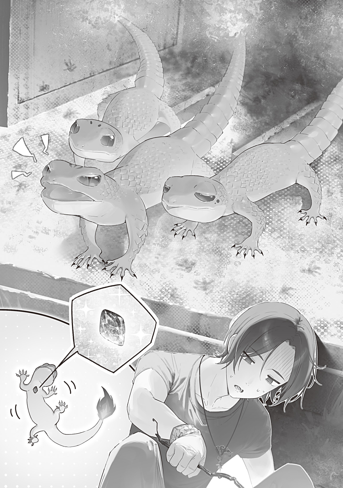

【火蜥蜴[とかげ]】

納屋で育てていた稲の苗も背が伸びてきて、そろそろ晩春の頃を迎える。

毎日温度計をチェックして気温の上がり方を予測し、俺は今日こそが今年の田植えのベストタイミングだと判断した。

天気予報があればそれを参考に農業の予定を立てられるのだが、天気予報復活を主導していた八王子[はちおうじ]の魔女がパンデミックで死んでしまい、計画は宙に浮いている。

他の魔女が計画を引き継ぐのか、完全に民間に引き継ぐのか、まだ決まっていない。魔法大学がやれよ、という声もあったが、大[おお]日向[ひなた]教授はそれより魔法大学以外の教育＆研究機関復活を推した。

まともな学府が一つしかない現状は歪[いびつ]だ。学びと研究の裾野は広げれば広げるほど良い。

せめて小学校教育は再開できないと、遠からず字の読み書きや足し算引き算すらできない大人で溢[あふ]れ返る事になる。

グレムリン災害から四年以上が経[た]ち、未[いま]だ義務教育は停止している。各家庭の教育に任せるか、有志の教員が青空教室を開いているに留[とど]まっているのが現状だ。

キノコパンデミックさえ無ければ今年の夏には学校が再開される見込みだったのに、計画は破綻した。

せっかく順調だった復興の足を引っ張ったキノコパンデミックの爪痕は深い。

とはいえ全て俺にはどうしようもない話だ。

俺には俺のできる事、具体的には杖[つえ]作りと毎日の狩猟農耕生活をするまで。

春風が心地いい労働日和の中、俺は興味を示した青の魔女と一緒に田植えをした。最初は黒コートの裾をまくり上げおっかなびっくり泥濘[ぬかるみ]に足を踏み入れていた青の魔女だったが、すぐに慣れて俺より手際よく植え付けをしていた。

やっぱり魔女は馬力が違いますよ。ちょっと植え方が汚いのは器用さの違いとして見逃してやる。

昼前に田植えが終わり、畦[あぜ]に敷いたござに二人で腰かけおにぎりを頬張[ほおば]る。

青の魔女は塩おにぎりを頬張りながらヤカンの下に手を当て呪文を唱えた。

「むぐむぐ……焔よ[ジン・ガ]」

火が吹きあがり、すぐにヤカンが白い水蒸気を噴き出しピーッと音を鳴らす。

ティーバッグを入れた湯呑[ゆのみ]に熱湯を注いでもらった俺は、少ししんみりした。

この便利魔法を世に広めた継火は封印中だ。良い奴[やつ]だったのに。

……良い奴だったか？

……いや、良い奴だったな。高レベルのムッツリスケベだったけど。

継火の魔女の変態な生態を思い起こしていた俺は、封印前に放火ックスされた廃屋をまだ片付けていない事を思い出した。秘伝のタレだの自己血鞣[じこけつなめ]しだの魔工具だのに夢中になってすっかり忘れていた。

焼け落ちて灰と炭の山と化した焼け跡は、放置していると出火の温床になる。

落ちているガラスが偶然レンズになって太陽の光で炭に着火してしまったり、そういう事は有り得る話だ。

今日の午後は焼け跡の片付けにあてよう。

俺はおむすびを包んでいた笹[ささ]の葉を片手で笹舟にして水田に浮かべ、立ち上がった。

「ごちそうさまでした。午後はどうする？」

「んー。大利[おおり]の予定は？」

「焼け跡の片付けする。ほら、お前が継火と……その……アレした廃屋だ」

「そんなに言[い]い淀[よど]む事か？　そうだな、今日は予定もない。少し手伝ってから帰ろうかな」

「助かる。じゃ、行くか。ヤカンはそこに置いといてくれ。帰る時に回収しよう」

俺達は連れ立ってぶらぶら放火跡地へ向かった。

奥多摩[おくたま]は四年間ほとんど人の手が入らず放置されている。が、案外自然の侵食は深刻ではなかった。割と場所による。

山際の家は壁に蔦[つた]が這[は]っていたり、土砂崩れに巻き込まれ半分埋もれていたり、野生動物の住処[すみか]と化し糞尿[ふんによう]臭くなっていたりするのだが、比較的家が密集している役場のあたりはコンクリート道路に囲まれ劣化や風化が軽い。

それでもコンクリートの亀裂から雑草が顔を出しているし、割れている窓ガラスも多いのだが。沈黙した信号機に器用に小鳥が（小鳥の魔物が？）巣をかけ、下の道路が白いフンまみれになっていたりもする。

グレムリン災害からたかが四年、されど四年。

人が作り出した物は野生の圧力を受け消えていき、少しずつ自然に還[かえ]っていくのだろう。

到着した放火跡地は見事に焼け落ちていた。灰と炭の山から黒焦げの梁[はり]が斜めに突き出し、冷蔵庫や電子レンジ、洗濯機といった家電が焼け残り黒焦げ煤[すす]まみれになって転がっている。

俺は近くの畑の納屋からスコップを二本持ってきて、一本を青の魔女に投げ渡した。

「灰と炭を一カ所にまとめて、ザッと土をかける感じで頼む。大きいのはどかして」

「灰は肥料にするんじゃないのか？」

「いやビニールとかガラス片とか、あと畑に入れちゃいけない化学物質も混ざってると思うし」

「それもそうか。大利、転んで怪我[けが]したりするなよ」

「アイアイ、マム」

二人で手分けして、焼け跡の片付けを始める。俺が灰をスコップでかき集めている間に、青の魔女は家電の残骸を踏んづけて凹[へこ]ませ、丸めて小さくして積み上げていた。ハイパワーにもほどがある。流石[さすが]人型重機。

しばらく頬を灰で汚しながら焼け跡の片付けをしていたのだが、青の魔女の驚きの声が聞こえスコップを動かす手を止めた。

「なんだ、どうしたー？」

「いや、魔物がいた。大利、こっちに来るなよ。今始末する」

「魔物？　……あっ待て待て待ていったん待て！　殺すの待った！」

俺はハッと気づき、スコップを放り投げ慌てて青の魔女を止めに走った。

この状況を全く考えなかったわけではない。

魔女とは、魔物の力を持つ魔物女だ。人から変異した存在ではあれ、性質としては魔物に近い。

パンデミックキノコや花の魔女は単為生殖をする。ならば、女同士、魔物に近い生き物である魔女同士の放火ックスでマジで子供ができるのも考えられない事ではなかった。

魔女を魔物として見ると種族が全然違うだろうから（なにしろ火と氷だ）、可能性は無いに等しいとは思っていたが。

この焼け跡に魔物がいたなら、それはたぶんお前が認知してない実子なんだぞ、青の魔女！　殺してはいけない！

俺が大急ぎで止めに入ると、青の魔女は非難がましく言った。

「おいだからこっちに来るな。危ないだろう」

「いや気になって。どこ？　どいつ？」

青の魔女は溜息[ためいき]を吐き、俺が前に出すぎないよう手で制しながら、横倒しになりドアをパッカリ開いた冷蔵庫の中を指さした。

そこには三匹の魔物がいた。

そいつらは人差し指一本分ぐらいの大きさの小さな蜥蜴[とかげ]で、冷蔵庫の中に作った巣の中で身を寄せ合い、俺達にしきりにミーミーと鳴き声を上げ威嚇している。

体色は焔[ほのお]のような鮮烈な赤。そして、尻尾の先には小さな火が灯[とも]っていた。

火蜥蜴[サラマンダー]だ。

う、うーん。人型の火妖精の子供がこういう感じになるものなのか？

継火の魔女とはまったく無関係で、たまたまトカゲから変異した魔物がここに巣を作っただけのような気もする。もう少し調べてみるか。

焼け残った金属棒を拾い、棒の先で火蜥蜴の一匹をつついてひっくり返す。

胸元あたりに青の魔女の固有色によく似た青いグレムリンがくっついていた。

アッ……これは間違いなく二人の愛の結晶ですわ。

詳しい原理は分からんが、二種族の雑種だから蜥蜴になったのか？　全体の色合いとしてはママ似だけど、グレムリンはママ似なんだな（？）。

俺につつかれひっくり返った火蜥蜴はジタバタ暴れ、それを見た二匹の火蜥蜴が怒って金属棒に火を噴いてくる。

俺は青の魔女に襟首を掴[つか]まれ、強制的に後ろに下げさせられた。

「バカ、だから言っただろう！　火傷[やけど]してないか？　凍る[ドウ・]────」

「わー待て待て待て……！」

またしても火蜥蜴を殺そうとする青の魔女に後ろから組みつき、口を手で覆って詠唱を止める。

青の魔女はモゴモゴ言った後、力を抜いて俺の手を軽く叩[たた]いた。

手を離すと、深い溜息を吐いて聞いてくる。

「この魔物がそんなに気に入ったのか？　魔物だぞ。殺せる時に殺した方がいい」

「いやっ……そのー、気に入ったというか……殺すのはやめといた方がいいんじゃないかなーと」

「なぜだ」

「なぜって……」

俺は返事に窮した。

その魔物はね、継火の魔女がお前の無知につけこんでこさえた二人の子供だからですよ。

なんて言えるはずもなく。

継火お前、封印される前にこんな爆弾残していくんじゃねぇよ！

バカ！　本当にバカ！　変態！

いや封印前に憧れのお姉さんとえっちな事したいという邪[よこしま]な欲望を炸裂[さくれつ]させただけで、まさか本当に子供ができるなんて思ってなかったんだろうけどな？

そのせいで俺が困ってんだよ！

「かっ、可愛[かわい]いし、無害そうだし。見逃してやっても」

「はあ？　何を言っている？　可愛い、まあ、可愛くはあるが、火を吐いたんだぞ？　無害とはほど遠い」

「いやそんなでも……危険度的には乙の下か丙の上の方じゃないか」

俺は尻ポケットから東京魔法大学魔物学科発行の魔物脅威度早見表（第３版）を出し、まだミーミー鳴いて俺達を威嚇している火蜥蜴の分類を調べた。

甲１類……魔女一人では倒せない。魔女集会への連絡と緊急事態宣言が必要。

（大怪獣）

甲２類……魔女でも苦戦する。相性の良い魔女か、強い魔女が必要。

（グレムリンを複数個持ち、複数種類の魔法を操るもの）

甲３類……魔女の出動が必要。魔女ならば問題なく倒せる。

（道具の使用など知的行動をとるもの、家より大きなもの）

乙１類……魔術師部隊がマモノバサミ、特異的魔法杖などを活用すれば倒せる。

（三種類以上の生物の混合型、人の特徴を持つもの）

乙２類……魔術師部隊ならば倒せる。

（特異個体を中心に群れを作るもの、殺傷力のある遠距離魔法を使うもの）

乙３類……戦闘訓練を受けた精鋭魔術師ならば倒せる。

（二種類の生物の混合型、幽霊やスライムなど本来地球に存在しないもの）

丙１類……魔術師、あるいは戦闘能力に長[た]け武装した者なら倒せる。

（変異体の中でも異形化が明確に分かるもの）

丙２類……必要に応じて人間を襲う。一般人は逃亡推奨。武装すれば倒せる。

（猫や蜘蛛[くも]など肉食動物の変異体）

丙３類……弱った人間や幼い子供を襲う事がある。

（鴉[からす]や鼠[ねずみ]など雑食動物の変異体）

丙４類……人間を見ると逃げていく。無害。

（兎[うさぎ]や鹿など草食動物の変異体）

※例外あり！　判断に困ったり違和感を感じたりしたらすぐ逃げ、警備隊を呼ぶ事！

「……丙４だな！　俺達見て怯[おび]えてるし。はい無害」

「三匹で群れているし、火を吐いた。乙２だろう」

「いやいや。見ろこの金属棒。火を吐かれたっつってもカワイイもんだ。表面を炙[あぶ]られたぐらいで火力なんて全然……いやちょっと融解してるな」

拾った時はススがついている程度だった金属棒は、火を噴きつけられた部分がちょっと融[と]けて歪[ゆが]んでいた。

おいおい火力バカたけーわ。こんなちっちぇクセに。

せっかく死刑を阻止しようと弁護してるのに、処刑人の有利になる証拠を提出するのやめてくれます？

「…………」

「無言でキュアノス構えるな。逆に考えよう。火力が高いのは良い事だ。な？　上手[うま]く躾[しつ]けりゃ燃料問題解決するぞ」

「不可能だ。魔物学科が魔物の躾[しつけ]を試しているが、全て失敗している」

「いや北海道魔獣農場ってコミュニティあるらしいじゃん？　名前からしてなんか飼育方法あるんだろ」

「火の魔物は火災の元になる。カタログスペックの脅威度以上の被害を出しかねない」

「それはそうだけどさぁ。でもさあ」

俺は小一時間青の魔女と押し問答をした末に、なんとか執行猶予をもぎ取る事に成功した。

火蜥蜴は冷蔵庫の中に金属を集め、融かして巣を作っていた。融けた金属の中には鉄製の中華鍋も混ざっていて、鉄をも融かす高火力を出せる事が窺[うかが]える。

口の周りに黒い炭のカスがついていたから、食べ物は炭なのだろう。

炭の火力で鉄を融かすのは難しい。炭を食べて鉄を融かす火力に変えてくれる変換生物と考えれば、この火蜥蜴は貴重で重要な生き物と言える。

上手く躾ければ炭焼きや石炭仕入れの手間から解放される。

俺の主張を聞いた青の魔女は、巣に近づかない事を条件に渋々帰っていった。

ただ、毎日様子を見に来て、凶暴化や食性の変化（肉食への変化）などが見られたら即処分するという事になった。

ふぃー、あぶねぇ。ひとまずセーフ。

庇[かば]う理由を伏せたまま子殺しを回避した自分を褒めてやりたい。

でも後で「継火の魔女の封印が解かれる日が来たら、青の魔女に土下座して足舐[な]めて許しを乞わせるように」という封書を火継の魔女に送っておこう。変態のせいで大変だよこっちは。

しかし急場は凌[しの]いだが、まだ青の魔女の火蜥蜴への殺意は高い。何か安全対策が必要だ。

実際、火蜥蜴がお散歩して市街地に出張し、火をつけて回りはじめる事も有り得る。

洒落[しやれ]にならない。何しろ親が放火癖持ちだ。

青の魔女は気付いていなかったし、俺もわざわざ言わなかったが、あの火蜥蜴たちは生まれたばかりの幼体だ。これから成長していくだろう。

人差し指ぐらいの大きさでアレなのだから、成長して大きくなったらどうなってしまう事か。

困った俺は家中の本棚からファンタジー図鑑とファンタジー漫画を引っ張り出し、何か飼育のヒントは無いか探した。後で魔物学科に大日向教授づてで手紙を出すが、自分で調べておくに越した事はない。

青の魔女もキノコ図鑑からキノコ病のメカニズムのヒントを得たと言っていたし、こういう調査はなかなかバカにできない。

夜更かしして資料（と呼べるか怪しい代物）をあたった俺は、特に飼育のヒントは得られなかったが、人型の火妖精から火蜥蜴が生まれた理由に仮説を立てられた。

もしかしたら継火の魔女の種族は完全変態生物なのかも知れない。

ここでいう変態は、性癖的な意味の変態ではなく、昆虫の変身的な意味の変態だ。

ファンタジーに登場する妖精はしばしば昆虫になぞらえられる。

花畑を飛び回る幻想的な妖精はまるで蝶[ちよう]のようであり、蝶が芋虫から蛹[さなぎ]、蛹から成虫に変わるのと同じく変貌を遂げる場合がある。

妖精が登場する12作品の漫画のうち、４作品でそういう描写がされていたし、ファンタジー図鑑にもコラムとして書かれていた。

こういった「幼虫から成虫になる時、蛹を経由して様変わりする」生態を完全変態と呼ぶ。

継火の魔女は老衰していっていたから、もちろん成体だったのだろう。

その継火の魔女から生まれたばかりの火蜥蜴は、もちろん幼体だ。

親子で姿が全く違うのも、完全変態生物だと仮定すれば納得がいく。

きっと火蜥蜴は成長の過程のどこかで蛹のような姿になり、羽化して人型の火妖精になるのだ。

まあ全て怪しげな資料に基づく想像であり、単純に青の魔女という異種族との間にできた雑種だから、混血バグを起こしてワケわからん姿になっただけの可能性も十分あるのだが。

あの青の魔女と無知シチュ放火ックスをするという蛮行に及んだ変態が完全変態だった可能性があるというだけでちょっとオモロい。やっぱり変態じゃねぇか。

徹夜調査をしたせいで朝になってしまったので、朝靄[あさもや]の中再び放火現場へ赴く。

青の魔女には近づくなと言われていたが、様子が心配だ。

三匹の火蜥蜴たちは焼け跡をチョロチョロ動き回り灰の中で転げ回りじゃれ合ったり、炭を小さな口いっぱいに頬張っていたりした。元気いっぱいだ。

距離をとって見守る俺の姿に気付くと動きを止め、しばらく彫像のようにジッとしていたが、俺が何もせずにいるとゆっくり動き始め、すぐにまた元気にチョロチョロし始めた。

可愛い。この生き物飼いてぇ～。

継火と青の魔女の子供という事実をいったん頭の隅に追いやって考えてみれば、実際、コイツらは有用だ。

ぜひウチの反射炉の中に住んで火力係をやってもらいたい。餌の炭ぐらいいくらでも食わせてやるから。それぐらい鉄を融かす高火力は魅力的だ。

そして何よりも火の魔物が住んでいる工房の炉ってめちゃカッコイイ。全俺がスタンディングオベーションのかっこよさだ。伝説の工房みが深いぞ。

しかし全ては絵に描いた餅。

魔物は人に懐かない。飼う事は不可能だ。

むしろ火災の原因となる事を考えれば、青の魔女が言う通り処分した方がいい。

でも継火の魔女と青の魔女の子供だし、処分するなんてあんまりだ。

あと可愛いし、有能だし……いつか人型に羽化するかも知れないという危険性を度外視すればペットにピッタリだ。

この三匹の火蜥蜴を飼いたいが、飼えない。

さてどうしたものやら。
