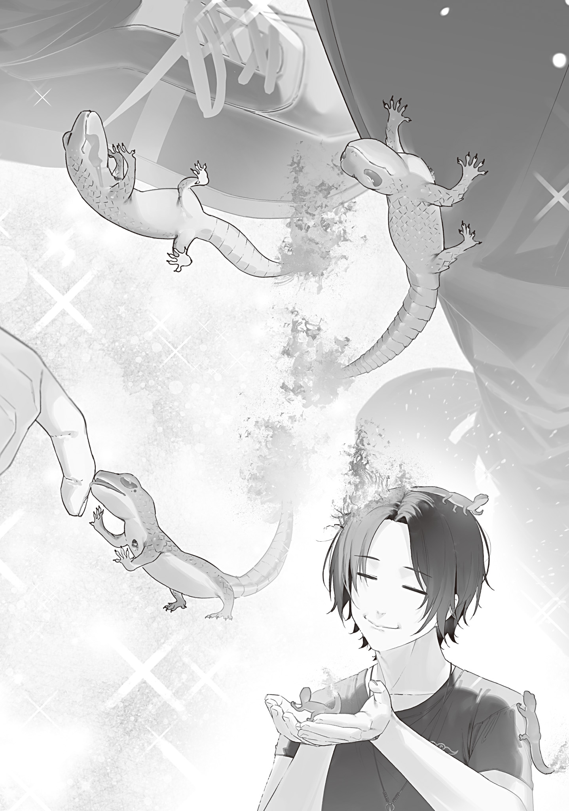

【北海道魔獣農場の秘伝】

それは渡りに船と呼ぶにはいささか遅いタイミングだった。

しかし東北狩猟組合から遅れる事二カ月で届けられた北海道魔獣農場の災害復興支援は、放火ックス犯が残していった火蜥蜴[とかげ]問題のクリティカルな解決手段になりそうだった。

事の経緯は少し複雑だ。

話によれば、北海道の大規模生存者コミュニティ「北海道魔獣農場」もキノコパンデミックにボコられた東京を支援したい気持ちはずっとあったらしい。

が、そう簡単にはいかない。

北海道魔獣農場は三年ほど前から沿岸部を我が物顔で支配する海の魔物、通称クラーケンに悩まされていた。

クラーケンのせいで北海道の海の幸は入手難易度爆上がり。船は全て沈められ、養殖場は破壊され、沿岸部におちおち家も建てられない有様だった。

クラーケンはイカとタコを合体させ巨大にしたような姿のかなり強力な魔物で、魔物学科分類でいうところの甲２類。しかも負傷したり危機を感じたりすると素早く海底へ逃亡する抜群の逃げ足を持ち、何度も北海道魔獣農場の魔女・魔法使い合同討伐作戦から逃れてきた。

いくら東京魔女集会がキノコパンデミックの後遺症に苦しんでいると言っても、それは北海道魔獣農場も同じ事だ。何しろ重要なポジションにいた魔女が一人、パンデミックで亡くなっている。支援を貰[もら]いたいのはむしろ魔獣農場の方である。

だから東京への復興支援はクラーケン討伐と交換条件になった。

クラーケンを倒してもらうぐらいのメリットがないと北海道魔獣農場としては魔女集会への支援を承諾できない。支援してもらうために支援しなければならないというのは妙な話だが、流石[さすが]に仕方ない。どこも大変なのだ。

そこで白羽の矢が立ったのが東京魔女集会所属の人魚の魔女だ。

人魚の魔女は知能が低下し人間の言葉を喋[しやべ]れないが、海中で無類の強さを誇る。一度獲物を定めれば、超深海層まで追いかけ仕留[しと]めるだけの能力があった。クラーケン討伐役としてこれ以上の適任はいない。

問題はイルカ並の知能だ。

動物として考えれば十分賢いのだが、北海道のクラーケンを倒しに行って欲しい、という要望を伝えるのは難しい。

お願いに熱心に耳を傾け笑顔で頷[うなず]き、伝わったかと思えばクラーケン似のダイオウイカを狩ってきて誇らしげに埠頭[ふとう]にポイッと投げてきた事があるぐらいだ。

だが、先日ついに意思疎通が成立した人魚の魔女は笑顔で頷き、東京湾から丸一日姿を消した。

そして何食わぬ顔で戻ってきた数日後、海路で北海道魔獣農場の使者がクラーケン討伐感謝状と事前の取り決め通りの支援物資を帆船に乗せやってきたのだ。

支援物資内容もリストアップして書類に全て書かれていたので、俺は確かにこれは簡単に贈れるものではないと納得がいった。

支援内容は家畜化した魔物。

つまり北海道魔獣農場が言う所の「魔獣」だ。

魔獣は３種類、合計60匹。長期的に繁殖させられるだけの数の若いつがいが揃[そろ]えられている。

また、飼育に必要な技術も詳細に解説され、必要な道具と餌も最低量ではあるが付属している。

要は東京の魔獣畜産スターターキットだ。

北海道魔獣農場も決して大量の魔獣を飼育できているわけではない。今まさに繁殖を推進し数を増やしている真っ最中で、東京に送った60匹はかなり身を削った数だ。

だが、豊穣[ほうじよう]魔法とクラーケン討伐の借りを考えれば、十分贈呈に値するとの判断が下った。

贈られた60匹の魔獣は現在魔女集会主導で厩舎[きゆうしや]や牧場の割り振りが行われている。俺の手元にあるのは資料だけで、魔獣は全て魔女集会の管理下だ。

北海道産の魔獣たちには興味があるが、今俺は火蜥蜴問題で手一杯。むしろ重要なのは手元に転がり込んできた魔物の馴致[じゆんち]（飼い慣らし）ノウハウだ。

遥[はる]か北の地で練り上げられた魔物の家畜化テクニックを応用すれば、一向に俺に懐かず火を吐いてはミーミー鳴いて威嚇してくる火蜥蜴たちも手なづけられるのではなかろうか？　かなり期待が持てる。

資料に記された貴重な情報を熟読したところによると、魔物畜産の基本はまず家畜化条件を満たす魔物を見つけるところから始まるという。

一つ目は飼料。大喰[ぐ]らいだったり、入手困難な餌を必要とする魔物は家畜化に向かない。

二つ目が成長速度。生まれてから食肉や毛皮を採れるようになるまでに二十年、三十年もかかる魔物は家畜化に向かない。

三つ目が繁殖力。繁殖のために広大な縄張りが必要だったり、異常な繁殖行動をとるもの（それこそ放火とか）は扱いにくく家畜化に向かない。

四つ目が気性。人を食べる魔物や、好戦的な魔物は当然ながら家畜化に向かない。

最後の五つ目が序列制のある群れを作る事。人間が飼育する場合、人間が魔物の群れのリーダーになる事で指示を聞かせ、飼育が可能となる。逆にリーダーが存在しない群れを作るタイプの魔物は家畜化に向かない。

書いてある事はいちいちもっともで、俺の火蜥蜴飼育計画の参考にもなった。

一つ目の飼料問題はクリア。奴[やつ]らは少量の炭を食べ、餌には困らない。

二つ目の成長速度は不明だが、別に早く育つ必要はないし、むしろ人型に羽化する危険性を考えると成長が遅い方がいい。

三つ目の繁殖力はむしろ畜産の基本の逆をいく。増えるな、お前らは。

四つ目の気性は特別大人しくはないが、荒くもない。仲間を虐[いじ]められれば怒り、自分よりデカい生き物には警戒する。生物として割と当たり前の気性だ。

最後の序列だが、これは一応あるらしい。三匹の火蜥蜴の中でも一回り大きな発育のいい奴が、三匹の先頭を切ってチョロチョロ駆け回る事が多いからだ。

トータル評価は「家畜化には問題あるけど、ペットとしては飼えそう」という感触だ。

資料には五つの家畜化条件を満たした魔物について、家畜化への次のステップが記されている。

同種の魔物を複数体捕獲し、そのうち一体からグレムリンを摘出し、飼育係の体に埋め込むのである。

埋め込まれたグレムリンが体に馴染[なじ]むと、同じグレムリンを持つ魔物たちは飼育係を同種だと認識するようになる。

こうしてグレムリンを埋め込み魔物の群れに溶け込んだ飼育係を魔獣使いと呼ぶ。

ちょっとグロい改造手術だが、恩恵はめちゃくちゃデカい。

同種と縄張り争いをしたり、傷つけあったりする種族でもない限り、まず襲われる事はなくなる。

適切に接すれば群れのリーダーの地位に立ち、群れの魔物を従わせられる。そうすれば家畜化成功で、この家畜化成功をもってコントロール可能になった魔物は魔獣と呼ばれるようになる。

だが、この改造手術は簡単ではない。

人間の体にグレムリンを埋め込むのにはリスクを伴う。

まずはアレルギー反応だ。

グレムリンを体に埋め込むと魔法的なアレルギーのような症状を出す人がいる。

魔力が回復しなくなったり、魔法が必ず暴走するようになったり、呪文を唱えても魔法が発動しなくなったりだ。

単純に体が異物を受け付けず、埋め込んだあたりの皮膚が爛[ただ]れたり、ズキズキ痛んだり、膿[う]んだりする事もある。

こういったアレルギー体質の人は魔獣使いに向かない。

ありがたい事に、アレルギー体質は事前に検査する手法が確立されている。

埋め込み予定のグレムリンを、埋め込み予定の人の血液に12時間程度沈めておくのだ。

アレルギーがある場合は凝血反応が起き、血中成分が固まって沈殿する。沈殿しなかったらアレルギーは無い。

資料に書かれたアレルギー検査の図を見る限り、かなり分かりやすくハッキリと塊を作って沈殿するようだ。見間違える事はない。

しかしアレルギー問題をクリアしても、グレムリンの体内埋め込みには代償が伴う。

魔力保有量の恒久的喪失だ。

埋め込まれたグレムリンは約１週間かけて体に馴染んでいく。この間、微熱を伴いながら徐々に魔力保有量を喪失していく。

この時に喪失した魔力保有量は、たとえ体に馴染んだグレムリンを抉[えぐ]り出[だ]しても戻らない。

喪失する魔力保有量は、埋め込んだグレムリンを持っていた魔物の魔力保有量と同値だ。

だから強大な魔力を持つ強大な魔物のグレムリンを埋め込めるのはほぼ魔女か魔法使いに限られる。

魔力の完全喪失と引き換えにすれば一般人でも強大な魔物のグレムリンを埋め込めるのでは？（自分よりも遥かに強い魔物を使役できるのでは？）と思ったが、そうは問屋が卸さない。

魔力保有量の恒久的喪失は、不可逆の死をもたらす。

グレムリン埋め込みによって魔力を完全に喪失し、魔力を全く持っていない魔力保有量ゼロの状態になると、塵[ちり]になって虚空に溶け消えてしまうのだ。

死体も残らない。完全にこの世から消える。

不可逆の死である。

資料には大[おお]日向[ひなた]教授の字で脚注として「魔法的死？」と書かれていた。

以前、聞いた事がある。

魔法には脳死や心停止の他に魔法的死の概念があると。

大日向教授は魔法的死を「魔力を喪失し二度と魔法を使えなくなった状態」と捉えていたが、その捉え方は間違ってはいないが正確でもなかった。そりゃあ塵になってこの世から消えれば二度と魔法も使えないに決まっている。

塵になってこの世から消えない限り蘇生[そせい]手段がありそうなところに魔法の奥深い可能性が垣間見[かいまみ]えるが、蘇生魔法の実在が確認されていない現状、脳死も心停止も魔法的死も全部一緒だ。死は死である。恐ろしい話だ。

グレムリンを埋め込むのはどこでもよく、通常は手の甲から上腕部にかけてのどこかに埋め込まれる。埋め込んだグレムリンは魔法の発動媒体としても機能するから、扱いやすい身体部位に埋め込んだ方がいい。

そうしてリスクを背負い苦労してグレムリンを埋め込んでも、それは魔物の家畜化────魔獣化のスタートラインに立ったに過ぎない事に重々注意が必要だ。

グレムリンを埋め込めば、魔物に自分達と同種だと認識させる事ができる。

だがそれだけだ。

人間で考えると分かりやすい。街中ですれ違った人間に好意を抱くだろうか？　見知らぬ他人に従おうと思うだろうか？　信用して身の安全を、生活を任せようと思うだろうか？

そんなワケがない。

グレムリンを埋め込んだ後は対象の魔物と親密な関係あるいは上下関係を築くための努力やノウハウが必須になる。

書類には北海道魔獣農場が贈ってきた三種の魔獣の飼育ノウハウ、つまり上下関係の作り方、躾[しつ]け方、厩舎の環境の整え方、好む餌や気温湿度風通しなどが微に入り細を穿[うが]ち書類の束の半分以上を使って記されていた。

これほどの情報を収集するまでにどれほどの苦労があった事か。

豊穣魔法とクラーケン討伐の借りがあるとはいえ、よくこの苦労の結晶を分ける気になったものだ。

だって絶対にこの資料が出来上がるまでに何十人か、いや何百人か死んでるもんな。

魔法的死の原理を把握するまでいったいどれだけの人が塵になったのか。

アレルギーでどれだけの人が苦しんだか。

調教失敗でどれだけの人が魔物に殺されたのか。

それを思うと書類の束がズッシリ重く感じた。

この紙束は命でできている。ありがたくも恐ろしい。

田舎でのんびり趣味の杖[つえ]作りしてるだけの単なる天才杖職人の俺が、ちゃっかりおこぼれに与[あずか]っちゃっていいのかなあ？　と流石に少し気が引けたが、資料の最後に「融解再凝固グレムリン着色技法を用いた埋め込みグレムリン代用が可能でした」と大日向教授の字の付箋が貼られていて安心した。

資料を北海道魔獣農場から受け取ってからまだ三日と経[た]っていないだろうに、爆速で応用研究を一つ済ませてやがる。

確かにわざわざ魔物からグレムリンを抉り出さなくても、魔物から血を抜いて固有色グレムリンを作れば代用できそうだ。そして、実際に代用は可能だったらしい。

俺の開発した技術が北海道魔獣農場側の技術を更に発展させられたなら、俺が気後れする必要はどこにもない。

あちらさんも技術を提供したと思ったら技術提供返しをされて腰抜かしてるだろうな。

東京はすごいのだ。

何しろあの試される大地の二つ名を持つ北海道と同じぐらいかそれ以上の試練を乗り越えてきたんだからな。ガハハ！

さて。

北海道魔獣農場の資料は最初から最後まで素晴らしいものだった。

何よりも火蜥蜴の扱いに悩んでいたところに送られてきたのが実にタイムリー。

書類の束にちょこちょこ挟まれた付箋を読む限り、俺の魔力量的にはだいたい乙１類中位の魔物のグレムリン埋め込みまで耐えられるようだ。人類としては相当優秀で、甲３類以上が事実上の魔女・魔法使い専用だと考えればこれ以上は望むべくもない。

火蜥蜴は乙２類。しかもまだ生まれて間もない幼体だ。誤差を大きく見積もっても乙１類の下位程度だろうし、火蜥蜴のグレムリン埋め込みで俺が塵になる事はない。

つまり俺には火蜥蜴の飼育資格があるッ！

魔物が成長に応じて魔力量を増加させるのかは知らないが、減る事はないだろう。早いうちに血を採取して火蜥蜴の固有色グレムリンを作り、埋め込んでしまった方がいい。

思い立ったが吉日。

俺は夜まで待ち、さっそく火蜥蜴の巣を訪ねた。

柔らかな月明かりの下、冷蔵庫の中に作られた金属の巣の真ん中で、三匹の火蜥蜴は仲良く身を寄せ合い丸くなってスヤスヤ寝ている。おやおや、鼻提灯[ちようちん]なんて膨らませちゃってまあ。

可愛[かわい]い。写真が撮れたら撮ったのに……

しかし今日持ってきたのは写真機ではなく注射器。

無痛採血をしてやりたいが、火蜥蜴の体の構造は分からん。ちょっと痛くしてしまうが我慢してもらいたい。

俺は音を消して巣に忍び寄り、鱗[うろこ]の隙間にそっと注射針を差し込んだ。

「ミ゙ッ!?」

急に注射を刺された火蜥蜴は飛び上がって驚く。

俺は素早く極少量の血を抜き、寝起きで混乱している火蜥蜴が状況を把握する前にスタコラサッサと逃げた。

すまーん！　でも昼日中に採血しようとしてもお前ら絶対火ぃ吹くじゃん？　奇襲しかなかったんだ。許されよ。

火蜥蜴が追ってきていない事を何度も振り返って確かめつつ家に戻り、俺は反射炉を稼働し火蜥蜴の血を混ぜた固有色グレムリンを作った。

出来上がった親指の爪サイズの楕円形[だえんけい]グレムリンは、火蜥蜴と同じ、青の魔女の固有色によく似た青色だ。

あとはコイツを体のどこにでもいいから埋め込み一週間馴染ませれば、火蜥蜴に同族と思われ、飼育チャレンジの権利が得られる。

上手[うま]く躾けて炉や窯に住まわせられれば、晴れて魔法生物の火で魔法のアイテムを鍛える伝説的魔法工房の出来上がりだ。めちゃカッコイイ！

ちゃんと躾けて飼育できると証明できれば、青の魔女もまさか殺そうとはしないだろう。

万事丸く収まる。

しかし……

俺は工房の一角ですっかり埋め込みセルフ手術の準備を整えた。アレルギー検査も済ませたが、いざ執刀しようとしても躊躇[ためら]ってしまった。どうにも踏ん切りがつかない。

だってさあ。これ埋め込むと魔力量が減るんだぜ？

それもちょっと減るどころじゃない。かなりガッツリ減る事が予測される。

ウサギの変異体やタヌキの変異体のグレムリンとはワケが違う。コレは乙２類のグレムリン。しかも誕生の経緯にさえ目を瞑[つぶ]れば、魔女と魔女の間に生まれたスーパーハイブリッドの血から製造したものだ。

このグレムリン、本当に埋め込んで大丈夫か……？　アイツら乙２類じゃ済まない気がしてきた。

埋め込んだ途端に魔力保有量があっという間にゼロになって塵になったらどうしよう。

塵にならなくても、魔力量がガクッと減り、魔術師としての実力は大幅に低下する。

俺は魔法杖職人だ。魔術師としての自分にプライドは無い。

でも弱体化は嫌だ。いや代わりに魔獣使いルートが拓[ひら]けるけど……でも……うーん……

土壇場で怖気[おじけ]づいた俺はしばらく考え込み、いったん保留にして火継の魔女宛に手紙を書いた。

「封印機構に不具合があるかも知れない」という名目で、継火が封印されている火守乃杖[ひもりのつえ]を一度メンテナンスに出してもらうよう頼んだのだ。

火蜥蜴の誕生に一番責任を持つべきなのは継火だ。封印して早々に起こして悪いが、アイツに責任を取らせるのが一番丸い。

同種族（？）でありママでもある継火なら、わざわざグレムリンを体内に埋め込まなくても躾けられそうだし。

ところが、翌日すぐに火継の魔女から返ってきた返信には「お姉ちゃんが心配なので、メンテナンスに付き添います」と書かれていた。

た、確かに～！　それはそうなる……！

断りたい。

火継は来るな、継火の杖だけこっちに寄[よ]こせと言いたい。

だがそんな要求は絶対通らない。

死にかけの家族がコールドスリープしていて、コールドスリープ装置の開発者が「機械バグってるかも」とか言い出したら心配で心配で仕方ないに決まっている。

この付き添い希望は断れない。断ったらあまりにも怪しい。

というか手紙の配達をした青の魔女が既に「大利[おおり]がこういうミスをするなんて珍しいな」と言ってちょっと怪しんでいる。しくじった。

いっそ全てを青の魔女と火継の魔女に明かし、継火の封印を一時的に解き、関係者三人に火蜥蜴問題をぶん投げてしまいたい。

しかし「お前らの無知放火ックスでできた実子だ。認知しろ」「あなたの姉が性欲に負けて青の魔女を騙[だま]して作った子供です」なんて口が裂けても言えない。どんな修羅場が起きるか想像するのも恐ろしい。

その修羅場を蚊帳の外から眺めようとしても、俺は青の魔女と仲良くなりすぎた。他人事[ひとごと]ではいられない。

俺は「勘違いだった。メンテナンスしなくて大丈夫」という手紙を再度火継の魔女に送り、覚悟を決めてグレムリンを左手の甲に埋め込んだ。

一週間、俺は軽い風邪をひいたような微熱を出し、ベッドの上で大人しく安静にした。

青の魔女が看病をしようとしてきたが、安静にすべき時なのにアレコレ話しかけてきたり、部屋をウロチョロされたり、傍[そば]に座って存在感を出されたりすると、微熱のせいもあってイライラする。普通に追い出した。

普通の感性してる奴らが看病を求めるのは知っている。友達が病気になったら心配するし看病する。

だが、俺の看病はしないで欲しい。こちとらコミュ障なんでね。

一週間経つと、書類に記されていた通り微熱は引いた。

これで俺は火蜥蜴に同族認知されるようになっているはずだ。

あんまり変わった感じはしない。手の甲に埋まったグレムリンがまるでデカめのかさぶたのように感じられ、ムズムズするぐらいだ。

そして、一週間ぶりに火蜥蜴に会いに行く。

一週間前と変わらず焼け跡をチョロチョロ走り回っていた三匹の火蜥蜴は、俺を見るとピタリと動きを止めた。

しかし以前とは違い、火の灯[とも]った尻尾をぶんぶん振り、こっちに走り寄ってきて足元にまとわりつく。

「お、おおお……？」

「ミー」

「ミッ」

「ミミミ！」

火蜥蜴たちは俺の靴紐[くつひも]を咥[くわ]えて引っ張ったり、小さな脚で一生懸命ズボンをよじ登ろうとしてきたりする。口から火の粉を散らし威嚇してきたのが嘘[うそ]のようだ。

な、懐かれた！

めっちゃアッサリ懐かれた！

すげえ。魔物は人間に慣れないという定説が嘘のようだ。

その場にしゃがんで赤い鱗を指でつつくと、ミーミー鳴いてつついた指を舐[な]めてくる。

恐る恐る一匹を手のひらで包んで持ち上げても、全然怒らない。ただ、かなり体温が高く火傷[やけど]しそうだったのですぐ放した。

それさえも俺に仲間意識を持った火蜥蜴にとっては怖いどころか楽しいものだったらしく、残り二匹も持ち上げて欲しそうに俺の手によじ登ろうとしてくる。

はー。仲間意識さえ持たれればめちゃくちゃ人懐っこいんだな。可愛い奴らめ。

よしよし、お兄さんが新しいお家[うち]、新しいお部屋に連れて行ってやるからな。

君たちは今日から大利家の一員だ。継火なんて親と思うな。青の魔女にも渡さないぞ。

餌と住処[すみか]の世話はしてやるから、我が家の炉と窯の主になり、俺の仕事を手伝ってくれたまえ。

