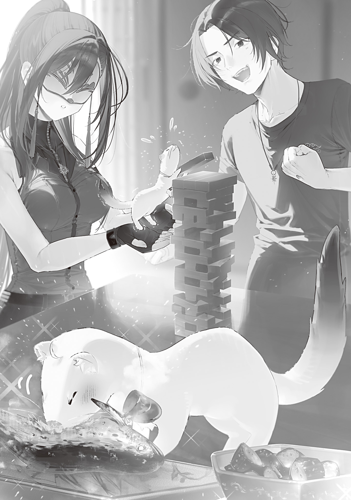

【無名叙事詩仮説】

夏真っ盛りで猛暑日が続く今日この頃。田んぼの稲に穂が出始めた。

これからこの穂の中に実が入り膨らんでいき、秋の豊穣[ほうじよう]に繋[つな]がっていく。重要な時期だ。稲作は春から秋にかけてずっと重要な時期だが、穂がつきはじめると特に気を遣う。

去年は実入りを助ける実肥えをケチり過ぎて軽い籾[もみ]が多かったので、今年は去年より多めに実肥えを撒[ま]く。

化学肥料の新規生産が無い今、効果の高い肥料は貴重だ。グレムリン災害前は確実な収量増を見込んで多めに撒く事ができていた肥料も、量を見極め節約しながら使っていかないといけない。

人糞[じんぷん]や食材クズを発酵させるコンポストで有機肥料生産も試みているのだが、あんまり上手[うま]くいっていない。どうやら一人暮らしの廃棄量だと根本的に量が足りないらしい。

一人分の生活廃棄物を集めて作る堆肥山は小さい。

堆肥山が小さいと、堆肥の発酵の過程で生まれる熱がすぐ逃げてしまい、温度が上がらない。

温度が上がらないと、堆肥の中の菌や寄生虫が死滅しない。

菌や寄生虫が死滅しないと、良い堆肥にならない。

火や熱湯で強制的に温度を上げると今度は殺すべきではない微生物まで殺してしまう。

こういう理屈で一人暮らしの良質堆肥生産は難しかった。

最近は火蜥蜴[とかげ]を加えて一人と三匹暮らしになったものの、アイツら炭が主食でウンチしないからな。排気ガスみたいなゲップを吐くだけだ。

都心部では大量の生活廃棄物が出るので、肥料作りは上手くいっているらしい。肥料を輸入させてもらえばいい話ではあるが、あんまり生活基盤を外部に依存したくなかった。肥料が欲しけりゃアレをやれコレをやれ！　みたいに言われたら困るし。被害妄想だと思うけど。

田んぼの世話をしつつ、断熱材と蒸気圧と火鉢を利用して半自動でコンポスト内の温度を一定に保つ絡繰[からく]り仕掛けの設計に取り組んでいるある日、大[おお]日向[ひなた]教授から手紙が届いた。

内容はいつもの時候の挨拶から始まり都市部の近況、質問への回答などだったのだが「近々そちらへ遊びに行きたい」と書かれていて驚く。

大日向教授は俺が人間が苦手なのをよく理解してくれていて、そのへんの配慮が厚い。それなのにこんな事を言い出すなんて何事かと思ったら、続きに「変身魔法の安定化に成功した」と書かれていた。

なにっ！

そりゃつまり、オコジョモードと獣人モードを自在に行き来できるようになったって事ですかい!?

うおおおお、激熱！

人型ではなく小さくてフワフワで可愛[かわい]らしいオコジョになって訪ねてきてくれるなら、拒否する理由もない。俺はウキウキで熱烈大歓迎の手紙を返した。

手紙配達人の青の魔女も一足先に教授の変身を見ていて、「オコジョの慧[けい]ちゃんも可愛い」と太鼓判を押していたから、なおさら楽しみで仕方ない。

東京魔法大学学長、言語学科教授、更には魔女集会ご意見番として多忙を極める大日向教授だが、上手く日程に都合をつけ、九月の頭に久々に奥多摩[おくたま]を訪れた。

迷いの霧の向こうから青の魔女の足元をてってこ歩いて現れた白いオコジョの姿を見て、思わず笑顔になってしまう。ウェルカム、ようこそ奥多摩パークへ！

「教授、久しぶり」

「お久しぶりです、大利[おおり]さん。またお会いできて嬉[うれ]しいです！」

足元に駆けよってきたオコジョの前にしゃがみ込み、小さな前脚と握手する。

毛艶の良いオコジョボディの胸元には、チェーンの長さを短く調節された御守り[アミユレツト]ロケットペンダントが揺れていた。

なるほどね。急にオコジョに戻ったじゃんか、と思ったが、前々から研究していたらしい。

大日向教授のロケットペンダントは、俺が半年前に贈った御守り[アミユレツト]だ。

父の写真を入れておきたいからロケットペンダント型にして欲しいという要望の他、チェーンの長さを短く調節ができるようにして欲しいという要望もあった。

特に疑問に思わず要望通りにしたのだが、ちゃんと理由があった。チェーンの長さを可変にしたかったのは、人間形態とオコジョ形態で体のサイズが変わってもネックレスをつけていられるように、という意図だったらしい。

「俺はオコジョに戻ってくれて嬉しいんだけどさ、教授はいいのか？」

「いいのか、というのは？」

「教授は人間の姿でいるのが好きなんだろ？　あっ、それともオコジョモードになると特殊能力がつくとか？」

例えば竜の魔女はデフォルトが人型の変身魔法の使い手だが、常にドラゴンに変身しているためそれが二つ名になっている。

ドラゴンは呪文詠唱無しで火を吐けるし、空を飛べるし、強靭[きようじん]な鱗[うろこ]があるし、とにかく強大で便利な数々のパワーを持っている。あと本人の気質とドラゴンの性質がマッチしていてしっくり来るらしい。

オコジョモードにも何か利点があるのかと思ったが、大日向教授は首を横に振った。

「いえ、特殊能力は無いですね。人間の方が体が丈夫ですし、器用ですし、移動も速いです。お腹[なか]減りやすいですし、食べられる物減りますし、抜け毛も多いです」

「メリットないじゃん……」

「メリットならありますよ？」

「どんな」

「こうやって大利さんに会えます」

大日向教授は恥ずかしげもなくニコニコして言った。

ええ……？　それはメリットなのか？

「なんだ、俺の事好きなのかよ」

「はい！　この姿ならお友達になれますか？」

軽口のつもりが元気よくストレートカウンターパンチを返され、流石[さすが]にビビる。

ひええ、陽[よう]キャ怖いよお！　俺と同じ言葉で喋[しやべ]っているはずなのに、言葉の全てから光が迸[ほとばし]っている。恐ろしい。やはり陽の者は理解できない。

「俺と友達になるために、人間とオコジョを自由に変身できるように頑張ったのか……？」

「はい」

「な、なんで？　自分で言うのもなんだけど、俺はそんなに友達になりたいと思うような人間じゃないだろ」

俺が心からの疑問をぶつけると、見守っている青の魔女が失礼にも深々と頷[うなず]いた。

お前後でジェンガでボコるからな。

「うーん。友達になりたいと思った理由は、友達になりたいと思ったからですね」

「は？」

「初めてお会いした時から、仲良くしたいな、お友達になりたいなと思っています。そんなに変な事でしょうか？」

「変だろ」

「慧ちゃんはこういう子だ。大利は慧ちゃんタイプの子に会った事が無いのか？」

俺達の会話が堂々巡りになりそうなのを察してか、青の魔女が口を挟んできた。

聡明[そうめい]なはずの大日向教授があまりに意味不明な事を言うので、第三者の意見を伺う。

「マジで意味分からん。どういう事なんだ」

「理屈はない。要するに、慧ちゃんは社交的なんだよ。それは知っているだろう？　大利のようなどうしようもない奴[やつ]が相手でも友達になりたいと思ってくれるし、そのために頑張ってくれるんだ」

「友達は頑張って努力してなるもんじゃないだろ。気が合うから、自然と仲良くなって、いつの間にか友達になってるのが本物の友達だ。俺とお前みたいに」

「…………。まあ、そういう友達もある。でも慧ちゃんにとって友達はそういうものじゃないんだよ」

「？？？？？」

優しく諭すように言われるが、やはり分からない。

つまりどういう事なんだ？　俺の理解を超えている。

継火の放火ックスから始まった複雑骨折人間関係はちゃんと理解して対処できたのに、大日向教授の考えは理解できない。

頭を抱える俺に、大日向教授はソワソワ尻尾を振っている。青の魔女は溜息[ためいき]を吐[つ]いて話をまとめた。

「自分の心に従ったらいい。大利が考える友達の定義は一度忘れてしまえ。慧ちゃんに友達になって欲しいと言われてどう思った？」

「陽キャ怖[こえ]ぇなって思った」

「お前なあ……まあいい。嫌だったか？」

「嫌では……無かったかな？」

何年も文通していたから、大日向教授が良い奴なのは知っている。

手紙はいつも分かりやすくて親切だし、お菓子を毎回つけてくれるし。俺とは気性が合わないが、間違いなく裏表無く良い奴だ。

友達になって欲しいと言われビビりはしたが、不愉快ではなかった。

「なるほどね。なんとなく言いたい事わかった」

「そうか。なら慧ちゃんにどう返せばいいかもう分かるだろう」

促され、俺は改めてオコジョに向き直っていた。

尻尾をピンと立て少し緊張する大日向教授に言う。

「悪い気はしなかった。友達でいい」

「私と友達になってくれるんですか？」

「まあ、そう」

「ありがとうございます！　仲良くしましょう！」

大日向教授は心底嬉しそうにピョンピョン跳びはねて大喜びした。

可愛い。

この可愛い生き物がこんなに喜ぶなら、友達でいいか。

でも一つ問題もある。

俺はウンウン頷いて満足気な青の魔女に言った。

「大日向教授と友達になるとさあ、お前との関係見直さないといけないんだよな」

「おい、今度は何を言い出すつもりだ……？」

「いやお前と俺はけっこう友達レベル高いじゃん？　いま友達になった大日向教授とお前じゃ、こう、親密度？　が違うのに、同じ『友達』って言葉で一括[ひとくく]りにするのはおかしいだろ？」

「なんだそんな話か。大利は難しく考えすぎだ。同じ友達でいいだろう？　友達にも色々あるんだから」

「いや納得いかない。だから今日から青の魔女は俺の親友[ベストフレンド]な」

俺の言葉に青の魔女は固まった。

こいつよく固まるな。仮面のせいで時々何考えてるか分からん。

「…………。親友か。私は構わない。が、友達から親友に変わったなら、いつかもっと別の関係性になる可能性も考慮しておく事だな」

「え。親友より上あったっけ？」

「分からないならいい。それより、親友になったなら青の魔女呼びは他人行儀だろう。いい加減苗字[みようじ]か名前で呼べ」

「あー、それもそうか。クセで呼んでたわ。青、青、青なんだっけ？　青森[あおもり]？　青木[あおき]？　お前ん家[ち]の表札に書いてあるやつだよな？」

「青山[あおやま]だよ。青山ヒヨリだ」

「じゃ、ヒヨリで」

「そんなにアッサリ名前の方でいくのか……お前の距離感は一体どうなっている？　まったく」

ぶつぶつ言い始めた青の魔女改めヒヨリの袖を引き、まだぴょんぴょんしているオコジョを片手でキャッチして腕に抱きかかえ、俺はウキウキで家の中に入った。

三人いるし、居間でトランプしようぜ！　二人でやれるトランプゲーってけっこう限られててつまんなかったんだよな。ボードゲームも三人いると遊びの幅が広がってイイ。

友達増えてよかった～。でもこれ以上は増えなくていいかな。

それから俺達は午前中をめいっぱいトランプやボードゲームで遊んだ。

大日向教授はトランプもボードゲームも強かった。ムーブが強いのももちろんだが、口プが強い。

一見してお互いに利益があるような提案を呑[の]んで言う通りにすると、いつの間にか大日向教授が勝っているのだ。かといって大日向教授の要求を突っぱねても、なぜか勝てない。強くねぇ？　無理じゃん。

腹いせにジェンガと双六[すごろく]で無双したが、全てのゲームで２位か３位しかとれなかったヒヨリはスネてしまった。実際は１回ボードゲームで１位になれたのだが、「接待プレイだ！」と無垢[むく]なオコジョにキレて本人から無効試合を言い出したのでノーカウントだ。

実際に接待プレイだったのかどうかは分からない。もしそうだったとしたら接待が上手すぎる。

昼飯は簡単に鮎[あゆ]の塩焼きと釜炊きご飯、きゅうりの浅漬けと味噌汁[みそしる]にした。全部自家製だ。

ヒヨリはちょいちょい昼飯を食いに来ているのでノーリアクションだったが、オコジョは大袈裟[おおげさ]に喜びながら小皿によそった和食に顔を突っ込んでいた。

うまかろう、うまかろう。俺の料理は上手いし美味[うま]いのだ。俺は小学校の家庭科の授業で生まれて初めて包丁を握った時、リンゴの兎[うさぎ]（リアル仕様）を作って先生を絶句させた事だってあるんだぞ。器用クラスタに料理下手はいないのだ。

飯を食い終わって満腹になった俺達は、なんとなくゲームをする雰囲気ではなく、ちょっとのんびりしようという流れになった。

食後のお茶（茶葉は大日向教授が持ってきてくれていた）を飲みながら、大日向教授の近況を聞く。

「教授さあ、忙しいイメージあるけど今日は暇なん？」

「大丈夫ですよ。今日は一日時間を空けました」

「じゃ、やっぱ普段は忙しいんだ」

「そうですね。多忙な方だと思います」

「最近は何やってんの？　授業やって、研究やって？」

「うーん。そうですね、最近やってる事で面白いのは……」

オコジョはちっちゃな腕を組んで考えた。

そこにお茶を啜[すす]っていたヒヨリが話を振る。

「私が知ってる中だと無名叙事詩は面白かったな。大利にも話してあげたら？」

「ほう？　無名叙事詩……！」

何のことやら分からんが、名前の響きだけでもうオモロい。

中学生の頃の感性が蘇[よみがえ]ってくるようだ。「無名」とか「無双」という単語に心躍らせたあの頃。興味ありますねぇ！

オコジョは俺の顔色を窺[うかが]い、ニッコリ笑った。

「興味ありますか？　じゃあ、ざっとお話しましょうか。

無名叙事詩仮説というのは、魔法言語学の根幹に関わるかも知れない仮説です。この仮説は、東北狩猟組合と北海道魔獣農場の使者さんたちを通して、魔法詠唱文のサンプルが増えた事で見えてきたものです」

曰[いわ]く、魔法の詠唱文の中に時系列や繋がりが窺えるものがあったそうだ。

ある魔法の詠唱内容と、別の魔法の詠唱内容がリンクしている。その魔法効果も関連性がある。

この事から、数多[あまた]の魔法詠唱文は実は何か一つの大きな文章からの抜粋なのではないかと推測された。

「仮説提唱の一番大きなキッカケになったのは、呪殺呪文と反射呪文です。

相手を呪い殺す呪殺呪文というものがありまして、その呪文はこうです。

君を愛している[ナトウ・ヤウエ]。でも僕は悪魔だから[デンニエクララバアイエン]、これが僕の愛の形なんだよ[フクシツワクララフイフイ・ヤウエ]」

言いながら、教授はメモ用紙に呪文の和訳を書いた。

和訳を読み、ドン引きする。この詠唱文で効果が呪殺なのエグくね？

「悪魔やべぇな。愛情歪[ゆが]み過ぎだろ」

「私もそれはちょっと思いました。それで、北海道魔獣農場の魔女さんが使う、魔法反射魔法の呪文がこうです。

誰よりもまず自分を愛しなさい[ンシユオンウータツほにやららヤーウエ]」

言いながら、教授は呪殺呪文和訳の下に反射呪文和訳を書いた。

並べて見ると確かに関連性というか、やりとりが鮮明に分かる。

まず、

「君を愛している。でも僕は悪魔だから、これが僕の愛の形なんだよ」

とほざきながら、悪魔が誰かを呪い殺そうとする。

それに対し、呪いをかけられた誰かが、

「誰よりもまず自分を愛しなさい」

と説いて、歪んだ愛情と一緒に呪いを反射して悪魔に返しているのだ。

「これさあ。悪魔が告白して、告白された誰か、たぶん聖職者的な奴に振られてるだろ。聖職者が言いそうな内容だし」

「そう。まさにそれなんです！　会話の受け答えとしても成り立っていますし、魔法の効果としても呪殺を反射している事になります。

この呪文を使っている魔女さんは、なぜ自分を愛しなさいという内容の呪文が魔法反射になるのか首を傾[かし]げていたそうです。でも、呪殺魔法の詠唱文を踏まえて考えるとこれ以上ないほど明白でしょう？」

「はーっ。なるほどなあ」

めちゃくちゃ面白い。

詠唱文の和訳って詩的だなーとは思ってたんだよな。

でもそれがマジで詩というか、詩的な文章の一部だとは考えもしなかった。

言われてみればそうとしか思えないのに。

「魔法言語学科では、全ての魔法詠唱文は一つの叙事詩から引用されているという学説が主流です。このタイトルの分からない壮大な叙事詩を、私達は仮に『無名叙事詩』と呼んでいるのです」

「最高か？　そのネーミングした奴に杖[つえ]贈ってやりたいわ」

「あはは、伝えておきますね」

詠唱文から窺い知れる無名叙事詩は断片的すぎて、全貌はまだ全然分かっていない。

ただ、悪魔と聖職者が登場して、物語の途中で王様になる人がいる、という事だけは確からしい。

全ての魔法の源泉になっている無名叙事詩。読みた過ぎる。

「無名叙事詩の全文が分かったら教えてくれ。めちゃ興味あるわ」

「はい、もちろん。私としては、無名叙事詩の内容を解き明かす事が、グレムリン災害を引き起こしたシャンタク座流星群の来歴を解き明かす事になるのではないかと期待しています。既に起きてしまった災害ですが、二度目、三度目が無いとは限らないですし。原因を知っておくに越した事はありません。

……それに実は私も、無名叙事詩の全文が知りたくてたまりません！」

「私が知ってる凍結魔法の詠唱文はけっこう悲しげなんだが、救いはあるんだろうか？」

「げー、そうか、バッドエンド叙事詩ってパターンもあるのか。それはなんかヤだな」

「どうなんでしょう？　単なるバッドエンドは無いと思います。バッドエンドだとしても少なくとも何かしらの教訓的内容は含まれているでしょうね。もちろんハッピーエンドの叙事詩だと私は嬉しいです」

俺達はそれからしばらく、無名叙事詩の謎について大盛り上がりした。

魔石やグレムリンの加工は奥が深い。

しかし、魔法言語学も大概奥深い。

これからの研究の進歩に期待だ。
