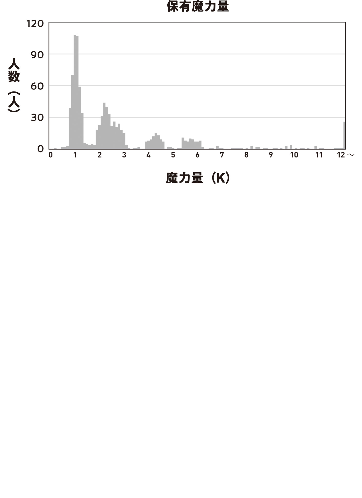

【魔力を測ろう！】

東北狩猟組合のダイダラボッチ討伐は仙台[せんだい]を沸かせたのみならず、東京でも話題になっている。

一般市民は東北との交易開始に注目している。陸路を塞[ふさ]いでいた激ヤバ魔物が消えたため、これから人と物の交流が活発になる。ダイダラボッチの縄張りになっていた広大な土地が丸ごと空き地になったため、そこに田畑を作れないかという話題も上がっている。そもそも交易前に交易路の整備、つまり道路整備も必要になっていて、そのための大規模人員募集が行われているようだ。

魔法大学魔物学科は東京に現れた甲１類魔物大怪獣とダイダラボッチの比較研究に取り組んでいる。魔物の中でも特に飛び抜けて強大な甲１類魔物の能力や出現傾向、発生機序などを解明できれば、今後の治安維持や災害対策への大きな助けになるからだ。

そしてグレムリン工学科ではダイダラボッチが持っていた謎の黒グレムリンについての議論が活発化している。

かくいう俺も黒色グレムリンの謎を自分なりに考えていた。

炭こたつでぬくぬくして、川魚の皮煎餅をつまみに自家製のどぶろくを飲みながら（酒税法自然消滅万歳！）色々考え、構造色になっていたのでは？　という仮説を立てた。

黒色グレムリンの黒色が構造色だったとすれば、なぜ塵[ちり]になってしまったのかは分からないが、異質な発色の理由は説明できる。

構造色とは、その名の通り構造が作る色だ。化学的な発色色素ではなく、物理的な構造でも色は出る。

例えば、コンパクトディスク[ＣＤ]は裏返すと見る角度によって虹色に色付いて見える。

これは構造色に由来する。

ＣＤにデータを記録するため彫られた微細な凹[くぼ]みが光を屈折させ、虹色染料無しで虹色に見せているのだ。

自然界にも構造色はある。クジャクやハチドリの鮮やかな色は、色素ではなく物理構造による光の屈折が生み出している。ブルーベリーやモルフォ蝶[ちよう]の青色もそう。

というか、自然界の生物の青色は99・９％構造色だ。本物の青色色素の存在は奇跡に等しい。だから「幸せの青い鳥」とか「奇跡の青バラ」なんていう概念があるわけで。

物理学の妙にも思える構造色は、生き物にとっては珍しくもない装備だ。

という事は。

ダイダラボッチの黒色グレムリンも、構造色だった可能性がある。

ダイダラボッチも魔物に変異する前は動物だったはず。何かしらの構造色を持っていて、それがグレムリンに現れたとしてもおかしくない。

つまり、ダイダラボッチのグレムリンは全て赤銅色だった。そのうち一つの一番小さなグレムリンに細かい物理構造の溝ができていて、光の屈折と吸収で黒色に見えていただけ。

これが俺の仮説だ。

塵化の説明はできないが、色については納得がいく。

俺は仮説を検証するため、グレムリンに構造色を彫ってみる事にした。

黒色は光を一切反射しない色だから、とりあえず適当なグレムリンの表面に光を吸収する物理構造を彫り込んでいく。ピッタリ５００ナノメートル単位で、規則的に。

鉄鋼羊の作業手袋は使い心地がよく、これだけ繊細な彫りをしていても指の動きを邪魔しない。魔工具も調子がいい。流石[さすが]に彫刻刀だの鉤針[かぎばり]だのではこれほどの精密加工はできない。手作業でレーザー加工をするようなものだ。

俺は軽々と、とまでは行かなかったが、１日かけて１㎝の長さの黒色構造色の溝をグレムリンに刻んだ。

シパシパする目を擦[こす]りながら改めて構造色グレムリンを見る。

うむ、確かに黒色になっている。黒色塗料なんて一切使っていないのに。これぞ構造色。理屈は分かっていても不思議だ。

俺は一度作業手袋を外し、構造色をつついて塵になったりしないかチェックしたのだが、そこで奇妙な事が起きた。

黒色構造色を指先でつついた瞬間、一瞬だけ黒が白に変わったのだ。

錯覚ではない。確かに見た。

今度はつつくだけではなく、べたっと触ってみる。すると、黒色構造色はサッと白色に変わった。

そして指を離すと再びサッと黒色に戻る。

おお？

なんだこのオモシロ現象。

うーん。これは人の接触に反応しているのか……？

いや違うな。温度か？　魔力か？

氷で冷やした指で触ってみたり、湯たんぽで温めた指で触ってみたりしたが、どうやら温度は関係無いらしいと分かる。

それと素肌で触らないとダメだ。手袋越しでは反応しない。素肌で、というか肉体を直接触れさせれば、肘でも頬[ほお]でも舌でも黒から白への変色反応を示した。

試すほどに疑惑が深まる。

魔力に反応してるっぽくないか？　これ。

生命力とか寿命とかに反応してる可能性もあるけど、今までグレムリン加工によって発揮されてきた様々な効果は、全て魔力や魔法がらみだ。今回も魔力・魔法がらみと考えていいだろう。

反射炉に行って朝靄[あさもや]の中で微睡[まどろ]んでいる三匹の火蜥蜴[とかげ]に構造色グレムリンを押し付けてみても、押し付けている間だけ黒から白に変色する。変色反応に個人差（種族差）は無いようだ。

一人でできる検証はそこで止まってしまったので、俺は魔力の専門家を招集した。

もちろん、ヒヨリだ。

使い魔通信で早朝に叩[たた]き起こされ迷いの霧を割って現れたヒヨリは不機嫌そうだったが、ブツブツ言いながらも構造色グレムリンの検証に協力してくれた。

「ふぅん。確かに色が変わるな」

構造色グレムリンに指を当てたヒヨリは頷[うなず]いて言う。

俺は勢い込んで聞いた。

「なあ、この変色って魔力関係？　固有色とは関係無さそうなんだけど」

「待て。調べる」

ヒヨリは短く言って動かなくなった。

俺には分からないが、魔力コントロールでなんかしているのだろう。

朝っぱらから呼びつけてもお願い聞いてくれるヒヨリはやっぱ親友だな！

でも俺も真夜中に急に「話を聞いて欲しい」とか言って魔法大学非常勤講師の職を受けるべきか受けざるべきかのお悩み相談に付き合わされたりするからお相子だ。ここは似たもの同士とさせていただこう。

しばらく構造色グレムリンに指を当てたまま彫像のように動かなかったヒヨリだが、不意に仮面を外しグレムリンに鼻先が触れるぐらい顔を近づけじぃーっと視[み]た。

その状態で少し間を置くと、今度は構造色グレムリンがすごいスピードで白黒白黒と切り替わり始める。

なんかやってるぅ！　なにやってるのかわからーん！

しかし俺は「待て」ができる伝説的魔法杖職人なので、ヒヨリが調べ終わるまで全ての質問を飲み込み大人しく待つ。

それからさらに十分ぐらい経[た]ってから、ヒヨリは構造色グレムリンから顔を離し仮面をつけなおした。

診断は終わったようだ。どうなんですか先生、うちの子の容態は!?

「だいたい分かった。このグレムリンは魔力保有量に反応している」

「ほう。詳しく」

魔力関係の何かだという事は俺も分かっていた。

しかし、魔力保有量とな？

魔力計測器になってるって事？

「これには私の現在の魔力残量が現れている。見ていろ…………ほら。魔力を絞って圧力を下げたら、つまり魔力切れの偽装をしたら目盛りが下がっただろう？」

「おおーっ」

ヒヨリがやったらしい魔力コントロールは俺にはサッパリ分からないが、魔力コントロールの結果は目で見る事ができた。

ヒヨリは構造色グレムリンの端に指をあてているのだが、黒いグレムリンが音量ゲージを上げるように指の接触点から白く染まっていったり、黒く戻っていったりしている。

俺の目には構造色を出すために刻んだ５００ナノメートル間隔の横線が、目盛り線のような役割を果たしているのがはっきり見えた。

ヒヨリが「魔力を上げる」と言えば黒色構造色の目盛りが白く染まっていき、「魔力を下げる」と言えば白く染まった目盛りが黒に戻っていく。

原理も、見た目もわかりやすい。

グレムリンに刻んだ５００ナノメートルの構造色横線集合が魔力残量ゲージになってる！

「魔力残量と目盛りは正比例してる。ほら、接触する魔力を２倍にしたら変色幅が２倍になった」

「これ、構造色グレムリンが魔力残量ゲージになってるって理解で合ってるか？」

「そうだな。魔女か魔法使いならこうやっていくらでも目盛りを騙[だま]せるが、魔力コントロールができない人間の正確な魔力残量チェックに使えるのは間違いない」

「マジか。この機能ずっと待ってた……！」

激熱大勝利演出を幻視する。

俺は感動に打ち震えた。

今まで、魔力の定量測定をできたためしはない。

魔女の感覚頼りで「お前は魔力が多い」とか、射撃魔法基幹呪文「撃て[ー]」を一度だけ撃てる魔力量だから君は魔力少ないね、とか、そういう評価基準で魔力を測るしかなかった。

ところが。

この構造色グレムリンは目盛りで魔力保有量、魔力残量を目視できる。

魔力の物差しを手に入れたのだ。

いうなれば、今まで人類は「親指と人差し指を広げたぐらいの長さ」という曖昧でフワフワした表現に頼って魔法を研究していたようなものだ。

しかし構造色グレムリンを物差しとして使えば「１８８・２㎜の長さ」というような具体的な数値を使って研究できる。

研究精度も研究の幅も飛躍的に跳ね上がる。

革命。これは革命……！

エラいこっちゃ。ダイダラボッチの黒色グレムリンの謎を解明するつもりが、うっかりとんでもない物を作ってしまった。

「大利[おおり]、喜ぶのはいいんだがこのグレムリンでは私の魔力は測りきれない。目盛りをオーバーしてしまう。というかお前の魔力ですら目盛りオーバーだろう？」

「任せろ任せろ。機能と理屈が分かればこっちのもんだ。すぐ、すぐ改良できるから待ってろ！」

もう脳内の閃[ひらめ]き回路がビッカビカだ。

俺は全速力でヒヨリの莫大[ばくだい]な魔力を計測できる構造色グレムリンの作製に取り掛かった。

まずは軽い実証実験から。

５００nm幅の横線で黒色構造色を作ったグレムリンは、魔力感知表示能力が敏感すぎて俺の魔力ですらオーバーフローを起こした。

そこで７００nm、６００nm、４００nm、３００nm、２００nmのそれぞれの幅の横線でも構造色を作ってみる。

すると、横線の幅が短くなるほど魔力感知表示能力が鈍感になると分かった。

つまり２００nm幅の横線で構造色を刻んだグレムリンなら、魔女の桁外れの保有魔力すら精密に測定できてしまうのだ。

俺は融解再凝固グレムリンでも天然グレムリンと同じ魔力保有量表示機能が働く事を確認し（この実験をしているあたりで暇を持て余したヒヨリは家に帰った）、４本の20㎝の長さのグレムリン棒を鋳造した。

そして、それぞれの棒に５００nm、４００nm、３００nm、２００nm幅の構造色横線を刻み込んでいく。

流石の俺もナノメートル単位の加工には手こずった。なにしろ細かい！

２００nm間隔で線を刻む場合、５万本刻んでやっと１㎝の構造色線集合が出来上がる。

たった１㎝のために５万回の精密動作！　馬鹿げている。朝日が昇り夕日が沈むまで片時も休まず１秒１本、自分は作業機械だと言い聞かせ淡々と繰り返してようやく出来上がるのが１㎝。

なんでこんな事をしているんだろうとか考えてはいけない。正気に戻ったら終わりだ。指が引[ひ]き攣[つ]り、腕がパンパンになろうともやり続ける。工作難易度が高いのはもちろん、体力、筋力、気力の問題がデカい。

謎の使命感に突き動かされ意地になって丸々一カ月作業を断行し、ようやく折り返しを迎え流石に小休止に入った。

長風呂を楽しんで、無精ひげを剃[そ]り、手の込んだ飯を作って、時間を気にせずしこたま眠る。起きたらしばらく放置していた火蜥蜴たちの御機嫌とりだ。

倉庫から引っ張り出した線香花火の火花にジャレつき一瞬で機嫌を直した火蜥蜴たちは、大型ロケット花火にしがみついて空を飛び、大興奮の鳴き声を上げながら木立の向こうへ消えていった。

思わず笑ってしまった。奴[やつ]らはいつでも元気いっぱいだ。世話してると手こずらされる事もあるが、こっちまで元気になってくる。

散々遊び倒した花火の燃えカスを水を張ったバケツに入れて片付けていると、ヒヨリが箒[ほうき]と塵取りを持ってきてくれた。手伝い助かる。

「見てたのか？　声かけてくれりゃあ一緒にできたのに」

「私が近くにいると火蜥蜴たちが緊張するだろう」

「ああ、まあ、それはそう」

三匹の火蜥蜴が懐いたのは俺だけだ。俺以外の生き物は仲間だと思っていない。自分達の何十倍も大きな巨大生物が近くにいたら楽しむものも楽しめないだろう。

「仕事が終わったならウチでレコードを聞かないか？　蓄音機とセットで手に入れたんだ。大利の知ってる曲もきっとある」

「いや、休憩してるだけで仕事終わったから遊んでるわけじゃないんだなこれが」

「まだ終わってないのか……？」

「進捗50％」

俺が丸々一カ月工房に籠っていたのはヒヨリもよく知っている。それでもなおやっと半分だと聞いて、軽く引いていた。

逆に考えて欲しい。常人なら人生百回繰り返しても不可能な事を一カ月でやってるんだぞ？　むしろ早いだろ。遅いけど早い。

せっかくだし途中経過をお披露目[ひろめ]しようという流れになり、俺は作りかけの魔力計測器を工房から持ち出し、庭で色々なモノの魔力を計ってみせた。

土やバケツ、池の縁石、雑草などは計測器を当てても目盛りが動かず、魔力が計測できない。バッタとコオロギも魔力無し。

しかし蛙[かえる]や生[い]け簀[す]のヤマメはほんの僅かに目盛りが動いた。ヤマメにも目盛りが動く奴と動かない奴がいて、個体によって魔力保有量が違う事が分かる。

「へえ？　魚にも魔力があるのか。知らなかったな」

俺の隣で池の縁[ふち]にしゃがみ、水面下を覗[のぞ]くヒヨリが意外そうに言うのが意外だ。

魔女は魔力について鋭敏だという話だが。

「魔女は相手の魔力量が見るだけで分かるんじゃなかったか？」

「こんな誤差みたいな、あってもなくても同じ微量の魔力は感じ取れない。精密測定をしているわけじゃなくて、感覚的に捉えているだけだから」

「感覚的にって言うとどういう？」

「そうだな。例えば今大利が持っているヤマメの重さは３００ｇぐらいに見える。でも０・１ｇ単位とかで精密に計ろうと思ったら電子天秤[てんびん]が要るだろう？」

「要らん。こいつは３１２・６ｇだ」

手から伝わってくる重量感から重さを弾[はじ]き出し即答すると、ヒヨリは天を仰いだ。

「この人間精密機械め……今のはたとえが悪かった。あー、見ただけで私の身長がミリ単位で分かったりはしないだろう？　ある程度の目算はできるだろうが」

「１７２・０㎝だ」

「…………」

「体重は53㎏」

「!?　なっ、なんで知って……！」

「キノコ病でダウンした時におんぶしただろ。記憶が確かならそんぐらいのはず。体脂肪率を計算すると、」

「うるさいバカ！　ノンデリ！　もう黙れ！」

耳まで赤くなって大声を上げるヒヨリにびびる。

え、なに？　なんで怒った？　まさか体重の話したから？

女性に体重の話題出すと怒るのってフィクションじゃなかったんだ？　チョコ食べたら鼻血出る並の迷信かと思ってたぜ。

ワケが分からない。身長の話には怒らないのになぜ体重だけダメなのだろうか？　いや、年齢もか。

女性に体重の話がＮＧという都市伝説が真実だったならば、類似関係にある年齢の話もＮＧの可能性が高いという推論が立てられる。そのへんの話もしない方が良いか。

「すまん。怒らせたかったわけじゃないんだ」

両手を挙げて降参の姿勢を見せながら謝ると、ヒヨリは仮面越しでも分かるぐらい俺を強く睨[にら]み、それから仕方なさそうに溜息[ためいき]を吐[つ]いた。

「悪気が無いのは分かる。だが、気をつけろ。本当に。せめて今の十倍の気遣いは覚えて欲しいところだ」

「えーと、自家製アイス食べるか？　氷室に取り置いてあるんだけど」

「……努力は認めよう。食べる」

なけなしのコミュニケーション能力を振り絞った渾身[こんしん]の一手にヒヨリは微笑[ほほえ]んだ。

セーフ。許されたっぽい。唯一無二の親友とこんなクソしょーもない事で喧嘩[けんか]するのはごめんだ。友情！

それからアイスを食べながらヒヨリの魔力を計らせてもらったのだが、一番感度が鈍い大魔力を計れる計測器でさえオーバーフローを起こした。一方で「目盛りが二倍になれば計れそう」という見解ももらえたので、無限にも思える単純作業の繰り返しでシナシナになっていたやる気が急速充填[じゆうてん]された。

しんどい作業も目標がハッキリすれば耐えられる。東京魔女集会一の魔力の持ち主、青の魔女の魔力を計測できる魔力測定器を作れるのは俺をおいて他にいないのだ。俺がやらねば誰がやる？

勢い込んだところで仕事が楽になるわけではなく、結局、四本の棒全てに４通りの構造色をつけ終わるまでに、毎日10時間労働したのに50日もかかってしまった。

途中で慣れてきて加速したのにコレである。今までで最大の工数をかけた仕事になった。

だが、おかげで全ての人、魔女、魔法使い、魔物の魔力量を精密計測できるようになった。

俺の魔力も、火蜥蜴の魔力も。あの青の魔女のクソデカ魔力ですら測れてしまう。

俺は新世界を切り開く新単位系の基準標本となるべき偉大な四本の構造色グレムリンを東京魔法大学に送り付けた。

ガハハ！　恐れおののき腰を抜かすがいい。

間違いなく俺以外の誰にも作れないスーパーオーバーテクノロジーだ。

国宝指定してもいいぞ！

---

四本の構造色グレムリンを東京魔法大学に送った一週間後。ヒヨリが教授陣の連名で書かれた立派な感謝状を持ってきた。

「なんだこの筒容器。卒業証書入れる以外に用途あったのか」

「慧[けい]ちゃんが大利が喜ぶだろうと思ってわざわざ考えたんだ。喜べ」

俺はオコジョの巧みな計略によってまんまと喜ばされた。もらったのは単に筆文字が書かれた厚紙なのに、様式を整えられると途端に宝物に見えてくるのは不思議だ。

簡易的な感謝状授与式を行ってくれた青の魔女様のお話によると、ずっと魔力の定量測定をしたくてしたくてたまらなかった各研究チームにとって、魔力計は突然天から降って湧いた神器に等しいのだという。使用のために順番待ちの列ができ、奪い合うように使われているらしい。

狂喜する研究者たちはお祭り騒ぎで我を忘れ、感謝状をまとめて代筆した大[おお]日向[ひなた]教授は礼状が遅くなってしまったのを手紙で謝っていた。本人は忙し過ぎて奥多摩[おくたま]に来られないぐらいらしい。嬉[うれ]しい悲鳴というやつだ。

そんなに高く評価されると、俺の鼻も天狗[てんぐ]になる。ぜひバンバン使って欲しい。でも作るのめちゃ大変だから大切に使ってくれよな。

感謝状に添えられた資料によると、構造色グレムリンが使われた最初の研究は単位系の新設だったそうだ。

魔力計測器はできた。ならば次は何よりもまず単位の決定が必要だ。

長さならメートル。

重さならグラム。

では魔力は？

単位の決定には教授会議による侃々諤々[かんかんがくがく]の議論があったが、理論と実態の中間を取る事に決められた。

構造色グレムリン魔力計測器を使い、無作為に選んだ１０００人の保有魔力量を計測。すると保有魔力量最頻出値が４００nm構造色グレムリンが示す１㎜とほぼ一致した。

この事から、４００nm魔力計に触れた時に目盛りを１㎜変色させる魔力量を、魔力の基本単位である「１・０賢視[けんし]」。即[すなわ]ち１・０Ｋと定められた。

一般人一人分の魔力量がだいたい１Ｋ。分かりやすい。

名前も分かりやすい。

魔力を「賢く視て定める」から「賢視」。

いやあ、いい単位の名前だなぁ！

俺の名前が大利賢師[けんし]なのとは無関係かな!?

添付資料の単位系の話のところに舌をペロリと出してウインクするオコジョちゃんの落書きがしてあったから、絶対わざとだ。

お茶目[ちやめ]オコジョめ、やってくれおる。直接俺の名前を使うのではなく文字を変えてそれらしくする工夫が小賢[こざか]しい。そのままの名前にすると俺が恥ずかしがるとでも思ったか？　正解だよ！

でも嫌いじゃないです。製作者の名前が売れると作品の売れ行きが目に見えて変わるからな。ペンネームが新単位の名前になったと考えれば全然オッケー。良いサプライズだよ、教授。

一般人１０００人の保有魔力量分布グラフを見ると、俺の魔力量がいかに多かったかよく分かる。

俺の現在の魔力量は６・６Ｋ。

火蜥蜴は44～48Ｋだったから、火蜥蜴グレムリンを左手に埋め込んで減少した分を考えると、俺の元々の魔力は50Ｋちょっとだったようだ。

かつてヒヨリが言っていた「大利は魔力が多い」という言葉は本当だった。

なお、大日向教授の魔力は１２０Ｋ。

継火の魔女の実妹にして人類最高峰の火継[ひつぎ]の魔女が２００Ｋ。

未来視の魔法使いは魔女集会ワーストの５１００Ｋ。

青の魔女は魔女集会トップの１１０００Ｋだ。

やはり魔女と魔法使いは桁が違う。

６・６Ｋの魔力では目玉の使い魔の魔法を使えないから、俺は火蜥蜴グレムリンを埋め込んでからはずっとヒヨリが出した使い魔をポケットに入れ持ち歩いている。氷槍[ひようそう]魔法も魔力不足で使えなくなった。

だが、６・６Ｋあれば焔[ほのお]魔法や凍結魔法の基幹呪文は２、３回唱えられるから、以前より不便にはなったもののまあまあ快適にやっている。６・６Ｋでも十分魔力多い方だし。人類の上位10％だぞ。

魔法大学の歓喜と興奮が伝わってくる手紙の最後には、ちょっと怖い研究結果が記されていた。

魔法医学科が早速魔力計を使って行った研究によると、魔力欠乏失神をすると魔力保有量が微減するそうだ。一度の失神で、だいたい０・０５～０・１Ｋの減少が起こる。

魔力が明らかに不足している魔法は使用できない。しかし、魔力がほんの少し足りない状況で魔法を使おうとすると、魔力最大値が自動的に削れて不足分を無理やり補い魔法が発動。そして魔力がゼロになり失神する……という原理なのだそうだ。

今までも魔力欠乏失神で魔力最大値が減少しているのではないか、という説があったのだが、何しろ減少量が少ない。加齢による減少なのか、測定誤差なのか、体調が影響しているのかなど、色々な理由が考えられ判然としなかった。

キノコパンデミックの後、世間では魔力欠乏失神がタブーになっている。だが更に失神を忌避すべき理由が出てきた事になる。

今思うと恐ろしい。パンデミック前は大日向教授とかポンポン魔力欠乏失神起こしてたって話だもんな。教授の魔力２～３Ｋぐらい減っていてもおかしくない。ヤバすぎ。

そんなヤバい事を平気でやってたんだから、あの頃の人類がいかに魔法について無知だったかよく分かる。知は力なり、だ。

こういう話を知るとつくづく思うのだが、まだまだ気付くべきなのに気付けていない重要な魔法的真実がゴロゴロありそうだよな。

「依頼書も持ってきた。目を通して、請けたい依頼があれば言え」

俺が魔力計資料に目を通し終わったタイミングで、ヒヨリが追加でリストを渡してくる。

クリップでまとめられた数枚の依頼書をザッと見ると、半分以上が魔力計測器の追加製作依頼だった。

どうやら数が足りないらしい。大学に送った魔力計測器は奪い合うように使い回されていて、もっと数があれば大助かりという旨の事が書かれている。

うーむ……需要に供給が追い付いていないのは分かったが、魔力計測器製造依頼はあんま請けたくないな。製造効率クソ悪くて、作るのしんどい上に、作るのつまんないから。単純作業すぎて飽きるし作業を通して新たな知見を得られたりもしない。

でも一番需要がある依頼はコレなんだよな。一番気乗りしない依頼が一番ウケるのって複雑だ。

魔力計測器依頼をいったん横に避[よ]け保留にして他の依頼書を見ると、残りは東北狩猟組合からの依頼と北海道魔獣農場からの依頼だった。どちらも魔法杖の製作依頼。

ふむ？　リストを裏返してみてもそれ以上の依頼は載っていない。

「琵琶湖[びわこ]協定と荒瀧[あらたき]組からの依頼は無いのか」

日本の五大生存者コミュニティのうち、依頼元は三つだけ。琵琶湖協定と荒瀧組（九州）からの依頼が無い。

竜の魔女が伝令役になり、一応全部の生存者コミュニティと繋[つな]がりができているはず。俺の事を知らないから依頼が来ていないなんて事は無い。西方の生存者コミュニティでは凄腕[すごうで]天才魔法杖職人が作る天下一品最強魔法杖に食指が動かないのだろうか？

不思議に思って聞いてみると、ヒヨリは首を横に振った。

「依頼は無い。というか、弾いている」

「なんで」

「怪しいから」

ヒヨリの答えは端的だった。短くまとまり過ぎてちょっと意味が分からない。

首を傾[かし]げると、溜息を吐いて補足説明を入れてくれた。

「大利は前に言っただろう？　『正しく使う人に売ってくれ』と。大利が作った物を悪用しそうな相手は取引先から除外している」

「え、何？　琵琶湖協定と荒瀧組ってそんなヤバい？」

俺の知らないところで自動的にハブられていた取引先に驚愕[きようがく]する。

そんな事ある？　いやあるのか？

東京ではかつて入間[いるま]の魔法使いという悪い奴が暴れたという。人智[じんち]を超える力に目覚めた超越者たちが皆善人とは限らない。

「もしかして琵琶湖協定と荒瀧組は竜の魔女みたいな奴がリーダーやってるとか？」

世の中には力を持たせたらロクでもない事をしでかす奴がいる。

俺が知っている一番ワルな超越者を引き合いに出して聞くと、ヒヨリは苦笑いした。

「あれぐらいの小物だったら可愛[かわい]いものだ。たまに捻[ひね]り潰してやりたくなるが、悪意の塊というわけでもないだろう？」

「あれより酷[ひど]い奴いんの？」

「いる。確実に」

ヒヨリはキュアノスを固く握りしめ、生々しい実感の籠った声で吐き捨てた。

いるのかよ。拉致監禁強制労働カスドラゴンより酷い奴とは。

「琵琶湖協定はタカ派とハト派で泥沼の権力闘争をしている。大利の杖を渡せば敵対派閥を皆殺しにするために使われると考えるべきだ。

荒瀧組は自分達の情報を伏せたまま東京に探りを入れている。友達になる態度ではないだろう？　大利の杖を渡せば東京を更地にするために使われると考えるべきだ」

「ええ……？」

物騒な未来予想にドン引きする。

被害妄想が過ぎる、と言いたいところだが、ヒヨリのこういう過剰なんじゃないかという警戒心で助かってる部分はあるんだよな。大真面目に言われると有り得る気がしてくる。

こえぇよ。これだけ立て続けに大事件が起きてたらもう充分だろ。もういいよそういうのは。

一体いつになったら平和な世界が戻ってくるんだ。

「現実はいつだって最悪の想定よりも最悪だ。思いもしないところから不意を打たれて、取り返しのつかない事になる」

「…………」

シリアスそのものの雰囲気で苦々しい過去を思い出しているらしいヒヨリの前では、継火の無知シチュ百合[ゆり]放火ックスの事を思い出してしまったなんて到底言えなくて、俺は目を逸[そ]らした。

そうだな。現実はいつだって最悪の想定よりも最悪で、思いもしないところから不意を打たれて、取り返しのつかない事になる。

全くその通りだ。継火、お前のせいだぞ。取り返しのつかない火蜥蜴を残していきやがって。可愛いからいいけどさあ。

ヒヨリが想像する最悪の事態と俺が想像する最悪の事態に激しい温度差がある気がしてならない。

でもまあどういう類[たぐい]の最悪が襲い掛かってきても、なんとなく大丈夫だろうというふんわりした楽観はあった。

今まで何度もヤバい事件を乗り越え度胸も自信もついてきた。

暴力で叩きのめせるモノならヒヨリが倒せる。

暴力でどうにもできない問題は、俺がなんとかする。

一人では挫[くじ]ける壁も二人揃[そろ]えば乗り越えられる。

なんでもこい、だ。
