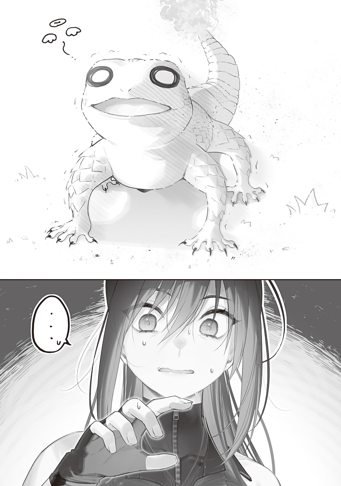
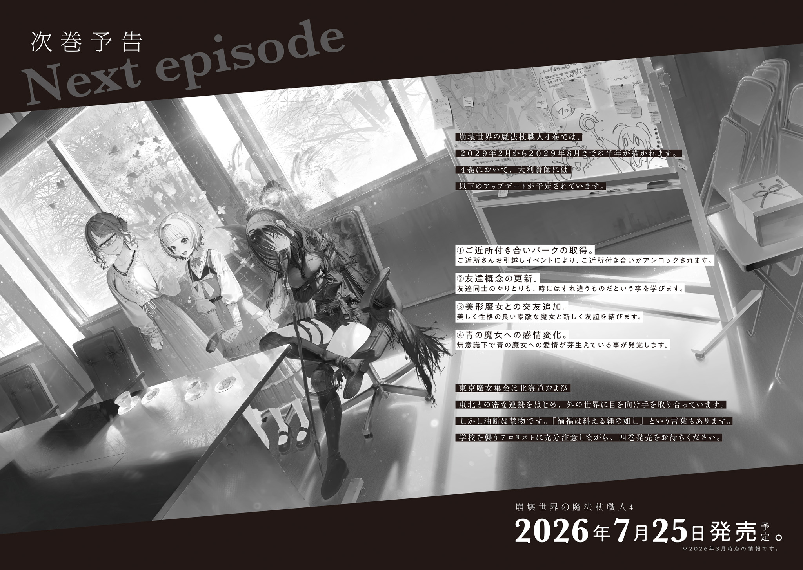

【番外編　赤いのさんびき、青いのひとり】

青の魔女と大利[おおり]賢師[けんし]の付き合いは四年近くになる。

付き合いの長さは理解の深さ。青の魔女は今日もまた工房でグレムリン加工に夢中になってしまった大利の意識が当分現世に戻ってこないと察した。

大利は生粋のコミュ障だ。青の魔女が大利を理解するほどに大利は青の魔女を理解してくれていない。もっと話したい、もっと知りたいと思っても、大利の反応は鈍く暖簾[のれん]に腕押しだ。

もっとハッキリ強く行かないと気持ちが何も伝わらないのではと思う一方、強く押して怯[おび]えさせてしまったら逆効果なのではとも思う。なんとももどかしい。

足音を立てないよう静かに工房を出た青の魔女は、少し考え大利のペットたちに餌をやる事にした。

集中すると寝食すら忘れてしまう大利がペットの餌やりを覚えているはずもない。こういったところを支えてやるのも青の魔女の役目だ。アレでいて律儀な大利は、普段は気遣いに気付かないが、稀[まれ]に気付いた時にはとても素直に感謝を口にする。可愛[かわい]い奴[やつ]なのだ。

火蜥蜴[とかげ]の手が届かない棚の高い場所に置いてある餌箱から餌を取り出し、三匹の火蜥蜴を探す。耳を澄ませると微[かす]かにミーミーと特徴的な鳴き声が聞こえ、それを頼りに青の魔女は台所へ向かった。

大利家の台所はコンクリート打ちっぱなしの土間になっていて、ヒビの補修跡が目立ついかにも古民家といった風情だ。部屋いっぱいに染み込んだ煙と調味料の匂いが大利の自炊頻度を教えてくれる。

自家製の味噌壺[みそつぼ]や塩壺、醤油[しようゆ]壺が流しの壁つけ棚に並べられ、几帳面[きちようめん]に使用期限を書いた紙きれが貼りつけられている。飲みかけの氷入りマグカップの横には、製氷に使ったのだろう魔法杖[つえ]ヘンデンショーが置きっぱなしにされていた。

そんな台所の流し横のまな板の上に、一匹の火蜥蜴がいた。のんびりとした動きと気の抜けた顔立ちを見るに、セキタンだろう。

最初こそ三匹の火蜥蜴の見分けがつかなかった青の魔女だが、しばらく接している内に見分けがつくようになってきた。手のひらサイズの小さな火蜥蜴たちはパッと見同じに見えても、存外個性が強い。

「ミッ、ミッ、ミッ、ミッミッ……」

セキタンはまな板の上に陣取り、自分の体より大きな丸々としたサツマイモに一生懸命歯を立てていた。両前脚でサツマイモに組み付き、せっせと齧[かじ]っている。火蜥蜴は油や炭を食べるのではなかったか？　と不思議に思って眺めていると、すぐに疑問は解けた。

セキタンはサツマイモを食べるのではなく、サツマイモをバラバラにしていた。

大きなサツマイモを齧って小片に分けては、尻尾で払ってフライパンに入れようとして、ボロボロ床にこぼしている。

「ミ。ミミ、ミミミ」

サツマイモをバラバラにし終えると、今度は後脚で立ち上がり、棚の調味料に前脚を伸ばしてなんとか取ろうとし始める。しかしまったく背丈が足りず、しばらくふらふら前脚を伸ばした後、コテンと転んで諦めた様子だった。

どうやら料理の真似事[まねごと]をしているらしい。

三匹の火蜥蜴は全員大利によく懐いていて、大利をよく見ている。中でもセキタンはたびたび大利の真似やお手伝いをしている（しようとしている）子だ。前にもセキタンがグレムリンを前脚でしきりに叩[たた]き、大利のグレムリン加工の真似をしているのを見た事がある。

まな板の上で腹ばいになって脱力しポケーっと休んでいるセキタンの前に餌の石炭を置いてやると、腹ばいのままずりずり動いて舌を伸ばし、一口で丸のみにした。

満足気に煙混じりの鼻息を吐き舌で口元を舐[な]めたセキタンは、石炭が置かれた場所をじっと見つめた後、不思議そうに顔を上げ、周りを見回す。

そしてそこで初めてすぐ近くにいる青の魔女に気付いた。

口をぱっくり開け、目を丸くして石像のように固まる。

「ミ゙……!?」

流石[さすが]のんびり屋のセキタンだ。青の魔女の接近に気付いていなかったらしい。

「セキタンはお料理ができるのか。偉いな」

大利がしているように優しく声をかけるも、セキタンは尻尾を縮こまらせ震えあがった。

まるで獰猛[どうもう]な巨獣を目の前にしたかのように、そろりそろりと後ろに下がり、ヤカンと箸立ての間に体を捻[ね]じ込[こ]み隠れてしまう。尻尾の火すらも小さくしてなんとか気配を消そうとするセキタンは、露骨に警戒心を剥[む]き出[だ]しにしている。

青の魔女は怖がってしまったセキタンを刺激しないよう、両手を上げ降参のポーズを取りながらゆっくり後ろに下がった。

ほとんどの魔物は魔力の大きさで相手の強さを推し量る。超越者の中でも指折りの大魔力を持つ青の魔女は、火蜥蜴たちにとってさぞかし恐ろしく見えているに違いない。

そしてそんな青の魔女と対等に接する大利は、火蜥蜴たちにとって強大な守護者に見えているようだった。大利が傍[そば]にいる時の火蜥蜴たちは、青の魔女が近づいても割と堂々としている。

火蜥蜴たちにとって、大利は頼れるボスなのだ。青の魔女にとっては危なっかしくて心配な男だが。

台所を出た青の魔女は次に寝室に向かった。鳴き声は聞こえないが、火蜥蜴の魔力を感じる。三匹の魔力はとても似ているのでどの魔力がどの子なのか区別がつかないものの、ツバキかモクタンのどちらかがいる事は間違いない。

寝室の戸を開けると、ベッド横の洋服箪笥[だんす]の一番下の引き出しが少しだけ開いていた。その小さな隙間に一匹の火蜥蜴が顔を突っ込み、機嫌良さそうに尻尾を振っている。

しばらく見ていると、火蜥蜴は大利のシャツを口に咥[くわ]え、箪笥から引っ張り出した。

セキタンと比べて小柄で、甘えた鳴き声を上げ大利のシャツにジャレつくこの火蜥蜴は、三匹の中で一番甘えん坊のモクタンに違いない。

「ミーミ、ミーミ、ミミミミミ！」

モクタンは嬉[うれ]しそうにシャツを何度も噛[か]んで涎[よだれ]でべとべとにし、戦利品をどこかへ持ち去ろうとする。

そしてシャツを咥えて引きずる途中で目の前に横たわる大きな影に気付き、ハッとして顔を上げた。

「ミ゙」

青の魔女と目が合ったモクタンは、引[ひ]き攣[つ]った鳴き声を上げ口からシャツの端をこぼした。そしてオロオロと周りを見回し、足元のシャツの中に顔を突っ込んで隠れた。もしくは、隠れたつもりになった。

頭隠して尻隠さず状態のモクタンは、尻尾が思いっきりシャツの外に出ている。

怯えさせてしまって可哀[かわい]そうという気持ちと小動物の仕草を可愛いと思う気持ちが青の魔女の中で衝突する。

可愛い。モクタンは可愛い。青の魔女はふわふわした小動物が好みで、爬虫類[はちゆうるい]系にはいまいち惹[ひ]かれない。しかしモクタンを見ていると火蜥蜴も悪くないかな、と思えてくる。

ぷるぷる震える尻尾の火の火力が不安定になりシャツを焦がし始めたので、青の魔女はすぐにモクタンをシャツから掴[つか]みだした。

「ミーッ！　ミーッ！　ミーミ！　ミーミ！」

悲鳴を上げジタバタ暴れるモクタンを床に放してやれば、泡を喰[く]って逃げ出し金庫の下の隙間に駆け込んだ。

セキタンに続いてモクタンにも怖がられ、少し悲しくなる。

火蜥蜴は初対面の時に青の魔女に殺されかかった事を覚えているのだろうか？　忘れていても魔力差が原因で怖がられただろうが、覚えていればなお怖いだろう。

青の魔女はあの時の判断が間違いだったとは思っていない。大利の安全を守るため、危険を排除し遠ざけるのが自分の役目だ。本人に欠けている危機感を補ってやらなければならない。そうでなければ世界崩壊などどこ吹く風でのほほんと生きている繊細な絶滅危惧人間を守れはしない。

とはいえ喉元過ぎれば熱さを忘れるというか、現金なもので、一度調教が済んで大利に慣れきり魔獣化した後になると、火蜥蜴たちを排除しようとは全く思えなくなっていた。

可愛らしく無邪気な子たちだし、大利を完全に仲間だと思っていて、大利を害するなんて有り得ない（少なくとも意図的には）。むしろ危機に際しては大利を守ろうとするだろう。

仲良くなるためだけにグレムリン埋め込みまでするのは抵抗がある。しかし怖がられ避けられると悲しい。我儘[わがまま]な話だ。

「モクタン」

「…………」

「お腹[なか]は空[す]いているか」

「…………」

大利が名前を呼べば尻尾を振って返事をするのに、青の魔女が呼んでもだんまりだ。しかし餌の木炭を振って見せると恐る恐る金庫の下から顔を出し、木炭を目で追った。

木炭を右に動かせば右を向き、左に動かせば左を向く。可愛い。

物欲しそうに喉を鳴らすが寄ってはこないので、青の魔女はその場に木炭を置いて後ろに下がった。するとようやくじりじりと餌に近づいてきて、サッと木炭を咥えたかと思うと金庫の下に駆け戻った。

モクタンはそれきりもう姿を現さず、金庫の下からサクサクと木炭を齧る音が聞こえてくるばかりだ。

壁を作られているのは仕方ない。とりあえず良し、である。

セキタンとモクタンへの餌やりは終わった。最後はツバキだ。

ツバキの魔力を探すが、家の中には感じられなかった。たぶん、巣にいるのだろう。

青の魔女は火蜥蜴たちの巣がある裏山の反射炉へ向かった。

他の二匹より一回り体が大きなツバキは態度も大きく、巣にしている反射炉の主だ。セキタンやツバキよりも縄張り意識が強く、反射炉の周りの散歩（警邏[けいら]）を欠かさない。

案の定というか、ツバキは反射炉が見えてきたあたりで青の魔女の前に立ちはだかった。魔力を感じ取り縄張りへの侵入者に気付いたに違いない。

反射炉に続く細い山道の真ん中に陣取ったツバキは恐るべき魔女を見上げ、口から火の粉を散らし威嚇してきた。

「ミミミーッ！　ミミ、ミミミ！」

ツバキは盛んに鳴きながら火を吐き、青の魔女の足元の枯れ枝を燃やしてみせた。それ以上近づいたら「こう」だぞ！　と言わんばかりに鼻息荒く興奮している。

青の魔女は刺激しないようにそっと懐から椿[つばき]油の油さしを取り出し、振って見せた。

「落ち着けツバキ。縄張りに近づいたのは悪かったよ。大利の代わりに餌を持ってきただけなんだ」

「ミ……？　ミミッ！」

一瞬目が油さしに吸い寄せられるも、ツバキはすぐ我に返った。眼光鋭く青の魔女を睨[にら]みつけ、大急ぎで反射炉に駆けていく。

かと思えばすぐ戻ってくる。

その口には、ミニチュアの魔法杖が咥えられていた。

大利の杖だ。

一目で多層構造加工も逆流防止機構もついていないオモチャ同然の杖だと分かるが、コアの色合いが火蜥蜴の鱗[うろこ]の赤色に寄せてあり、研磨もしっかりしてあって、大利の凝り性な部分がよく出ている。

「ツバキお前、大利に杖を作ってもらったのか？」

「ミ゙ッ！」

ミニチュアの杖を口いっぱいに咥えたツバキは自慢げで、杖を咥えたまま威勢よく鳴き声を上げる。

なんだかいい感じの木の枝を咥えて尻尾を振る小型犬を思い起こさせ、青の魔女は微笑[ほほえ]んだ。大利が火蜥蜴たちをペットとして可愛がる気持ちも分かる。魔物とはいえ動物には違いない。懐いてくれればさぞ可愛いのだろう。

「ミ゙
ミ゙

ッ、ミ゙ーミ゙……ミ゙
ミ゙

？？」

ツバキは口に杖を咥えたまま火を吐こうとしているようだが、口に咥えた杖が邪魔になってうまくいかない様子だ。魔力が上手[うま]く収束できていないのが見てとれる。

生来持っている自前のグレムリンと杖のグレムリン、両方に魔力を集中させようとしてどっちつかずになってしまっている。

青の魔女は少し考えて言った。

「ツバキ。こういう感じでやってみたらどうだ」

「ミ゙……？」

見かねてツバキに合いそうな魔力コントロールの手本を見せると、首を傾[かし]げてじっと観察し、すぐに真似した。バラついていた魔力がたちまち見事な収束を始める。

青の魔女は目を見開いた。

東京魔女集会最強の青の魔女をして、驚きを隠せないほどの才覚だった。見せた手本を真似すればよいと理解できる知能はもとより、すぐに真似できるのは天賦の才といえる。

鋭い鳴き声と共に杖を咥えたツバキは驚く青の魔女に向けて勢いよく火を吐き────

「ミッ!?」

「あっ!?」

────そして、咥えていた杖は一瞬で燃え尽き灰になってしまった。

「…………」

「…………」

ツバキは口から真っ白な灰をサラサラこぼし、ショックを受けた様子で固まった。

青の魔女も頭を抱える。

見え透いた落とし穴を踏み抜いてしまった。杖はコア部分以外、木製だ。口に咥えたまま火を吹けば当然燃える。火蜥蜴の火力にかかれば一瞬で灰と化す。当たり前の事なのに、考えが至らなかった。

馬鹿すぎた自分に自己嫌悪するやら、大利のプレゼントを焼いてしまったツバキが可哀そうやらで、胸がズキズキ痛む。

「ツ、ツバキ。その、ごめん……」

「…………」

声をかけても反応がない。ショックで呆然[ぼうぜん]自失状態になっている。青の魔女が傍にいる事も忘れてしまったようだ。

あまりの気まずさに居たたまれなくなった青の魔女は、油さしを一本丸ごとツバキの前に置いてそそくさと退散した。

青の魔女の力では新品を用意してやる事も、慰めてやる事もできない。謝ってもどこまで言葉が伝わるか。

大利に事の次第を伝え、なんとかツバキの機嫌をとってもらうしかない。ミニチュア杖を新調するとか、お得意のナデナデでケアするとか、大利ならツバキを癒[いや]してくれるだろう。

せっかく大利を助けようと火蜥蜴たちの餌やりをしていたのに、大利に負担をかけてしまいそうで落ち込む。

青の魔女は自他共に認める最強の杖を持つ最強の魔女だ。立ち塞[ふさ]がる敵の全てを薙[な]ぎ倒[たお]せる。

その代わり敵を倒して解決できない問題には弱かった。

もっとも、一時期はそのせいで塞ぎ込んでいた青の魔女も今はそれほど悲観していない。

自分にできない事は大利がやってくれる。

大利ができない事は自分がやる。

火蜥蜴の世話も、得体の知れない様々な脅威も。

些細[ささい]な事から重大な事まで、なんでも助け合っていける深い関係になれたら良いなと願う、青の魔女であった。

２０２９年度　グレムリン工学科　入試問題　抜粋

●　次の問い（問１～４）に答えよ。（配点　20）

問１　改定モース硬度指標において、グレムリン（ａ）と魔石（ｂ）の硬度の組み合わせとして最も適当なものを、次の①～④のうちから一つ選べ。

① a=11,b=11　　② a=11,b=12

③ a=12,b=11　　④ a=11,b=10

問２　魔法媒介結晶（グレムリン及び魔石）の魔法増幅率を測定する手法として存在しないものはどれか。最も適当なものを、次の①～④のうちから一つ選べ。

①励起魔力感応吸音鑑定法　　②加熱トルマリン吸着法

③魔力操作感知法　　④標本鉱物衝突比較法

問３　天然乳白色グレムリン（ａ）と人間固有色グレムリン（ｂ）をマーブル状に混合した時、その混合比率によって魔力回復速度上昇率が変化する。魔力回復速度上昇率を最大化する混合比率として最も適当なものを、次の①～④のうちから一つ選べ。

① a:b=6:4　　② a:b=2:8

③ a:b=4:6　　④ a:b=8:2

問４　グレムリンにひっかき傷を付けられない魔物素材はどれか。最も適当なものを、次の①～④のうちから一つ選べ。

①ドラゴンの爪　　②フクロスズメの嘴[くちばし]

③人食い天使のバッカルコーン　　④潜影蝙蝠[こうもり]の牙

２０２９年度　グレムリン工学科　入試問題　解答と解説

問１　解答は①。

グレムリンと魔石に硬度差はない。熱に対してはグレムリンとは異なり魔石が極めて高い耐性を示し、魔石の高温融解は現状実現していない。

問２　解答は④。

励起魔力感応吸音鑑定法は実在する。励起状態の媒介結晶は増幅率と吸音率が反比例の関係にあり、これを利用し聴覚によって増幅率を識別できる。

加熱トルマリン吸着法は実在する。トルマリンは加熱によって微弱な電気を発する鉱物である。０・０１ｇ円盤状加工済の湯煎した１００℃トルマリンのグレムリンに対する吸着性を観察する事で、増幅率を測定できる。

魔力操作感知法は実在する。超越者の感覚による増幅率概算であり、既知の増幅率測定法の中で最も精度が低い。

標本鉱物衝突比較法は存在しない。標本鉱物沈降比較法の誤りである上、標本鉱物沈降比較法はグレムリン移植アレルギー検査に用いられる手法であり、魔法増幅率測定法としては不適当。

問３　解答は②。

魔力回復速度上昇率は天然乳白色グレムリン：人間固有色グレムリン＝６：４でマイナスのピーク、２：８でプラスのピークを示す。

混合率の他にも、製造時の温度および時間管理などによっても上昇率を向上させる事ができる。

問４　解答は③。

ドラゴン、フクロスズメ、潜影蝙蝠[こうもり]はいずれも空間収納腹袋を持つ魔物である。

人食い天使はクリオネ（流氷の天使とも呼ばれる）が変異した魔物であり、バッカルコーンはその捕食用触手。人食い天使は空間収納腹袋を持たない。

あとがき

これは日本一のあとがきです。

嘘[うそ]でも誇張でもない。なぜならば、日本一北にある最北の地、宗谷[そうや]岬でこの文章を書いているから。紛れもなく日本一の（北の地で書かれた）あとがきなのだ！

もし私が文字に魂を込められるなら、その魂はガタガタ震えて凍えているに違いない。何しろ寒風吹き荒[すさ]ぶ寒空の下でスマホをタプタプしているわけだから、指先どころか全身が震えて仕方なく画面も指先も震えに震えて書きにくいったらありゃしない。他の観光客にも気のせいか不審な目で見られてる気がするし。

目の前に広がる望洋たる海の水平線から足元までジリジリと視線を引き戻すに、海の色が途中で変わっているのが目につく。おそらく水深の関係か視野角による光の散乱の変化の影響か、遠くの海は青く、手前の浅瀬は黒々と見える。青い海から黒い浅瀬に侵入した大きな白波は散り散りに砕け分隊となって岸へ駆け、そのうち一つ、二つの個体がその波の下に巨大魚でも匿[かくま]っているかのような滑らかで素早い生き物じみた動きで岸に肉薄し、しかし届かず、細波[さざなみ]に紛れて消える。なるほど、これは確かに「海は生き物」と言う人が何を見て何を思ったのか分かる気がする。

初見では原因と法則性を掴[つか]みきれない現象を既知の物事に無理やり落とし込んでいるだけの気もするが、まあ、学術的考察はさておき想像を楽しむ分には良いだろう。

ここまで全くもって小説の内容と関係の無いあとがきになっているのは全くもってその通りで、ごめんという謝意は少しばかりあるけれど、しかし何よりも、この日本一のあとがきを書くためだけに宗谷岬にわざわざ足を運んだ自分が無性に誇らしい。

読者諸兄におかれては、是非「日本一のあとがきを読んだ事がある」という与太話のタネにでも使って欲しい。

最後にスペシャルサンクスとしてこれを執筆中に海面を滑るように低空飛行していった名も知らない一羽の海鳥を挙げ、筆を置く。

令和八年一月某日　黒留[くろどめ]ハガネ

