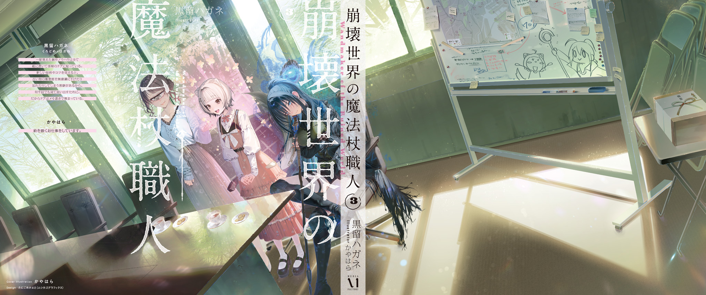

電子書籍特典　書き下ろし短編

『フクロスズメ馴致手引き』

以下にフクロスズメ馴致の手引きを示す（北海道魔獣農場秘伝より抜粋）。

フクロスズメを使役するためには、通常の手順に従いフクロスズメのグレムリン埋め込みを行った後、馴致（人に慣れさせ、従わせること）が必要になる。

グレムリン埋め込みを行えばフクロスズメは埋め込みを行った人間を同族と認識するが、それだけでは従わない。

フクロスズメは群れで生活する社会性動物であり、リーダーに従う習性を持つ。単にグレムリン埋め込みを行っただけではリーダーとは見なされないどころか、現行のリーダースズメに従わない場合、非難の態度を取られる（激しい威嚇の鳴き声、巣への侵入を拒む、後頭部の髪（羽）を啄んで毟るなど）。

フクロスズメにリーダーと認められるためには、営巣時に群れの全個体の中で最も優れた貢献を行う必要がある。

フクロスズメは何らかの理由によって巣が壊れると、巣の残骸を解体して巣材を回収し、その時々で最も適切と判断した場所に移動し、改めて巣を作り直す。

この時、フクロスズメは最大で20羽が巣材を持ち寄り、一つの頑丈な集合住宅（コロニー）を形成する。フクロスズメのリーダーになるためには、この営巣時に優れた巣材を充分な量提供しなければならない。

共同で営巣する他個体が持ち寄る資材の量や質との兼ね合いになるが、概ね下記のいずれかを目安として巣材を用意すれば、群れのリーダーとして認定される。

自動販売機……１基

郵便ポスト……２基

電子レンジ……６台

50㎏サイズの岩……８個

自動車やコンテナハウスなどは大きすぎるため、巣材として不適切と見なされ、貢献度にカウントされない事に注意。また、低密度で軽い素材（発泡スチロールやウレタンなど）も巣材として不適切と見なされる。

木材や革などの燃えやすい素材は、他にもっと適切な巣材が無かった場合にのみ渋々受け入れられる（貢献度は低く見積もられる）。

営巣のために最大の貢献をしたと認められると、営巣完了時にリーダー承認の儀式が行われる。承認の証として、その群れの全個体はリーダーの腹袋を嘴で甘噛みする。

当然ながら人間は腹袋を持たないので、腹部にポケットがついた服を着る事。承認時にリーダーになるべき個体に腹袋（腹ポケット）が無い場合、フクロスズメは混乱し、最悪、リーダーと認められない。一度リーダーとして認められれば、以後は（次の営巣までの間は）腹ポケットが無くても良い。

フクロスズメはリーダーに死をも厭わない徹底した従順さ、極めて高い忠誠心を示す。非常食になれという指示にすら震えながら従う。

くれぐれも、フクロスズメの忠誠を悪用しないこと。

