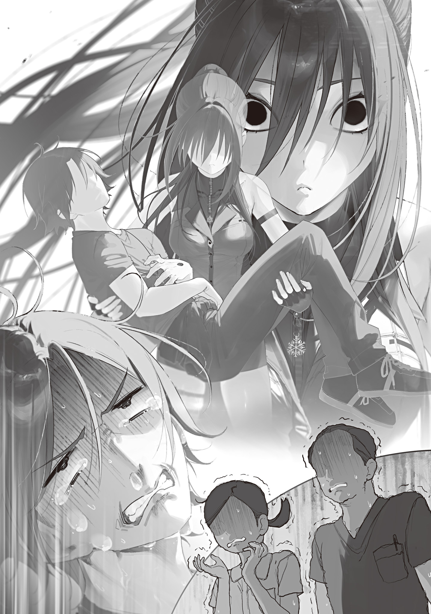

【病気と療養】

世の中のペット代表格といえば、犬猫だ。

理由はハッキリしている。

犬は数万年も昔から人類の最良の友であり続けた。

猫は数万年も昔からずっと最高に可愛[かわい]い。

ペット二大巨頭として君臨し続けるのは当然だ。

しかし世界から電気が失われ魔法と魔物が現れて約五年が経[た]ち、ライバル勢力が登場した。

フクロスズメである。

家畜化された魔物、つまり魔獣であるフクロスズメは、賢く従順で可愛く飼いやすい上に四次元ポケットじみた亜空間収納腹袋まで持っている。でっぷり太った皮下脂肪たっぷりのまんまるフォルムは愛嬌[あいきよう]の塊で、捕食者にとっては鈍重で良いカモだが、動物愛好家を惹[ひ]きつけてやまない。

愛玩用に、そして収納腹袋を活[い]かした配達業に。ペットとしても使役動物としても、フクロスズメは急速にシェアを拡大しつつある。

ヒヨリもフクロスズメの魅力にクラクラきていた。東京魔女集会最強と畏れられる青の魔女様の凍[い]てついた鋭い目を緩ませるスズメの魅力は相当なものだ。

ヒヨリは庭に餌箱を設置してバードウォッチングをしていたぐらいだから、元々興味はあったのだろう。フワフワした小さな生き物が好きなのだ。

三寒四温で春が近づくある日、俺はヒヨリに青梅[おうめ]の自宅まで呼びつけられた。フクロスズメを飼おうか迷っているので意見が欲しいというのだ。

「尾羽の色が選べるんだ。青の差し色が入っている子と、桜色の子と。こっちの真っ白の子は繁殖待ちになるけど、綺麗[きれい]で可愛い」

「あ～、可愛いけどさあ。全身白いのはアルビノじゃね？　色素疾患。アルビノは虚弱体質って聞くからやめといた方が無難そう」

一緒に居間のソファに座り、テーブルにフクロスズメ販売カタログを広げあーだこーだと言い合う。

魔女の使い魔といえばカラスと黒猫のイメージがあるが、実際には全然そんな事はない。目玉の使い魔魔法で羽の生えた目玉を飛ばす場合が多く、さもなければさざれ石の魔女のように石でできたゴーレムを使役する。

「赤系は？　好みじゃない？　やっぱ青系？」

「んー。確かにキュアノスも御守り[アミユレツト]も青だし……寒色系で合わせるのもアリか。大利[おおり]的にはどうなんだ？　赤が好きか？　大利の火蜥蜴[ペツト]たちの色に合わせるのもアリな気がしてきた」

「なんで俺のペットと色合わせするんだよ」

「なんでって……それは……」

「ヒヨリの目とかスゲー綺麗な青色してるしさあ、髪も青みがかってるし、好みの色が特に無いならペットもヒヨリの持ち味の色彩に合わせた方がハマるんじゃねえの」

「…………」

ヒヨリのポニーテールの毛先を指で弄[いじ]りながらカタログに描かれたスズメの色を見繕っていると、前触れもなく突然腹が痛くなった。

急にズキズキ痛み始めた腹を押さえ、動揺する。

なんだ？　本当に急に腹痛が来た。

へ、変だな。危ない物なんて食べた記憶は無いのに。

しばらく痛みが治まるのを待ちながらヒヨリがゴニョゴニョ言うのに相槌[あいづち]を打っていたのだが、腹の痛みは引いていくどころかどんどん悪化しはじめた。

やべ。これお薬が必要なやつだ。

「話さえぎってすまん。ヒヨリ、胃薬ってあるか？」

「ん？　漢方なら。腹痛か？」

ヒヨリは俺の顔色と腹を押さえているのを見てすぐに察してくれた。

「そう。腹が……すっげぇ痛い……！」

「……おい？　脂汗出てるぞ。大丈夫か？　立てるか？　おいっ！」

立ちあがろうとしてフラついた俺はヒヨリに支えられた。

ヤバいヤバいヤバい！　どんどん痛みが酷[ひど]くなってくる。もうフクロスズメどころじゃない！

「い、胃薬を。胃薬を早く……」

「薬でどうにかなる感じじゃないだろ！　救急車、は、無くなったんだったクソが！　すぐ病院に行くぞ。歩けるか!?　大丈夫か!?」

「病院？　嫌だ、薬で治す……」

「だから薬で治らないだろコレは。自分で分からないのか？　すごい汗だぞ。顔色も酷い！」

「病院はヤダ。医者って問診とかするじゃん……」

「言ってる場合かバカッ！」

ブチギレたヒヨリは業を煮やし、俺を強制的に横抱きに抱え上げた。

うおっ、めちゃめちゃ力強い！　お相撲さんかレスラーにガッシリ担がれたみたいだ。すごい安定感と安心感。

ヒヨリは俺を抱えたまま急いで玄関に行って靴をつっかけ、外に出る。そして俺を力強く抱え直し、頼れる凛々[りり]しい声で言った。

「飛ばすぞ、掴[つか]まっていろ。沸き立て我が血潮[×××××デーニツ]」

自己強化魔法をかけたヒヨリは、弾丸のように駆け出した。

街中を風のように駆け抜けたヒヨリは、めちゃくちゃ速く走っているのに俺を全然揺らさなかった。

ううっ、病院か。嫌すぎる。医者にかかりたくないから自宅に医薬品準備してたのに。

でも、横抱きで高速輸送されている間もこれ以上の痛みなんて無いと思った痛みを超えてますます腹が痛くなっていく。

俺は泣いた。

いてえ。いてえよ。死んでしまう。

医者は嫌だがこの激痛から解放してくれるならこの際もうなんでもいい。助けて！

ポロポロ泣いている間にヒヨリは街中を風のように駆け抜けて、俺を千代田[ちよだ]区のデカい病院に担ぎ込んだ。道中聞いたところによると、この病院が一番医療が充実していてプライバシーも高いらしい。

「私は青の魔女だ。最優先で最高の医者を出せ！」

という鶴の一声で、病院は蜂の巣をつついたような騒ぎになった。白衣を翻し急いで出てきた医院長によって俺たちは奥へ通される。

清潔なベッドや机がある診察室で、俺はヒヨリに付き添われながら矢継ぎ早に問診や触診を受けた。このいかにも病院っぽい消毒薬の匂い、苦手だ。早めに治して帰してくんねぇかな。それか焼けた鉄と炭と木の香りの香水つけてくれ。

一通り診察を終えた先生は、最後に下腹部をグッと押して俺をギャン泣きさせた後、頷[うなず]いた。

「虫垂炎かと思われます」

「チュウスイエン……？　それ死ぬ病気ですか？」

「なんでもする。先生、こいつを助けてくれ」

「虫垂炎というのはいわゆる盲腸[もうちよう]の事です。今の時代でもできる簡単な手術で済みますよ。死にません」

「盲腸……」

院長先生の言葉を繰り返す。

盲腸。

聞いた事あるぞ？

確か簡単な手術で治る事で有名だったはずだ。

じゃあ俺、死なないんですか？　こんなに死にそうなほど腹が痛いのに？

そっか、良かった。

死にそうなだけで死なないらしい。

「良かった、盲腸か。いや良くはないが」

後ろのヒヨリの露骨にホッとした声が聞こえる。俺もホッとしたが、先生は少し躊躇[ためら]ってから付け加えた。

「普段ならこのまま手術に入るのですが、実はつい先日新式の魔法検診法を導入しまして。魔法がお嫌でなければ、万が一の誤診を避けるためにも受けて頂けないでしょうか？　安全性は確かめられています」

「是非お願いします」

先生の提案に、なぜか患者の俺ではなくヒヨリが即答した。

いやいいけどさぁ。それで誤診回避率が上がるなら。

「ついでにこいつの悪いところを全部調べてやってください」

「分かりました。では術後に経過を見ながら可能な限りの精密検査を行いましょう。しかしまずは魔法検診ですね。石矢[いしや]くん、ご説明を」

先生が部屋の隅でカルテを持って立っていた若い青年に声をかけ後ろに下がると、代わりに青年が前に出てきた。

軽く一礼して説明を始める。

「魔法医の石矢です。

今から使うのは目玉の魔女様の透視魔法の迂回[うかい]詠唱です。三種類のグレムリンを使い、出力を変えながら三度身体の内部を透視します。Ｘ線検査のようなものだと思って下さって結構です。

Ｘ線検査と違うのは、写真を現像できないため、患者様や付き添いの方へのご説明が難しい事。放射線量がゼロである事です。

何かご質問はありますか？」

俺達は首を横に振った。

レントゲンが導入されていたとは心強い。オコジョ大先生、迂回詠唱の発明をマジでありがとう。おかげで俺、ちゃんとレントゲン検査受けられそうだ。

俺達の同意を確認した石矢先生は頷き、いったんカルテを横に置き、①と書かれたシールが貼られた小さなグレムリンを嵌[は]めた杖[つえ]を手に取った。

「服は着たままで構いません……失礼ですが、青の魔女様はこちらへお願いできますか？　その位置に立っておられますと、魔女様まで透視してしまいますので」

ちょっとビクリとしたヒヨリはサッと横へ避[よ]けた。

なんかエッチな透視に悪用できてしまいそうな魔法っぽいな。まあエッチな能力とか魔法って医者にとっては大助かりな印象あるし、そんなもんかね。

「両目を潰せば偽りではなく[ヤヤクンヌムグーラツグ・ヲオンカパジヤ]太陽の如く輝くものが見えなくなるとでも[フラヒトイヤツゾリソンヌム・カカ]？」

同じ呪文は事前に言われた通り、杖を持ち替えながら三度唱えられた。

グレムリンの大きさと形状的に、出力は０・７倍、１・１倍、１・５倍ってところかな。

ふん。やるじゃねぇか。そうやって細かく出力を変える事で透視レベルを変える工夫を褒めてやりたいところだが、激痛で喋[しやべ]れないから早く手術して？　吐き気もしてきた。口から胃がまろび出そう。

透視魔法診断の結果も盲腸を示していたらしく、俺の承諾を経て手術にＧＯサインが出る。

俺は手術着にパパッと着替えさせられ、テレビでよく見た例の患者を乗せてガラガラ運ぶ移動式ベッドみたいなやつに乗せられ手術室に運ばれた。

手術室の前で心配そうなヒヨリと別れ、いざ戦場へ。

手術着を着たお医者さんが五人で俺を取り囲み、そのうち一人が俺にテキパキ酸素マスクをつけ、もう一人が俺の腕に注射の針をブッスリ刺した。

「鎮静薬の注射です。麻酔もかけますね。大丈夫ですよ、起きた時には手術が済んでいますからね」

鎮静薬に麻酔だぁ～？　それ強制的に意識落とされるって事だろ？

なんか嫌だな。この眠りが永遠の眠りになる可能性も無くはないんだし。

俺は大利賢師[けんし]だぞ。小癪[こしやく]な麻酔薬程度、軽く耐え────

────病室のベッドで目が覚めた時には全て終わっていた。

お医者さんのお薬、強くない？

全然逆らえなかった。正にストンって感じであっさり意識落とされた。ワンパンＫＯ。

ありゃ勝てねぇわ、と敗北感に沈みながら何度か瞬[まばた]きして意識をハッキリさせ、ベッド横の椅子に座っていたヒヨリに声をかける。

「おはよう。どれぐらい経った？」

「!?　大利が起きた！　良かった～……！　今は手術が終わってから三十分ぐらいだ。お前、けっこう麻酔に弱いみたいだぞ。普通はもっと早く起きるという話だったから、心配した」

「おー、そうなん？　良かった永眠しなくて」

「やめろ。笑えない」

「いや本当に。手術受けるの人生初だったからさあ」

ヒヨリは黙って俺の片手をぎゅーっと握りしめた。

けっこうな力で握りしめられている気がするが、まだちょっと感覚が鈍い。麻酔残ってるなこれ。

麻酔が切れると共にじわじわきた腹痛を痛み止めで抑えてもらいながら、俺は術後三日間を点滴で凌[しの]いだ。

俺の病室はいわゆるＶＩＰルームらしく、青の魔女が病院に色々伏せながら事情を伝えてくれた事もあり、入院中は人の気配がなく快適そのものだった。

点滴の袋の交換も俺が寝てる間にやってくれてたし、至れり尽くせり。

麻酔だの痛み止めだの点滴だのとアレコレ処置してもらっていると、文明衰退を食い止めていて良かったなとしみじみ思う。

俺は魔法杖を作っていただけだ。だがそのおかげで巡り巡って東京の文明水準低下は水際で踏みとどまり、比較的簡単な手術と術後処置ができる程度には医療インフラが保たれている。

本当に世界が崩壊しきり略奪と破壊が横行する荒廃世界になっていたなら、助かるはずの盲腸で俺は死んでいた。さしもの俺も自分で自分に麻酔をかけながら自分の腹をかっ捌[さば]いて手術したりはできない。と思う。たぶん。

ヒヨリはキノコパンデミックの時のお返しだと言い張り、四六時中俺の傍[そば]にいて、何かにつけて世話を焼いてきた。

ヒヨリに世話をしてもらう方が病院スタッフと何かにつけて顔を突き合わせるよりはずっと楽だから助かっている。なんといっても対人ストレスが無い。友達の時間を拘束してしまってすまねぇなという気持ちはあるものの、そこはまあ、困った時はお互い様だろう。

なお俺が寝ている時までベッド横にいる意味は不明だ。よく分からんが快適な入院生活ができているのでよし。

だが、術後四日目に快適入院生活に邪魔が入った。

術後初めてとなる軽い食事を持ってきたお医者さん（最初に問診をしてきた医院長）が、カルテを片手に重要な話があると言ってきたのだ。

蒼褪[あおざ]める俺と緊張して身を固くするヒヨリに、医者は丁寧に言った。

「安心して下さい。悪い話ではありません」

「なんだ、良い話か。びっくりした」

「そうですね。良い話です。しかし少し奇妙に聞こえる話かも知れません。お眠りの間に色々な健康診断や検査をさせていただいたのですが、その結果がですね……」

お医者さんの話によると、俺はビックリ人間らしい。

自分がビックリ器用人間なのはとっくの昔に分かっていた事だが、医学的、人類学的にもある程度の説明がされた。

人間は、猿から進化した。

しかし実のところ、まだ進化の途上である。

例えば世の中には稀[まれ]に四色色覚の人がいる。通常の人が三種類の視細胞を持つ三色色覚なのに対し、四色色覚の人は四種類の視細胞を持つ。

四色色覚の人が識別できる色の数は、三色色覚の数十倍から百倍と言われる。

これはまさに進化と呼ぶべきもので、四色色覚にデメリットはない。三色色覚の完全上位互換と言える。

そして俺の眼[め]も進化しているらしい。眼球周辺と内部に非常に特殊な組織が見られるとの事。断定はできないが、分解能が大幅に向上し、顕微鏡のように物が見えているのではないか、という話だ。

まあそうですね。この眼は遺伝です。母も目が良かったし、姉も良かった。どちらも俺ほどではなかったけど。母方の遺伝だろう。

心臓も特殊で、拍動回数が10秒に１回ぐらいしかない。代わりに一回の拍動で大量の血液を送り出しているそうだ。これについては症例があり、特殊ではあるものの健康に支障はないとのこと。

そうなんすよ。コレ便利なんすよ。普通の人は心臓がドクドクいうからその震動が指に伝わり手が震えるというが、俺は10秒に１回しか拍動しないから、かなり安定して作業ができる。

最後のビックリポイントは手指の変化。可動域が広く柔軟でありながら固定時の安定性が高く、しかも繊細な動きができるだろうという話。

知ってた。だって俺、両手全部の指を同時に反らせて手の甲にくっつけられるもん。同じ事ができる人なんて見た事ないぞ。

「魔法使いに変異していたという事か？」

ヒヨリがどこか期待しているような声で言ったが、お医者さんは首を横に振った。

「魔法使いではないですね。発声器官の変異は見られませんし、魔力の増大もありません。左手甲に埋め込んだグレムリンによる魔力最大値減少を差し引いても、充分人間の範疇[はんちゆう]です。臓器などもかなり若々しいですが、普通です。非常に特殊で特異な事例ではありますが、魔法変異と異なり全て医学的に説明がつきます。我々人類の進化の延長線上、その最先端の一つにあると言えるでしょう」

「ほー」

聞かされた話はだいたい全部分かっていた事だが、改めて医学的見地から太鼓判を押されると納得する。

「この眼とか我ながらチートだなと思ってたんですけどね」

「チート……？」

「あ、特別とか異常とかいう意味の若者言葉です……」

「ああ、失礼しました。新しい言葉に疎いものでして。視力の革命的進化ですが、進化史を紐解[ひもと]けば非常に珍しいですが無い事ではありませんよ。

例えば、生物が眼球を獲得した時の進化はまさに革命的なものでした。平面視しかできなかった構造が、立体視ができる構造に変わったんですね。類人猿が獲得した眼窩[がんか]後壁の進化もまた革命的でした。眼球の後ろに骨の壁が形成された事により、視座が飛躍的に安定し、揺れないハッキリした視界を手に入れたのです。

あなたの眼に起きた変化も、今挙げた眼の進化の大転換点に比肩する……いや、これは言い過ぎですね。ですが間違いなく素晴らしい進化の一歩ですよ」

「進化史ってすげー！」

魔女や魔法使いはとんでもない変異進化してるけど、こちとら純地球産正当進化じゃい！　人類の可能性を舐[な]めるなって感じだ。ガハハ！

「そうだ。ヒヨリも健康診断してもらったらどうだ？　なんかおかしいところ見つかるかも知れないし」

「ハッ！　魔女に健康診断なんて無駄だよ。私は見た目こそ人だが、心臓が無いし、深部体温は氷点下だ。診断してもどうせおかしいところしか見つからない」

「やば。手とか普通に温かいのになあ。脈もあるのに」

ヒヨリの手をにぎにぎふにふにしてみるが、感触は完全に普通の女性の手だ。

この手でどうやってあのパワーを出しているのか意味不明。

パッと見普通の美少女なのにな。解せぬ。

俺が固まってぴくりとも動かないヒヨリの手を調べていると、お医者さんはニコニコしながらお大事に、と言い、経過が順調なら明日には退院できると言って去って行った。

いやあ、腹に大激痛が走った時は俺は死ぬんだと思ったが、なんとかなるもんだ。

俺の超絶器用さの源泉もちゃんと医学的に理解できたし（かなり噛[か]み砕[くだ]いて説明してくれていた感はあった）、トータル悪いアクシデントではなかったんじゃないですかね。

明日には退院だ。

帰ったらリハビリしながら、入院中ほったらかしだった火蜥蜴[とかげ]の世話をしてやらないとな。

---

盲腸から始まった入院生活は六日で終わった。

抜糸して自宅療養の注意点を伝えられ、ヒヨリに付き添われ奥多摩[おくたま]に帰った俺を迎えたのは、ご立腹の火蜥蜴たちだった。

「ー！」

「ミッ！」

「ミミ！」

足音を聞いたのか魔力を感じたのか、とにかくボスの帰還を察知して玄関先までやってきた三匹の火蜥蜴が俺を見上げ、盛んにミーミー鳴いて怒る。

感情表現が激しいツバキはもとより、モクタンも、穏やかな性格のセキタンまで非難がましい荒っぽい鳴き声を上げていて、三匹の不満がチリチリと肌を炙[あぶ]る熱波になって伝わってくる。

「すまん、すまん。いきなりほったらかして悪かったよ」

「ッ！」

「でも俺も大変だったんだって。手術したんだぞ、手術。許せよ」

「ミーミ、ミミミーッ！」

撫[な]でてペットの御機嫌を取ろうとしゃがむと、三匹は俺の指をちょっと強めに噛んできた。

「おっと。いてて……」

「おい、いま噛んだぞ!?　大丈夫なのか？」

「大丈夫大丈夫。マジでキレたら火ぃ吹くから。噛んでくるうちは加減してくれてるよ」

病み上がりの俺を過剰に心配したヒヨリが手を掴んで引き寄せ見てくるが、血も出ていない。でも歯型がついているから、お怒りレベルは真ん中ぐらいか。みんなで日向[ひなた]ぼっこ中に寝返りをうって三匹いっぺんに下敷きにしてしまった時と同じぐらいの怒り方だ。

小さな体で体当たりされたり尻尾で叩[たた]かれたりしながら玄関を見ると、戸の下の方が焼き壊されているのが目に入る。

……嫌な予感がする。

鍵を開けて家の中に入ると、案の定めちゃくちゃのぐっちゃぐちゃに荒れていた。

どうやら足りなくなった餌を探して家の棚という棚、押し入れという押し入れをひっくり返したらしい。

工房の炉と土間の竈[かまど]の灰は全部掻[か]き出され辺り一面に散乱し、台所のフライパンと鍋と包丁は半分融[と]かされいっしょくたに隅っこに転がされている。一部屋に一つ置いていた消火器は裏庭に乱雑に放り捨てられ、親の仇[かたき]のように引[ひ]っ掻[か]き傷[きず]だらけにされた上に土をかけ汚されていた。

好き放題のやりたい放題だ。倉庫のシャッターを炎で融かして侵入し中をうろついた痕跡まであった。これにはヒヨリも溜息[ためいき]だ。

「酷いな。大利の留守中の火蜥蜴の事まで気が回らなかった……」

「気を回しても変わんなかったと思うぞ。お前、懐かれてないから。世話しようとしても逆効果だったろ」

俺の代わりに餌やりをしようとしたヒヨリが、何を間違えてかツバキお気に入りのオモチャを壊してしまった事件は記憶に新しい。

火事で家が燃えていないなら上出来だ。青の魔女という火蜥蜴たちにとっての外敵がアレコレ世話を焼こうとしていたら、今頃我が家は焼け跡だったかも知れない。

育児放棄を受けてお怒りのペットをこれ以上刺激しないようヒヨリには新品の消火器と調理器具を街まで調達しに行ってもらい、俺は荒れた家の片付けにとりかかった。

割れたガラスや陶器、床一面に撒[ま]き散[ち]らされた灰は箒[ほうき]と塵取[ちりと]りで集め、まとめて裏庭に捨てる。焼け焦げた枕とシーツも交換だ。穴を開けられた玄関の戸は近くの民家から同じサイズの戸を拝借してきて交換し、反射炉の巣に持ち去られていた金槌[かなづち]と彫刻刀を回収する。

しばらく俺の後をチョロチョロついてきて口から火の粉を漏らして怒っていた火蜥蜴たちだったが、歯ブラシを持ってきて灰と埃[ほこり]と乾いた泥で汚れ切った体を磨いてやると尻尾を振って機嫌を直した。

よしよし、可愛い奴[やつ]らめ。病み上がりでごっちゃごちゃの家の片付けをするハメになったのは頭痛の種だが、火蜥蜴はまだ一歳にもなっていないバブちゃん達である。怒る気にもなれない。病気になっていたり、痩せ衰えていたりするより一兆倍良い。元気で大変よろしい。

元気じゃないのは俺の方だ。医者から一カ月は激しい運動を避け無理をしないようにと言われている。

体に負担をかけないよう、休み休みなんとか寝室だけ綺麗に復旧した時にはもう日が落ちていた。

俺は新品の消火器と調理器具を持ってきてくれたヒヨリに当面の面会謝絶通知を出した。大[おお]日向[ひなた]教授にも同じ内容を知らせてもらうように頼む。

友達と遊ぶのは楽しいが、疲れるんだよな。一人でいるのが一番楽。

二人の方も心得たもので、緊急連絡用の目玉の使い魔を常に持ち歩く事だけ約束して話がついた。

それから毎日ダラダラ家の片付けをしたり、種籾[たねもみ]の選別や育苗をしている間にも色々と物事は進んでいく。

俺は二人からマメに送られてくる手紙を新聞代わりに暇を潰しながら、杖製造業もいったんお休みにして、初春の間をゆったりと療養にあてた。

新年から始まった新通貨の流通は順調に行っているそうだ。

配給券と新通貨の両替に長蛇の列ができたり、散々広報されたのに旧通貨を使おうとする人が後を絶たなかったりと多少の問題はあるものの、だいたい上手[うま]く行っている。

蜘蛛[くも]の魔女やゾンビの魔女、さざれ石の魔女といった外との交流の少ない魔女の管理地区でも貨幣経済は受け入れられ、東北狩猟組合と北海道魔獣農場を含めて経済圏ができあがった。

東北狩猟組合はダイダラボッチ討伐によって開通した陸路を、交易隊商が魔法使いの護衛をつけて行き来している。草木の侵食やひび割れが酷くなった幹線道路の整備が着手され、いつか線路に貨物車を通そうという話が持ち上がっているとか。

東北狩猟組合はその名の通り狩猟が盛んで、解体技術を修めている市民が多いため、魔物をただ倒すだけでなくその素材の剥[は]ぎ取りや利用が東京とは段違いに進んでいる。交易によって東京もその恩恵に与[あずか]れるようになった。

牛タンやずんだ餅、ブランド米「ひとめぼれ」などの前時代から辛うじて生き延びた名産品も少量ながら輸入され、両地域の間で物資も人も交流が増え、貨幣はその交流の潤滑油としておおいに活用されている。

北海道魔獣農場はクラーケンが消えた事により太平洋側沿岸航路が開通し、水生魔獣の船舶牽引[けんいん]によって北海道─仙台[せんだい]─東京の交易ルートが活性化している。

船を牽引できる水生魔獣はまだまだ数が少なく貴重なため、交易頻度はそう多くない。悪天候や水生の甲類魔物出没で船が止まる事も多い。

北海道の名産は言わずもがな家畜化された魔物、魔獣だ。魔獣そのものはもとより、魔獣の乳で作られたチーズやヨーグルト（食べすぎると腹を壊す）も高値で取引されている。

鮭[さけ]とばやホタテの乾燥貝柱、昆布など、前時代から引き続き生産が続けられている食材も少なくない。

北海道からの輸入品で石狩[いしかり]炭田の石炭が安く売られているという話だったので、俺は次の貿易船で１００㎏送ってもらうよう発注しておいた。２万円（旧貨幣で20万円相当）もしたが、俺は稼いでいるから特に懐は痛まない。火蜥蜴たちに良い餌食わせてやらないとな。

一方で、経済圏から外れている残る二つの大規模生存者コミュニティ、琵琶湖[びわこ]協定と荒瀧[あらたき]組は不穏な動きを見せている。困った事に、いつだったか青の魔女がしていた不穏な未来予想は当たらずとも遠からずだった。

琵琶湖協定はキノコパンデミックをきっかけに政変が起き、内部でごたついていた。

しかし年明け頃に九州に本拠地を置く荒瀧組が電撃的に琵琶湖協定を襲撃、制圧。

琵琶湖協定は荒瀧組に併呑[へいどん]され、消滅した。

竜の魔女が東京魔女集会の使節として二月の終わり頃に琵琶湖を訪ねた時には表向きは歓迎されたものの、「なんか探り入れられた気がするの。ヤバそうな臭いがしたの」という話だ。

不穏である。

が、竜の魔女は性格がアレなので、情報源としてイマイチ信頼できない。

話をまた聞きしてる限りだと、荒瀧組って反社っぽいんだよな。もっといえばヤクザ。

グレムリン災害で崩壊したこの世界は、何しろ暴力がモノを言う。日本人の衝突を避けがちな国民性ゆえか、いろいろ事件はあったものの東京魔女集会は緩くまとまり、法と秩序がある。東北も北海道も同じだ。

しかし荒瀧組は悪い意味で終末世界らしく暴力性剥[む]き出しだ。

他の生存者コミュニティを襲撃して制圧って。怖いよ。

もっとも、情報源が一つしかない上に信頼性に欠けるので、どこまで話通りかは分からない。

襲撃制圧とか言ってたけど、実際は琵琶湖協定の目に余る内輪モメに仕方なく介入し、内紛のせいで苦境に喘[あえ]いでいる市民を助けました！　みたいな話かも知れないし。ヤクザはヤクザでも、せめて任侠[にんきよう]ヤクザであれ。

魔女集会としても遠く交流の薄い地域で起きた問題より、我が身に起きている問題の方が重要だ。

例えばつい先週、４月４日からとうとう再開された学校教育は雑多な問題を山ほど生んでいる。

ひとまず六年制の小学校教育を義務教育として復活させたのだが、例えばグレムリン災害時点で新小学一年生（６歳）だった子供は、ちゃんとした教育を受けないまま11歳になってしまっている。

まさか年齢的に六年生だから六年生からスタート！　というわけにもいかない。

かといって11歳の子供を６歳の子供に交ぜ一緒に新一年生扱いするわけにもいかない。体も知能も発達段階が全然違う。

これについては学区によって扱いが違い、教員の数が足りないので年齢の全然違う子を無理やり一緒にしている区もあれば、１歳差までを一緒にしている区、年齢通りの学年に配置しつつ補習授業を厚くする事で間に合わせようとしている区など、千差万別だ。

しかしそうなると今度は「なんで××ちゃんはコレコレこうなのに、僕は違うの？」といった不満の声が噴出するわけで。

学年問題だけでも厄介なのに、通学途中で魔物に襲われただの、慣れない集団登下校していた子供たちがまるごと迷子になっただの、子供が心配で学校まで迎えに来る親で大混雑が起きただの、学校で魔法をぶっ放して怪我人[けがにん]を出した大喧嘩[おおげんか]事件だの、あれやこれやと問題につぐ問題。

もうね、手紙に書かれたオブラートに包まれたエピソードを読んだだけでダルい。

果てしなく面倒臭い。

これでも大きな問題は潰してから教育再開に踏み切っているというのだから恐ろしい。

授業科目を国語、算数、理科、道徳（保健含む）の四科目に絞ってもまだ教員数はギリギリだ。国語に社会の内容を混ぜ込んだり、理科に図工の内容を入れたりと、涙ぐましい努力が窺[うかが]える。

グレムリン災害前の日本の教育がどれだけ恵まれていたのかよく分かる。モンスターペアレントとか、不審者の侵入とか、平和な問題しか起きなかったもんな。今はガチモンスターがいるから、治安悪めの地区だとモンペどころか人食いモンスターが校庭に現れたりする。洒落[しやれ]にならん。

俺は平和な時代に教育課程を全て終わらせられた世代で本当によかった。

他人事[ひとごと]として聞いてるだけでも大変そうなんだから、当事者たちはそりゃあもうてんやわんやだろう。南無～。

教育問題だけでなく、魔物問題もここ数カ月で魔女集会を悩ませている厄介なトピックスだ。

昨年末頃のダイダラボッチ討伐はまだ記憶に新しい。

そのダイダラボッチが持っていた謎の黒グレムリンが、甲類魔物と一部の乙類魔物の間で散見されるようになってきたのである。

ダイダラボッチ討伐に前後して、強力な魔物が更に強力になる事例が起き始めた。

主に甲類魔物が時間加速魔法を使うようになったのだ。

時間加速魔法を使う魔物の死体からは、必ず時間経過で塵になって消える謎の黒グレムリンが採取された。

甲類魔物はただでさえ強力だ。魔女か魔法使いにしか倒せない。

その甲類魔物が厄介な新能力を獲得し始めたというのは極めて深刻である。

現状、黒グレムリン持ちの甲類魔物は全体の１／５程度で、使ってくる時間加速の持続時間も数秒程度。魔女たちはまだ魔物に対応できている。

だが、黒グレムリン持ち魔物の出現頻度は徐々に上がっている。

戦闘慣れした魔女が突然加速した魔物に不意をうたれ、負傷する事態も数件起きた。

これから更に黒グレムリン持ち魔物が増え、新能力に目覚めていけばどうなってしまうか分からない。最悪、魔女や魔術師たちの対応力が飽和し、強力な魔物の群れに東京が踏み荒らされる事すら有り得ないとは言い切れない。

グレムリン災害から五年。

なぜ、今さらになって魔物が新能力を獲得し始めたのか？　それも共通した厄介な能力を。

今年度はその謎を探るため、大学の魔物学科の研究予算が増やされたそうだ。

戦闘学科でも募集人員が増やされ、グレムリン学科では鋭利なグレムリンを利用した対甲類魔物用グレムリン榴弾[りゆうだん]が研究されているとか。

奥多摩は最大でも丙１類魔物までしか出ない平和な地域だし、迷いの霧が常に張ってある。東京屈指の安全地帯ではあるものの、話を聞いていると油断ならない。魔物のレベル上昇は百害あって一利なしだ。

さて。

色々怪しいニュースを手紙で読みつつ療養していた俺だが、５月も近づき田植えが迫る。安静にしていないといけない期間も過ぎたので、俺は火蜥蜴たちをお供につれて体の慣らしがてら散歩に出かけた。

田植えは重労働だ。田植えまでには鈍[なま]った体を戻しておかないといけない。

しっかり群れの序列を理解している火蜥蜴たちは、散歩していると決して俺の前を歩かない。後ろをちょこちょこついて来る。

一番態度がデカいツバキはバッタを追いかけて前脚で捕まえているし、好奇心旺盛なモクタンはチョウチョを追ったりタンポポの綿毛に火を吹いてみたりと忙[せわ]しない。のんびり屋のセキタンは遅れがちなので、たびたびツバキに尻尾をつつかれ急[せ]かされていた。

迷いの霧は奥多摩全域に広がっているので、緑萌[も]ゆる春山の遠景を楽しむわけにはいかない。だが歩き慣れた道を散歩するのは良い気分転換になった。

体の調子もいい。小走りでちょっと走ってもみたが、腹が痛む事もなかった。完全に復調したと思って良さそうだ。

復活！　大利賢師、復活ッ！

奥多摩の端まで歩いた俺は踵[きびす]を返して気分よく帰ろうとしたのだが、霧の向こうから何か声が聞こえた気がして足を止めた。

聞き間違いかと思い耳を澄ませると、確かに声がする。

「……さーん…………じさーん……」

人の声だ。

それも幼い女の子のものだった。

困惑する。このあたりに人は近づかないはずだが？

いや待て、そうだ。

義務教育が再開し、生まれて初めて登下校をする子供たちがたびたび迷子になっているというニュースが手紙にあったな。

ははあん。分かったぞ。

きっと線路沿いにガキんちょがこんなところまで来てしまったのだ。

あり得る。

なにしろ俺も小学生の頃に徒歩で隣の市まで迷い込んだ事がある。なんかまっすぐ歩いたら知ってる景色の場所に行ける気がしたんだよなぁ。あの時は親の通報で探しに来た警察のお世話になった。

迷子の子供とはいえ、相手は人だ。好き好んで会いたくはない。

が、迷いの霧は魔法の霧。この霧の中に足を踏み入れると、最悪餓死するまで迷わされ死ぬ事になる。

「おじさーん！　おじさーん！　おじさああああん！　……どこー？　おじさーん！」

女の子の声は心細そうに叔父を呼んでいた。

う、うーん。聞かなかったフリをして帰りたい。

でも、ここで知らんぷりしたらたぶん迷い続けて死ぬんだよな。

流石[さすが]にか。

ヒヨリを呼んで対処してもらおうとも思ったが、いくらなんでもこんなクソしょーもない事では呼べない。ドラゴンが出たとか、病気になったとか、そういうのとは話の次元が違う。

俺はたっぷり数分かけて知らん人に会うための勇気を振り絞り、念のためにモクタンとセキタンを火炎放射器代わりに両手に持ち、声のする方へ向かった。

迷子の子供は青梅線の線路まで案内してやり、都心部に続く方向を教えてやれば充分だろう。自宅に辿[たど]り着けるかまでは知らん。そこまで責任は持てない。

霧の中から現れたのは、声の通りの幼い女の子だった。

身長は小学校低学年ぐらい。幼く可愛らしい顔立ちで、緑色の長い髪に上品な赤い花飾りをつけている。不安そうに霧の中で辺りを見回す女の子の方からは、嗅いだことのあるような無いような感じの優しい花の芳香がする。

俺が声をかけようと近づくと、女の子は振り返って俺に気付いた。

そして俺も気付いた。

この子が下半身に着てるやつ、スカートじゃない。

葉っぱと花弁だ。

この子、上半身は人間なのに下半身が植物になってる！

「あーっ！　おじさんだー！　やっとみつけた！」

女の子は不安そうな表情から一変、パッと顔を輝かせ嬉[うれ]しそうに駆け寄ってくる。

俺は腰を抜かすほど驚いた。

あれぇええええええええええ!?

お前、花の魔女のとこの子株じゃん!?

どうしてここに!?
