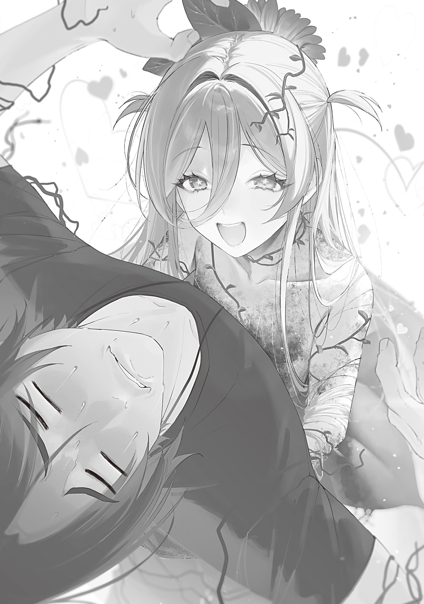

【花の魔女の子、フヨウ】

一年と少し前、俺は花の魔女の次女の助産師を務めた。

両手で持てるぐらいの大きさの小さくて柔[やわ]いプニプニの赤ん坊だった子株は、ほんの短い間に小学生ぐらいまで育っていた。

急成長しているが顔が花の魔女によく似ていて、確かな血の繋[つな]がりが見えた。

「おじさん、ずーっとさがしてたんだからね。あいたかったんだから♡」

子株はするする近づいてくると両手を腰のあたりに回して俺をホールドし、更に蔦[つた]と根で足をぐるぐる巻きにした。

スーッと血の気が引いた。

花の魔女は人を喰[く]うという話が頭を過[よ]ぎる。親が親なら、子も子だ。

「お、え、あっ……く、喰わないでください……！」

「えっ？　あ、ごめんなさい……！」

命乞いを絞り出すと、子株は慌てて拘束を解いて少し離れてくれた。拘束を解いてからも細い蔦の先端で俺の手をさわさわ触ってくるが、締め付けるような感じはしない。

というか、ホールドする力強さも絞め殺してやろうというほどではなかった。

そっ、そうだよな？

命の恩人を絞め上げてぶっ殺して吸い尽くしてやろうなんて、そんな恐ろしい事は考えてないよな？

そう思っていいんだよな？

「ミー……！」

「ミッ……！」

「ミミミ……！」

火蜥蜴[とかげ]たちも俺の怯[おび]えが伝染して怖がってしまっていて、セキタンとモクタンは両手の中で丸くなり、ツバキは俺の足の後ろに精一杯体を小さくして隠れた。

しまった、頼れる護衛達が萎縮してしまった。俺がボスらしく堂々としていないばっかりに……！

「あ、あのー、確かに花の魔女には『たまには顔を出しなさい』って言われてましたけど。そのぅ、悪気はなくてですね、蔑[ないがし]ろにしようとかそういう意図もなくて、ただ、あの、出不精なもので。出頭命令には従いますんで、ど、どどどどうかお手柔らかに……」

花の魔女とその子株が俺に何か接触してくる理由があるとすれば、それしかない。

俺が超振動人間シェイカーになってセキタンとモクタンをガタガタ揺らしながらへりくだると、子株はキョトンとして首を傾[かし]げた。

「？？？　よくわかんない。そうだ！　あのねあのね、おかあさまのおてがみあるよ。おじさんにあげるね」

子株は花びらのスカートの中をまさぐり、一通の手紙を俺に差し出してきた。

俺はガタガタ震えながら両手の火蜥蜴を地面に降ろし、震えすぎて何度も受け取り損ねながら、なんとかガタガタ手紙を受け取りガタガタ震えながらガタガタ読んだ。

この手紙けっこう長いな。しかも文字がガタガタしてない？　いや俺がガタガタしてるせいか。

私の愛娘[まなむすめ]たちの恩人へ

お久しぶりです。花の魔女です。

貴方[あなた]の名前も聞きそびれたまま一年と少しが経[た]ち、季節は巡り春になりました。

貴方の事は時々未来視の魔法使いに視[み]させていました。もっと早く娘を行かせたかったのですが、青の魔女に邪魔される未来しか視えなかったものですから。理由はどうあれ、このような突然の訪問になってしまった事をお詫[わ]びします。

貴方に手紙を渡した娘は名前をフヨウと言います。花の芙蓉[フヨウ]から名を取りました。美しく、上品で、富に恵まれ幸せに暮らせる子になってくれればと願いを込めています。

さて。

今回、フヨウが貴方の許[もと]を訪ねたのには二つ理由があります。

一つはフヨウが貴方に会いたがったからです。

子株の成長は早いもので、すぐに言葉を覚え、情緒も豊かになり、人間とお話ができるようになりました。母として目を見張る毎日です。私の種族の子供は人間とかなり違った速さで大きくなるようですね。

フヨウは自分を取り上げた貴方の優しく温かな手の感触をぼんやりと覚えていて、私が時折貴方の事を褒めたせいもあってか、会いたい、会いたいと可愛[かわい]い我がままをよく言いました。

小さい内はお外は危ないからと止めていたのですが、体も大きくなり、ある程度流暢[りゆうちよう]に喋[しやべ]れるようになり、最低限の判断力もついたので、こうして旅をする許可を出しました。

私の管理区から奥多摩[おくたま]までの道のりで、フヨウは誰にも会わず、安全な遠足を楽しんだはずです。未来視の魔法使いが嘘[うそ]をついていないなら、ですが。

フヨウは貴方に会えて喜んでいるでしょう。貴方はあまり喜んでいないようですが。フヨウは貴方を好いています。優しくしてあげてください。せめて冷たくはしないで。あまり冷たくするようなら、いくら恩人でも私は怒ります。

フヨウが貴方を訪ねた理由の二つ目は、根を張る場所にするためです。

私たちの種族は、大地に広く根を広げ、縄張りにします。しかし荒川[あらかわ]区から台東[たいとう]区にかけての私の管理地にはもう私が根を広げてしまっていて、娘が根を張る余地がありません。

フヨウは最近動き回らずじっとする事が増え、歩くのが下手になってきました。寝ている間に根付きかける事も増えました。早急にこれから根を張り一生を過ごすのに相応[ふさわ]しい、良質な縄張り候補地に移動する必要がありました。

貴方が住んでいる奥多摩は、フヨウの縄張りに相応しい。

充分な広さがありますし、理由は分かりませんが弱い魔物しか出没しない。まだまだ小さなフヨウが対処できないような強力な魔物に襲われる事はありません。安全に健やかに育つ事ができます。綺麗[きれい]な水があり、土も肥えています。

フヨウを手元に置いておきたい、近くの地区に根付かせたい、そんな母心もあります。しかし私の近くの土地は他の魔女の管理区になっているか、そうでないなら強力な魔物が出没し、幼いフヨウには危険です。

フヨウにとって一番良い土地は、間違いなく奥多摩です。貴方には是非娘の移住を受け入れてもらいたい。

とはいえ。

ただお願いしても貴方が断るのは分かっています。そこで貴方にとって良い条件を揃[そろ]えました。

まず、貴方を慕う可愛い可愛い私のフヨウと一緒にいられます。毎日会い、話し、抱きしめる事ができます。貴方はそうするつもりが無いでしょうけど。これは間違いなく最大のメリットです。否定は許しません。

次に護衛です。フヨウには有用な魔法をいくつか教え込みました。奥多摩に今張られている迷いの霧の魔法はもちろん、目玉の使い魔の魔法も、豊穣[ほうじよう]の魔法も使えます。夜の魔法や継火[つぎび]の魔法も覚えています。フヨウは覚えた魔法をいつでも貴方のために喜んで振るうでしょう。精油を振り撒[ま]いて畑の害虫駆除もできます。

フヨウは発音不可音を発音できますから、できれば新しい魔法をどんどん覚えさせてあげて下さい。芸は身を助けると言いますし。娘が強く賢く美しく育ってくれると私は嬉[うれ]しいです。

最後のメリットは杖[つえ]素材の提供です。私たちの種族は、様々な性質の木材を作り出す事ができます。一年前、私が木桶[きおけ]を作るのを見たでしょう？　フヨウも同じ事ができます。堅さもしなやかさも重さも思うがまま。まだ少しおぼつかないところもありますが、成長すれば貴方の仕事に欠かせない伴侶になるでしょう。

さあ、心は決まりましたね？

ここからは娘の教育について、貴方への４つのお願いです。

①化学肥料はどんなに欲しがっても三日に一度、１袋までにして下さい。化学肥料は体に悪いです。

②身の回りの雑草は面倒くさがらずにちゃんと抜く事。貴方が抜いてくれても良いですが、できれば自分で抜かせるようにして下さい。

③水浴びは夕方か朝にするように！　これはしつこく言って聞かせて下さい。昼間に水を浴びると水玉がレンズになって葉っぱを火傷[やけど]したり、夏の猛暑日はお湯になって根っこが茹[ゆ]で上[あ]がったりします。

④目玉の使い魔に手紙を持たせ、毎日私にお手紙を送るように言って下さい。恐らく、最初の一カ月を過ぎた頃からお手紙をサボりはじめると思うので。筆記具はフヨウが自分で作り出すので大丈夫です。

以上４点。

くれぐれもよろしくお願いします。

娘の話ばかりしましたが、個人的に私も貴方を好ましく思っています。訪問はいつでも歓迎します。これからも永く良い付き合いをしていきたいものですね。

花の魔女

読み終える頃には全身の震えは止まっていた。

手紙から顔を上げると、フヨウは短い根っこをうねらせ、俺の後ろに隠れながら威嚇する火蜥蜴たちに威嚇を返していた。

「なまいきーっ！　わたしよりちっちゃいクセに！」

「ミーッ！」

「むーっ！　わたしのほうがおねぇさんなんだからーっ！」

「ミー！」

「まいったして！　ほらっ、ひっくりかえってまいったしなさい！」

「ミミミ！」

俺の靴で半身を隠し、舌をベーッと出して挑発的に笑うツバキに、フヨウは悔しそうに蔦でばんばんアスファルトを叩[たた]いた。アスファルトにちょっとヒビが入ってビビる。

いや強いよ。お前ほんとに一歳児？　成長早過ぎだろ。生まれた時はあんなにヤワヤワで、少し力を入れただけで潰れてしまいそうだったのに。

「なに？　お前こいつらの言葉分かんの？」

「え？　わかんない！　けど、わたしのことそんけーしてないのはわかるもん。おねぇさんだぞー！」

「ミー！　ミミッ、ミミミ！」

「こらツバキ、あんまり威張るんじゃない。格付けは後にしろ」

「ミ……」

俺を挟んで火炎放射と蔓[つる]の鞭[むち]の応酬に発展すると困るので、いったん大人しくさせておく。

未来視で行動を見透かされるのってあんまりいい気分じゃない。

フヨウの扶養は確かに良い条件だけどさあ。要するに奥多摩の護[まも]りが堅くなって、杖の良質素材が手に入るんだろ？　流石[さすが]にメリットでかいよな。

まあ移住には頷[うなず]くんだけど、頷く前提でつらつら書いてあるとなんだかなーとは思う。

俺はポケットから青白い目玉の使い魔を出し、ぺしぺし叩いてコールしてから話しかけた。

「もしもしヒヨリ？　今、奥多摩の入口あたりに花の魔女の子株が来ててさあ。移住許可出す事にしたから。面通しに来てくれ」

「……はっ？　何を言っている？　花の魔女がなんだって？」

「詳しくはこっちで話そう。じゃ」

「おいこら、お前っ」

何か言っている目玉の使い魔をポケットに押し込み、俺は精一杯蔦と根っこを広げて火蜥蜴たちを威嚇しているフヨウに言った。

「お前のお母さんの手紙は全部読んだ。奥多摩に住んでいいぞ」

「えっ、ほんとー!?　やったー！　おじさんだいすきー♡」

威嚇を止[や]めて喜びも露[あら]わに抱き着いてこようとするフヨウを一歩下がって避[よ]ける。

挫[くじ]けずハグしてこようとする子株の頭を手で突っ張って拒否しながら、俺は移住条件を提示した。

「ただし。家と畑の周りには近づくな。あと水車がある川辺にも。今言った場所には根を張るな、蔦も伸ばすな。顔を見せるな。縄張りにしていいのは奥多摩の中でも俺の生活圏の外側だけだ」

「…………？　え、もういっかいいって？」

「俺ん家[ち]の周りに近づくな。それが守れるなら奥多摩に住んでいい」

「？　わかった！」

「絶対分かってないやつだ……まあ後で色々案内しながら教えてやる」

「ひろいナワバリーっ！　おじさんといっしょーっ♡」

フヨウは嬉しそうに蔦と根を躍らせている。

こいつほぼ初対面なのにやたら好感度たけーな。

……高いんだよな？　これは。花の魔女の手紙にもフヨウは俺が好きって書いてあったし。

わっかんねぇなあ。命を救われ恩に着るのはわかるけど、それで好きになるもんかね？

その理屈だと俺は盲腸の手術してくれたお医者さんにゾッコンＬＯＶＥじゃないとおかしいぞ。意味わかんないだろ。

数分の間、人の感情と恩義の関連性について哲学的熟考をしていると、道路の向こうからキュアノスを握りしめたヒヨリが爆速で走ってきた。

俺とフヨウの間に飛び込んで急停止し突風を吹き散らし、フヨウにキュアノスの先端をビタリと向けたところで鬼気迫る迫力は萎[しぼ]んだ。

「お前は……なんだ？　花の魔女じゃない……？」

「言ったろ。娘だ」

「わあ、きれーなつえ……あっ！　アオのまじょにもおてがみあるよ。はい、どーぞっ！」

「あ、ああ。ありがとう？」

ヒヨリはキュアノスをフヨウに向けたまま困惑しながら手紙を受け取った。

手紙を片手で開いて読んだヒヨリは無言で握り潰し、ポケットに突っ込んだ。

「なんて書いてあったんだ？」

「……ああいや、大した事じゃない。奥多摩の護りが堅くなれば、慧[けい]ちゃんの護衛についている時に大利[おおり]を心配しなくて済むという話だ」

「それな。いいだろ？」

「そもそもこの子が信用できるかという話だが」

ヒヨリは疑[うたぐ]り深[ぶか]くフヨウをじろじろ見た。視線に気付いたフヨウは青の魔女様にしっかり向き直り、花びらのスカートをちょこんと持って挨拶[カーテシー]をする。

「アオのまじょ。わたしのなまえはフヨウ！　１さいです。いいこですっ」

「……ああ、うん。青の魔女です。自己紹介できて偉いね」

「えへ」

褒められたフヨウは嬉しそうに微笑[ほほえ]んだ。

ヒヨリの身体から警戒の緊張が抜けていき、キュアノスが下げられる。

警戒解くの早くね？　いやいいけど。俺もだいたい安全とは思うし。

「いいのか？」

「花の魔女は馬鹿じゃないし、娘を策略に利用する事は絶対にありえない。娘のために策略を巡らせる事はあるだろうが」

「確かに。それはそう」

キノコパンデミックの時も、数百万の命と娘の命を天秤[てんびん]にかけて、余裕で娘をとってたからな。本当に短い付き合いだが、娘を利用して俺をどうこうする事は無さそうだと俺ですら分かる。

むしろ俺がフヨウを意図せず傷つけて花の魔女をキレさせる心配をした方が良さそうだ。

俺はそーっと手に伸びてきていた蔦を振り払い、火蜥蜴たちに合図して自宅へ向かった。なにはともあれ、警備担当と話はついたし、移住するなら家に案内しない事には始まらない。畑と家を見せて、近づかないように言い聞かせないとな。

俺とヒヨリが並んで先頭を歩き、その後ろから火蜥蜴とフヨウがわちゃわちゃしながらついてくる。

特に話す事もないのでぼんやり歩いていたのだが、ポケットの中の手紙をガサガサいわせていたヒヨリが咳払[せきばら]いをして話しかけてきた。

「なあ、大利」

「ん？」

「今年の夏なんだが、一緒に海に行かないか？」

「行かない」

恐ろしい事を言わないで欲しい。そんな事をしたら真夏の太陽と陽キャの群れに焼き尽くされ灰になってしまう。

ゾッとして震える俺に、ヒヨリは続けた。

「だよな。なら川はどうだ？　奥多摩の川で一緒に釣りとか、水遊びとか」

「おー、いいね」

別に川遊びが大好きという訳でもないが、生き地獄の話を聞いた直後だとやたらと魅力的に聞こえる。思えば久しく川遊びなんてしていない。

「じゃあどっちがデッカいスッポン捕まえられるか競争しようぜ！　ミシシッピアカミミガメはノーカウントな」

「分かった。じゃあ、約束だ。水着を用意しておけよ。私も用意しておく」

「え、短パンで良くね？　ああいやお前は良くないのか。悪い、失言だった。分かった、俺もなんか用意しとくわ。高校の時の水泳ゴーグルまだ捨ててなかったかな……」

俺は心なしか機嫌を良くしたヒヨリを連れ、ぞろぞろ魔物たちを引きつれて我が家へ向かった。

フヨウは言動こそかなり幼いが、物覚えは良かった。

俺が教えた川辺の水車や釣り場、畑と田んぼの場所はすぐに覚えた。

裏山の反射炉と家の場所までしっかり記憶できたところまでは良かったのだが、そこからが問題だった。

嬉しそうにいそいそ裏庭の井戸横に行き、地面に根っこを突き刺し始めたフヨウを俺は全力で引っこ抜いた。

両脇腹に手を入れてスポンと引き抜くと、フヨウはびっくりした顔をする。

「え。ここだめ？　もっとおうちのちかくがいい？」

「根っこ張ろうとしたんだろ？」

「うん」

フヨウは素直に頷いた。

「場所の説明は聞いて、覚えただろ？」

「おぼえたよ！」

フヨウは元気に手を突きあげた。

「いいか、よく聞け。さっき説明して案内した場所には入っちゃいかん。もちろん、この家もダメだ。説明してない場所にだけ根を張れ。つまり、俺に近づくな」

「……なんで？　おじさん、わたしのこときらい？」

フヨウは傷ついた目を潤ませ俺を見上げてきた。

なーにを被害者面してんだガキんちょが。俺だって傷ついてる。具体的には胃とか。あと盲腸とか。

俺も友達ができて精神的に成長した。こうやってある程度社交的な自分を装って、多少は話せるようになった。

が、それはストレスを感じなくなったという事ではない。

ストレスを感じていないフリをしながら喋る事を覚えただけだ。

しかもそれも長続きはしないし、子供相手だからなんとか取り繕えているに過ぎない。

はやいとこ縄張りを理解し、俺の視界から消えてくれないと困る。

ストレスで胃腸に負担をかけたくない。

「フヨウの事は嫌いじゃないが、苦手だ。どっかいってくれ」

「大利、言い方。相手は子供だぞ」

「ストレートに言わないと通じねぇだろ」

ヒヨリが窘[たしな]めてきたが、こうでも言わないと伝わりそうにないから仕方ない。

フヨウは１歳児にしては異常に賢いが、語彙が少なく、難しい言葉が理解できていない様子だ。

俺は相手がちゃんとした大人でも会話が怪しいんだぞ。子供相手に言葉を選んで気遣った会話なんてできるわけねーだろ！　ごめんね！！！

手でシッシッと追い払うジェスチャーをすると、フヨウは涙を引っ込め、根っこと蔦を振り回して不満を爆発させた。

お前嘘泣きかよ。小賢[こざか]しい。

「やだーっ！　わたしもおじさんのおうちすむもんんんん！」

「俺もやだ！　なんで友達でもないガキと毎日顔を突き合わせなきゃならんのだ。断固断る！」

俺も負けじと不満を爆発させるが、フヨウは生意気にも張り合ってくる。

ヒヨリは呆[あき]れた様子で仮面の上から額を押さえた。

「ツバキもセキタンもモクタンもすんでるでしょ！　なんでわたしだけだめなの!?」

「ミーッ！　ミッミッミッ！」

「こら笑うなツバキ」

「ずるだーっ！　ずるっこだーっ！　とった！　わたしがすむのに！　とったぁーっ！」

「あーあー、うるせぇなあ。あんまりワガママいうと俺にも考えがあるぞ」

このワガママぶり。相当花の魔女に甘やかされて育ったと見える。

俺は軽く脅したが本気にした風もなく、フヨウはますます激しくダダをこねる。

「やだやだ、やだったらやだ！」

「いいんだな？　聞き分けないと俺もやる事やるぞ？」

「やだっ！　わたしもおじさんのおうちにすむーっ！」

「よし分かった……やだーっ！　やだやだやだやだ！　やだーっ！！！」

俺が裏庭の土の上に転がりあらんかぎりの声を張り上げじたばたダダをこねはじめると、フヨウはびっくりして固まった。

ちょっと離れて俺達を見ていたヒヨリと火蜥蜴たちもあまりの迫力に後ずさる。

「フヨウを俺ん家[ち]に住まわせたくないぃいいい！　顔も見たくない！　俺に見えないところで幸せに健やかに生きていてくれないとやだやだやだやだやだ！　やだーっ！！！！」

「えっ……あ、あの……ワガママいってごめんなさい……」

「ハン。さっさとそう言えばいいんだ」

俺はすっかり恐[おそ]れ戦[おのの]き格の違いを理解した様子のフヨウに頷き、立ち上がって服についた土を払った。

フッ、大人の恐ろしさでガキを分からせてやったぜ。

見たか、子供には決して出せない迫力を。二度と逆らうんじゃねぇぞ。

花の魔女には俺の断固とした躾[しつけ]を見習って欲しい。

フヨウはしばらくオドオド俺の顔色を窺[うかが]っていたが、連絡用の目玉の使い魔を寄こすように言うと、嬉しそうに魔法を使い木の実のような茶色っぽい使い魔を出して俺に握らせウキウキ山に分け入っていった。

それを見送り、フヨウの姿が木々の向こうに消えるか消えないかのうちに使い魔から声が届く。

「おじさん、わたしここにするね！」

「早いなおい。近い近い。まあギリ見えないからいいけどさあ……」

「あのね、ねっこひろげてると、ちょっとねむくなるけど。きょうもあしたも、いっぱいおはなししてね！　それでね、いつかおかあさまみたいにびじんになるから、そしたらあいにきてね？」

「何言ってんだ？　お前はこの俺が取り上げた子だぞ。しかもこの奥多摩で育つんだ。花の魔女より美人になるに決まってるだろ」

俺が物の道理というものを知らない無知な子供に単純な事実を教えてやると、使い魔越しに鳴き声のような何か複雑な感情が込められた声がした。

そしてヒヨリの手がスッと横から伸びてきて使い魔を握り潰す。

何事かと目線で尋ねると、ヒヨリは少し黙った後に端的に答えた。

「長電話は嫌いだろう？　早めに切っておけ」

「ああなるほど？　長電話フラグだったか」

「それと……あー、たとえ相手が子供でも、急に突き刺す発言は慎むように」

「え。何が？　どの発言？」

「分からないならいい。お前は本当にどういう感性をしているんだ？　コミュ障なのか口が上手[うま]いのかはっきりしろ。まったく」

ヒヨリは何やらちょっと怒りながら帰っていった。

なんだあいつ。俺の事コミュ障コミュ障っていうけど、お前も時々わけ分かんねぇからな？　お互い様だ。

---

フヨウは本人が言った通り、数週間の間を根を広げるために費やし終始眠たげだった。

毎日使い魔越しに連絡こそ来るものの、見た事のない虫を捕まえたとか、魔物を初めて一人で絞め殺したとか、崖の下で岩の下敷きになっている古い白骨死体を見つけたとか、そんな物騒だが完結した内容にとどまる。

アレやってとかコレやってとか、恐れていたワガママはあまり言ってこない。最初の躾でガツンとやったのが効いたらしい。

しかもヒヨリと違って長電話をしないし、夜中に突然かけてもこない。通話をかけてくるのはだいたい日の出か、南中時刻か、日の入りの３パターンだ。植物的にそのあたりが時間感覚としてハッキリ把握できるからだろう。たぶん。

俺としては新しいご近所さんが良い子でいてくれて嬉しい。

嬉しそうじゃないのは火蜥蜴たちだ。

初対面で威嚇し合っていた火属性と草属性は、何週間経っても火花を散らしていた。

毎日ド突き合いに、マウントの取り合いに、バッチバチだ。

今日も朝早くからツバキが寝室にやってきて、縄張り争いの招集をかけてくる。

ツバキよ、お前のボスはまだ寝てるんですが？

「ミミミーミ、ミーミミ！」

「またかよ……俺はいーから。お前らだけでやれよ……」

「ミーミッ、ミーミッ、ミーミーミッ！」

「分かった、分かったからせめて着替えさせろ」

ミーミー鳴きながら布団の上でポンポン跳ねるツバキに起こされ、寝ぼけ眼をこすりながらパジャマを着替えて裏庭に行く。

裏庭には、兜[かぶと]のつもりなのかドングリのヘタを頭にちょこんと被[かぶ]って武装したモクタンと、顔に泥を塗りたくって迷彩柄になったセキタンが既に待機していた。

なんだぁ？　どんだけ可愛いければ気が済むんだお前らは。いい加減にしろよ。

「ミーミ。ミミミミ、ミミ。ミミーミ、ミミミーッ！」

「ミー！」

「ミー！」

俺を呼び出したツバキが興奮して後ろ足で立ち何やら気炎を上げれば、二匹は元気に鳴いて応える。

なんかヤル気を出してる。フヨウが現れて以来、三匹の団結力が強まっている気がする。

一体何をするつもりなのかと眺めていると、裏庭の菜園のブロッコリーを植えているあたりに三匹でチョロチョロ移動し、前脚で一生懸命土を掘り返しはじめる。

催促するように鳴かれたので穴掘りを手伝ってみれば、俺の二の腕ぐらいの太さのゴツい根っこが掘り当てられた。

「うおっ。なんだこれ？　畑作る時にデカい根っこと石は除去したはず……いや、フヨウの根か？」

「ミー！」

「ミッ！」

「ミミミ！」

顎に手を当てフヨウの根の伸長の早さに感心していると、火蜥蜴たちは露出した根に向けて一斉に火を吐いた。

水分をたっぷり含んだ根はもうもうと白い水蒸気を上げながらみるみるうちに萎[しな]びて燃え上がり、あっという間に灰と化した。

裏庭に面した山の斜面の木々の向こうから、タンスの角に足の小指をぶつけたような痛そうな悲鳴が上がる。

フヨウの悲鳴を聞いた三匹の火蜥蜴たちはミーミーとワルそうな笑い声を上げた。

まーたこんな小競り合いしてんのか、お前らは。

呆れているとフヨウの怒声が聞こえてきた。

「なんてことするのーっ！　いたいでしょーっ！」

「ミーッ！」

「バカにしてーっ！　こっちきなさーい！　やっつけてやるんだから！」

「ミミミー！」

火蜥蜴語は分からんが、ツバキのキリッとした顔つきを見れば「受けて立つ」と思っているのはすぐ分かった。好戦的だ。

フヨウとの縄張り争いを主導するのはいつもツバキだが、三匹の中で一番温和なセキタンですら戦化粧をしているあたり、これは火蜥蜴たちの総意なのだろう。

「お前らさあ。喧嘩[けんか]はいいし、仲良くしなくてもいいけど、ほどほどにしとけよ」

「ミーミ！」

分かっているのか、いないのか。ツバキは勇ましく口から火の粉を散らし、先陣を切ってフヨウが植わっている山の斜面に向けて進軍を始めた。

火蜥蜴たちが日常的に往復しているのがよく分かる山の斜面にできた焦げ付いた細い獣道を登ると、すっかり土地に根付いて枝を増やしたフヨウに出迎えられた。

フヨウは目を吊[つ]り上[あ]げて火蜥蜴を威嚇してから、俺に気付き甘ったるい声で蔦を伸ばしてくる。

「あーっ！　おはよー、おじさん♡　おちゃでもいかが？」

「いらん」

「ミミッ！」

「ツバキたちはみずたまりでもなめてて」

「ミーッ！」

火蜥蜴たちとフヨウは互いに舌を出して「べーっ」をした。

すっげぇ子供の喧嘩だ。青の魔女の喧嘩とか、他の魔女の足を引き千切ったりするからな。それと比べたら可愛いもんだ。

俺は鼻息荒く前のめりになって今にも突撃しそうな火蜥蜴たちに「待て」をして、せっかくの機会なのでフヨウに頼み事の進捗を聞く。

「フヨウ。杖素材はどうなった？」

「つえそざい……？　えっと、ハクボクのこと？」

「そう。安定生産できそうか」

「んっとね、ハクボクはもうちょっとかかるかも。そだてるのたいへんなの」

フヨウは自分の背後に生えた葉まで真っ白な若木を振り返り、すまなそうに言った。

花の魔女の種族は、一人につき一本の特殊補助樹木、即[すなわ]ち白木[はくぼく]を持つのだそうだ。

根本から葉先まで全てが白い白木は、地下茎を通じて本体と接続された栄養と魔力の貯蔵器官である。飢えた時には貯[た]めておいた栄養を引き出して腹を満たせるし、栄養を取り過ぎて太りそうな時は余分な栄養を預けておける。

花の魔女は樹高50ｍもある天を衝[つ]く巨大な白木を持っていた。大量の人や魔物の死体を吸い上げ、何年もかけてジックリ育てた、養分のメガバンクだ。キノコパンデミックの時は衰弱したヒヨリのために白木に蓄えられた養分を消費し、栄養ドリンクを作ってくれたりもした。

花の魔女の愛娘で一歳児のフヨウの白木は、母親よりずっと小さい。奥多摩に根付いてからまだ一カ月足らずの若い白木は俺の肩ぐらいの高さしかない。枝は細く、風が吹くたび幹が揺れ、頼りない。

そんな白木でも杖素材として優れた性質を発揮する。

花の魔女の手紙に「フヨウに杖素材作ってもらったら？」みたいな事が書いてあったので作れる木材を一通り作ってもらったのだが、検証の結果、白木が一番良かった。

検証を手伝ってくれたヒヨリ曰[いわ]く、白木材は魔力コントロールを助けてくれるらしい。

これは俺が魔工具を使うようなものだ。普通の工具では俺の本来の器用さを十全に発揮できない。精密加工特化の魔工具があって初めて、俺の器用さを余すところなく出力できる。

白木材も魔力コントロール技術を発揮するための良質なツールになる。

元々魔力コントロールができない奴[やつ]にとっては白木材なんてなんの効果も無いものではあるが、魔力コントロールができる奴にとっては、無くても大丈夫だけどあったら嬉しいよね、という程度の効果を感じるという話だった。

靴を履く時の靴ベラのようなものだろう。あるいはカレーライスについてくる福神漬け。

魔石は魔力の流れが良く使い心地が良いと評判だから、呼吸をするように魔力コントロールをしている超越者たちにとっては魔力を扱いやすくしてくれる白木材の杖もまた好印象に違いない。

高機能高級路線を謳[うた]う魔法杖職人[ワンドメーカー]０９３３ブランドとして、白木は今後製作する杖素材に是非とも使っていきたい。

だから、白木供給元のフヨウには期待がかかるところだが。

「キュアノスの柄は換装したけどさあ、オクタメテオライトとヘンデンショーの柄も換装したいんだよな。下塗り試験用に予備も欲しいし。次の生産いつ頃になりそう？」

「う～ん……がんばるけど……おひさまのきぶんもあるし……あっ！　おじさんがいいこいいこしてくれたら、わたしもーっとがんばっちゃうよ♡」

「やだよ。お前、先週もそんな事言ってかまってちゃんした挙句満足してなんもしなかっただろ。ガキがよぉ、約束は守りなさいってママに教わらなかったのか？」

「やくそくはー、じょうずにりよーしなさいっておかあさまいってた！」

「利用て。ロクな教育受けてねーな」

花の魔女も豊穣魔法伝授やキノコ病特効薬と引き換えに法外な巨利を得ていたし、種族としてそういう利己的な思考回路をしているのかも知れない。いや、単純に親の教育方針か？　よく分からん。

花の魔女は確かに約束という契約行為を巧みに利用していた節がある。が、約束を破りはしなかった。フヨウも母の真似[まね]をするなら上っ面だけじゃなくてちゃんと芯まで真似して欲しい。

あれこれフヨウと話していると、ヤル気だったのに放置された火蜥蜴たちがじれったそうに靴紐[くつひも]を咥[くわ]えて引っ張ってきた。

俺とフヨウを交互に見上げミーミー鳴く火蜥蜴たちに、フヨウは勝ち誇ったドヤ顔で言う。

「ふふーん♡　わたしは、おじさんのおてつだいしてるもんね。あいぼーだもん。ツバキとセキタンとモクタンは、ただのペット！　おじさんのペット！　わたしのかちーっ！」

「ミ……？」

「ミ～……？」

「ミミミ……？」

ところがフヨウ渾身[こんしん]のマウンティングは言葉が難しくて火蜥蜴たちには伝わらなかったらしい。

首を傾げて顔を見合わせる火蜥蜴たちに、フヨウは一瞬困り顔になって考えてから、また勝ち誇った表情に戻り分かりやすく言い直した。

「ツバキはざこ！　セキタンもざーこ！　モクタンだって、よわいんだ！」

「!?」

「ッ!?」

「ー!!」

今度はちゃんと伝わって、火蜥蜴たちは口から火の粉を飛ばして怒り出す。それを見てフヨウは楽しそうにケタケタ笑った。

やっぱお前ら、仲いいだろ。「喧嘩するほど仲がいい」なんて嘘っぱちだ、喧嘩したら普通に仲悪いだろと思っていたが、コイツらを見ていると本当なのかもと思えてくる。本気で毛嫌いしていたら顔も見たくないはずだし。

挑発された火蜥蜴たちがフヨウに飛び掛かって火を吹きはじめ、フヨウは何本もの蔓の鞭を操りそれに応戦する。

俺は気配を消しそっと退散した。ツバキは俺を旗頭にしてフヨウと戦いたかったようだが、巻き込まれたら大怪我[おおけが]必至。勝手にやっててくれ。

朝から子供の喧嘩に引っ張り出されて気疲れした。昨日の晩飯の残りを温めて朝食にしようと家に戻ると、ちょうどヒヨリが合鍵で玄関の戸を開けているところだった。

「ん？　なんだいたのか。おはよう、大利」

「おー。どうした？　なんかあったか」

「いや些細[ささい]な話なんだが。杖に不具合があったらどんな事でも言えと言っていただろう？　柄の塗装が剥[は]がれたから」

「あ～……やっぱ下塗り塗料と素材の相性悪かったか。そんな気してたんだよな」

メンテナンスにやってきたヒヨリを中に入れ、台所に寄って冷や飯のお握りをパパッと作ってから工房に移動する。

お握りを咥えながらキュアノスを預かり、リムーバーでささくれ立ったパリパリの塗料を除去していると、ヒヨリが裏山の方を壁を透かすようにして見ながら呟[つぶや]いた。

「火蜥蜴とフヨウはまた喧嘩しているのか」

「そうだけど。なんで分かるんだ？」

「魔力が励起してぶつかり合っていれば、多少距離があっても感じ取れる。大利も車が走る音が聞こえれば近くで車が走っているぐらいは分かるだろう？」

「あーね」

具体的な車種とか距離とかまでは分からなくても、あっちの方でなんかやってる、ぐらいは分かるみたいな感じか。ヒヨリは喩[たと]えが上手い。

超越者特権とも言える魔力感覚に感心している俺に、ヒヨリは控え目に続けた。

「いいのか？　放置して」

「なんで」

「あの子たちは会ってからずっと毎日喧嘩ばかりだろう。良い事だとは思えない」

語気に真剣みを感じ、口の中のご飯粒を全部呑[の]み込んでからヒヨリに向き直る。

なんすか。俺の教育方針に文句でも？

「別にいいだろ、喧嘩してても。何も殺し合いしてるわけじゃないんだし、どっちかがまいったすれば終わってるみたいだ。子供のじゃれ合いだ、ほっときゃいい」

「フヨウも火蜥蜴も魔物だぞ。人間の子供じゃないんだ。火を吐いて蔓で殴打して、大怪我したらどうする？　加減ができる年齢でもないだろう」

「そんな過保護な。アイツらも一挙手一投足にイチイチ指図されたくねーだろ。子供なりに自分で考える頭持ってるんだからさあ、勝手に上手くやるよ。本当にダメな事した時だけ叱れば良い」

世話焼きはヒヨリの美点だが、場合によりけりだ。

俺は親に「トモダチツクレ」とか「アイソヨクシロ」とか口うるさく言われて良かったと思った事は一度もない。当たり前だ。ペンギンに空を飛べと命じるようなものだ。

人にはね、適性ってモンがあるんです。魔物にもある。

あーしろこーしろと指図したって良い事はない。大人の上から目線のアドバイスは、往々にして子供にとってはウザったい有害な命令でしかないのだ。

「放任はダメだろう。火蜥蜴は大利の大切なペット、フヨウはその手で取り上げた子供なんだろう？　もっと親身になって、愛情を注いでやれ。喧嘩の仲裁をしてやるべきなんじゃないか」

「だーからそれが過保護なんだって。子供の喧嘩にさあ、親とか先生が出しゃばってさあ、無理やりお互いにゴメンナサイさせられてさあ、スッキリ丸く収まるか？　全ッ然根本的な解決にならないの、目に見えてるだろ」

まごう事なき正論を言っているのに、ヒヨリは納得の様子を見せない。

なんでこんな子供の教育方針でモメる親みたいな会話をしなければならんのだ。

ちょっとイライラしていると、ヒヨリは慎重に言葉を選びながら俺の膝にそっと手を置いてきた。

「大利の言う事も分かる。大利にとって、大利のやっている事は正しい。だが、世の中はみんながみんな大利のようではないんだ。大利とは考え方も感じ方も違う奴ばかりなんだよ」

「十人十色って言いたいんだろ？　そんなん分かってる」

「本当に？　大利は、本当にフヨウと火蜥蜴が嫌い合っているなら距離をとって会話も拒否するはずだ、毎日顔を突き合わせて喧嘩してるなら仲が良い、なんて考えているんじゃないか」

「え。こわ、読心魔法使った？」

言ってないはずの心の中を完璧に読まれて恐れ戦く。

魔女、怖い！　すぐこういう事する！

ヒヨリは恐怖に震える俺に苦笑して続けた。

「考えてる事が分かりやすいだけだ。いや、たまに斜め上のワケの分からん考え方をするが……それはそれとして……こほん。とにかく！　私はフヨウと火蜥蜴の喧嘩は仲裁してあげるべきだと思う。大利がして欲しい事と、あの子たちがして欲しい事は別だ」

「うーん……？」

「もっと言えば、あの子たちがして欲しい事と、あの子たちのためになる事も別だ。今はじゃれ合いの喧嘩でも、エスカレートして心から憎み合うようになったらどうする？　保護者のお前が、止められる内に止めてやれ」

「ふむ……」

切々と諭され、なんだかヒヨリの言い分にも一理あるように思えてきた。

フヨウも火蜥蜴も一歳児。赤ちゃんだ。

そして俺のコミュニケーション能力も赤ちゃんだ。

自主性の尊重は赤ちゃんには荷が重いのかも知れない。いったん、ヒヨリの言う通りにしてみるのもアリか。

「大利はフヨウと火蜥蜴たちに好かれている。何の関係もない私が言っても逆効果だろうが、大利が言って聞かせればお互い矛を収めるさ」

「お、おう」

関係なくはねぇよ火蜥蜴たちの実母だろ、と思ったが何も言わないでおいた。ただでさえ難しいコミュニケーション問題をこれ以上難しくする必要はあるまい。

キュアノスのメンテナンスを終わらせ、ヒヨリに追加の助言をいくつかもらい、俺は再びフヨウの根本を訪ねた。

今回の小競り合いの勝者はフヨウで、細い蔓で三匹まとめて縛り上げられた火蜥蜴たちが宙吊[ちゆうづ]りにされてミーミー抗議の声を上げていた。

「まいった？　まいった？」

「ミーミ、ミーミーミミッミ、ミミミ！」

「バンザイしてまいったしたら、おろしてあげる。まいったしないなら、しめあげちゃうよ？」

「ー！」

三匹の火蜥蜴たちは口から黒っぽい排ガスを吐いてジタバタしている。ガス欠らしい。火蜥蜴も無限に火を吐き続けられるわけではないのだ。

一方、フヨウも蔓と葉があちこち焼け焦げて、花びらスカートの端が燻[くすぶ]っている。

フヨウの勝ちだが痛み分けに近いか。

「フヨウ、下ろしてやれ。ツバキ、セキタン、モクタン、こっち来い」

声をかけるとフヨウは素直に獲物を解放し、ボコられた火蜥蜴たちはヨタヨタ俺の足元に走ってきた。

三匹には木炭と石炭と椿油[つばきあぶら]をくれてやり、フヨウには液体肥料のボトルを投げてやる。

いったん飯食って落ち着け。そして対立の理由を教えてくれ。

「今更な疑問だけどさあ、フヨウは火蜥蜴の何が気に入らないんだ？　縄張り被り？」

「おじさんのそばゆずってあげてるのに、ツバキなまいきなんだもん。セキタンはムシするしー、モクタンはひっかいてくるしー。きらーい！」

フヨウは液体肥料のキャップを開けて焦げた花びらにかけながら口を尖[とが]らせた。

ふむふむ。生理的に無理、みたいな話ではないのか。フヨウは陽キャvs陰キャみたいな種族的断絶は感じていないらしい。態度が気に食わん、と。

俺は足元のペット達に目を移した。

「お前らはフヨウの何がそんなに気に入らないんだ？　言ってみろ」

「ミミ、ミミミミミミ」

「ミミーミミーミ！」

「ミ～……ミッミーミ」

三匹は餌を頬張[ほおば]りながら一生懸命ミーミー鳴いて意見陳述を行う。

俺は深く頷いた。

「なるほど。何言ってんのか分かんねぇ」

「ツバキたちは～、わたしがねっこひろげると、もやしてくるよ。イジワルなの！　ひどいよね？」

「ほーん。じゃ、縄張り意識っぽいな」

火蜥蜴たちの態度は仕方ない。コイツら、俺のシャツを勝手にタンスから引っ張り出して巣に持ち去ったりするし、台所の食用ごま油を浴びて全身テカテカのまま歩き回って家じゅうベタベタにしたりするし。群れのボスとして尊敬されている俺ですら手を焼いているんだから、フヨウに対してお行儀よくさせるのは無理だ。

フヨウの縄張り拡張も仕方ない。植物なんだから、根を伸ばすのは本能だ。根詰まりを起こすほど窮屈にさせたら、花の魔女が娘を広い奥多摩に送り込んだ意味がない。親からクレームが来てしまう。

…………。

……おい待てよ？　どっちも仕方ないという結論になってしまった。

やばい詰んだ。喧嘩不可避。

ヒヨリ先生～！　コミュ障に喧嘩の仲裁は難しいです！　オコジョ教授連れてきて！

ウンウン悩んだが、考えるほどに分からなくなるので、話を俺の得意な土俵に引きずり込む事にした。

喧嘩とか仲違[なかたが]いとか、そういう対人摩擦の話はよく分からん。

だが、職人としてのリスペクトの話なら分かる。

そこを突いてみよう。

「ツバキ。お前に作ってやった新しいミニチュア杖な」

「ミッ？」

「アレの柄は白木の端材で作ってるんだ」

「ミ……？」

「これ。杖、素材。加工。これ。分かるか？」

ツバキを手のひらに乗せて白木の目の前まで持って行ってやると、不思議そうに白い木を至近距離でジロジロ見た後ハッとして目を見開いた。

「ミミ！　ミミ！　ミミ！」

「そう。つえ。杖だ」

気付いたようだ。

お前のお気に入りの宝物は、フヨウ協賛で作られているのだ。

「セキタンのお気に入りの笹舟[ささぶね]もフヨウの葉っぱで作ったんだぞ」

「ミ……」

「モクタンだって、喧嘩した後にコッソリ炭になったフヨウの枝とか食べてるだろ」

「ミミミ……」

フヨウの葉や炭化した枝の切れ端を見せながら言えば、セキタンとモクタンも決まりが悪そうに目を逸[そ]らした。

火蜥蜴よ。お前たちも大利工房の一員なら、素材提供者へのリスペクトは理解できるはず。

大人しくなった火蜥蜴たちを見下ろし勝者のドヤ顔をしているフヨウにも言う。

「フヨウ。お前が首にかけてる御守り[アミユレツト]な、」

「え、ヤダ！　かえさない。おじさんのプレゼントだもん、もうわたしのだよ！」

「違うそうじゃない。その御守り[アミユレツト]、火蜥蜴たちの火で鍛えた金属とグレムリンを使ってるんだぞ。俺と火蜥蜴が一緒に作った共作だ」

「えっ……」

その情報は、火蜥蜴たちを小馬鹿にしていたフヨウにとって想像の埒外[らちがい]だったに違いない。虚を突かれたようだった。

「あなたたち、こんなキレイなのつくれるの……？」

「ミー」

「ミッ」

「ミミミ」

フヨウが蔓の先で御守り[アミユレツト]を引っかけて揺らし驚いて聞くと、火蜥蜴たちは自慢げに胸を張った。

俺の激ニブ対人センスでも分かるぐらい、ほんわかした空気が流れる。

「別にお互い気に入らんとこがあってもいい。でも、良いとこ探しもしてみろよ。喧嘩ばっかりじゃなくてさ」

最後に一押しすると、まずモクタンが頭をぷるぷる振りドングリ兜を脱いで地面に落とした。

続いてセキタンが小石に顔をこすりつけて泥の戦化粧を落とす。

二匹の行動を見たツバキも、仕方なさそうに舌をしまって尻尾の火の勢いを弱めた。

素直で偉い！　火蜥蜴たちは和解の姿勢を見せた。フヨウ、お前は？

「ふ、ふーん？　まいったするんだ。ならあやまって。いままでのことぜんぶ、」

「フヨウ。素直に」

「…………。いいよ、なかよくしてあげる。わたしのほうがおねぇさんだから」

フヨウは肩の力を抜き、ちょっと笑って蔓の先で三匹のおでこをつついた。

火蜥蜴たちは少し迷ってから蔓を甘噛[あまが]みし、フスーッと煙を吐いて巣に帰っていく。

俺も御守り[アミユレツト]を弄[いじ]って考え込むフヨウをそのままにして、帰宅した。

喧嘩仲裁任務完了だ。あの感じならもう面倒事にはなるまい。

全員俺の魔法杖作りを手伝う奥多摩の愉快な仲間たちなのだから、仲が良いに越した事はない。

ひとまず丸くおさまったものの、こんなので良かったんだろうか、という不安もある。

喧嘩を辞めさせたいという俺の都合で、火蜥蜴とフヨウの自然な感情を誘導してコントロールしてしまったような気がする。

それって歪[いびつ]じゃないか？

健全な関係と言えるのだろうか……？

いや、でも。

ヒヨリは「あの子たちがして欲しい事と、あの子たちのためになる事は別」と言っていたし。喧嘩の仲裁は間違っていなかったと思いたい。したい事をしたいようにさせてやるのが最善手とは限らない……はず……

考えるほどに思考の迷宮に入り込んでいくようで、ワケが分からない。

魔物同士の関係も、人間関係と等しく面倒くさい。

しかし火蜥蜴とフヨウの仲が俺の介入のせいで悪くなったなんて事は無さそうだし。

俺も感情の機微というものが分かってきたのだと思いたい。

きっとなるようになるだろう。
