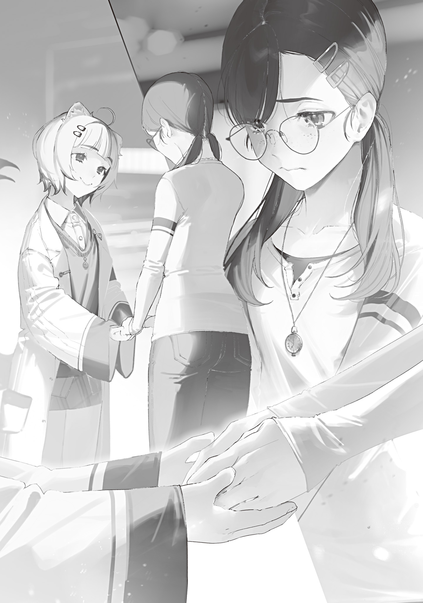

【魔法大学抗争】

東京魔法大学魔法言語学科准教授七瀬[ななせ]七海[ななみ]は、大[おお]日向[ひなた]慧[けい]を敬愛している。

大日向の薫陶を受けた学生で、彼女を敬愛していない者の方が少ない。学生から研究生へ、研究生から准教授へと昇格していっても、敬愛は薄れるどころか強まるばかりだ。

賢く優しく親切で明るく可愛[かわい]らしい学長は、どんなに偏屈な人間にも好かれてしまう。七瀬も例外ではなく、ストーカー騒動を契機に密[ひそ]かに学長ファンクラブを組織し、敬愛する大日向に近づく不審者の排除とファン統制に動いていた。

朝早くに緊急事態宣言が発令された時、七瀬は大日向と共に資料室前の廊下にいた。

「緊急事態宣言発令！　二時間後、敵対勢力による東京襲撃あり！　待機し救助を待て！

緊急事態宣言発令！　二時間後、敵対勢力による東京襲撃あり！　待機し救助を待て！

緊急事態宣言発令────」

文京[ぶんきよう]区役所から飛んできた目玉の使い魔が構内を飛び回り、警報を繰り返し隅々まで届ける。

ほんの数秒前まで柔らかな笑顔で談笑していた大日向は一瞬で表情を引き締めた。

「……困った事になりましたね。七瀬さん、今から大学を閉鎖し防備を固めます。手伝って下さい。敵は恐らく人間の集団。荒瀧[あらたき]組でしょう。甲類魔物の襲撃なら『敵対勢力』という言葉は使わないはずですから。出入り口に対人用バリケードを構築し、罠[わな]を設置します。戦闘学科に行ってこれを伝えて下さい。以上、質問はありますか？」

大日向は超人的な速度で状況を理解し、推測を立て、淀[よど]み無く対策を指示した。

自分より遥[はる]かに幼い少女の落ち着き払った様子を見て、パニックを起こしかけていた七瀬も落ち着く。深呼吸をして、一つだけ聞いた。

「大日向教授はどうされるのですか？」

「私は仙堂[せんどう]教授の所へ行きます。魔獣学科に今いる魔獣を出して大学の要所に配置してもらう必要があるので。他に質問はありませんね？」

「は、はい」

「さあ、急いで。今日は廊下を走っていいですよ？」

大日向は最後に悪戯[いたずら]っぽくウインクすると、風のように廊下を駆けていった。

「お気をつけて、大日向教授！」

小さくも頼もしい背中に声をかけてから、残された七瀬も踵[きびす]を返し、廊下の反対へ走り出す。

心臓がバクバクと高鳴っていた。キノコパンデミックの時のような、忍び寄り締め上げてくる冷たい恐怖とは違う。今回は流行[はやり]病[やまい]ではない。明確に敵意を持った勢力が襲ってきている。

かつて入間[いるま]の魔法使いが起こしたクーデターの記憶がフラッシュバックし、吐き気を催す。超越者同士の戦いは恐ろしく、何があるか分からない。未知の魔法一つで戦況は容易[たやす]くひっくり返る。

最盛期から十人以上も数を減らしてしまった東京魔女集会は、いくら青の魔女がいるとはいえ、荒瀧組から東京を守り抜けるのだろうか……

七瀬が戦闘学科の研究室に駆けこむと、鬼瓦[おにがわら]教授が既に学生に指示を出し魔法杖[まほうづえ]やマモノバサミを持ち出し始めていた。ホワイトボードに殴り書きされた学内図面の要所には赤いマークがつけられ、作戦が立てられている真っ最中である事が分かる。

「鬼瓦教授！　学長から伝言です。敵は推定荒瀧組、超越者集団です。出入り口に対人用バリケードを敷き、罠を張るようにと」

「もう始めています」

呼吸を整えながら言った七瀬に、ただでさえ厳[いか]めしい顔を更に恐ろしいしかめっ面にした鬼瓦教授は素っ気なく答えた。

「屋上に魔法狙撃隊を置いて、マモノバサミにかかった敵を撃ち下ろす計画です。ただ壁役が欲しい。魔物学科に魔獣を借りに行かせているところです」

「魔物学科には今大日向教授が……いえ、まさか迎撃するおつもりで？」

引っかかりを覚えた七瀬が尋ねると、鬼瓦教授は当然とばかりに頷[うなず]いた。

「襲撃されるなら迎え撃つまで」

「待ってください。緊急事態宣言に付随する指示は『待機し救助を待て』です！　学長は大学の防備を固めるように指示しただけで、反撃命令はありません。超越者に半端な攻撃魔法は効きませんし」

「そうとも言い切れない。蚊の一刺しでも百万回刺せば失血死します」

「そ、そんな脳筋な……」

絶句する七瀬にロッカーから出した防刃ベストを押しつけ、鬼瓦教授は武装した学生と共に忙[せわ]しなく去って行った。

緊急事態への素早い対応は素晴らしい。しかし大日向学長と教授の間で早くも対応のズレが生じている。

七瀬は頭を抱えた。

超越者相手に勝てる訳がない。なのに、鬼瓦教授はやる気だ。

勝算があるというのか？　それとも血の気が多いだけか？　前者なら良いが、後者なら最悪だ。敵を攻撃して、怒らせるだけで終わったら、怒った超越者に何をされるか分かったものではない。

そもそも、こういった緊急事態では未来視の魔法使いからもっと詳細な指示が来るのが通例だ。キノコパンデミックの時はそうだった。

まるで未来を視[み]てきたような、というか、本当に未来を視てきた具体的な指示があるはず。「アレを持ってココへ行け」だとか「あの人にこれを伝えろ」だとか「夜までにコレをしろ」だとか、そういう指示だ。

それなのに今回の指示は全く具体性に欠ける。

具体性に欠けるせいで、現場の自己判断が増え、統率に乱れが生じている。

七瀬は未来視の魔法使いが既に具体的指示を出せない状況にある事を危惧した。

同時に鬼瓦教授の勝手な判断に苛立[いらだ]った。

未来視の魔法使いの指示に反するのはこの際いい、しかしなぜ学長の指示を遵守しないのか？　なぜ余計な事をする？　未来視の曖昧な指示は大日向によって具体的な物に落とし込まれている。それで充分なはずだ。まさか、自分の判断があの大日向慧より優れているとでも思っているのだろうか？

指揮系統の統一が必要だ。

各々が伝令を送り合うのではなく、一度学内の要人が全員揃[そろ]って対応策をすり合わせる必要がある。

七瀬は考えをまとめ、人を集めるために再び慌てた人々が行きかう廊下を走り出した。

---

襲撃二時間前の非常事態宣言発令は、大学に十全とは言えないまでもそれなりの猶予をもたらした。校門はバリケードで塞がれ、砲台鳳仙花[ほうせんか]の植木鉢が置かれ、生け垣には鉄条網が仕込まれた。

超越者の前にはなんとも頼りない防備である。全て大魔法一発で容易く吹き飛ぶ。

しかし未来視の魔法使いは逃走ではなく待機の指示を出した。敵が魔法大学の学徒達を皆殺しにする未来が視えたのなら逃走を指示しているはずだ。敵が皆殺しを目的としていないのなら、つまり手加減を考えているのなら、抵抗の意思を見せる事に意味はある。

非戦闘員を集めた大講義室で、大日向教授は心配そうに尻尾を垂れ下げ耳をしきりに動かしウロウロ歩き回っていた。愛杖[あいじよう]のアレイスターを抱え持ち、手遊びが止まらない。

「いっそ交渉を……いえひと当てしてから……決闘形式に……共通の敵を用意……虚報を出して……それだと信頼性が……うーっ……」

ブツブツ呟[つぶや]く大日向を不安げな学生たちの目線が追いかける。七瀬は大日向の制止を振り切った徹底抗戦派を張り倒したくなった。

緊急の教授会の結果、東京魔法大学は二つに割れた。徹底抗戦派と、無血開城派だ。

徹底抗戦派は血の気の多い戦闘学科と魔物学科で構成され、荒瀧組への徹底抗戦を主張した。

超越者を殺せないまでも大怪我[おおけが]を負わせられれば、一時撤退に追い込む可能性が浮上する。鎧袖一触[がいしゆういつしよく]されても「コイツらは噛[か]みついてくる」と思わせれば、扱いは慎重になる。

無血開城派は抵抗が裏目に出るのを恐れ、無抵抗で荒瀧組に下る事を主張した。

超越者に大怪我を負わせれば怒り狂って手加減をやめ大学を吹き飛ばすかも知れない。「コイツらは噛みついてくる」と思われたら、噛みつく奴[やつ]は殺しておこうと判断される。

徹底抗戦と無血開城のどちらにも一理ある。

そして大日向がバリケード越しに降伏条件の交渉をするのが一番だと言ったから、それが百理ある。

一対百の賛成多数で学長の方針が採用されて然[しか]るべきなのに、徹底抗戦派は譲らず、有志が抗戦を行う事になってしまった。許しがたい暴挙だ。

不安に駆られた七瀬は、難しい顔をしている大日向にそっと近づき耳元で囁[ささや]いた。

「大日向教授。あなただけでも、今からでも逃げて下さい。私が血路を開きます」

「できません。事ここに至って組織のトップが逃げれば信用を失い、士気が崩壊します。降伏するにせよ抵抗するにせよ、私はここにいなければいけません」

大日向は儚[はかな]く微笑[ほほえ]み囁き返した。七瀬の胸が締め付けられる。

どうして彼女がこんな重責を負わなければならないのか？

いつもそうだ。グレムリン災害が起きてからというもの、楽をして欲しい人ばかりが苦労して、生きて欲しい人ばかりが死んでいく。

七瀬は大日向の袖を掴[つか]んで強く引いた。

「教授が頷いて下さればできない事なんてありません。あんな奴らに捕まったら何をされるか」

窓に打ちつけられた板の隙間から外を覗[のぞ]けば、封鎖された校門の外にたむろする荒瀧組の集団が見える。揃いも揃って髪を派手に染め、あるいは刈り上げ、派手な柄シャツの上からだらしなくスーツを着崩している。耳も唇も趣味の悪いピアスだらけで、へらへら馬鹿笑いしながら下品な罵声を飛ばし、刀や釘[くぎ]打ちバットを振り回している。

大学を包囲した荒瀧組は分かり易すぎる無法者[ヤクザ]たちだった。

無論、ピアスを開けていても悪者とは限らないし、近接武器で武装するのは東京の警備隊もやっている事だ。スーツを着崩すのが敵の条件なら夜勤明けのサラリーマンは敵だらけ。

しかし良い所探しをして擁護する気も失[う]せるほど、荒瀧組の全てから醜悪さが噴き出している。

大日向は七瀬の隣でチラリと窓の外を見て、溜息[ためいき]を吐[つ]いた。

「お願いして帰ってくれそうな人たちではありませんよね」

「何を呑気[のんき]な……！」

「未来視さんは待機しろと言いました。逃げた方が良いなら逃げろと言っています。それに」

大日向は言葉を区切り、明るい笑顔を浮かべた。

「東京には青さんが、青の魔女がいます。頑張って耐えていれば、悪い奴はみんなやっつけてくれます！　荒瀧組なんてみーんなこう。こうですよ！」

言いながら大日向は尻尾を激しく振り、キリッとした顔でシャドーボクシングをして見せた。

七瀬は曖昧に頷いた。

青の魔女と大日向慧の仲の良さは七瀬もよく知っている。東京最強の魔女は常日頃から「私は慧ちゃんを守る、手を出す奴には容赦しない」と言って憚[はばか]らない。

その公言に裏は無いのだろう。

しかし事実として今ここに青の魔女はいない。

大日向慧のいる場所に、青の魔女はいない。

強さと頼り甲斐[がい]は別の話だ。

青の魔女は入間クーデターの時に味方を平気で巻き込んで攻撃していたし、お膝元の青梅[おうめ]の住民は全員死んでいる。いくら口で大日向慧を必ず守る！　と嘯[うそぶ]いたところで信じ切れなかった。

今だって東京に襲来し大学を包囲した荒瀧組は軽薄極まる下卑た笑みを浮かべていて、青の魔女の鉄槌[てつつい]が下る様子は全くない。

「荒瀧組が私を人質に使うと青さんも困るでしょうから、そこだけが心配ですけど。対策は立ててあるので安心して下さい。大丈夫ですっ！」

ぐっとガッツポーズをした大日向が太鼓判を押した直後、門前で動きがあった。

チンピラ集団の人垣が割れ、二人の男が姿を現す。

一人は青い目をした五十代ほどに見える厳つい男で、それに付き従うのは腕に入れ墨を入れサングラスをかけたスキンヘッドの男だ。二人とも未加工の魔石を握りしめている。

「俺らぁ荒瀧組ちゅーもんじゃ！　今日から東京はウチのモンになる！　分かったら頭下げろや!!」

スキンヘッド男のがなり立てに、魔法大学側の戦陣から鬼瓦教授が一歩前に出て叫び返した。

「断る！」

「ハイ以外聞こえん！　口ひん曲げてハイしか言えんようにしたろか！」

「…………」

鬼瓦教授は中指を突き立て、無言のジェスチャーで挑発した。

額に青筋を浮かべたスキンヘッドの男が人ならざる跳躍力でバリケードを軽々飛び越え、内側に着地する。

その足が地面に触れた瞬間、足元にリング状の光が浮かび、その光がスキンヘッド男が持つ魔石に吸い込まれ消えた。

鬼瓦教授が息を呑[の]み、見守っていた七瀬と大日向も驚愕[きようがく]する。

「そんな。マモノバサミが不発した!?」

「!!　そうか、アースです！　魔石がアースになったんです！　思えば魔石持ちをマモノバサミに捕らえた事は無かった……！」

大日向は前のめりになり、窓の隙間から食い入るように状況を見ながら言った。

マモノバサミは砕いた魔石を複数種類連結させて作る、時間停滞魔道具だ。罠を踏んだ者の時間を途轍[とてつ]もなくスローにできる。

しかし罠の内部に別の魔石が入ると、マモノバサミに流れる魔力の流れが歪[ゆが]んでおかしくなるらしい。

何も起きなかったが、スキンヘッド男も何かされそうになった事は分かったようだった。

「なっ、なんだぁ？　妙な事を────」

敵の動揺が戦意に変わるその前に、鬼瓦教授は杖を持った右手を挙げて合図した。

開戦の合図を受け、背後に控えた七人の魔術師が素早く魔道具を構えた。七人は扇状に陣形を組み、吹奏儀式魔法七祭具を媒介に音を揃え朗々と儀式魔法詠唱を行う。

「鎖で留め置かれた勇士は師を恃んだ[ナエタク・ジーシオヲンタルクエア×××マブイナイ××]」

吹奏儀式魔法七祭具は、本来発音不可音研究用に魔法杖職人[ワンドメーカー]０９３３が製造したハーモニカ型の魔道具である。

魔法増幅倍率はマイナス。そもそも戦闘用に作られたものではない。

しかし常人が唱えられない魔法を数人がかりで唱える儀式魔法は、鉄火場に於[お]いて十二分にその効果を発揮した。

無理な魔法行使で儀式魔法祭具が砕けると同時に、今は亡き八王子[はちおうじ]の魔女が得意とした鎖魔法が発動した。

虚空から飛び出した鈍色[にびいろ]の鎖が生き物のように敵を襲い、振り払おうとした腕に絡みつき、そのまま全身に巻きつく。

「この……テメェーッ！」

「おうおう、ハメられたなぁ？　助けは要るか？」

上役と思[おぼ]しき青い目の魔法使いが面白そうに笑う。

それを屈辱と思ったのか、スキンヘッドは顔を真っ赤にして唸[うな]った。

「いりませんよ！　組長はそこで見とって下さい！　この、こんなロクに魔力も籠っちゃいねぇ魔法なんざ……！」

威勢の良い啖呵[たんか]は口に猿轡[さるぐつわ]を噛ませるように絡みついた鎖によって封じられる。

マモノバサミが不発に終わった今、虎の子の鎖魔法儀式詠唱を初[しよ]っ端[ぱな]で切らされた。

その魔法の鎖も、力任せに引っ張られいつ千切られるか分からない。

人間が叡智[えいち]と魔力を結集して再現した魔女の魔法は、本人が使うよりも遥かにダウングレードしている。

それでも足止めはできた。

抗戦に反対していた七瀬も固唾を呑んで見守る。果たして、人間の魔術師部隊の牙は超越者に届くのか？

「斉射開始！　凍る投げ槍[ドウ・ヴアアラー]！」

鬼瓦教授がバックステップを踏みながら杖で狙いをつけ、魔法の鎖で拘束された魔法使いに氷槍[ひようそう]魔法を撃ち込む。それを皮切りに魔法の一斉攻撃が始まった。

「凍る投げ槍[ドウ・ヴアアラー]！」

「撃ち砕け[ダウー！]」

「血契は悪しき廻天を成した[デーニツ・フエトス・イエントードツトヒアーズイ]！」

「凍る投げ槍[ドウ・ヴアアラー]！」

「撃て[ー！]」

「凍る投げ槍[ドウ・ヴアアラー]！」

「凍る投げ槍[ドウ・ヴアアラー]！」

「撃ち砕け[ダウー！]」

常人が使える魔法のレパートリーには限りがある。魔法大学が誇る魔術師達は見事に揃った構えで杖を敵に向け、各々が唱えられる最大火力魔法を惜しみなく吐き出した。

氷槍が乱れ飛ぶ。

光弾が、光線が、敵を打ち据える。

鮮血でできたコウモリの群れが襲い掛かる。

魔力を使い果たした者はすぐに下がって次の魔術師に代わり、たった十秒足らずの間に間断なく撃ち込まれた魔法は百発に達するだろう。

着弾した魔法の嵐は土煙を巻き起こし、視界不良によって狙いが付けられなくなる。

「中止！　散開！」

土煙が広がり狙いが付けられなくなった段階で、鬼瓦教授は素早く指示を出し、敵に背を向け逃げ出した。魔術師部隊も綺麗[きれい]に四方八方にバラけて散っていく。

「がぁあああーッ!!　ブッッッ殺す!!」

鎖を引き千切り土煙から飛び出したスキンヘッドは、スーツがボロボロになっていた。サングラスも割れている。

肝心の負傷は────

「血が出てる！　効いてますよ、大日向教授！」

「まだです。あれぐらいなら魔法使いは数時間で自然治癒してしまう。負傷のうちに入りません」

喜ぶ七瀬に大日向が冷静な見解を述べる。

見守る二人の前で戦況は更に動いていく。

逃げ散っていく魔術師隊に何かの魔法を使おうとしたスキンヘッドは、斜め上方から撃ち下ろされる魔法の雨によって地面に叩[たた]きつけられた。屋上で待機していた魔術師の一団による狙撃が始まったのだ。

地を舐[な]めた男が立ち上がろうとするたび、降り注ぐ氷槍と光弾に打ち据えられ再び膝をつく。

しかし戦いが優位に進んだのはそこまでだった。

一瞬だけ、一方的攻撃を受けていた魔法使いは体勢を完全に立て直した。

そして次の瞬間、とんでもないスピードで走り出した。

あっという間にトップスピードに乗ったスキンヘッドの魔法使いに、魔法が全く当たらなくなる。撃ち下ろされる魔法は全て三歩も四歩も後ろに着弾していく。

単純な話で、動いている相手には攻撃を当てにくいのだ。それが高速なら尚更[なおさら]。

充分な助走をつけた魔法使いは、魔法も無しに南棟校舎の外壁を駆けあがり屋上に到達する。

そして屋上に並べられた砲台鳳仙花が飛ばす殺人的な種の弾丸を全て容易く回避し、そのままの勢いで屋上にいた魔術師を全員殴り飛ばした。

七瀬は息を呑み、大日向の目を手で覆い隠し凄惨な光景を見ないようにした。

血[ち]飛沫[しぶき]が舞い、人の体が千切れ飛ぶ。

超越者に攻撃され宙を舞ってなお即死を免れた幸運な魔術師も、屋上から落下し、地表にグロテスクな血の花を咲かせた。

魔法も使わず。敵の魔法使いは、大学の魔術師隊を簡単に半壊させてしまった。

七瀬は蒼褪[あおざ]めた。ほんの僅かにでも「いけるかも知れない」と思った自分を引っぱたきたかった。あれだけやっても全身の擦り傷や打ち身程度のダメージしか入っていない。

人間と超越者では、生き物としての根本的な強さが違い過ぎた。

人の域を超越してこその超越者。

やはり人が勝てる存在ではなかったのだ。

「……大勢は決しました。七瀬さん、目隠しをありがとうございます。もう大丈夫です」

全く大丈夫ではなさそうな震える声で言った大日向は、七瀬の手をそっと外した。

大学全体に響き渡る魔法使いの勝ち誇った呵呵大笑[かかたいしよう]に、大講義室に避難している学生たちは震えて身を縮めていた。空間に冷たい恐怖が充満していく。

大日向も恐ろしくてたまらないだろうに、泣きたいだろうに、気丈にも冷静さを保ち、七瀬に確固たる言葉で指示を出した。

「荒瀧組に停戦を申し入れます。なんとか交渉して、皆さんの助命を」

「分かりました、私にお任せ下さい。命にかえてでもこれ以上の戦いを止めてみせます」

自分の代わりに講義室を飛び出して行こうとする七瀬を、大日向は袖を引いて止めた。

「これは魔法大学学長である私の仕事です」

「いいえ、これは大人の仕事です！　大日向教授はまだ子供じゃないですか！」

憤慨し、手を振り払って行こうとする七瀬を、小さな獣耳の愛らしい少女は放さない。

深呼吸を挟み、まるで学生の進路相談を受ける教授のような、落ち着いた柔らかい声で言った。

「七瀬さん。七瀬さんはいつも、私を大人として扱ってくれましたね。陰ながら色々して下さって、私のやる事を尊重し支えてくれました。私の事を一廉[ひとかど]の研究者として見てくれるその尊敬の目が、私はとても嬉[うれ]しかった。だから、こんな時だけ子供扱いは嫌です」

言葉を失う七瀬の手を両手でそっと包み、東京魔法大学初代学長大日向慧は優しく命じた。

「七瀬さん。あなたはどこかに隠れていて下さい。全員が降伏したら、荒瀧組が全員の処刑を決めた場合全滅してしまう。ここで何が起きたのか救援にやってくる誰かに伝える人が必要です。

ダメですよ、反論は受け付けません。全員で共倒れしないために、私を後で助けるために、今は耐え忍んで。何が起きてもです。いいですね？」

大日向は絶対に譲らない強い目をしていた。

七瀬はどうしても喉から声を出せず、ただ、頷いた。

未来視の魔法使いは「救助を待て」と言った。

その言葉を信じるしかない。

きっと、必ず、救助はやってくる。

七瀬は血を吐く思いで敬愛する教授に背を向け、教授の指示を全うするため、校舎の暗がりに姿を消した。

