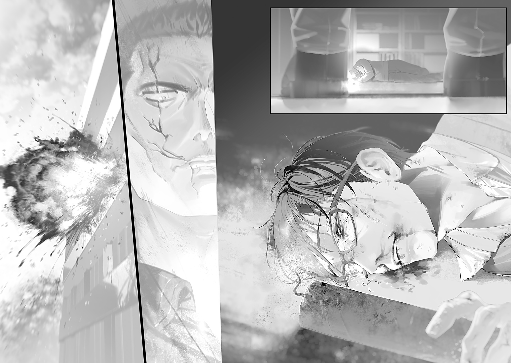

【グレムリン工学教授の終止論文】

グレムリン工学教授半田[はんだ]作之助[さくのすけ]は、手酷[ひど]く殴られ痣[あざ]と血まみれになった顔で苦しい呼吸をしていた。

服従魔法の使い手である組長によって尋問部屋まで引きずられ、半田は荒瀧[あらたき]組への己の儚[はかな]い抵抗の終わりを悟る。

思い返せば。

全ては自業自得だった。

半田は出身地のさいたま市で、殺し、脅し、盗みを散々やってきた。そうしなければグレムリン災害直後の地獄を生き残れなかったとはいえ、数え上げるのも億劫[おつくう]な程の残虐な罪にまみれている。

さいたま市よりも遥[はる]かに穏やかで平和な東京に移住し安穏としている内に忘れかけていた。悪夢を見ない夜を過ごすようになったといっても、悪夢のような過去が消えたわけではない。

因果応報。過去に人を苦しめた報いが、今、荒瀧組による暴虐という形になって返ってきたにすぎない。

魔法大学の同僚や教え子たちは、荒瀧組の襲撃に純粋に怒り、抵抗の意思を見せた。

そんな朋友[ほうゆう]たちの姿が、半田には眩[まぶ]しく辛[つら]かった。

彼ら彼女らは荒瀧組を「敵」として見ている。

無論、半田もそう思っている。

一方で、半田にとって荒瀧組は敵である以上に「過去の自分」だった。

かつての自分はきっと荒瀧組のように見えていたのだろう。

女子供にも病人にも慈悲の一片すら見せず、人間らしい共感も対話もなく、嬲[なぶ]り、利用し、奪い、騙[だま]し、己さえ良ければいいと平気で踏みつけにして、殺す。

自分に荒瀧組への怒りを燃やす資格があろうか？　全く同じ事に手を汚してきたというのに。

激しい自己嫌悪に胃がねじ切れそうだった。吐き気がした。

東京の安寧を享受し知らず知らずの内にくすんでいた鏡の曇りは拭われて、姿映しに己の醜悪さを直視して。

同僚が研究資料に面白半分に火をつける荒瀧組に必死で縋[すが]りつき嗚咽[おえつ]しながら絞り出した「悪魔」という言葉は、言葉を向けられた本人よりも遥かに深く半田の心を抉[えぐ]った。

半田作之助は有り難くも東京が誇る魔法大学のグレムリン工学教授を拝命し、信任に応える善き教育者であろうと、優秀な研究者であろうとしてきた。

何度も学生の相談に乗った。落ち込んでいる学生を励ました。学生にとっての模範になり尊敬に値する導き手になろうと虚勢を張ってきた。時には厳しく叱り、叱りながらも怒りに呑[の]まれず理解と歩み寄りの姿勢を保った。完璧な教授では無かったかも知れない、だが確かに半田はできる限りの事をしてきた。大[おお]日向[ひなた]学長に頼まれ自信の無いまま手探りで始めた仕事は、いつしか誇りになっていた。

研究者としても多くの成果を挙げる事ができた。

研磨剤量産体制の確立。

魔法杖[まほうづえ]量産プロセスの構築。

魔力逆流防止機構および御守り[アミユレツト]の改良。

加熱トルマリン吸着法における定量測定考案。

グレムリン昇華精製法の開発。

主導的立場ではないが協力者として携わった研究を含めれば、書き上げた論文は20本に及ぶ。

同僚と徹夜をして、コーヒーの差し入れをして、査読に冷や汗を垂らし、外れ値の意味に悩み。討論がヒートアップして口論になった事もあれば、飲みの席での四方山話[よもやまばなし]から目も覚めるような素晴らしいアイデアを閃[ひらめ]いた事もあった。

謎の天才魔法杖職人[ワンドメーカー]０９３３が気まぐれに寄こすメモや質問状から奇妙で素朴な人柄を感じ取りなんだか笑ってしまったり、食堂で連日夜食を頼み続けた結果家に帰って休むよう窘[たしな]められ頭を掻[か]いたり……

魔法大学には何にも換えられない大切な思い出が詰まっている。積み上げられた研究成果一つ一つにどれほどの時間と苦労と奇跡が込められているのかよく知っている。

それを無知蒙昧[むちもうまい]軽挙妄動の荒瀧組の薄汚い手でゴミのように粗雑に扱われ、平静でいられるはずがなかった。

今の半田には、奪われ壊される側の立場も、奪い壊す側の立場も、痛いほどよく分かってしまう。

やめて欲しかった。

まるで賽[さい]の河原だ。積み上げた物はすぐに壊され、挫[くじ]けず再び積み上げても、無造作にまた壊される。

自分だけにして欲しかった。

血と破壊の報いを受けるのは自分だけでいい。どうして善良で罪の無い人々が苦しめられなければならないのか。これほどの喪失を、辱めを、攻撃を受けなければならない何かを魔法大学がしたのか？

全ては自業自得だ。

自業自得でなければならない。

悪事の報いを受けるのは当然だ。

善行の報償を受けるのも当然だ。

当然でなければならない。

当然である事が難しいモノを当然にするため、多くの善き人々が力を合わせ懸命に守り育ててきた。それを壊させはしない。決して。

大日向学長が自分が人質にとられる事を避けるため毒を飲んだ事態を受け、半田は荒瀧組への協力を申し出た。

荒瀧組は全てを壊し奪うつもりで、拒否すれば悲惨な目に遭う。自発的に敵に降[くだ]り、敵側の立場から無辜[むこ]の人々にできる範囲でこっそり手を差し伸べた方がいくらかマシだという判断だった。

苦渋の決断だった。

その苦渋の決断すら踏みにじるのが荒瀧組だった。

荒瀧組の組長たる魔法使いは、表向きの忠誠を誓い頭[こうべ]を垂れた半田に命じた。

頑[かたく]なに従属を拒んでいる目玉の魔女を拷問しろ、と。

憎い敵からの拷問には耐えられても、信頼する身内からの拷問には折れる。アレはそういう手合いだと、組長は口を歪[ゆが]め嗤[わら]った。

表面上の裏切りは、実際に味方に手をかける事で後戻りできない本物の裏切りへ堕[お]ちる。

大して賢くもなさそうで付け入る隙があるように思えた組長は、厄介な事にそういった機微に敏感だった。

魔法の鎖に囚[とら]われ傷つき憔悴[しようすい]した魔女を前に更なる拷問を促された半田は、目玉の魔女の目を見る事ができず俯[うつむ]いた。

失望しているだろうか、嫌悪しているだろうか、恐怖しているだろうか。

拷問器具を持つ半田の手は震えた。

ポーズだけでいい。

形式的に、できるだけ痛みが少ない方法で拷問のフリをして、組長への忠誠が本物だとアピールするだけでいい。

ここで敵の懐にしっかり潜り込めば、この先もっと多くの人を助ける事ができる。

言われた通りに振る舞って、潜伏するのが正解だ。形は違えど七瀬[ななせ]准教授も屈辱を押し殺して潜伏を選んでいる。それと同じだ。

しかし…………

躊躇[ちゆうちよ]する半田の耳に、友愛を尊ぶ世話焼き魔女の柔らかな声が届いた。

「いいのよ、半田さん。私は大丈夫だから」

かけられた優しい言葉に、半田は頭が真っ白になった。

気が付けば振り返り、赤熱する焼きゴテを固く握りしめ、背後の荒瀧組の下っ端を一撃の下に殴り倒していた。魔法を撃ち、更に二人に血反吐[ちへど]を吐かせ膝をつかせた。

そして目玉の魔女の縛[いまし]めを解こうと奮闘した半田は、呆気[あつけ]なく組長に殴り倒され取り押さえられた。

自業自得。

自業自得なのだ。

自分のような薄汚い奴[やつ]が、ずっと誠実に人々を護[まも]ってきた魔女を傷つけるなど、あってはならない。彼女たちは救われ、報われるべきなのだ。

感情に駆られ愚かな事をした。

しかし後悔は無かった。

後悔ばかりの人生に、これ以上後悔を重ねる事はできない。

己の宿命を悟り大人しくなった半田は、組長によって手ずから別の尋問部屋に連れていかれ、生々しい血痕が染みついた床に投げ出され小さく呻[うめ]いた。

「てめぇなあ。素直に降伏すれば契約魔法は勘弁したるとは言ったが、降伏してから反抗したらソイツは裏切りだ。処罰せん事には示しがつかん」

組長は自分の悪行を全て棚に上げ、まるで半田こそが道理に悖[もと]る悪行を働いたのだと言わんばかりの口ぶりだった。

芋虫のように床に転がる半田は黙り込む。

組長は理解者面で続けた。

「だが俺はお前さんを高く買ってる。実績もそうだが、他の連中とは目が違う。足の指を二、三本詰めて、契約魔法かけるだけで済ませたるわ」

言うが早いか、組長は無造作に半田の足先を踏み潰した。

右足の指が数本、まとめて踏み潰され鮮血が飛び散る。

脳を焼き焦がす電撃のような激痛も、目から溢[あふ]れそうになる涙も、体の痙攣[けいれん]も。半田は全てを鋼の意思で抑え込み、なんでもないフリをした。

半田は荒瀧組を喜ばせる反応を何一つ見せたくなかった。思い通りにさせたくない。

屈強な大人でも絶叫し悶[もだ]え苦しむはずの処罰を真顔で耐えた半田に、組長は感心したようだった。

「ほぉ……声一つ上げんとは、やはり大したタマだ。魔法で無理やり従わせるのが惜しい男だ。が、裏切りのケジメはつけてもらうぞ。汝を我が騎士に任ずる[シスウ××トオインクサアオ]。二心あれば魔力で応えよ[××オーオ××××デエナエイ]」

組長は床に転がる半田の肩に手を当て、大学を占拠されてからの短い間に何度も聞いた忌まわしい呪文を唱えた。

この魔法をかけられた者は、魔法をかけた者の命令に逆らえなくなる。頭と心でどれほど反抗しようとも、体は従ってしまうのだ。伝え聞く入間[いるま]の魔法使いの魔法よりはいくらかマシだが、慰めにはならない。

処置を終えた組長は重々しく言った。

「お前が自由に喋[しやべ]れるのはあと三十秒だ。言い残す事はあるか？」

その言葉に、半田は一瞬だけ考え、答えた。

「……私はさいたま市出身でね。超越者たちに護られ平和慣れした都民とは違う。子供や老人、怪我[けが]をして助けを求める女性から物資を奪い、魔物への囮[おとり]にして生き延びてきた。この手はとっくに血に汚れている」

半田の脳裏に今までの人生の思い出が次々と浮かんでは消えていく。

そうとも。

自業自得だ。

己の行いは己に返る。

しかし。

「悪いがアンタに従う従順な僕[しもべ]にはなれん。もう一度悪虐に身を染めるのも御免被る」

人々を苦しめた過去が決して消えないなら。

短い間ながら人々と手を取り合い信頼し合って過ごした大学教授としての日々もまた、決して消えはしない。

「なんだ、自殺するつもりか？　お前に人質の価値は無い。漢[おとこ]として死を選ぶっちゅうんなら止めんぞ」

何を勘違いしたのか、組長は知ったような事を言う。

半田は呆[あき]れた。

全く、ゴミ山の大将はやはりゴミだ。ここまで来て何も気付いていない。

魔法で服従させられるのは分かっていた。

服従させるためには至近距離に接近し、対象に接触しなければならない事も観察して分かっていた。

だから、半田がやるべき事は決まっていた。

半田は悪逆非道の生存者ではなく、人の道を歩んだ研究者として言った。

「これは自殺ではない。半田作之助、人生最後の実験だ。題して」

軽く笑い。

魔法大学教授として最後の研究をする。

「〝ダイナマイトで魔法使いは殺せるか？〟」

「……!?　お前ッ、」

組長の脳に言葉が染み込む前に、隠し持っていたダイナマイトの凄[すさ]まじい爆発が、一人の教授の命と思考の全てを怨敵もろとも吹き飛ばした。

