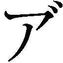

【賢者の杖[つえ]】

魔力鍛錬に必要な磁場は、原理さえ分かれば比較的簡単に作れる。工作精度も低くて大丈夫で、超難易度のグレムリン加工に慣れた職人たちと冶金業者（主にゼンマイ動力部の製造を担った）の手により、魔力鍛錬棺[ひつぎ]は急ピッチで量産され、東京各地に配置されていった。

各地の魔力鍛錬施設は昼夜問わず大行列で、凄[すご]いスピードでデータが集まっていった。

おかげで判明した新事実は多い。

例えば、魔力はどうやら際限なく伸ばせるらしい。デメリットを無視すれば。

魔力は誰でも１～２Ｋ程度なら問題なく伸ばせる。しかしその先は個人差が大きい。

魔力を鍛えていると、どこかの時点で魔力が揺らぎ始める。魔法の制御能力が落ち、逆流が大きくなる。

最も簡単な魔法であるとされる射撃魔法基幹呪文「撃て[ー]」ですら暴走するようになるのだ。コレのせいで「撃て[ー]」を暴走させてしまい、手や腕を骨折した人は多い。

それでもなお魔力を増やすのを止[や]めない場合、魔法的な疾患が併発・深刻化していく。

魔力回復停止、魔力漏出、魔法不発、魔法使用時の消費魔力量増加、魔法過敏症、魔法認識不全などが発症・重症化する。

だから、魔力量は際限なく増やせはするのだが、どこかの段階でデメリットが生じ重くなっていくので、現実的に考えると限界がある、というわけだ。

この魔力鍛錬の限界値を見極める方法は二つ。

一つは魔女か魔法使いに見てもらう事。

魔力コントロールができる超越者たちの視点だと、魔力鍛錬のデメリットが現れる前兆としてかなり露骨に魔力が揺らぐようになるらしい。その時点で鍛錬をストップすればいい。

もう一つは構造色グレムリンを使う事。

構造色グレムリンで魔力保有量を測る時、魔力鍛錬限界が近づくと目盛り表示が安定せずブレ始める。魔力残量表示がブレ始めたら鍛錬をストップすればいい。

また、魔女や魔法使いも魔力を伸ばす事ができる。

彼女らの肌感として「魔力コントロールが上手[うま]いほど鍛錬限界が高いだろう」という話だ。

恐らく、人間も同じである。

人間は魔力をコントロールできないが「もし魔力コントロールができれば上手かった」という人は鍛錬限界が高く、「魔力コントロールができたとしても下手だった」という人は鍛錬限界が低い、と推察されている。

魔力鍛錬も才能の世界でちょっと悲しい。

しかし、魔力保有量最低記録保持者である初期魔力量０・２Ｋの人が既に６Ｋ伸ばし、まだまだ限界を見せず鍛錬し続けているというから、なかなか夢がある。

初期値低くても鍛錬頑張ればワンチャン２００Ｋぐらいまで伸びるのもあり得そう。アツい。

たとえ初期魔力保有量が１Ｋでも、１５０年ぐらい鍛錬し続ければ青の魔女の魔力量（１１０００Ｋ）を超えられるぞ。頑張ろう!!

さて。

俺は色々と送られてくるデータをつまみ食いして知見を深めつつ、家の倉庫を片付け魔力鍛錬瞑想[めいそう]室を作った。

二畳間の小さな部屋で、部屋の外周に磁石を埋め込んであり、ゼンマイ式動力で部屋を回転させながら瞑想する事で魔力鍛錬ができる。

川遊びに備えバーベキューセットを持ってきたヒヨリに試してもらったら正常に作用したから、機能はバッチリだ。

実際に瞑想室を作ってみて、磁界観察シートや砂鉄で磁力線を観察し理解を深め、俺が考えたのは「これ杖にできるんじゃね？」だった。

俺が作った瞑想室は部屋としては狭いが、物としてはデカい。都心で使われている魔力鍛錬棺も仮設トイレぐらいのサイズだ。持ち運べない事もないが、デカすぎる。

瞑想室の機能を一本の杖にコンパクトに収める事ができればめちゃくちゃ便利。いつでもどこでも瞑想杖だ。

魔力鍛錬に必要な磁場作りは、原理さえ分かっていればそう難しくない。工作精度も低くてＯＫ。かなりユルい。

これだけのユルさなら、小型化できる。精密機器の小型化は困難だが、これだけ元が大きくガバが許される機器なら、小型化も現実的だ。

日本人はね、小型化が得意な民族なんですよ。ドイツ人の発明品をアメリカ人が製品化、日本人が小型化して中国人が量産しユダヤ人が儲[もう]ける、なんて国際ジョークもあるぐらいだし。

俺は磁気物性の教科書を取り寄せ熟読し、変異学科の論文を読み込み、実験を重ねながら、杖に磁場変化逆再生機能を組み込む作業に熱中した。

元が棺や小屋サイズの物なので、杖サイズに機能を収めるにはかなりの小型化が必要だ。機構が絡み合い、まるでパズルのように磁石を配置していかなければならない。

原理的には、杖の先端を額に当て、座標を固定。それから杖のダイヤルを回してゼンマイに動力を溜[た]める。あとはゼンマイ式に杖の内部の機構がゆっくり回転するから、瞑想を併用すれば、いつでもどこでも魔力鍛錬ができる、という寸法だ。

実験機の製作途中で川遊びに備えビーチパラソルを持ってきたヒヨリが「それ杖にする必要あるのか？」とツッコんできたが、愚問だ。

そんな必要性は、全く無い！

俺が杖職人だから杖にしてるだけですね。別にヘルメットとかでもいけると思うぞ。

グレムリンの加工難度に慣れていると、加工そのものは簡単だった。むしろ内部機構が上手く噛[か]み合うように設計するのが難しい。

だが、俺は五回の試作を経てなんとかやりとげた。

この杖は俺がやらなくてもいずれ誰かがやっただろう、というレベルの単なる小型化だ。

ぶっちゃけ都市の杖工房の職人さんでも腕利き集めれば作れると思う。流通してる市販汎用杖を取りよせ分解してみた限り、それぐらいの技術はある印象。

しかし、一番最初に作ったのは俺だ。

俺が一番槍[やり]。

いや、一番杖……！

世界で一番最初の飛行機はライト兄弟のライトフライヤー号だ。

しかし二番目に飛んだ飛行機は全く知られていない。何事も一番最初という要素が大切なのである。

俺は新作のどこでも魔力鍛錬杖を「賢者の杖[ワイズ・ワンド]」と名付けた。

賢者の杖は、先端にイカした木の瘤[こぶ]をつけた木製の杖だ。木材はフヨウに出してもらった名称不明の堅い木。先端の木の瘤には「ここを額に当てて使って下さい」という目印として大粒のサファイアを埋め込んである。

グレムリンや魔石は使っていない。これはあくまでも魔力鍛錬用なのだ。内部構造に磁石を使った絡繰[からく]り仕掛けを埋め込んであるし、ある程度の強度は担保してあるもののぶん回して戦闘に使うのは全く想定していない。

俺はこの新作「賢者の杖」をオークションを開催して売ろうとも思ったが、やめた。何しろ新通貨発行からまだ一年も経[た]っていない。

大金を持っているのはまだ魔女と魔法使いばかりで、誰が落札するかだいたい予想がついてしまう。オークションを開いても面白くない。

オークション開催はもっと貨幣経済が浸透し、市井に金持ちが増えてからがいい。競りの参加人数は多ければ多いほど盛り上がるし、落札された時の杖の格も上がるってもんだ。

賢者の杖は、マイ・ベスト・フレンドに贈る事にした。

川遊び前日になり、フラワーコーラ（新通貨発行後に発売された台東[たいとう]区の名産品。植物成分を上手く使って作った疑似コーラ）をケースで持ってきたヒヨリにオマケの布で包んでプレゼントすると、嬉[うれ]しそうに受け取ってくれた。

「ありがとう。嬉しいぞ。宝石は私の色に合わせてくれたのか？」

「そんな感じ。手持ちの宝石の中で一番でっかいサファイア使った」

「なるほど。良いね、すごく気に入った。毎日これで瞑想するよ。大切に使う……ん？　この布は？」

ヒヨリは杖を梱包[こんぽう]していた深藍色の布を広げ、それが新品のローブである事に気付いた。

俺はドヤ顔で説明する。

「素材は蜘蛛[くも]の魔女の蜘蛛糸と白木[はくぼく]繊維と鉄鋼羊ウール。グレムリン処理もしてある。性能と軽さを両立した最高級の魔法の布で仕立てたローブだ。熱耐性があって頑丈。魔法にも少しだけ耐性がある。汚れに強くて折り目が付きにくくて、軽いし色落ちも……あー、まあ、要するに天下の青の魔女様の専用ローブだ。

お前の黒コートさあ、ずっとボロボロだろ？　思い入れがあって着続けてるんだろうけど、背中のとこの色剥[は]げてるし、肩のとこ擦り切れてるし、端っこほつれまくってるし、もう限界だろ。良かったら着てくれ」

促すと、ヒヨリはローブを自分の体に当て、工房の端の姿見でチェックした後、ソワソワと落ち着きを無くした。

ローブの襟の六花[りつか]結晶ブローチを指先で弄[いじ]りながら、挙動不審になって聞いてくる。

「……これを受け取ると、私はお前の杖を持って、お前のネックレスをつけて、お前のローブを着る事になるんだが。大利[おおり]は私をどうしたいんだ？　自分色に染め上げたいのか？」

「いや、それは思ってないけど。お前は魔女で、しかもめっちゃ美少女じゃん？　似合う格好してるの見たいんだよ。着てくれ頼む」

青の魔女改造計画だ。

俺が初めて出会った青の魔女は、ボロボロの黒コートを着て、未加工の魔石を握りしめた貧相な格好をしていた。威圧感はすごかったが、格好良かったかというと怪しい。

そこを俺デザインの魔女っぽい装備の数々でどーん！

魔女の魔法杖[ワンド]！

魔女の御守り[アミユレツト]！

魔女の服[ローブ]！

ヒヨリ、お前はコテコテの魔女になれ……！

絶対似合うから。俺は童話から飛び出してきたような王道魔女の姿を見たいぞ。

欲望全開で着衣要求すると、ヒヨリは変な鳴き声を上げ、俺につかつか歩み寄ってきた。

「おい、抱きしめるぞ。ぎゅってさせろ」

「は？　嫌だが？　おいやめろって！」

ヒヨリは俺を問答無用でぎゅーっと抱きしめると、別の部屋に行き着替え、戻ってくるなりくるくる回って見せびらかしてきた。

「どうだ。似合うか？」

「お？　あ、ああ、似合う。似合ってる。世界一の美少女魔女に相応[ふさわ]しい」

「ふふ、ふふふふふ……！　慧[けい]ちゃんにも見せよう！」

ヒヨリは仮面の上からでも分かるぐらい上機嫌で帰って行った。

それを見送り、俺は工房に立ち尽くす。

急に抱きしめられ、まだ動揺が抜けない。以前は血と硝煙の臭いがして物騒だったヒヨリだが、なんか香水の良い匂いしたな。

心臓もなんか変な感じだ。ドキドキする。

まあ、ヒヨリのパワーで抱きしめられたら全身複雑骨折しかねないもんな。ドキドキの一つや二つや三つや四つ、して当然か。心臓が物理的に破裂しなくて良かった。

ククク、最強の青の魔女が俺製品で身を固めるほど、俺のブランドの価値も上がる。新装備はどんどん贈っていきたい。

ヒヨリは強くてセンスの良い装備で嬉しい。

俺も宣伝になるし目の保養になって嬉しい。

全部嬉しい。

せっかく世界がファンタジーになったんだ。

ファンタジーのせいで苦しむ事も多いが、楽しむ事だって多い。

ファンタジーを味わい尽くして生きていこうぜ！
