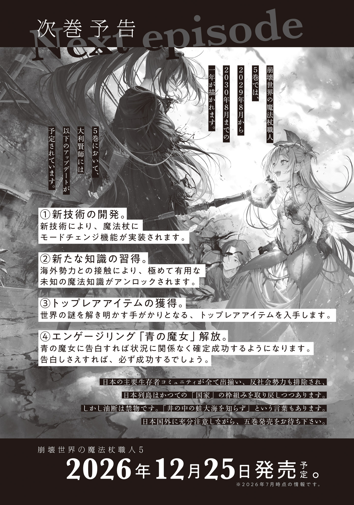
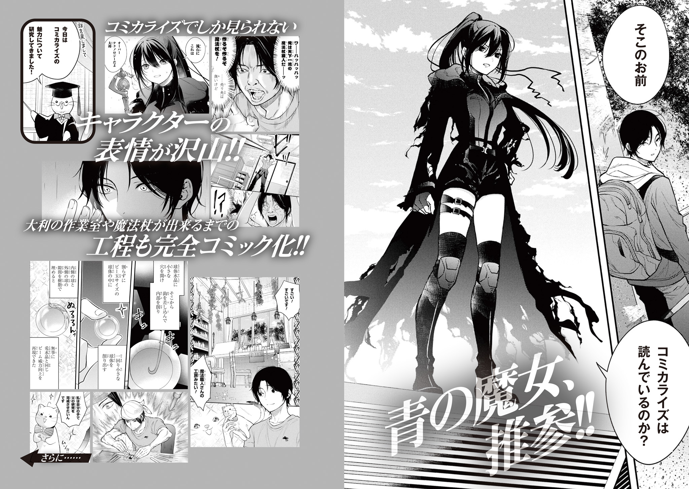
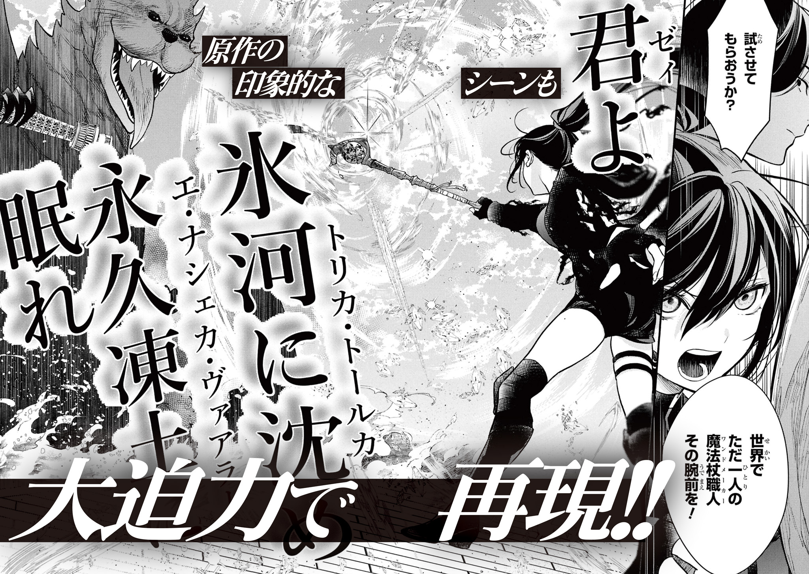
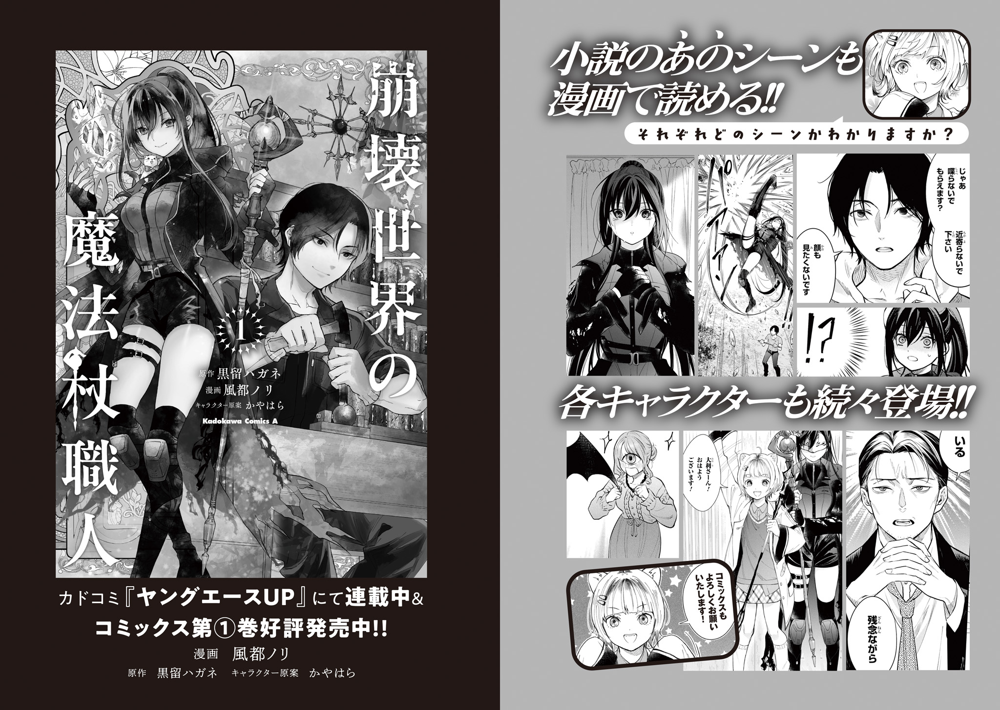

【番外編　魔法建築家】

須吾井[すごい]大久[だいく]のような東京で働くベテラン大工にとっては常識的な話だが、グレムリン災害以後に建てられた新築物件はカスだ。

基礎はガタガタ、寸法もガタガタ、耐震基準はボロボロ。災害後に建てられた見掛け倒しの小綺麗[こぎれい]な新築物件に住むぐらいなら、災害前に建てられたボロ屋に住んだ方が百倍マシ。

災害前の日本の厳しい建築基準に基づいて建てられた優れた家屋は、一見グラグラで今にも倒壊しそうに見えてもしぶとく何年も持ちこたえるものだ。

だから東京の大工は港[みなと]区のように一度更地になってしまった地区での仕事を除き、滅多[めつた]に新築をしない。

倒壊した建物からまだ使える建材をサルベージして、まだ持ちこたえている建物にあてがい、ニコイチ・サンコイチで既にある建物を補修する。これが一番効率が良い。

コンプレッサーが停止し、インパクトドライバーが沈黙し、電気の恩恵を失った大工の仕事効率は悲劇的に低下している。電動機材や重機に頼らずゼロから新築するのもやってやれない事はない、だが効率が悪すぎる。全人口の85％が死んだ東京には不幸中の幸いで空き家が溢[あふ]れている。利用しない手はなかった。

須吾井は練馬[ねりま]区に籍を置いているため、規則正しく不足の無い安定した仕事ができている。

練馬区を管理している蜘蛛[くも]の魔女は安定を重んじる。他の区や他県からの移住者は慎重に精査され、食事も医療も教育も安全も公平公正に行き渡り、足りない物は無い。

建築資材に限っていえばむしろ余ってすらいる。

調布[ちようふ]市では魔女の意向で集住政策が取られており、人が住んでいない家屋は全て解体され、更地に畑が作られている。解体によって出た大量の木材をまとめて回収保管しているのが練馬区だ。

建材に、水車作りに、造船にと、木材の用途は多岐にわたる。いくらあっても困らない。

他の区では空き家を乱暴に取り壊し薪[まき]にしてしまったり、雨漏りをどうせ住む者も無いからと放置し腐るに任せていたりする事もあるという。なんとももったいない。練馬区は理解ある魔女に恵まれて幸運だった。

そんな幸運に恵まれているのを忘れそうなぐらいに何事もない穏やかな日々を過ごすある日のこと。

月初めの仕事割り振り指令書を自宅ポストから取って開いて見た須吾井は、目を瞬[またた]き無精ひげを撫[な]でた。

いつもなら建物補修作業が３～７件入る。稀[まれ]に隣接した区の応援が入る時もある。

しかし今月の仕事割り振りは新築１件のみだった。その上来月以降の予定欄が空白になっている。

これはどうした事かと眉をひそめていると、指令書の末尾に「詳しい話をしたいです。週末までのいつでも大丈夫なので、下記の住所までお越しください。都合がつかない場合は都合のつく日時を添えてお手紙を下さい。よろしくお願いします」と几帳面[きちようめん]な文字で書かれているのを見つけた。蜘蛛の魔女のサイン付きだ。

須吾井はすぐに家の中に取って返し、急いで身支度をした。

どうやら蜘蛛の魔女直々の新築案件らしい。都合がつかないなんて有り得ない。

都合はつくし、つかなくても都合がつくよう最優先で調整しただろう。

須吾井は昼前に練馬区某所の自動車販売店が改装された蜘蛛の魔女の住処[すみか]を訪ねた。蜘蛛の魔女は巨体で、普通の民家のドアをくぐれない。コンビニ跡地や体育館などを点々とした後、自動車販売店に落ち着いたと聞いている。

魔女の住処は割れたガラス張りの壁に蜘蛛の巣がかけられ、大小さまざまな蜘蛛たちが物陰で陰気にひっそりと獲物を待ち伏せていた。

蜘蛛たちの眼[め]で動きを追われているのを感じぞわぞわしながら、ドアの前に設置された呼び鈴を鳴らす。

するとすぐに呼び鈴の横で目を閉じていた目玉の使い魔[インターフオン]が覚醒し、須吾井に目を留め穏やかに話しかけてきた。

「おはよう、須吾井さん。久しぶり……来てくれてありがとう……予定は大丈夫だった……？」

「とんでもない。魔女様の招集に馳[は]せ参[さん]じるのが予定です」

「ありがとう。さあ、入って……正面の突き当りを左に行った、一番奥の部屋にいるから……待ってるね……」

目玉の使い魔が目を閉じ沈黙し、須吾井はおっかなびっくり建物の中に入った。

廃墟[はいきよ]になった自動車販売店にはかつては数百万はしたであろう車が何台も埃[ほこり]を被[かぶ]り静かに眠っている。タイヤと車体の隙間や開けっ放しのボンネットに巣をかけた蜘蛛たちが不気味に光る紅[あか]い目で須吾井を追った。無害と分かっていても恐ろしい。

蜘蛛たちは、蜘蛛の魔女の眷属[けんぞく]だ。蜘蛛型の魔物は蜘蛛の女王たる蜘蛛の魔女の指令に従う。

練馬区において蜘蛛は吉兆だ。役割上は。

蜘蛛はもう何年も自分達を見守り助けてくれていて、一度たりとも危害を加えられた事などないのに、細かい毛や棘[とげ]に覆われた八本足でカサカサ動く生き物を好きにはなれなかった。どうしても生理的な嫌悪が湧き出してくる。

須吾井はできるだけ蜘蛛たちを見ないように短い廊下を歩き、蜘蛛の魔女が待つ部屋に入室した。

部屋には御簾[みす]がかけられ、薄い仕切りの向こう側に人智[じんち]を超えた巨大蜘蛛の禍々[まがまが]しいシルエットが浮かび上がっている。

蛇に睨[にら]まれた蛙[かえる]のように、須吾井は一瞬凍り付いた。

蜘蛛の魔女は人間を食べたりしない。物静かで穏やかで親切で真面目な魔女だ。それなのに、相対するたび捕食者に睨まれた小動物のような気分にさせられた。

「おはようございます、蜘蛛の魔女様」

「……おはよう、須吾井さん」

湧きあがる恐怖を抑え込み頭を下げた須吾井に、蜘蛛の魔女は僅かな沈黙を挟み物憂げな挨拶を返した。

「こんなに早く来てくれてありがとう……須吾井さん、午前中はのんびりする人じゃなかった……？」

「そんな事は。モーニングコーヒーが好きだっただけですよ。市街地のコーヒー在庫が尽きてからは朝早くから仕事してますね」

「そっか……花の魔女のとこから取り寄せようか……？　少しだけどコーヒー豆作ってたはずだし……」

「い、いいんですか？　高いんじゃ？」

「大丈夫。花の魔女と取引量を増やすのは良い事だし……配下の蜘蛛にはコーヒーが好きな子もいるんだよね……だから遠慮しないで……」

やんわり言われ、須吾井は有り難く魔女の厚意を受け取る事にした。同時にこれから何を頼まれるのか戦々恐々とする。

蜘蛛の魔女は口が上手[うま]い。口八丁で誑[たぶら]かして陥れてやろうというタイプとは真逆の気遣い屋ではあるものの、明らかに断りにくい空気になっていて、身構えてしまう。

蜘蛛の魔女は長々と世間話をするつもりは無いようで、話のクッションを一つ置いたあとすぐに本題に入った。

「仕事の依頼にも書いたけど。新築一軒家を建てて欲しい……須吾井さんは建築センス良いから、どうしても須吾井さんに頼みたくて……」

「光栄です。でも、どうしてまた？　御存知[ごぞんじ]かと思いますが、古屋を改築した方が早く済みますよ」

「…………。見栄[みえ]、かな。個人的な理由で……その、つまり……もしかしたら友達が遊びに来るかも知れないから……この巣に招くのはちょっと……ね？」

そう言って蜘蛛の魔女は決まりが悪そうにモゾモゾ動いた。

確かに照明も無く蜘蛛の巣だらけの薄暗い廃墟はお世辞にも来客に適しているとは言えない。

「御友人の魔女様を招待する別荘という事ですか？」

魔女集会の個性が豊か過ぎる魔女達を思い浮かべながら尋ねる。

蜘蛛の魔女はまたモゾモゾしながら心なしか恥ずかしそうに答えた。

「ううん……男の人。遊びに来てくれるか分からないけど……新しい家を建てたよって言ったら……興味持ってくれるかなって……」

須吾井は衝撃を受けた。

蜘蛛の魔女が妙にモゾモゾしていると思っていたが、違った。

モゾモゾでは無かった。これはモジモジだ。

あんなに人との関わりを避け続けていた蜘蛛の魔女が、まさか男友達を作り、気を惹[ひ]いて家に招こうとするなんて……！　これは恋では!?

思わず笑みが零[こぼ]れてしまう。そういう話なら気合が入る。

友達を招待するためにわざわざ家を建てるというのはかなり豪快な思考回路だが、友達の事がなくとも、魔女集会の魔女のために立派な邸宅を建てて差し上げるのは良い事だ。

かつて、須吾井は魔物に襲われ、蜘蛛の魔女に助けられた。

命を救われたのに、恐ろしい怪物がもっと恐ろしい怪物に殺されたようにしか見えず、悲鳴を上げ失禁する始末だった。

事情を知った今では申し訳なかったと思っている。

だが、七つの無機質な目を怪しく光らせ涎[よだれ]をダラダラ垂らしながら凶悪な棘がついた脚を伸ばしてきた蜘蛛の魔女が、客観的にどう見えるのか？　という面に関しては情状酌量の余地があると主張したい。

いくら性格美人な良い魔女でも怖いものは怖いのだ。人食いの化け物にしか見えない。

蜘蛛への恐怖が骨の髄まで刻まれている須吾井では、蜘蛛の魔女と親密になれない。自分の代わりに誰かが蜘蛛の魔女の友人になり孤独を癒[いや]してくれるのなら是非とも応援したい。

蜘蛛の魔女から新築住宅についての詳しい要望を聞いた須吾井は、それから二週間で建築図面を引いて、首尾よく用意されていた土地に建築を始めた。

グレムリン災害後の世界で建築法は機能していない。成熟した文明の恩恵無しに耐震性や日照権や道路幅員に配慮して仕事をするのは手間がかかり過ぎて非現実的なため、全て無視するのが慣例化している。おかげで設計も着工も早い。

着工してまず行われるのは水道設備の埋設だ。

現在の東京の上水道は荒川[あらかわ]や多摩川から水車で汲[く]み上[あ]げられた水が使われている。市街地に血管のように張り巡らされた雨樋[あまどい]が水道管代わりだ。つまり水道は地上を走っているので、地面を掘り返す必要はない。

問題なのは下水である。現在東京で主流なのは汲み取り式便所で、各家庭の糞尿[ふんによう]は回収され郊外に集められ堆肥になる。しかし特に夏場などは回収を待つ間に便所から異臭が漂いだし、都民を苦しめている。工事現場の仮設トイレの悪臭よりなお酷[ひど]い。

未来視の魔法使いが統治する文京[ぶんきよう]区で悪臭問題に対応するため、下水道と下水処理施設を一部地域で試験的に復活させているらしい。

従来の下水処理施設をそのまま使うと汚物を食べるスライムが発生し、急激に増殖して魔物の群衆事故[スタンピード]を起こしてしまう。そこでスライムを誘引する特別な餌を使ったり、定期的に処理層を煮沸したりなど、複合的な対策でスライム発生の抑え込みが行われている。

練馬区ではそんな大規模で手間のかかる実験的下水処理施設運用はできないので、須吾井は下水処理用の新設計家庭用浄化槽を導入した。

新設計の浄化槽は地下に埋めたタンクで、中に魔物学科が品種改良を施した新種のスライムを入れてある。大喰[おおぐ]らいの割に繁殖が遅い新種のスライムは、タンクに流れ込んできた汚物などを食べ、綺麗[きれい]な水を排出する事で効率良く処理してくれる。

家の地下で馴致[じゆんち]不能の魔物を飼うのは普通なら危なくてできない。だが蜘蛛の魔女なら充分制御できる。

工業規模で汚物処理スライムを飼育すると、増殖した時に手に負えなくなる。一般家庭一軒分なら増殖してもたかが知れていて、対処は容易だ。

上下水道の敷設ができたら、次は基礎と土間打ち工事に取り掛かる。

鉄筋を配置するところまでは従来と同じだが、コンクリートの代わりに砂利を敷き詰める。そしてその砂利にさざれ石の魔法をかけるのが最新工法だ。

さざれ石系・さざれ石魔法は、さざれ石の魔女の名前の由来になった魔法である。小石に魔力を付与し、ゆっくり育て、岩に変える事ができる。

いくらか運用上のコツはあるものの、適切に運用すればそこそこの品質のコンクリートの代用品になる。

さざれ石魔法をかけ数日かけて岩を育て、鑿[ノミ]を入れて形を整えたら、次はいよいよ足場を建て木材を組み立てていく。見た目が一気に家らしくなる頃だ。

使うのはもちろん他の家屋からとってきた木材である。旧時代の木材は機械によってプレスカットされ、寸法が整っているのが良い。そして何よりも防蟻[ぼうぎ]処理が施されているのが最高だ。

防蟻処理とは要するにシロアリ対策の事だ。シロアリは日本中どこにでも生息していて、対策を疎[おろそ]かにするとあっという間に木材を食い荒らしボロボロにして家屋倒壊の原因になる。

旧時代の木材にはシロアリ被害を予防する薬剤が染みこんでおり、シロアリに非常に強い。電気が失われ化学が衰退した今、防蟻薬剤の新規生産はできない。シロアリに強い木材としては旧時代の遺産を流用するのが最善だった。

組み立ての後に行われる上棟式文化は以前とは形を変え、いつからか神酒・塩・米を奉じる代わりに壺[つぼ]に入れたグレムリンを埋めるようになっている。

須吾井は新しい慣習に倣い、蜘蛛の魔女が出した甲３類魔物産の大粒グレムリンを奉じた。ここで家の下に埋めるグレムリンは大きければ大きいほど縁起が良く、家を守ってくれるとされている。

グレムリンに家内安全効果など無いはずである。が、グレムリンは大きければ大きいほど魔法増幅率が高いし、価値も高い。いざという時のためにへそくりを埋めたと解釈すれば、全く無駄な事ではない。祭祀[さいし]に無駄だの実利だのとケチをつける方が野暮[やぼ]ではあるが。

上棟式が済むと屋根が張られ、建材を屋内に入れる事になる。

屋根に葺[ふ]く瓦は、蜘蛛の魔女が惜しみなく金とコネを使ってくれるため、品川[しながわ]区で生産されている軽量金属瓦を採用した。

粘土やスレートで作られた瓦は晶雨に弱く、１～２年も雨雲がもたらすグレムリン結晶に打たれるとヒビが入り割れて雨漏りの原因になる。長く住むつもりなら金属屋根は必須だ。

屋根を葺[ふ]いたら床と壁を取り付けていく。そして断熱材を入れ、蜘蛛の魔女の御守り[アミユレツト]を仕込んだ。

効果範囲を計算し壁の各所に複数個組み込んだ御守り[アミユレツト]は力場を展開し、家の中のどこにいても蜘蛛の魔女の魔力回復を促進してくれる。わざわざ御守り[アミユレツト]を身に着ける必要はない。癒しの家だ。

本当は魔力鍛錬用の専用瞑想[めいそう]室も作りたいところだが、流石[さすが]に新し過ぎる技術を家の標準機能として採用するのは不安があるため見送った。建築するのはあくまでも蜘蛛の魔女の自宅であり、実験家屋ではないから。

外装材の取り付けまで終わればあとは内装で、須吾井は蜘蛛の魔女の要望をこまめに聞き取りながら仕上げていった。

窓はスライムガラス。フローリングは蜘蛛の魔女の重量をかけても削れない頑丈なものにして、壁紙は落ち着いたベージュ色。

友人を招いても恥ずかしくない家にするならば、もちろん家具選びや造園のセンスも重要になってくる。しかしそこは須吾井の力の及ぶところではないため、内装が全て終わった段階で内覧してもらい、引き渡しとなった。

労働用ゴーレムを出してもらったり応援を貰[もら]ったりした上で、着工から引き渡しまで三カ月。

魔女集会の重鎮肝入りの新築住宅は、最高のバックアップ体制があったとはいえ素晴らしい早さで完成した。

引っ越し前最後の魔女との面会で、須吾井はウキウキが声に出ている蜘蛛の魔女から御簾越しにお褒めの言葉を授かった。

「すっごく早く建ったね……私の我儘[わがまま]を叶[かな]えてくれて、本当にありがとう……」

「いえいえ、給料も貰っていますし。気に入っていただけたなら何よりです。御友人の方を招いてゆっくり過ごして下さい」

「う、うん……誘っても嫌がらないかな……？　まずは引っ越して家具を揃[そろ]えるところからだけど……いや、とにかくありがとう。最高の家だよ……」

須吾井は浮ついた魔女としばし歓談し、清々[すがすが]しい気持ちで魔法建築の大仕事を締めくくった。

こんなに喜んでくれるなら大工冥利に尽きるというものだ。

近頃はヤレ杖[つえ]職人だ、ソレ魔獣使いだ、ホレ魔法研究者だと新時代の新職業が持てはやされているが、旧時代から続く職もしっかりと時代に合わせアップグレードしているのだ。

須吾井はウキウキの魔女に負けないぐらいウキウキしながら、まだまだ俺は時代に取り残されるほど老いぼれちゃいない、と自信を新たに微笑[ほほえ]んだ。

あとがき

最近、感情経済学に凝っている。

感情経済学というのは、私が考えた創作論だ。感情の動きを経済として捉えたものである。

例えば。雨に打たれた野良猫に傘をさしてやったとしよう。家に帰ると、「先ほど助けていただいた猫です」と猫がやってきて、五兆円をくれる。

これは小さな親切が大きな金銭になって返ってくる話のわけだが、感情経済学においては別の捉え方をする。

猫に小さな慈悲（感情）を渡し、お返しにクソデカ感情が返ってきた、と捉える。小さな感情を渡して大きな感情の返礼があったため、感情経済学的に考えると、感情の収支は大儲[おおもう]けである。

このような「感情の儲け」を「読者にとって心地よいもの」であると仮定し、創作物内で運用する事こそが感情経済学の骨子だ。

たとえば「私はそんなでもないけど彼氏が私の事を好きすぎて困る」は、自分は相手に対して感情を全然支払っていないのに相手は自分にクソデカ感情を支払ってくれるから、一方的に感情の大儲けができて困っちゃう、という金持ちマウント（感情持ちマウント）として解釈できる。

感情の返報性原理も働く。

通常の金銭経済においては、５円の商品を５万円で売り付けたらボッタクリだ。逆に５万円の商品を５円で売っていても「おかしい。何か罠[わな]があるのでは」と警戒される。

５万円の商品は５万円で売るのが正常な金銭経済だ。

感情経済においても、等量の感情取引が基準とされる。

小さな感情をもらったら、小さな感情を返す。大きな感情には大きな感情を返す。これが基準で、正常。

小さな感情をあげて、あげた感情に見合わない大きな感情が返ってきたら、５円で５万円の商品を買った時のように「これは得しすぎだ。不釣り合いで申し訳ない取引をしてしまった」という心理が働く場合がある。もちろんやったー大儲け！　と喜ぶ人々も多いが。

大きな感情をもらったのに小さな感情しか返さなかったら、相手に感情収支的な損をさせる事になるわけだから、相手は損して嫌な気持ちになる。

等量の感情を返せば良くも思われず悪くも思われず「普通のちゃんとしている感情取引」と認識されるから、普通は感情取引は等量交換が無難で波風が立たない。

感情経済学を小説執筆に適用するにあたり、感情の等量交換は必ずしも正解ではない。無難で波風が立たない等価の感情取引は、裏を返せば起伏やドラマ性、ダイナミズムが無い退屈なものだという事でもあるからだ。

そこで詐欺行為が必要になる。不釣り合いな量の感情取引を、釣り合っているかのように見せかけるのだ。

五兆円を持ってきた猫は、小さな慈悲に見合わないクソデカ感情で返してきたように思える。

しかし、傘をさしてもらえなかったら凍死していたとしたら？　途端に五兆円は、クソデカ感情返礼は、妥当なものであるように思えてくる。自分が支払った感情量に対して不釣り合いなクソデカ感情を、心おきなく受け取れる。

この大量の感情収入は騙[だま]し取ったわけじゃない、正当に手に入れたのだ、と納得できるわけだ。

小説の感情描写とは、「いかにして気持ちのよい感情取引をするか」にある。

読者は感情的に大儲けしたい、感情的に損をしたくない、という仮定の元に物語を動かす。

相手にクソデカ好意を向けているのに、相手にガン無視されるのは不快だ。感情収支的に大損の丸損だからだ。従って向けられた好意を無視する奴は感情を強盗する悪い奴なのである。せめてほんのちょっとでもいいから感情を返し、ただの感情強盗ではなく、不釣り合いであれど感情取引を行ったというポーズをとる必要がある。あるいは、あなたとは感情取引を行いたくないので、最初から感情を渡さないで下さいと断りを入れてしまうと誠実に見える（たとえ自分が儲かるとしてもあなたに感情強盗を行いませんという誠実宣言になるため）。

受け取ってもらえない（当然返してももらえない）と諦めていた感情を受け取ってもらえたのみならず、クソデカ感情を返してもらえると、意図せず感情を大儲けした事になるわけだから、そりゃもう嬉[うれ]しい。断られると思っていた告白をＯＫしてもらい、実は私も前から好きだったんですと言ってもらえたパターンとかがこれ。

以上のように、感情経済学は感情にまつわるあらゆるシーンに適用できるし、複数人の関係性における感情の動きを共感や感覚ではなく、論理として分解解析し説明できる。

私は、感情経済学の研究を始めてから、今まで面白さがサッパリ分からなかった作品の面白さがわかるようになり大いに楽しめた。理由は分からないけどただ面白いと感じていた作品の面白さを理論的に説明できるようにもなった。

そして以前はラッキーパンチのように出していた小説の感情関連描写を、意図的に出せるようになった。小説の攻撃力を安定化・高止まりさせる事ができた。

私にとって、感情経済学は一番最近身に着けた非常に強力な創作兵器なのだ。

まあ、感情経済学はぜ～んぶ根っこから間違っていて、感情の本質からは程遠く、的外れで明後日[あさつて]の方向に行ってるのかも知れないけど。

とりあえず、今のところ感情経済学の運用に支障は出ていないし、致命的欠陥が見つかるまでは運用していこうと思っている。欠陥が見つかったら破棄するか修正するまで。そうやって私は幾多の創作論を積み上げ小説家としての腕を磨いてきたし、これからも永遠にそうしていくのである。

令和八年五月某日　黒留[くろどめ]ハガネ

